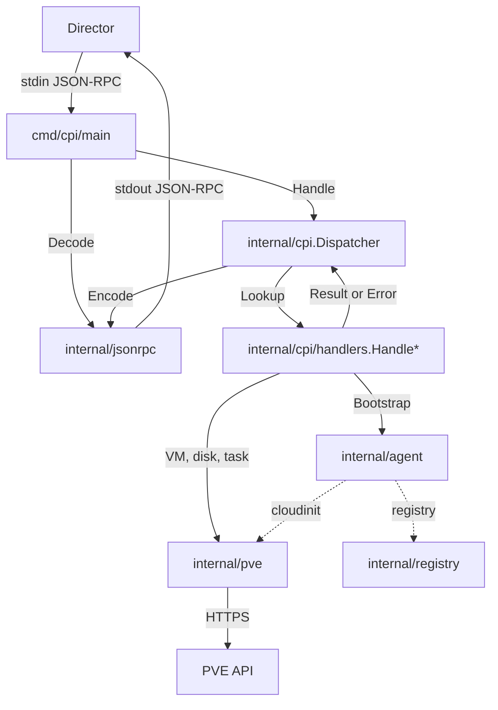

# Architecture

The BOSH PVE CPI is a Go binary that implements the BOSH CPI v2 specification for PVE 9.x. The director invokes the binary per request, exchanging JSON-RPC envelopes over stdin and stdout. Internally the code is split into layered packages; each layer has a single responsibility and a narrow interface so unit tests can replace dependencies with mocks.

## Source Layout

Go sources live under `src/pve_cpi/` so the directory shape matches the BOSH packaging spec (`packages/pve_cpi/spec` globs `pve_cpi/...`). Concretely:

- `src/pve_cpi/cmd/cpi` — binary entry point
- `src/pve_cpi/internal/...` — internal packages described below
- `src/pve_cpi/go.mod`, `src/pve_cpi/go.sum`, `src/pve_cpi/vendor/`

The Go module path is `github.com/fivetwenty-io/bosh-pve-cpi` and the internal package import paths (e.g. `internal/cpi/handlers`) are unchanged. References to `cmd/cpi` and `internal/...` below name Go packages, not repo-root directories.

## Layers

- `cmd/cpi`

  Binary entry point. Parses CLI flags, loads config, builds dependencies, dispatches one request per line from stdin until EOF or signal.

- `internal/jsonrpc`

  Encodes and decodes BOSH CPI request and response envelopes. Owns the wire format.

- `internal/cpi`

  Dispatcher and handler registry. Routes a method name to its `Handler`, translates handler errors to typed CPI error responses.

- `internal/cpi/handlers`

  One file per CPI method. Each handler decodes arguments, calls the PVE wrapper and agent strategy, then returns either a result or a typed CPI error.

- `internal/agent`

  Agent bootstrap strategies. `ConfigDrive`, `RegistryAgent`, and `NoAgent` implement the `Agent` interface (`Configure` / `Remove` / `UpdateDiskHints`). `ConfigDrive` is selected by `pve.agent_mode: cloudinit` (the default); see [ConfigDrive](configdrive.md).

- `internal/pve`

  Thin wrapper over `github.com/fivetwenty-io/pve-apiclient-go/v3`. Builds the SDK client from `internal/config`, polls task UPIDs, allocates VMIDs race-safely, parses disk CIDs, and normalises SDK errors to BOSH CPI error types.

- `internal/registry`

  Minimal HTTP client for the optional BOSH registry. Used only when `agent_mode = registry`.

- `internal/config`, `internal/errors`, `internal/log`, `internal/version`

  Shared primitives. Config parses and validates the CPI JSON document. Errors defines the BOSH CPI error taxonomy with `OkToRetry` semantics. Log wraps `log/slog` with context-carrying helpers and a test observer. Version exposes build-time identifiers populated via `-ldflags`.

## Request Flow



## Dependency Direction

```text
cmd/cpi
   ↓
internal/cpi → internal/cpi/handlers
                       ↓
                 internal/agent, internal/pve
                       ↓
internal/registry, internal/config, internal/errors, internal/log, internal/version, internal/jsonrpc
                       ↓
                   stdlib + SDK
```

No cycles. `internal/pve` does not import `internal/agent`; `internal/agent` does not import `internal/cpi`.

## Error Mapping

Every SDK error flows through `internal/pve.WrapError`, which classifies HTTP 4xx as `CloudError`, HTTP 404 as a flag the caller upgrades to `VMNotFound` or `DiskNotFound`, HTTP 5xx and network timeouts as `RetriableCloudError`. The dispatcher serialises the resulting error's `Type()`, `Error()`, and `OkToRetry()` into the JSON-RPC error envelope.

## Task Awaiting

Every PVE API call that returns a UPID is awaited via `internal/pve.AwaitTask` before the handler returns. The wrapper polls with a default 2-second interval and a configurable deadline. Standard calls use a 300-second deadline; stemcell upload and VM disk import use a 600-second deadline (`pve.StemcellMaxWait`) to accommodate large qcow2 files and PVE format conversion (e.g., qcow2 → raw on LVM storage).

## Stemcell Model

Each stemcell is backed by a single frozen PVE template VM. `create_vm` clones that template instead of running a qcow2 block-copy per VM. On linked-clone–capable storage backends this reduces VM creation from roughly four minutes to seconds.

### create_stemcell

The handler uploads the disk image (or extracts it from a gzip+tar tarball first) to the configured `stemcell_storage` pool under content type `import`. The upload volume is addressed as `<storage>:import/<filename>`.

Filename format:

```
bosh-stemcell-<sanitized-name>-<sanitized-version>-<sha8>.qcow2
```

where `sha8` is the first 8 hex characters of the SHA-256 hash of the disk image.

After the upload, the handler creates a new QEMU VM in the template VMID range (`[stemcell_template_vmid_range_start, stemcell_template_vmid_range_end]`, default `[6000, 8999]`), imports the qcow2 into it, and freezes it with `MakeTemplate`. The VM is named `bosh-stemcell-<name>-<version>` and tagged with `bosh-stemcell-sha-<sha8>` for later lookup. For CPI-owned images (heavy tarball uploads and light-fetch images), the intermediate upload volume is deleted after the template is frozen; for operator-preuploaded light stemcell images the upload volume is left intact.

Template creation is idempotent: if a template VM with the canonical name already exists in the template VMID range, the existing VMID is reused and the upload is skipped.

The returned **stemcell CID** is:

```
template:<vmid>
```

For example: `template:6042`

All three create_stemcell paths (heavy tarball, light-preuploaded, light-fetch) return a `template:` CID. The older `<storage>:import/<filename>` CID form only appears in stemcell_cid values produced before this feature was introduced.

### create_vm

The handler dispatches on the stemcell CID format:

- **`template:<vmid>`** — clones the template VM directly. This is the fast path.
- **Pre-upgrade CID** (`<storage>:import/<file>` or `light:...`) — extracts the sha8 from the filename and searches for a matching template by PVE tag. If found, clones it (fast path). If not found, falls back to the original `import-from=` slow path (block-copy per VM).

Clone type follows `pve.clone_mode` (default `auto`): linked CoW for snapshot-capable backends, full clone for `lvm`-thick.

VMID allocation for the new VM uses the range `[vmid_range_start, vmid_range_end]` (default `[100, 5999]`).

### delete_stemcell

The handler dispatches on the CID format:

- **`template:<vmid>`** — destroys the template VM with `purge=true` (removes all associated disks). Idempotent: an already-absent VM is treated as success.
- **`<storage>:import/<filename>`** — deletes the qcow2 volume via `DeleteVolumeIfExists`. Missing volumes are logged at WARN and treated as success.
- **`light:...`** — no-op (operator-managed image; CPI never deletes it).
- **Integer-only** — no-op (pre-upgrade legacy CID scrub).

### Shared-storage requirement

`stemcell_storage` must be a shared PVE storage pool accessible from every cluster node (NFS, CIFS, CephFS, GlusterFS, or any pool with `shared=1` in the PVE storage config). The CPI enforces this at `create_stemcell` time: local storage is rejected with a descriptive error when the cluster has more than one node. Single-node clusters may use local storage.
