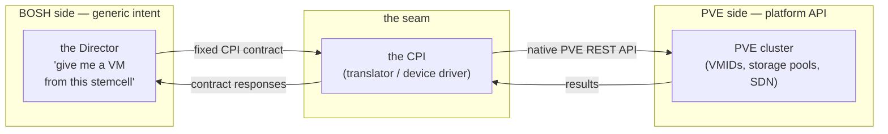
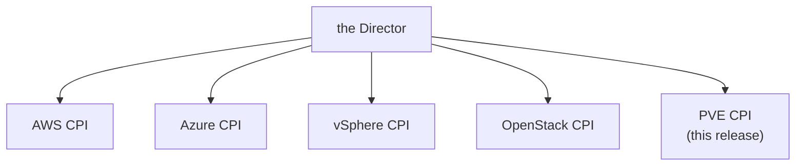

# Chapter 1 — The Problem and the Seam

A team decides to run their platform on Proxmox VE. They already use BOSH to deploy and manage that platform — it knows how to roll out a release, monitor every VM, replace a failed instance, and resize a disk without losing data. Then someone asks the obvious question: how does BOSH, which was built without any knowledge of Proxmox, learn to drive it? BOSH already has the answer, and it is a deliberate one. The system is built around clear, versioned contracts, and one of them exists precisely to make infrastructure pluggable: the Cloud Provider Interface, or CPI. Adding a new platform is not a matter of forking BOSH or teaching its core a new API — it is a matter of writing to a contract BOSH already defines for exactly this purpose. That contract — where a general orchestrator meets a specific platform it has never heard of — is the seam this document exists to explore.

## What BOSH is, & the line designed not to cross

BOSH is a release-engineering and lifecycle system. We hand it a packaged release and a description of the deployment we want, and it does the unglamorous, relentless work of getting there and staying there: provision the machines, lay down the software, watch for drift, and heal what breaks. It runs the same way whether the underlying infrastructure is AWS, Azure, Google Cloud, vSphere, OpenStack, or Proxmox VE.

That portability is not an accident. It is a deliberate refusal. BOSH's orchestrator — the Director — does not know how to create a VM on any specific cloud. It cannot, because the moment it learned one cloud's API, it would start to rot every time that API changed, and it would need a new brain for every cloud that followed. So BOSH draws a hard line. The Director speaks only in generic intent: "give me a VM from this stemcell, on this network, with this much memory." It never says how.

*The first principle of the whole system: the Director is infrastructure-agnostic; all infrastructure-specific knowledge lives behind a fixed contract.*

## The seam: a Cloud Provider Interface

Something has to sit on that line and translate, and the CPI is what BOSH puts there. It is the seam between BOSH's generic intent and one platform's concrete API. BOSH defines a fixed, versioned contract: a list of named operations like "create a VM," "attach a disk," or "delete this stemcell." Each platform ships a CPI that implements the contract in its own terms. The Director calls the contract; the CPI does the platform-specific work; the Director stays blissfully ignorant of the details.

The cleanest way to picture this is the device driver. An operating system speaks one generic language for "print this page." It does not carry the wiring diagram for every printer ever made. Instead, each printer ships a driver that translates the generic request into the signals that particular hardware understands. BOSH is the operating system. Proxmox VE is the hardware. This CPI is the driver.

*The Director speaks one generic language on the left; the CPI translates it into PVE's native API on the right.*

Because the contract is the same everywhere, the family of CPIs all look alike from the Director's seat. Swapping the cloud underneath a deployment is, in principle, swapping the driver — the Director never notices.

*One contract, many drivers; the Director treats every cloud the same way.*

## The central truth about PVE

Here is the fact that shapes everything that follows: Proxmox VE is not a cloud.

PVE is a single-node hypervisor manager with cluster features bolted on over time. It runs QEMU virtual machines identified by numeric VMIDs, manages storage pools, and offers a software-defined networking layer. It is genuinely good at being a hypervisor. But it was never designed around the abstractions a cloud takes for granted. It has no scheduler that picks the best node for a new workload. It has no concept of an availability zone or a fault domain. It has no first-class durable volume that outlives the VM it is attached to. It has no portable, cluster-wide notion of a network that follows a machine wherever it lands. It has no storage classes that bind intent to capability.

A cloud CPI for AWS or Azure mostly *translates* — it maps a generic request onto a rich service that already exists. This CPI's job is harder. For most of what BOSH asks, the corresponding PVE primitive does not exist, so the CPI has to *manufacture* it. It builds a scheduler from live cluster reads, invents fault domains, and synthesizes durable volumes from the only durable carrier the platform offers. Think of the CPI as a small factory standing between BOSH and PVE, stamping out the cloud primitives the hypervisor lacks. That factory motif runs through every chapter ahead.

## The scope of this release

Concretely, this CPI is a single binary that implements BOSH's CPI version 2 contract starting from Proxmox VE >= 9.2. One executable, one contract, one platform. It is deliberately small in surface area and deliberately ambitious in what it conjures behind that surface. Everything it does — the scheduler, the portable networks, the durable disks, the resilience, the safety guards — is a consequence of two facts already on the table: BOSH refuses to know about PVE, and PVE is not a cloud.

## Where this leads

The contract tells us *what* the Director and the CPI exchange. It does not yet tell us the one structural fact about *how* the Director runs this binary — and that single fact, more than any feature, dictates the entire shape of the design. Everything else follows from how the Director calls this binary, which is where [Chapter 2](02-stateless-contract.md) begins.

## Grounding in the implementation

- [Architecture overview](../architecture.md)
- [CPI methods](../cpi_methods.md)
- [Documentation index](../index.md)
