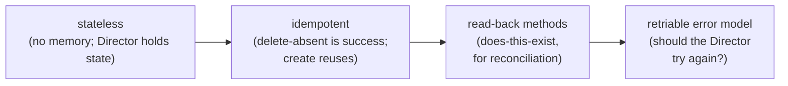
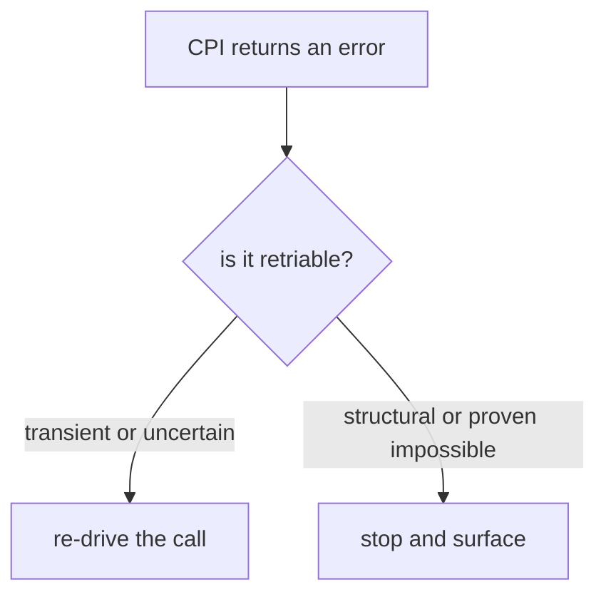
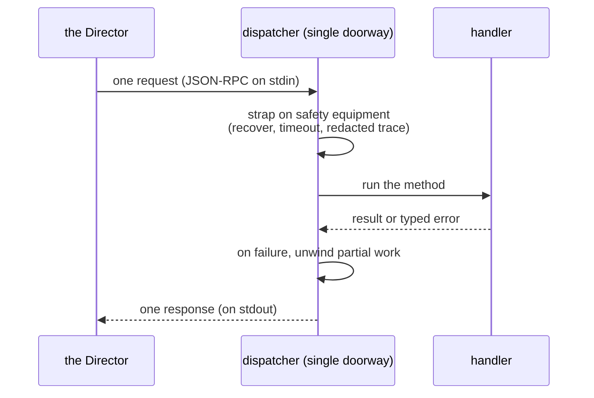

# Chapter 2 — One Constraint, Many Consequences

Strip the CPI down to its most concrete form and we find a single line a person could type into a terminal:

```
echo '{"method":"info","arguments":[],"context":{"request_id":"r1"},"api_version":2}' | ./bin/cpi --config "$CPI_CONFIG"
```

One request goes in on standard input. One response comes out on standard output. The process exits. That is the entire wire shape of the contract, and it is not a simplification for the documentation — it is literally how the Director drives the binary. Hold this line in mind. Almost every design decision in the rest of this document is forced by it.

## The wire shape

Each call is one self-contained JSON-RPC envelope: a method name, its arguments, a little context, and the contract version. The Director sends exactly one, the CPI answers with exactly one, logs go to a separate diagnostic stream, and then the process is gone. There is no long-running service, no open connection, no session. The next request starts a fresh process that remembers nothing about the last.

*The first principle of this chapter: the binary is invoked once per request and may be retried — therefore it must be stateless, idempotent, and honest about whether a failure is worth trying again.*

That one sentence is the seed. The rest of the chapter is just watching it grow.

## Statelessness, because there is nowhere to keep state

A binary that starts fresh every call has no memory and no database of its own. So where does the durable truth of the deployment live? With the Director. When the CPI creates something, it returns a cloud ID — a compact string the Director records and hands back on every future call about that resource. The CPI never has to remember which VM belongs to which deployment, because the Director tells it, every time, by way of the cloud ID. Everything else the CPI needs, it reconstructs by reading live PVE state at the moment of the call.

This is why the cloud ID matters so much later. It is the only thing the CPI gets to carry forward, so it becomes the place identity is stored. The Director holds the map; the CPI reads the territory afresh on every request.

## Idempotency, because the Director will call again

The Director is allowed to re-drive a call after a partial failure. It may have lost the network mid-response, or crashed and restarted, or simply be reconciling its records against reality. From the CPI's side, that means any request might be a repeat of one that already partly or fully succeeded. A binary that assumed every call was the first time would corrupt state on the second.

So every method is built to converge, not to assume a clean slate. Deleting a resource that is already gone is success, not an error — the world is already in the state the Director wanted. Creating a resource that already exists reuses it rather than making a duplicate. A create that fails partway cleans up the fragments it left behind, so the next attempt starts clean. The CPI's job is not "do this once"; it is "make the world match this request, however many times the request arrives."

## Read-back, because the Director needs to reconcile

If the Director holds the state and the CPI reads reality, the two can drift — a VM the Director thinks exists may have been destroyed out of band; a disk it forgot may still be sitting on a node. To close that gap, the contract includes pure read-back methods that ask reality a yes-or-no question: does this VM exist, does this disk exist, what disks are attached here? BOSH's reconciliation machinery uses these to detect orphaned and missing resources and bring its records back in line with the truth. Because the CPI keeps no state, these read-backs are how BOSH audits its own bookkeeping against the platform.

## The error model, because the Director must decide whether to retry

Now the chain reaches its sharpest consequence. Since the Director re-drives calls, every failure the CPI returns must answer one question, and only one: should the Director try again?

A transient hiccup — a busy hypervisor, a momentary timeout, a storage lock held by someone else — deserves another attempt; the world might be fine a second later. A structural fault — a malformed argument, a request to shrink a disk in a way the platform cannot do — deserves to stop and surface, because retrying it only wastes time and hides the real problem. So the CPI tags every error with a retriability signal, and the Director reads that tag to decide between re-queueing the call and giving up loudly.


*One connected chain: statelessness forces idempotency, which needs read-back, which culminates in an honest retriability signal.*

The decision the Director makes from that signal is simple, and it is the whole point of the model:


*Every error resolves to one of two roads, and the CPI's job is to point the Director down the right one.*

This is the CPI's honesty contract, and it has a deliberate bias. The system never reports false success — it never tells the Director the world is in a known-good state when it might not be. And when uncertainty touches data — *could I have left a disk orphaned, could I have lost something* — the CPI resolves toward retry, never toward a comfortable lie. A crash mid-call is caught and turned into a retriable error rather than a malformed response that could wedge the Director. The worst legal output of this binary is a typed, retriable error. Silence and corruption are not on the menu.

## The single doorway

Twenty-odd methods all need the same care: decode the envelope, survive a panic, respect a time limit, trace the call with secrets redacted, and clean up partial work if something fails. Rather than scatter that machinery across every handler, the CPI routes every request through one chokepoint — a dispatcher that is the single doorway into the binary. Each request walks through the same door, gets the same safety equipment strapped on, does its one specific job, and leaves cleaned up whether it succeeded or not. Panic recovery, the per-request timeout, redacted tracing, and partial-failure rollback all live at that door, so every method inherits them uniformly and none of them has to reimplement caution.

We will name these guards properly when production load and safety get their own chapters in Part IV. For now, the picture to keep is the doorway: uniform safety equipment, applied once, to everything.


*Every request enters the same door, runs its handler under uniform protection, and returns exactly one answer.*

## Where this leads

The contract and its consequences are now in place: one line in, one line out, stateless, idempotent, honest about retrying, and funneled through a single guarded door. That is the frame. With it established, we can stop talking about the binary in the abstract and follow one machine all the way through its life — birth, identity, disks, and death — as the Director sequences the primitive vocabulary the CPI provides. That story begins in [Chapter 3](03-lifecycle.md).

## Grounding in the implementation

- [CPI methods](../cpi_methods.md)
- [Architecture overview](../architecture.md)
- [BOSH CPI certification](../bosh-cpi-certification.md)
