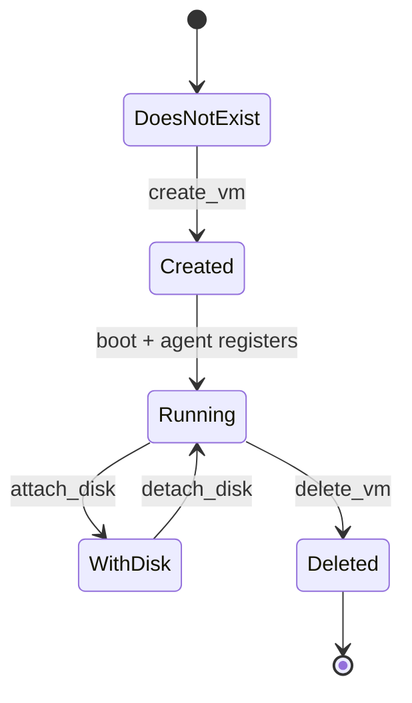

# Chapter 3 — The Lifecycle of a Machine

A running deploy looks like chaos: dozens of machines appearing, disks attaching, networks wiring up, all at once. Underneath, it is something far simpler. The Director never issues a single "build me this deployment" command. It issues a long sequence of small, individually retriable steps, each one a named method on the CPI, and it sequences them itself. To understand the CPI is to watch one machine walk through that sequence from first breath to teardown.

The previous chapter established the constraint that shapes everything: the binary is invoked once per request and may be retried, so it must be stateless, idempotent, and honest about retriability. This chapter follows the consequence. If the CPI holds no memory between calls, then the *Director* must hold the plan, and the CPI must offer it a vocabulary of primitives small enough to retry and complete enough to compose.

*The first principle of this chapter: a deploy is the composition of independent, individually retriable resource lifecycles, and the CPI is the primitive vocabulary the Director sequences.*

## One VM's life, told as a chain

There is a canonical order in which these methods fire, and it reads like a biography. It is worth holding the whole chain in mind at once, because every later chapter is a deep dive into one link of it.

*The canonical method chain — the spine of the whole document. Each link is one retriable step the Director drives in order.*

The chain begins with a question, not an action. **Capability is discovered, not assumed.** The Director's first call is `info`, which answers two things: which contract version the CPI speaks, and which stemcell image formats it accepts. The Director adapts to the answer rather than presuming it. This is the same humility the whole design rests on — nothing is taken on faith that can be read from live truth.

## The conceptual groups

Twenty-one methods is a lot to hold as a flat list, so think of them in five families, each answering a different question.

- **Stemcell management**
  Turn a golden OS image into a reusable, frozen template, and later remove it. This is "prepare the mold," and Chapter 4 is entirely about why it exists.

- **VM lifecycle**
  Create, delete, reboot, check for, and label a machine. `create_vm` is the keystone of the whole CPI: it clones the template, allocates a VMID from the 100–8999 band, wires the network, attaches any disks the VM should own, writes the boot settings, and starts the machine.

- **Disk lifecycle**
  Create, delete, attach, detach, resize, snapshot, and tag persistent disks, which live in their own 9000–29999 band, plus a PVE-specific extension for updating a disk's performance contract in place.

- **Reconciliation**
  `has_vm`, `has_disk`, and `get_disks` exist purely so the Director can compare its records against reality. Because the CPI keeps no database, the Director needs read-back primitives to detect an orphaned or missing resource and heal its own state. These are the methods BOSH's cloudcheck leans on.

- **Optional networking**
  `create_network` and `delete_network` run only for networks an operator explicitly marks as managed. Most deploys pre-provision their networks and the CPI never touches them. Chapter 7 takes this up.

*A single VM as a state machine. The Director can re-ask "which state is this VM in?" at any point, which is exactly what the reconciliation methods are for.*

## Why compute and data are kept apart

Notice that the disk lifecycle is a separate family from the VM lifecycle, with its own identity band and its own create, attach, and delete verbs. This separation is deliberate, and it is the entire reason persistent disks exist. A VM is disposable. The Director may delete and recreate it during an upgrade, a stemcell roll, or a recovery. The data on a persistent disk must survive that churn untouched. So the disk has a life of its own: created before the VM that will use it, attached when needed, detached and re-attached to a fresh VM during a recreate, and deleted only when the deployment truly no longer wants the data. **Data survives compute** — that sentence is the whole justification for two lifecycles instead of one.

## The quiet trick underneath

Here is the part that makes the disk family more interesting than it looks. PVE has no first-class persistent-disk object. It has no per-disk snapshot. It has no place to record disk metadata or tags. The substrate the CPI builds on simply lacks the things BOSH's disk vocabulary asks for.

So the CPI manufactures them. A persistent disk is emulated by riding on a host VM: a disk snapshot becomes a VM-level snapshot, disk metadata becomes a sentinel written into the VM's description, and disk tags become VM tags. The Director asks for a clean abstraction and gets one; that PVE never offered such an object stays hidden behind the method. This is the factory motif in its first concrete appearance, and Chapter 8 is devoted to how the durable volume gets invented out of parts PVE never intended for it.

## Where this leads

The chain has fourteen links, but they are not equal in cost. Most are quick API calls. One is expensive enough to threaten the whole deploy: making the VM itself. Block-copying a fresh operating-system image for every machine takes minutes, and minutes times dozens of machines is intolerable. The next chapter shows the trick that turns those minutes into seconds — pay for the image once, then stamp out cheap copies. See [Chapter 4](04-stemcell-mold.md).

## Grounding in the implementation

- [CPI method reference](../cpi_methods.md) — every method, its arguments, and its return shape.
- [Architecture overview](../architecture.md) — the package layout and dispatch model behind these methods.
