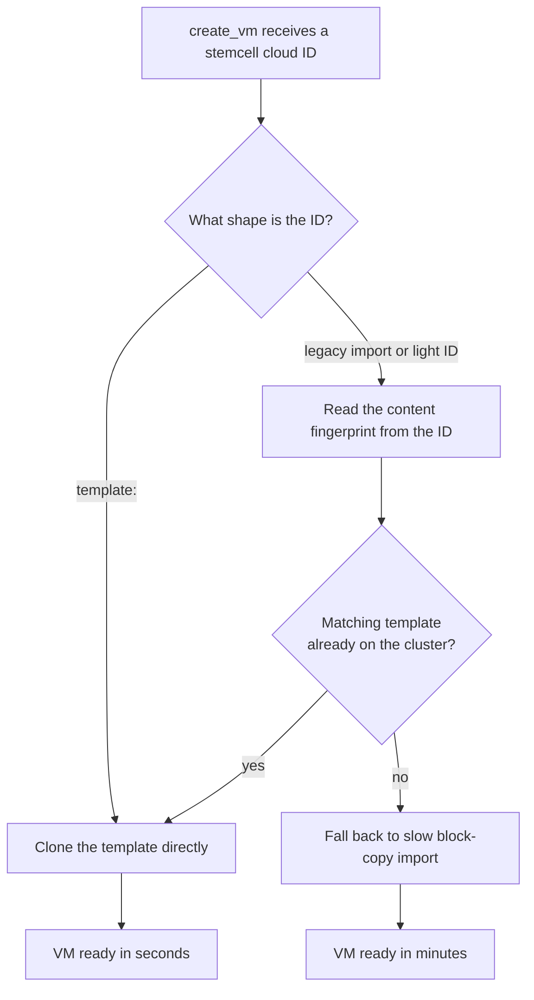

# Chapter 4 — The Stemcell as a Mold

Of the fourteen steps in the last chapter's chain, one dominates the clock. Making a VM means putting an operating system on a disk. The obvious way to do that — copy the stemcell's disk image, block for block, onto a fresh disk for every machine — takes about four minutes. A handful of VMs and we wait half an hour. A real deployment of dozens, restarted on every upgrade, makes that cost the difference between a platform people use and one they abandon. The expensive step has to stop being expensive.

It already can be. The previous chapter named `create_stemcell` as "preparing the mold" without saying why. This is the why.

*The first principle of this chapter: pay the image cost once by building a frozen golden template, then make every VM as a cheap copy-on-write clone. Identity is content-addressed, so the same image is never imported twice and concurrent imports converge on one survivor.*

## Mold and castings

A stemcell is a base operating-system image carrying the dormant BOSH agent. The naive reading treats it as raw material to be copied per VM. The better reading treats it as a *mold*. We import the image exactly once into a frozen template VM — a machine that never runs and exists only to be copied. It lives in its own VMID band of 30000–30999, so it is instantly distinguishable from real VMs and persistent disks. From then on, every VM is a casting: a clone of that template.

On storage backends that support copy-on-write — directory, NFS, CIFS, ZFS, thin LVM, RBD, and CephFS — a clone shares the template's blocks and writes only its own changes. It finishes in seconds, not minutes. The four-minutes-to-seconds gap is the single most important performance decision in the CPI, and it comes entirely from refusing to copy the same bytes twice. The clone strategy does depend on the backend underneath; thick storage that cannot do copy-on-write falls back to a full copy. Chapter 8 returns to what visibility and capability mean for storage. Here the point is simpler: import once, stamp many.

## Identity by content, not by name

A mold is only useful if we can tell whether we already have it. The CPI tags each template with a short fingerprint of the image's content — a hash carried as a tag on the template. That fingerprint *is* the template's identity. Ask for a stemcell whose content already has a template, and the CPI hands back the existing one rather than importing a second copy. The image is never imported twice.

This content-addressed identity also settles a race. Two deploys can call `create_stemcell` for the same image at the same moment, and both may begin importing. Because identity is the content fingerprint, not a name either process chose, the CPI can resolve the collision afterward by keeping a single survivor and discarding the duplicate. Concurrent imports converge instead of multiplying. **Statelessness forces this** — with no shared memory between invocations, the only way two processes can agree on what they built is to derive the answer from the artifact itself.

## Dispatch on the shape of the cloud ID

Every stemcell the CPI creates returns a cloud ID announcing it is a template. But operators have older stemcells, created before the template-and-clone path existed, whose cloud IDs have a different shape. The CPI must serve both without forcing anyone to re-upload anything.

It does this by branching on the *shape* of the cloud ID it is handed.

*Dispatch on cloud-ID shape. A modern stemcell takes the fast clone path; a legacy one opportunistically upgrades to it when a matching template is found, and only block-copies when none exists.*

The optimization is backward-compatible by construction. A legacy stemcell does not have to be re-uploaded to benefit; the first time the CPI sees its fingerprint match a template already present, it quietly takes the fast path. Old deployments get faster on their own.

## The template is a build-time artifact, nothing more

Once a VM is cloned, the Director sees no further dependency between it and the template: the clone has its own cloud ID, its own lifecycle, and nothing in BOSH's model ties the two together. Underneath, the block-level story depends on the clone type. A full clone is a real byte copy — genuinely independent, and the template can be deleted freely. A linked clone, the default on copy-on-write storage, shares the template's read-only base image and stays bound to it at the block layer for as long as it lives. That dependency is real, but it is never a hazard, because we never let a base be deleted while it still has children. PVE's storage layer refuses to remove a base volume that a linked clone still references. Our own delete path destroys a template only once its last stemcell reference is gone. So the framing holds with one honest qualification. A template is build-time scaffolding, disposable the moment nothing is cloned from it — and the system guarantees we cannot pull it out from under a VM that still needs it.

## Living across many nodes

A single mold on a single node only helps machines born on that node. A real cluster has several, and a clone can only be made on a node that can see the template. So on a multi-node cluster the template must live on shared, file-based storage. Block storage cannot accept the image upload in the first place, and local storage would strand the mold on one node. Single-node clusters relax this, since there is nowhere else for a workload to land.

The CPI can optionally replicate the frozen template to every node in parallel, so every node can clone locally at full speed. The same content fingerprint that dedupes imports also drives cleanup. Provenance tags let a delete sweep the cluster and remove every copy of a retired template — including replicas on nodes the original create never touched. Identity by content pays off again — the fingerprint we used to avoid importing twice is the fingerprint we use to find every copy when it is time to let go.

## Where this leads

A clone comes off the mold fast, but it comes off *anonymous*. It is an operating system with a sleeping agent and no idea who it is, where its message bus lives, or how to report for duty. Before it can join the deployment, something has to hand it an identity — and the CPI cannot log in to do it. The next chapter is about how a bare clone learns who it is and phones home. See [Chapter 5](05-machine-identity.md).

