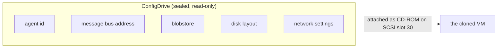
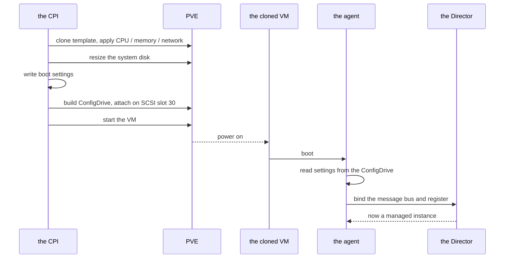

# Chapter 5 — Giving a Machine Its Identity

A fresh clone boots into a strange situation. It has an operating system and a BOSH agent, but the agent wakes up amnesiac. It does not know its own name, where the message bus that connects it to the Director lives, which blobstore to use, how its disks should be laid out, or what its network looks like. None of that can be guessed; all of it must be told. And the obvious way to tell a machine something — log in and configure it — is precisely the thing the CPI cannot do. The CPI speaks only to PVE's API. It has no shell into the guest, no SSH, no way to reach inside.

So identity has to arrive another way: handed to the machine from outside, in a form the machine already knows how to read, before any network conversation begins.

*The first principle of this chapter: a cloned VM is anonymous until it is handed its identity, so deliver that identity out-of-band as a read-only ConfigDrive the guest's stock datasource already understands — no in-guest scripting, no SSH, no registry — reusing the OpenStack ecosystem rather than inventing a bootstrap.*

## The envelope, not the conversation

The mechanism is a ConfigDrive: a small, read-only disk image, attached to the VM as a CD-ROM, carrying the boot settings as plain data. The guest's operating system already ships with a datasource that looks for exactly this on first boot, reads it, and applies it. There is no script to run, no service to install, no cloud-init step the operator has to wire up. The settings are simply *present*, the way a sealed envelope is present in a new hire's onboarding folder. The machine opens it and learns who it is.

*The ConfigDrive as a sealed envelope. The CPI fills it, seals it, and hands it to the VM; the guest's stock datasource opens it on first boot.*

This is where the OpenStack lineage earns its keep. The ConfigDrive layout the CPI writes is the OpenStack config-drive format, the same one a long line of OpenStack guests already understand. That is not an accident of convenience. It is why the CPI advertises OpenStack stemcell formats in the very first `info` call from Chapter 3 — so that existing, unmodified OpenStack stemcells run on PVE unchanged. The CPI did not invent a bootstrap protocol and ask the world to adopt it. It reused one that stemcells already speak.

## Where the envelope sits

A VM has a fixed number of SCSI slots, and the CPI treats them as a deliberate map rather than a free-for-all. The system disk takes the first slot. A run of slots is reserved for the persistent data disks a VM may carry. A slot is left as deliberate headroom. And one slot near the top of the range — SCSI slot 30 — is reserved permanently for the ConfigDrive. Because that reservation must stay intact, the CPI caps how many persistent disks a single VM may hold; pack too many in and they would collide with the very envelope that carries the machine's identity. The cap is not a limitation so much as the price of keeping the delivery slot sacred.

## Modes, and one that is gone

How identity gets delivered is selectable, but the choices are deliberately few.

- **cloudinit**
  The default, and the only real bootstrap path. Settings are delivered by the ConfigDrive described above.

- **noagent**
  No bootstrap at all. This exists to test the CPI's own plumbing — cloning, wiring, attaching, starting — without involving an agent — exactly what we want when debugging the infrastructure layer in isolation.

- **auto**
  Resolves on each call but always lands on the ConfigDrive, so in practice it behaves like cloudinit for every stemcell.

One mode used to exist and now does not. The BOSH registry — a separate service the agent once contacted to fetch its settings — has been removed entirely. Asking for registry mode, or supplying any registry setting, now fails configuration validation outright. This tracks upstream BOSH, which has deprecated the registry, and it makes the model cleaner: the agent reads its settings directly from the metadata on the ConfigDrive, with no intermediary service to stand up, secure, or keep alive. One fewer moving part, one fewer thing to fail.

## The handshake

Put the pieces in order and the bare clone becomes a managed instance.

*The boot-and-handshake sequence. Registration with the Director is the moment a bare clone becomes a managed BOSH instance.*

## The gotcha that justifies the seams

It is worth seeing one failure to understand why the boot path is shaped the way it is. The agent will hang forever — not error, just wait — if its settings name an ephemeral device that does not exist, or if the system disk is too small to carve the ephemeral partition the settings describe. A bad boot here is silent and permanent, the worst kind.

So the CPI declines to over-specify. It leaves the ephemeral layout for the stemcell to carve for itself rather than naming a device that might not be there, and it resizes the system disk after cloning so there is room to carve. The lesson generalizes: when the consequence of a wrong instruction is an unrecoverable hang, the safe move is to say less and let the guest, which can see its own hardware, fill in the rest. The seam between what the CPI dictates and what the guest decides is drawn exactly where a mistake would be fatal.

## Where this leads

One machine now lives. It came off the mold in seconds, opened its envelope, and reported for duty. But a deployment is not one machine — it is many, and the question of *where each one lands* is its own design problem. PVE offers no scheduler to answer it. Part III turns to the cloud primitives the CPI has to manufacture from scratch, beginning with placement. See [Chapter 6](06-scheduler.md).

## Grounding in the implementation

- [ConfigDrive](../configdrive.md) — the ISO layout, the SCSI slot map, and why earlier delivery modes were dropped.
- [CPI method reference](../cpi_methods.md) — `create_vm` and the boot path it drives.
- [Configuration](../configuration.md) — agent modes and the removal of registry support.
