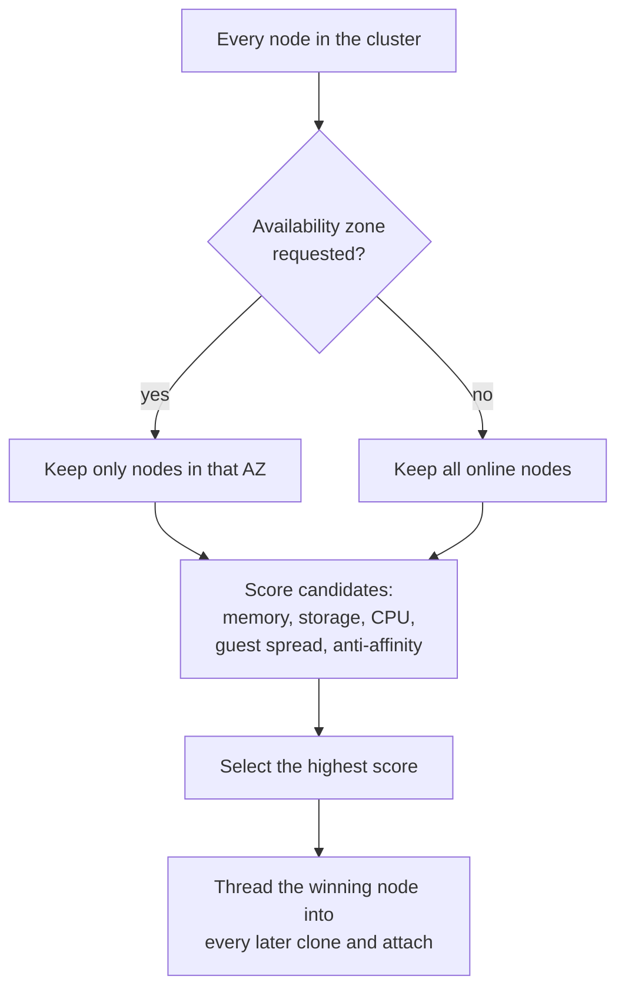
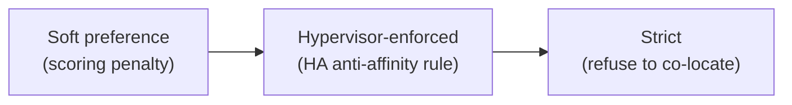
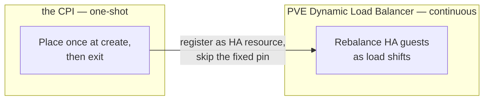

# Chapter 6 — Manufacturing a Scheduler

A fresh VM has to land somewhere. On a real cloud we ask for an instance and never think about which physical host runs it — a scheduler weighs every machine's free capacity and picks the best one. PVE has no such call. It creates a VM wherever we point it. Point every VM at the same node and it obediently piles them all onto one machine, until that machine falls over and takes the whole deployment with it. The other nodes sit idle. The cluster we bought for resilience has become a single point of failure.

This is the first primitive the factory has to stamp out: a scheduler PVE does not provide. And it has to build one under the constraint that defines this whole system — the CPI holds no state between calls. There is no running daemon keeping a live index of cluster load. Every placement decision starts from a fresh read of the cluster, made in the moment, then thrown away.

*The first principle of this chapter: the CPI must synthesize a scheduler PVE lacks, from a fresh live read on every call. A scorer ranks preferences. Physics and fault domains are hard constraints. And a one-shot decision has limits it must respect.*

## Scoring: a ranking of preferences

At every VM creation the placement scorer pulls live cluster state — node status, resource usage, per-node storage, and maintenance flags — and ranks the candidate nodes. The ranking is a weighted sum of axes, each chosen because it bears on whether a node will host the VM well and keep the cluster balanced.

- **Memory, the dominant axis**
  Free RAM is the hard ceiling on how many VMs fit; a node out of memory cannot start the guest at all. It carries the heaviest weight.

- **Storage headroom**
  A node low on disk cannot hold the cloned root and ephemeral disks. Weighted, but below memory.

- **CPU headroom**
  Free CPU keeps the VM off an already-saturated node.

- **Guest-count spread**
  Busy nodes are penalized in proportion to how many guests they already run. This produces natural load-leveling even before anyone configures anti-affinity — a cheap term that keeps the cluster from clumping.

- **Anti-affinity penalty**
  A node already hosting a sibling of the same instance group is heavily down-weighted — the single largest term in the sum — so same-group VMs spread across nodes instead of sharing one failure.

The weights are operator-tunable, but the design intent is fixed: the score is a *preference*, not a gate. This is soft preference versus hard constraint in its purest form. Scoring expresses what we would prefer; it never forbids.

That distinction drives an asymmetric failure design. Gathering the facts can fail in pieces, and the CPI treats each piece by what it can afford to lose. Only one read is load-bearing: the list of candidate nodes itself. Lose that and there is nothing to place onto, so the call fails. Every other signal — resource usage, per-node storage, maintenance state — degrades gracefully if a transient API hiccup drops it. The scoring axis it fed simply goes quiet; the VM still gets placed. Fail open or fail closed, chosen per risk: the one fact we cannot work without fails closed, and every refinement fails open.

*Placement is a funnel: filter by zone, score the survivors, pick a winner, then carry that winner through the rest of the call.*

## Availability zones and the three strengths of anti-affinity

Spreading load is not the same as surviving a failure. Real high availability needs independent failure domains — racks, power feeds, switches — so one domain's loss takes out at most one slice of a job. PVE has no concept of an availability zone. The CPI manufactures one by letting the operator map BOSH availability zone names onto sets of PVE nodes: this zone is these two nodes, that zone is those two. A VM that asks for a zone is restricted to that zone's nodes before scoring even runs.

Anti-affinity then comes in three escalating strengths, and choosing the right one is the soft-versus-hard decision made explicit.

*Anti-affinity escalates from advisory to enforced to absolute — and the absolute form can be too strong for a small cluster.*

The soft form is the scoring penalty: advisory, and resource pressure can override it. The middle form asks PVE's own high-availability subsystem to enforce the spread with a negative resource-affinity rule, so the constraint survives beyond the placement call. The strict form makes PVE *refuse* to co-locate siblings at all. That sounds like the safest choice, and on a large cluster it is. On a two- or three-node cluster it is self-defeating. If a strict rule leaves no compliant destination when a node fails, high availability has nowhere to evacuate to — and the very mechanism meant to protect the job now blocks its recovery. A constraint's strictness must be matched to the cluster's size. A hard spread rule on a small cluster removes the slack that failover depends on.

## Making placement outlive the call

The CPI places a VM once and then exits. But PVE's high-availability failover, or a later rebalance, can migrate that VM to any node — including one outside its intended zone — silently undoing the fault-domain design the operator asked for. A decision any background process can reverse is not a guarantee.

So the placement writes itself down. When pinning is enabled, VM creation records a high-availability node-affinity rule binding the VM to its zone's node set, derived from the node the VM actually landed on. It is the same move the CPI makes whenever it must remember something: encode the decision into a system that persists and is honored after the process is gone. PVE's own high-availability rule store becomes the CPI's long-term memory. The pin can be strict or merely preferred, and deleting the VM removes it. PCI passthrough forces a strict pin automatically, because a passed-through device cannot follow a live migration anyway.

## Knowing when to stop placing

A one-shot score captures the cluster at one instant. It cannot react to load that develops hours later. For workloads where ongoing balance matters more than a fixed landing spot, the right move is not a smarter score. It is to stop placing and delegate to the one component that *can* watch continuously: PVE's Dynamic Load Balancer, which rebalances high-availability guests as load shifts.

*When balance is a continuous problem, the CPI hands placement back to a component that never sleeps.*

Delegation is powerful and costly, because it imports the delegate's entire constraint set. Live migration cannot move a local-disk VM, so shared storage is required. The migrating VM must keep its address across nodes, which means cluster-global networking too. BOSH's own resurrector must be turned off, or two independent systems will each try to restart a stopped VM and produce duplicates. And the Director itself must never be balanced mid-deploy, or it would drop the very CPI calls in flight. Because those preconditions are real, this delegation is opt-in and fails inert: absent its prerequisites, it simply does nothing. The escape hatch above all of this is unchanged — name an explicit target node and scoring steps aside entirely.

## Where this leads

A VM placed on the right node, in the right fault domain, pinned so it stays there, still needs one more thing before it is useful: a network identity that survives wherever it lands. And here the same locality question returns in a new form — a node-local network cannot follow a roaming VM any more than a node-local disk can. That is the subject of [Chapter 7](07-portable-networks.md).

