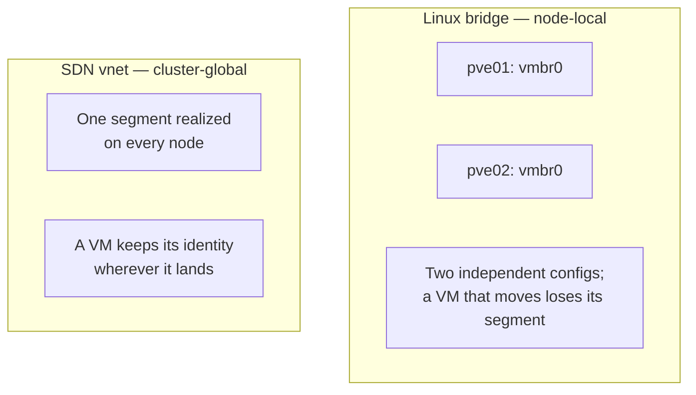
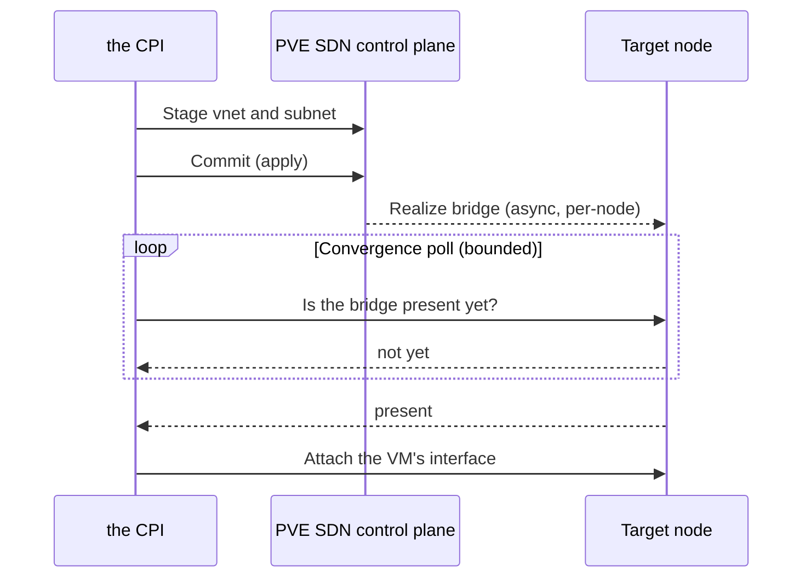
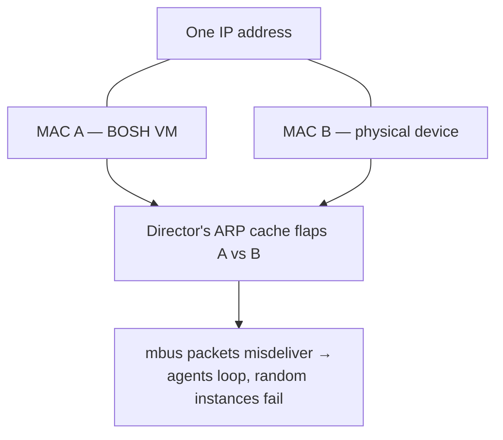

# Chapter 7 — Portable Networks

The scheduler in [Chapter 6](06-scheduler.md) earned a VM the right to land on any node in the cluster, and to be moved later if balance demands it. That freedom comes with a hidden bill. A VM is only useful if it can be reached at a known address, and PVE's simplest networking primitive is bolted to a single node. The moment a workload can roam, a network that cannot roam with it becomes a trap: the VM keeps its identity in BOSH's books but loses the segment that identity lived on. So the factory has another primitive to manufacture — a network as portable as the workload it serves.

This is the **locality is the spine** motif again, wearing a different costume. In [Chapter 8](08-durable-volume.md) it appears as local versus shared storage; here it is bridge versus vnet. The principle is identical: a node-local resource pins a workload in place, and a cluster-global one lets it move.

*The first principle of this chapter: network identity must be as portable as the workload it serves. A node-local primitive is fine only when the workload never moves; the instant placement or migration can relocate a VM cluster-wide, the network must be cluster-global too.*

## Two primitives, because two topologies

PVE offers two fundamentally different network objects, and both earn their place.

- **The Linux bridge**
  A per-node configuration object. A bridge named `vmbr0` on one node and a bridge named `vmbr0` on another are two unrelated things that happen to share a name. A bridge is perfect for a static, single-node, or bootstrap deployment that needs zero machinery — but it cannot follow a VM to another node.

- **The SDN vnet**
  A cluster-global software-defined network. One vnet is the *same* layer-2 segment realized on every node, so a VM keeps its address wherever it is placed or migrated. This is the only thing that makes the roaming of Chapter 6 safe — which is exactly why the Dynamic Load Balancer demanded it.

*The same locality split as storage: a bridge pins a VM to its node; a vnet lets it roam.*

## Owned versus borrowed networks

Most deployments pre-provision their networking and want the CPI to keep its hands off. The CPI honors that: it runs network lifecycle operations only for networks explicitly marked as managed. Everything else — a pre-existing bridge, a static VLAN — is borrowed, and the CPI attaches VMs to it without ever creating or deleting it. When a network *is* managed, routing is decided from three inputs: an explicit mode, a zone named on the network, and the operator's default zone. The default mode chooses for us — SDN when a zone is present, a bridge otherwise — and an unresolvable combination is a clear, immediate error rather than a half-built network.

PVE imposes a brutal naming rule on vnets: one to eight lowercase alphanumeric characters, no hyphens, no underscores, no capitals. The CPI validates that rule up front, before any API call, so a bad name produces a crisp CPI error instead of an opaque PVE rejection halfway through provisioning. Pushing precondition failures as far left as possible is a recurring operability theme; this is its smallest, cleanest instance.

Zone ownership is the harder problem. A zone can be shared by many managed networks, so auto-deleting one could orphan others. The CPI never invents a zone name — a name must always be supplied, even when it is allowed to manage zones — and it will auto-delete a zone only when it can prove three things at once: that zone management is enabled, that the zone is not the operator's pinned default, and that no vnets remain inside it. PVE's zone API has no description or notes field, so there is nowhere in PVE to record "the CPI owns this." Ownership is therefore tracked the only way a stateless process can track anything: as a rule over names and configuration, evaluated fresh each time. This is the **statelessness writing into a durable carrier** motif, applied to a resource with no carrier of its own — so the carrier becomes the ownership rule itself. Never destroy a shared resource we cannot prove is ours alone.

## A committed change is not yet a realized fact

SDN has a subtlety that bites the unwary. Staging a vnet in PVE's configuration and committing it does not instantly make the network real on every node — each node has to reload its networking independently, asynchronously. A VM can race ahead and try to attach to a bridge that does not yet exist on its target node.

So managed SDN networking is a two-phase commit followed by a convergence gate. Every create or delete stages the change, applies it, and — on failure — rolls back exactly what *this* call staged and nothing more, on a context detached from cancellation so cleanup finishes even if the caller walks away. When the convergence poll is enabled, network creation waits until the vnet has actually appeared, and VM creation confirms each SDN-backed interface's bridge is present on the target node before attaching. A timeout there is reported as a retriable error, so the Director simply re-drives the call. Crucially, the gate distinguishes what it owns from what it must never wait on: a static bridge, which is pre-existing infrastructure, bypasses the poll entirely.

*A committed control-plane change is not a realized data-plane fact; the convergence poll is the gate between them.*

## Handing the VM its address

For the common simple-zone case, the vnet is realized as a bridge of the same name, so the CPI can return the zone, vnet, and bridge as one identity and attach the VM's interface to it. The static IP, gateway, and search domain BOSH assigned ride in on the ConfigDrive from [Chapter 5](05-machine-identity.md) — the CPI never has to log into the guest to configure networking. Router and NAT workloads get two extra knobs: per-interface forwarding, which stops PVE from dropping forwarded frames, and advertised routes, which inject subnets into an SDN logical router. The honest caveat travels with the feature: route injection needs an OVN-backed zone; on a simpler zone PVE accepts the route and quietly does nothing, so the CPI warns and continues rather than pretending it worked.

## Failing open for the legitimate occupant

PVE can run an anti-spoofing filter that only lets approved addresses out of a VM. Enabled naively, it locks a VM out of its own network, because the allowlist is *complete* — the VM's own primary IP is not added automatically. The CPI treats this as a fail-open problem. It seeds the allowlist with the primary address and any virtual IPs *before* enabling the filter, and it skips interfaces it cannot reason about — a DHCP interface, an unparseable address — rather than risk locking them out. Malformed input fails fast, before any change is made. A security control that can lock out its own legitimate user is a bug; the design fails open for the occupant and closed for the impostor. This is **fail-open versus fail-closed** chosen deliberately per risk.

## The war story that made ownership a precondition

The sharpest lesson in this chapter came from a deployment that flapped for no visible reason. Agents would loop on connection resets, and random instances would fail with timeouts on a routine state request. The deployment subnet overlapped a physical office LAN. A BOSH-assigned IP collided with a real device already on the wire, so two MAC addresses answered ARP for the same address. The Director's ARP cache flapped between them, message-bus packets were delivered to the wrong machine, and the symptom looked like everything except its cause.

*One IP, two MACs answering: ARP ambiguity is the hidden root cause of 'mysterious' agent flapping.*

The fix was not a tuning knob. It was an isolated SDN network — a private range with its own zone, vnet, and subnet, NATed to the uplink — that BOSH fully owns, so no foreign device can ever claim one of its addresses. Ownership of the address space turned out to be a *correctness* precondition, not a nicety. A network BOSH does not fully own cannot guarantee unique addressing, and without unique addressing the entire control plane is built on sand.

## Where this leads

Placement lets a VM live anywhere; portable networking lets it keep its identity wherever it lives. But a VM's *data* has to outlive the VM entirely — that is the whole reason persistent disks exist — and PVE has no durable volume object to make that easy. Inventing one out of nothing is the work of [Chapter 8](08-durable-volume.md).

## Grounding in the implementation

- [Networks](../networks.md)
- [ConfigDrive](../configdrive.md)
- [Configuration reference](../configuration.md)
