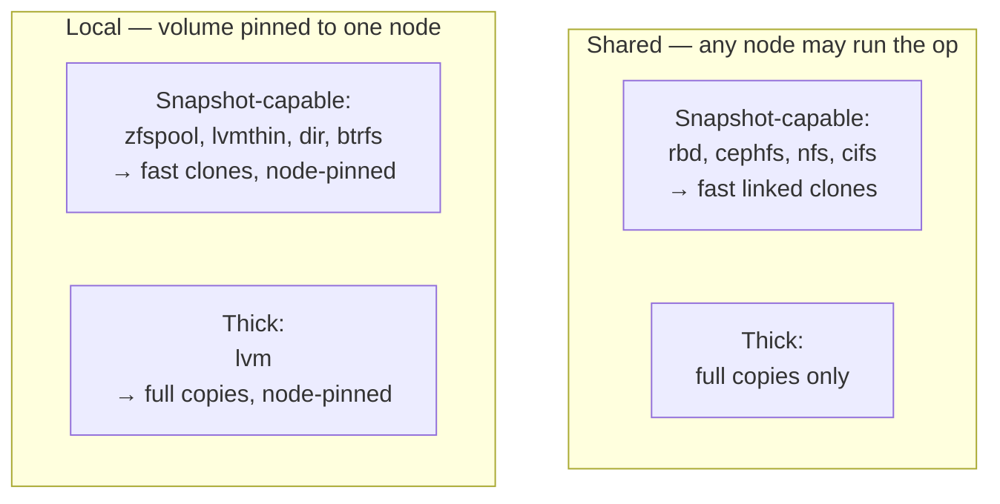
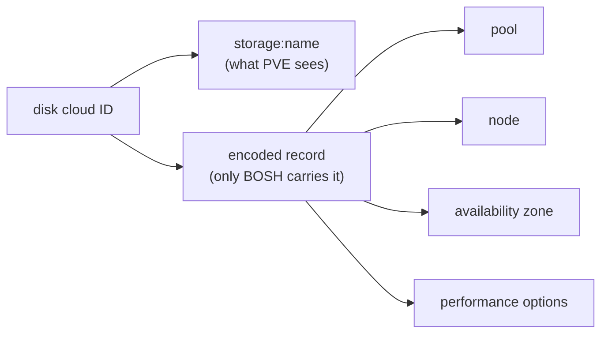
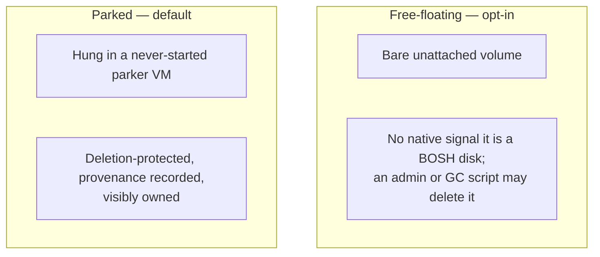

# Chapter 8 — Inventing the Durable Volume

BOSH's most important promise is that our data survives our compute. Kill a VM, recreate it, move it to another node — the persistent disk it carried comes back attached and intact. Every real cloud backs this with a first-class object — an EBS volume, a Cinder volume, a VMDK. Each has its own identity, metadata, tags, and ownership, all existing independently of any VM. PVE offers no such object. A volume's entire identity is the string `storage:name`. There is no volume-metadata API, no volume-tag API, no ownership field. A detached volume is bytes on a disk with no record of who made it, what it is for, or whether deleting it is safe.

This is the richest invention in the whole CPI. There is no volume, so the CPI builds one out of the only durable carrier it has. And because storage in PVE is bolted to locality, building the volume drags placement back into the story — the two are not separable decisions.

*The first principle of this chapter: when the platform lacks the object our abstraction needs, build it out of the only durable carrier we have. Locality is destiny for local storage; placement and storage are one coupled constraint. And a scored preference is the wrong tool for a physical impossibility.*

## The storage matrix: discovered, not assumed

PVE storage backends differ along two independent axes, and getting either wrong produces an unattachable disk or a four-minute VM creation. The CPI classifies every backend by reading the cluster's live storage list and caching it briefly.

- **Visibility — local or shared**
  A shared backend is reachable from every node, so any node may run an operation against it. A local backend lives on exactly one node's storage, which pins both the volume and whichever VM owns it.

- **Capability — snapshot-capable or thick**
  A snapshot-capable backend supports fast copy-on-write linked clones. A thick backend can only do a full block copy. This is the axis behind the clone economics of [Chapter 4](04-stemcell-mold.md): the linked-clone path that turns roughly four minutes into seconds is available only on snapshot-capable storage.

*Two orthogonal axes; an unrecognized backend is read as the most constrained cell — local and full-copy.*

The default for an *unrecognized* backend is the most constrained reading: local, explicit placement required. That is the fail-closed choice again. When a wrong guess costs us a lost or unattachable disk, the safe pessimistic default beats the optimistic one. Clone strategy then follows capability. The automatic mode picks linked clones where snapshots exist and full copies on thick storage. Forcing linked clones on a thick backend errors loudly rather than silently falling back to a slow path we did not ask for.

## Locality couples storage to placement

Because a local volume lives on one node, it dictates which node its consumer must run on. Storage and placement stop being independent decisions. When a disk is born on a local backend, it must be created on the same node as its owning VM, so the node-selection order inverts relative to shared storage. When the CPI must find an existing local volume, it cannot assume where the volume sits, so it scans the cluster node by node until it finds it.

This is where preference hardens into constraint. Chapter 6's scoring weighed preferences a busy cluster could override; a local disk is physics. A local disk on one node simply cannot attach to a VM on another; the bytes are not there. So VM creation reads the node out of the cloud ID of any persistent disk the VM already owns and applies it as a hard placement constraint. Attaching a local disk to a VM on a different node is refused up front with a clear error, instead of a baffling failure deep inside PVE. There is no cross-node move: once a local disk lands, its owner is bound to that node, and relocating it is a manual operator action. No amount of good scoring can attach bytes that are not on the node, so scoring never gets the chance to try.

## Smuggling identity into the only string PVE gives us

Here is the headline invention. PVE will not store a volume's identity, so the CPI hides the identity inside the volume's own cloud ID — the string the Director already carries and hands back on every call. Appended to the plain `storage:name` that PVE understands is an encoded record the Director transports and PVE never sees. It holds the pool, the node, the availability zone, and the disk's performance options. The cloud ID is simultaneously the volume's *name* and its *configuration*. The CPI strips the encoded part before any PVE call and reads it back on the next one. Statelessness forces this: with no daemon memory, the identity has to live somewhere durable, and the durable thing is the ID the Director never loses.

*The cloud ID is both name and config: PVE reads the left half, the Director carries the whole thing.*

Identity also needs a namespace. Persistent disks get their own synthetic VMID band, separate from the bands used by VMs and templates. A destructive operation can tell a foreign persistent disk from a VM's own disks by the band its ID falls in. The identity lives in the namespace itself, and it is load-bearing safety machinery: the guard that stops VM deletion from freeing a persistent disk that drifted into the VM's config is built directly on it. [Chapter 10](10-safety.md) returns to that guard in full.

## The detach window and the coat-check

Between detaching a disk and re-attaching or deleting it, a persistent disk has no owning VM. The cheap reading of that window lets the disk float as a bare unattached volume — unlimited, one API call. But a PVE administrator browsing storage then sees an anonymous volume with zero native signal that it is a live BOSH disk. They might delete it. A cleanup script might garbage-collect it as an orphan. For a single BOSH-aware operator that risk is tolerable; for a shop with non-BOSH-aware admins or storage-scanning automation it is not, and the loss it ends in is unrecoverable. So floating is what we make operators ask for, not what they get by accident.

The default strategy gives every detached disk a visible, protected home. Think of it as a coat-check. Each detached disk is hung in an active slot of a dedicated parker VM. The parker is a machine in its own VMID band that is never started. It is marked deletion-protected, so PVE refuses to remove it. It exists for no reason other than to hold ownership — and a deletion block — onto bytes PVE would otherwise treat as anonymous. Parkers fill densely: each holds many disks, new parks reuse the lowest parker with a free slot, and a fresh parker is created only when the rest are full. Local disks park on a parker on their own node, honoring locality even at rest. The cost is a handful of extra API operations per detach instead of one, on top of a cluster-wide holder scan that both strategies now pay before an attach or a delete — the price of making an invisible thing safe.

*Parking trades a few API calls for a visible, protected home; free-floating gives that back for cheapness and anonymity.*

## The paperwork can race; the disk cannot

Even parked, a disk wants an audit trail — which disk, from which VM, when, on which node, under which Director. PVE has no field for that except the parker VM's description, so each park writes a structured provenance note there. An audit tool reads those notes cluster-wide and classifies every volume: attached, parked, free-floating, or unknown. The note is best-effort: PVE offers no atomic read-modify-write on a description, so two concurrent parks on the same parker can overwrite each other's *entry*. But the disk itself stays correctly attached in its slot. The durable physical fact — the slot attachment — is deliberately separated from the best-effort advisory record. When we cannot have atomicity, we arrange for the thing that races to be the one we can afford to lose. The disk is safe even when its paperwork is incomplete. Guards protect the parker itself. VM deletion refuses to destroy a tagged parker; snapshotting a parked disk is refused; an unreadable parker band is refused and retried rather than guessed at.

## Expressing intent at the right altitude

The disk's identity string does one more job. Attaching a disk carries no properties of its own, and the CPI holds no state. So the performance contract chosen at create time — caching, threading, throughput caps — is baked into the cloud ID. At attach it is merged with global defaults, and the per-disk choice wins. Intent rides with the thing it describes.

Above that sits a layered resolver, so operators express intent at its natural altitude. A global default says "always." A named profile handles a workload class. A per-call override wins outright. The more specific layer always wins, which makes overrides predictable instead of surprising. Storage tiers apply the same spirit to placement. A tier describes what storage must *do* — fast, shared, encrypted — and the CPI matches that against live cluster storage at call time. It picks the first pool that satisfies the requirement rather than hard-coding a pool name. This is the Kubernetes storage-class idea: bind intent to capabilities, not to names, so the same manifest works on any cluster that can meet the requirement.

## Where this leads

The machine, its network, and its durable data are all designed now — every primitive PVE lacks, manufactured from first principles. But a clean design on a quiet cluster is not the same as a design that survives production. In production a dozen deploys hit a hypervisor built for a handful, and the lockfiles start to creak. Surviving that storm is the opening of [Chapter 9](09-absorbing-the-storm.md) and Part IV.

