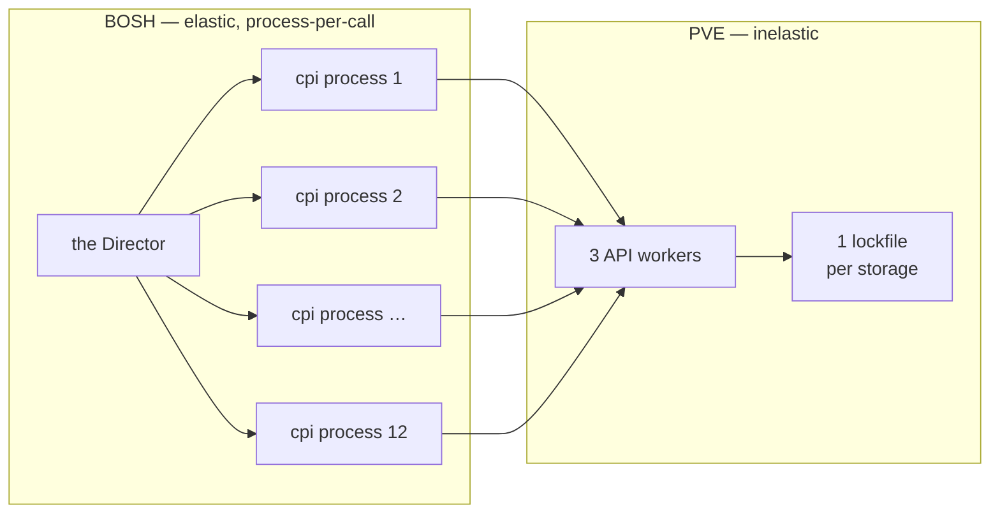
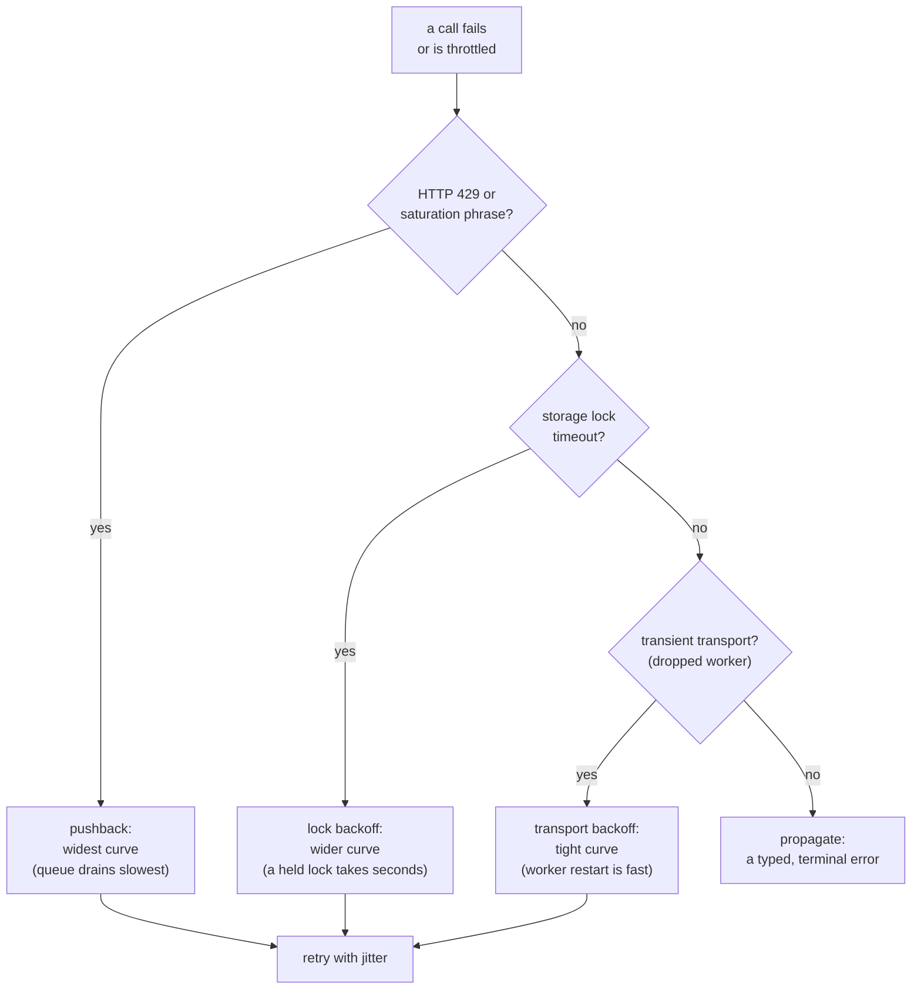

# Chapter 9 — Absorbing the Storm

A single Cloud Foundry deploy launches a dozen or more machines in the same breath. The Director, eager and parallel, fires a dozen `create_vm` calls inside one second. On AWS or Azure that burst lands on an elastic API that shrugs and scales. On PVE it lands on a control plane that was built for a human clicking a web UI, or a handful of automation calls — never a fan-out storm. Somewhere between the eager orchestrator and the unhurried hypervisor, something has to absorb the shock. That something is the CPI.

*The first principle of this chapter: the CPI is an impedance-matching transformer. An elastic orchestrator stands on one side, an inelastic hypervisor on the other, and the CPI's core resilience job is to absorb a burst the server cannot.*

## The structural mismatch

The two sides were designed under opposite assumptions, and neither can be changed. BOSH assumes the infrastructure API is horizontally elastic, because on the big public clouds it is. PVE assumes a narrow, serial workload. Its API daemon runs a small fixed pool of HTTP workers — three by default — and every storage mutation serializes behind a single lockfile per storage pool. Allocate, free, resize, snapshot, import, and upload all queue behind that one lock.

Now count. A dozen concurrent calls hitting three workers and one lockfile per storage is roughly a ten-to-one ratio of in-flight work to capacity. And here is the detail that makes in-process cleverness useless: each CPI call is a *separate operating-system process*. The Director spawns one binary per VM. There is no shared memory, no in-process queue, no semaphore the calls could cooperate through on their own. In-process serialization does nothing. The only throttle BOSH offers is its worker pool, which defaults wide. So the reconciliation cannot live in BOSH and cannot live in PVE. It lives entirely on the seam, in the CPI.

*A wide fan-out meets three workers and one lockfile; the ratio is roughly ten to one, and the CPI is the only place the two can be reconciled.*

The mismatch shows up as two distinct failure signatures, and telling them apart is half the design. The first is **lockfile serialization**: a mutation that loses the race for a storage lock waits, and after about thirty seconds the task simply fails with a timeout. PVE does not retry it. The second is **worker recycling**. Each API worker has a request quota and a memory ceiling, and when it hits either it exits cleanly mid-request, dropping every in-flight connection with no HTTP response. The symptom depends on exactly when the worker died — an empty body, a connection reset, a non-standard backend-gone status, or a truncated login that surfaces as a parse error on the auth ticket. Because a recycle happens roughly once every few hundred requests, a recycle landing inside a twelve-call burst is not bad luck. It is statistically guaranteed.

## Three layers, three points on the timeline

No single defense works, because the failure has three causes — queue saturation, lock contention, and worker recycling — that drain on three different timescales. The CPI answers with three layers, each acting at a different point in the call's life.

*The retry-decision flow: pushback first, then lock, then transport, then propagate — each routed to a backoff curve matched to the physics of its bottleneck.*

**Retry with backoff and jitter** acts *after* a failure. A worker restart is sub-second; a lock hold is a few seconds; both are transient. A retry that re-issues the call after a short, growing wait rides out the window with no operator in the loop. The signature move here is that the backoff curves are not arbitrary — each is matched to the drain time of its source. Worker restarts get a tight curve because the bottleneck clears fast. Lock holds get a wider one because a held lock takes longer to release. And jitter de-synchronizes the herd: without it, a dozen retrying processes would re-collide on the same lock in lock-step, recreating the contention they are trying to escape.

**Pushback detection** recognizes a stronger signal. When the server answers with an explicit too-many-requests status or a plain-text task error naming worker-pool saturation, the problem is no longer one contended lock — it is the whole queue. A saturated queue drains slower than a single lock, so the tight curve would only produce a retry storm that prolongs the saturation. Pushback gets the widest curve of all. The principle is to back off in proportion to how much of the server we have overwhelmed. A single contended lock is cheap to retry soon; a saturated queue must be left alone longer, or we feed the fire.

**The per-node in-flight limit** is the only preventive layer. Retries and pushback *absorb* a burst that already happened; this one *prevents* it. It is an opt-in cap on how many mutating calls the CPI will have in flight against any one PVE node at once, keyed by node name. Set at or below the worker count, it converts the CPI from purely reactive to partly preventive — fewer recycles and less saturation at the source rather than more retries after the fact.

## Waiting for the work to actually finish

There is a quieter resilience problem underneath all of this. PVE mutations are asynchronous. The API call returns a task ticket immediately, and the real work — clone, import, resize, destroy — runs in the background and may still fail. A CPI that returned on the ticket would report success before the VM existed, and the Director would record a machine that is not there.

So every call that returns a ticket is awaited: the CPI polls until the task truly completes before the handler returns. This is where async PVE becomes the synchronous, exactly-once illusion BOSH's state machine requires. It also fixes a correctness hazard, not just a timing one — awaiting a queued deletion before re-uploading a same-named volume prevents a late-firing delete from eating a fresh upload. The polling carries deadlines, and the deadlines matter as much as the polling. A never-completing task becomes a recoverable, retriable timeout the Director can re-drive, rather than a wedged loop holding a queue slot forever. An optional adaptive mode varies the poll interval with the task's reported progress — slow and gentle early on a long clone, quickening as it nears done.

Every one of these mechanisms obeys the same rule, the one this whole part of the book turns on: the worst legal output is a typed, retriable error. The CPI may slow down, back off, or hand the work back — but it never reports a success that did not happen.

## When the fix is host-side

The CPI absorbs *typical* recycle and lock windows. When contention is *structural* — too few workers, or storage that serializes harder than any retry budget can ride out — the honest answer is different. The fix is on the host, not in the CPI. Raise the API worker count for large deploys. Above all, split stemcell storage and VM storage onto different pools so they no longer share a lockfile. That is the highest-leverage change for any deploy beyond a few VMs. Worker tuning helps the API plane; storage splitting helps the data plane, and the data plane is usually where deploys stall. The design is equally honest about what *not* to tune. The thirty-second storage lock is baked into PVE and is not configurable. Kernel dirty-page knobs are useless here, because the storage lock serializes the operation long before the kernel ever sees the I/O. Knowing where the wall is matters as much as knowing where the knobs are.

## Where this leads

Absorbing load keeps deploys moving. But absorbing a storm is not the same as surviving a single call that fails anyway, halfway through building a machine. The next question is what the CPI does at the moment of failure. How does it guarantee it never wedges the Director, never leaks a half-built VM, and never destroys data it was only asked to detach? That is the subject of [Chapter 10](10-safety.md).

