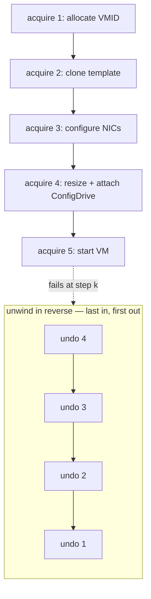
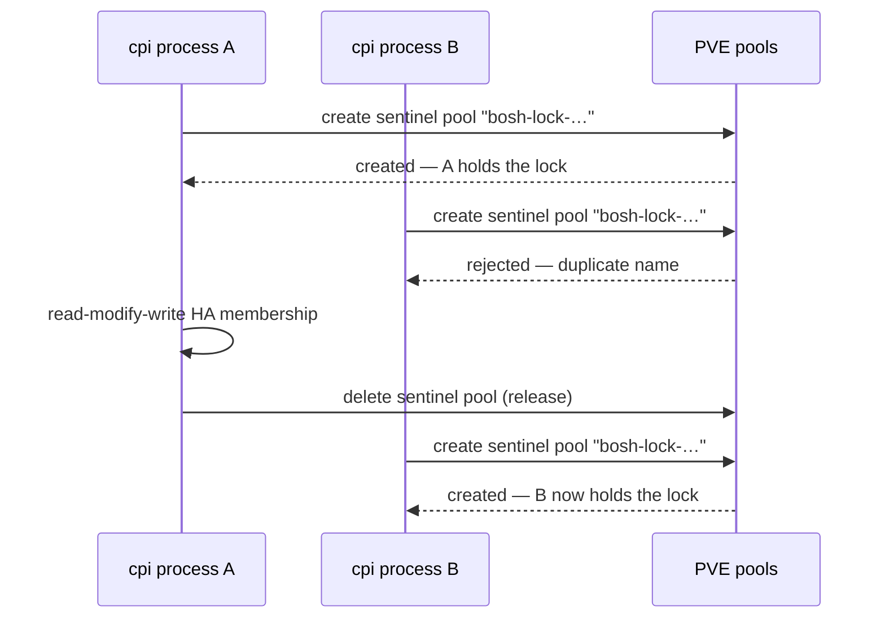

# Chapter 10 — Never Wedge, Never Leak, Never Lose

The Director is a long-lived state machine driving a whole foundation. The CPI is a disposable process it spawns thousands of times. That asymmetry sets a hard rule for the small side. Whatever goes wrong inside a single call, the CPI must never take the big side down with it. Never strand a half-built machine. Never destroy data it was only asked to set aside. A crash, a leak, or a silent deletion is not an acceptable failure — it is a catastrophe with a stack trace.

*The first principle of this chapter: an infrastructure component's worst legal output is a typed, retriable error. Never silence, never a crash, never corruption. And when the platform offers no atomicity, compose it out of non-atomic primitives — record an undo log and replay it in reverse.*

## Converting the worst case into the best available case

The CPI exchanges JSON-RPC over standard input and output: one request in, one response out, process exits. A programming fault deep in a handler — a bad assumption about a value that turned out missing — would crash the process and emit a malformed or empty response. To a long-lived Director, a garbage envelope is worse than an error: it can stall or confuse the state machine and leave a deploy half-orchestrated.

So the single doorway every request walks through — the dispatcher introduced back in [Chapter 2](02-stateless-contract.md) — wraps every handler in a recovery net. A fault that would have crashed the process is caught, logged with its full trace, and converted into a retriable error the Director understands. The worst case becomes the best available case. Instead of a dead process and a confused orchestrator, the Director gets a clean "try again" and the operator gets a logged trace to read later. This is the safety equipment every call wears, applied uniformly so no individual handler has to remember it.

## A transaction with no native rollback

Creating a VM is not one operation. It is a sequence: allocate an identifier, clone the template, configure the network interfaces, resize the system disk, attach the ConfigDrive, start the machine. PVE offers no rollback for that sequence. A failure at the fifth step leaves a half-built VM occupying an identifier and consuming storage, with no corresponding record on the Director's side. That is a leak, and leaks compound. They deplete the VM identifier range, litter storage with disks and ConfigDrive images, confuse later orphan scans, and tempt a retrying Director to pile a second mess on top of the first.

The answer is to compose atomicity out of steps that are not themselves atomic. As each resource is acquired, the handler registers an undo action onto a stack. If the call succeeds, the stack is discarded. If any step fails, the stack fires in reverse — last acquired, first released — so a half-created VM does not leak.

*The rollback stack as a LIFO undo log: resources are acquired in order, and on a failure at any step the recorded undos fire in reverse, because later resources depend on earlier ones and must be torn down first.*

The reverse order is not cosmetic. Later resources depend on earlier ones; we cannot release the identifier while the clone that uses it still exists. So the unwind must mirror the acquisition exactly, the way nested cleanup naturally stacks. The design is honest about its own limit: best-effort cleanup can itself fail, and a cleanup that fails leaves a leaked identifier that an operator must remove by hand. And there is a deliberate escape hatch. A debug setting tells the CPI to keep failed VMs instead of destroying them — tagged for inspection rather than erased — so an engineer can examine the wreckage of a hard-to-reproduce failure. It breaks the no-leak guarantee on purpose, which is exactly why it is off by default and labeled for debugging only.

## Borrowing a mutex the platform never offered

Some state is not local to one call. Anti-affinity — the rule that keeps a deployment's machines spread across nodes — lives in shared, cluster-wide membership that every `create_vm` may need to read and rewrite. Two concurrent calls are two separate processes with no shared memory. Both can read the same membership, both can pick the same least-loaded node, and both can write back, each clobbering the other. It is the classic time-of-check-to-time-of-use race, and its consequence is precisely the co-location that anti-affinity exists to prevent.

There is no in-process lock that spans separate processes, and PVE offers no application-level lock primitive at all. So the CPI builds one out of a platform operation that is *already* globally serialized: creating a resource pool. PVE serializes pool creation cluster-wide and rejects a duplicate pool name. That create-or-fail is a distributed test-and-set. The process that successfully creates a sentinel pool holds the lock; its identity and an expiry timestamp are recorded in the pool's description. Others wait. **PVE resource pools double as a cluster-wide mutex.**

*The pool lock as a distributed test-and-set: one process wins the create and serializes the shared read-modify-write; the other is rejected and waits, and on a stale expiry a waiter may steal the lock and verify it actually won.*

The hard part of any advisory lock is process death — a holder that crashes must not deadlock the cluster forever. So the lock carries an expiry that doubles as a time-to-live. A waiter that finds the recorded expiry already passed *steals* the lock by deleting and recreating it, then verifies it genuinely won before proceeding. That expiry-plus-steal-plus-verify trio is the minimum needed to make the lock safe against a crashed holder. The feature is opt-in, and on timeout it returns a retriable error so the Director re-drives the call rather than failing the deploy.

## Refusing to cross a lifecycle boundary

The most dangerous moment in the whole CPI is `delete_vm`. The underlying destroy can be told to free every disk referenced in the VM's configuration. Most of the time that is correct — the system disk and ephemeral disk should die with the machine. But persistent disks are the one thing BOSH must never lose. They hold stateful service data and outlive the machines that mount them. The Director's view of which disks are attached can drift from PVE's; a snapshot can quietly demote an active disk into an unused configuration slot. If `delete_vm` blindly purged everything in the config, a routine VM recreate could wipe a database. Irreversibly.

The guard rests on a decision made earlier in the book: persistent disks live in their own synthetic identifier band, separate from the band VMs use. That separation, introduced for [durable volumes](08-durable-volume.md), turns a dangerous ambiguity into a decidable question. Before destroying anything, the CPI inspects the VM's disks. A disk whose identifier falls in the persistent band is not this VM's to delete — it belongs to BOSH's separate disk lifecycle. So `delete_vm` refuses outright and demands a `detach_disk` first, with an error message that names exactly what is wrong and what to do. The namespace makes "is this disk mine to delete?" an answerable question, and where data is at stake the answer fails closed: when in doubt, refuse.

## The same answer, every time

Four mechanisms, one shape. Recover a fault into a retriable error. Unwind a partial build instead of leaking it. Serialize a shared write instead of clobbering it. Refuse a destructive delete instead of crossing a lifecycle boundary. Each resolves its uncertainty toward retry or refusal, and never toward a false success. That is the error model from [Chapter 2](02-stateless-contract.md) closed at last. Every failure answers the Director's one question — *should I try again?* — honestly, and the honest answer is never a lie about what happened.

## Where this leads

A CPI that is safe to itself must also be safe to everything around it: the operator who holds its credential, the logs it writes, and the network it can reach. Safety against our own bugs is one thing; safety against a hostile world is another. That is the subject of [Chapter 11](11-hostile-by-default.md).

