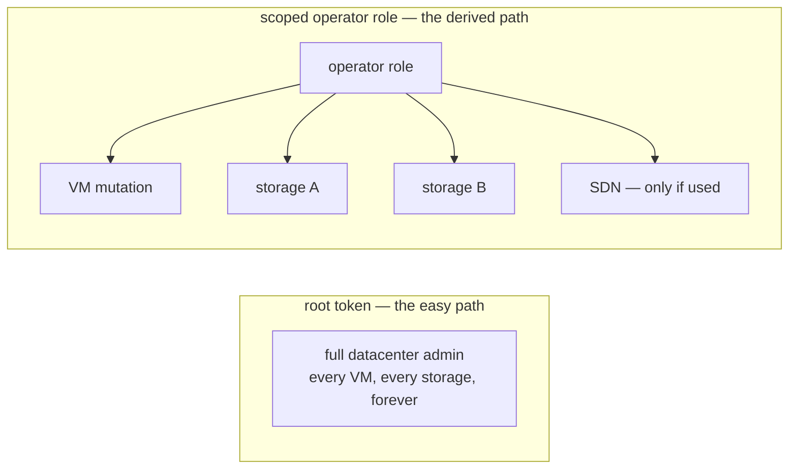
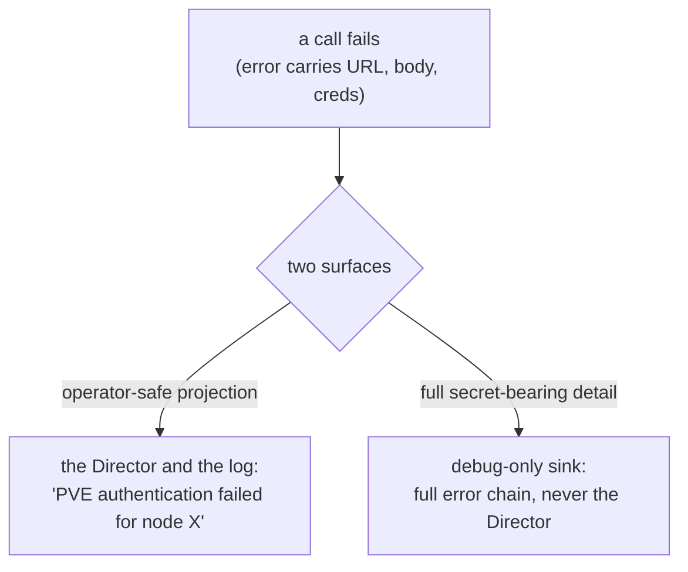

# Chapter 11 — Hostile by Default

The fastest way to make a CPI work is to hand it a root token. Give it full administrative power over the whole cluster, and every call it could ever make just succeeds. That token then sits on the Director for the entire life of the foundation. The fastest path is also the worst one: a standing root credential is a standing blast radius, and if the Director or its config store is ever compromised, that credential's scope is the ceiling on the damage. The same logic applies to everything the CPI touches — the secrets in its arguments, the logs it writes, the commands an operator asks it to run, the URLs it dials. A serious infrastructure component assumes the world around it is hostile and designs for that assumption up front.

*The first principle of this chapter: a standing credential's scope is its blast radius, so derive privileges from what the code actually does; secrets must never reach a lower-trust sink; and every extension point is hostile by default.*

## Least privilege derived from the call graph

The CPI does not need administrative power. It needs exactly the calls it makes — and no more. So the privilege set is not guessed at; it is derived from the actual inventory of operations the handlers perform. Each operation maps to a specific PVE privilege on a specific path: the right to allocate a VM on the VM path, the right to allocate space on each named storage path, and so on down the list. Those privileges bundle into a single custom operator role, granted on narrowly scoped paths — the cluster root for cluster-wide reads, the VM tree, the SDN tree only if managed networks are in use, and one grant per storage pool the CPI is configured to touch. Audit-read comes from a built-in read-only role rather than widening the custom one. Feature-specific privileges are conditional on the feature: the SDN privilege appears only with software-defined networking, the console privilege only with HA placement. Least privilege here is not a guess or a recommendation. It is a consequence of auditing the code.

*Blast radius: a root token is the whole datacenter standing on the Director; a derived operator role is exactly the named storages and features the code actually uses.*

The design is honest about where this hits a wall. One destructive flag — the one that forces destruction of a locked VM — is restricted by PVE to the literal root user and cannot be granted through any role at all. So full least privilege has a real cost: a minimally-privileged CPI cannot clear a *locked* VM. The design states that trade-off plainly rather than hiding it, and shapes the rest of its behavior around PVE's root-only restrictions to stay minimal everywhere it can.

The credential itself is an API token, not a password, because a token can be revoked on its own without disturbing the account, and several tokens can be scoped differently. Tokens carry a privilege-separation toggle that, when turned off, lets the token inherit its parent user's full access. On a root user that toggle is reckless — it exposes the entire datacenter. On the minimally-privileged operator user it is safe, because the blast radius is already bounded by what that user can do. The setting is the same; the trust boundary is different. A security toggle's safety is a property of the principal it applies to, not of the toggle itself.

## Two trust tiers, two messages

Secrets pass through the CPI constantly. The message-bus URL embeds a username and password. Blobstore credentials, API tokens, and raw error bodies from PVE all flow through arguments and responses. Logs, meanwhile, are a *lower* trust tier than the credential store: they are written to disk, shipped to aggregators, retained for months, and pasted into support tickets. A credential that reaches a log has, for all practical purposes, escaped its vault.

So nothing reaches a log unscrubbed. A deep, structure-preserving scrub walks every argument and result before it is traced — masking sensitive-keyed values, URL userinfo, and signature-bearing query parameters — and leaves the *shape* intact so the log stays diagnostic even with the secrets replaced by redaction markers. The redactor's coverage is not theoretical; it is the accumulated product of real leak post-mortems, each of which taught it one more place a secret hides.

*Two trust tiers, two messages: the Director and the durable log get an operator-safe projection, while the full secret-bearing detail stays in the lowest-reach debug sink or never materializes at all.*

The same two-tier discipline governs error messages at the RPC boundary. An error carries an operator-safe message that the Director sees, while the full underlying detail — the URL, the response body, the credential hints — is preserved only for the local debug log. A PVE authentication failure returns a clean "authentication failed for node X" to the Director; the raw failure with all its sensitive context stays in the lowest-reach sink. This split never loses the retriability classification from [Chapter 10](10-safety.md): the operator-safe projection still tells the Director whether to try again. Operational identifiers — paths, storage names, VM identifiers — are deliberately *not* redacted, because they aid diagnosis and are not secrets.

## Extension points that assume hostility

Operators want side effects around CPI calls — audit logging, annotating a VM with its deployment identity, registering it in a load balancer, running a site-specific command — without forking the CPI or threading a conditional through every handler. These concerns are orthogonal to the per-method work, so the CPI factors them out as **hooks**: middleware that wraps around a stable handler interface, running before and after each call without the handler knowing they are there. Configured hooks are resolved by name against a registry at startup, and an unknown name fails immediately rather than silently — a typo is caught at boot, not discovered in production.

The economics matter as much as the mechanism. When no hooks are configured there is no chain to build and nothing to wrap, so the overhead is exactly zero. Registration itself is gated, not just execution. That zero-cost-when-off property is the precondition for the provable additivity that [Chapter 12](12-operating.md) rests on: a feature that taxed every deploy whether used or not would be a feature operators disable.

Four hooks ship built in: an audit log that records each call's duration and outcome but never its argument content, so it is redaction-safe by construction; a notes writer that stamps the owning BOSH deployment into the VM's description so the PVE UI shows who owns what; a load-balancer registration; and a general host-command runner. They share one rule — side channels are best-effort. A load-balancer registration that fails is logged and moves on; it does not fail the VM lifecycle. An external dependency must never become a single point of failure for the core mutation. Only the core mutation itself is allowed to fail the call.

Two of those hooks dial directly into the hostile world, and each carries its own guard. The **host-command runner** treats its inputs as dangerous: no shell, so there is nothing for metacharacters to exploit; an allowlist of absolute executable paths rather than a denylist, with an empty allowlist making the hook entirely inert; symlink resolution so the allowlist cannot be tricked; a scrubbed environment that drops everything except an explicit pass-list, so the Director's credentials never reach the child; and a process-group kill on timeout so the child cannot orphan runaway grandchildren. Every dimension — path, environment, time, and process tree — is bounded, and the dangerous capability ships off.

The **load-balancer registration** dials an operator-supplied URL, which makes the CPI a confused-deputy candidate: it holds a trusted network position, inside the perimeter, that an external caller lacks. Pointed at an internal address — a metadata endpoint, loopback, a private host — it could be turned into a server-side request forgery. So by default it refuses any endpoint that resolves to a private or loopback address. An operator on a genuinely trusted private network opts into the exception explicitly. The default is deny; widening it is a deliberate, recorded choice. Any component that dials an externally-supplied URL from a trusted position must start from refusal and make the exception loud.

## Where this leads

Fast, safe, and secure, the CPI still has to be *operated* — by someone who did not write it, at three in the morning, reading logs and running recovery commands under pressure. The last property of a production component is that it can be diagnosed and repaired from the outside. That is the subject of [Chapter 12](12-operating.md).

## Grounding in the implementation

- [API permissions and least privilege](../pve-api-permissions.md)
- [Configuration reference](../configuration.md)
- [Architecture overview](../architecture.md)
- [Operations](../operations.md)
