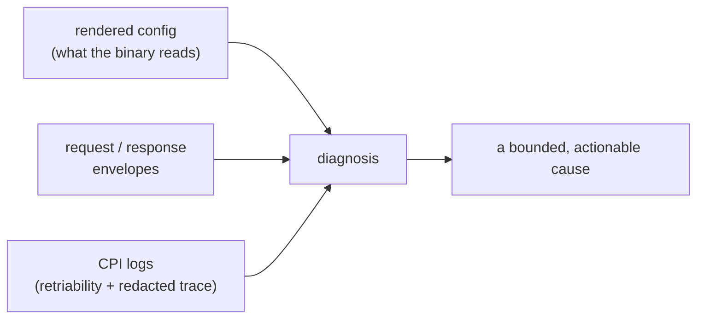
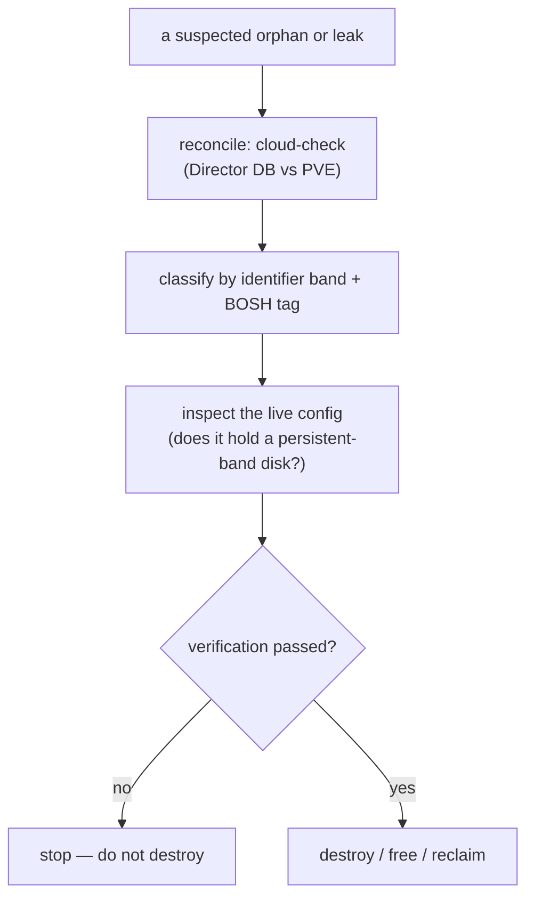
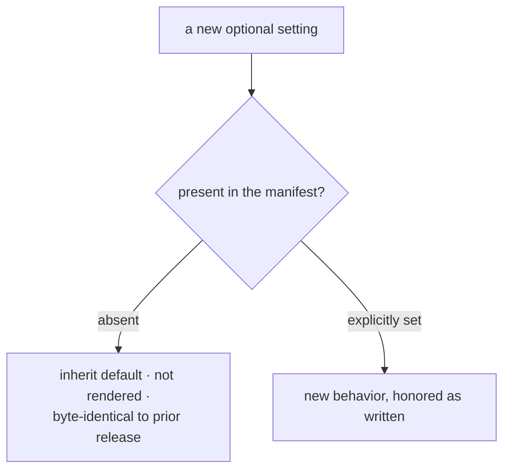

# Chapter 12 — Operating the Thing

A deploy breaks at three in the morning. The person staring at it did not write the CPI, cannot read its source, and has one piece of evidence: an error string and a hung task. Every property the earlier chapters built — fast, safe, secure — is worthless now if this person cannot find the cause and repair it. Operability is the last property of a production component, and it is the hardest to retrofit, because it has to be designed into how the system reveals itself.

*The first principle of this chapter: diagnosis starts from ground truth, ownership is made legible so recovery is a decidable classification, precondition failures are pushed as far left as possible, and additivity is made provable so upgrades are safe.*

## Diagnose from ground truth

The first trap is diagnosing from the manifest. The manifest is what the operator *intended*; it is rendered, defaulted, and transformed before the binary ever reads it. So every diagnostic path starts from the artifact the running process actually consumes: the rendered configuration file the binary reads, the request and response envelopes it exchanges, and the logs it writes. Not the template — the ground truth.

*The three ground-truth entry points — rendered config, RPC envelopes, and logs — feed a diagnosis; none of them is the manifest the operator wrote.*

Inside those envelopes sits the load-bearing field from [Chapter 2](02-stateless-contract.md): the retriability flag that told the Director whether to re-queue. Reading it backward, an operator can tell self-healing noise from a real problem. A handful of retries on a storage lock or a dropped connection is the resilience layer from [Chapter 9](09-absorbing-the-storm.md) doing its job, and it needs no human. The same error climbing toward the attempt ceiling, every time, is a structural problem the host must fix. The skill is not reading the log; it is knowing which lines to ignore.

## Push failures left

Most CPI deploy failures are not CPI bugs. They are environmental preconditions: a storage pool missing the content type the CPI needs, stemcell storage that is local-only on a multi-node cluster, a firewall blocking the API port, a VM identifier range too small for the deployment. Discovering any of these twelve minutes into a deploy, wrapped in an opaque hypervisor error, is expensive. Discovering them before the deploy starts, with a message that names the exact storage path and the exact missing privilege, is cheap. The whole game is to move the failure left.

The left edge is a pre-deploy smoke test: a small set of API probes that exercise every privilege the CPI will need and return a clear permission error on a named path the moment one is missing, plus checks that the storage is shared and file-based, the bridge exists, and the identifier range has headroom. A wrong answer here costs seconds. The next edge in is an in-band check: after a VM starts, the CPI can ping the guest agent and fold a boot failure into a clean timeout error *before* it rolls the machine back, so boot problems surface earlier and more legibly. An optional check verifies the agent's binary digest, and it fails *open* — any inability to verify proceeds, and only a proven-wrong digest stops the deploy. That posture is deliberate: a diagnostic must never become a new failure mode. A check that fails closed on its own uncertainty would break more deploys than it ever caught.

## Own the configuration the CPI trusts

The smoke test names a missing privilege, but a privilege is only half the story. Behind it sit the credential that carries it and the file that declares it, and both are the operator's to own. The rendered configuration file that our first diagnostic path already named is the second ground-truth artifact of this chapter: the Director interpolates the manifest, resolves its secrets from the credential store, and writes one file the binary reads on every invocation. That file is where an operator's intent — endpoint, storage, network, and identity, each field documented in the [configuration reference](../configuration.md) — becomes fact, so we treat it as a contract to be checked, never trusted. On load the CPI applies its defaults, then validates the whole structure and accumulates every error before it opens a single connection to PVE. A malformed file fails at the door, with the offending field named, rather than twelve minutes into a deploy behind an opaque hypervisor error. It is the same push-left instinct, turned on the operator's own input.

The credential in that file is where the least-privilege story of [Chapter 11](11-hostile-by-default.md) meets an operator's daily reality. We prefer an API token to a password, and when both are supplied the token wins and the password is discarded: a token is revocable on its own, scoped on its own, and carries no ticket to expire mid-deploy. The one hard requirement is that at least one of the two is present — a config with neither is rejected at load and named as such. The token is the combined user-realm-identity-secret form, so nothing about which node we call or which operation we run changes how we present ourselves to PVE.

What that token can do is exactly what the handlers call, and no more. The [PVE API permissions](../pve-api-permissions.md) reference lists each grant against the path it acts on, and Chapter 11 explains why the set is derived from the call graph rather than guessed. The operational payoff shows up here, in the 3am frame: a compromised CPI credential is a bounded loss. It can allocate and mutate the VMs, disks, and networks it was scoped to and cannot reach past them — it cannot even force the destruction of a locked VM, because PVE reserves that one flag for the literal root user, which no role can impersonate. The credential is a liability we sized deliberately small, and its exact size is written down, auditable, and owned. Configuration and credential are owned artifacts, legible and bounded. The resources the CPI leaves behind must be made just as legible, and that is the harder problem.

## Make ownership legible

Resources leak. A VM is torn down outside BOSH, a task crashes mid-flight, a [parker VM](08-durable-volume.md) is deleted and leaves a disk floating free. PVE has no first-class record of which volume belongs to BOSH, so recovery would be guesswork — except that the CPI made ownership legible on the way in. The synthetic identifier bands from [Chapter 10](10-safety.md) are the same mechanism reused for operations: a resource's band names its lifecycle class. VMs in one range, persistent disks in another, templates in a third, parker VMs in a fourth. BOSH tags add the deployment and job identity on top. Together they turn recovery from a guess into a *classification* — identity by namespace, paying off a second time.

Classification is necessary but not sufficient, because every cleanup step is destructive and irreversible. So recovery is gated: verify before destroying.

*Verify-before-destroy: reconcile, classify by band and tag, inspect the live config, and only then take an irreversible action — every destructive step is gated behind a check the operator must pass first.*

A disk-audit tool walks the persistent band and classifies every disk — attached, parked, free-floating, or unknown — with stable exit codes so the classification can drive a script as well as a human. The reconcile-first habit catches drift before anyone reaches for a destructive command, and the inspection gate ensures no purge runs against a config still holding a disk from the persistent band. Wrong cleanup is data loss, so the procedure is built to make wrong cleanup hard.

## Index by the symptom

A troubleshooting reference organized by subsystem forces the operator to already know the cause to find the cure. So the CPI's runbook indexes by what the operator can *observe* — the literal error string, the hung deploy — and routes from there to diagnosis and fix. That matches how incident response actually works: we start with the symptom and hunt for the cause, never the reverse.

The gold standard is the duplicate-IP entry. The symptom is maddening: instances flap on a roughly fifteen-second cadence while every resource, the message bus, the firewall, and the agent process itself all measure perfectly healthy. Nothing is broken, yet nothing stays up. The entry does not guess. It gives a packet-capture and ping-sweep procedure that *proves* the cause — two hardware addresses answering for one IP, the genuine machine's address frame even distinguishable by its byte length from the impostor's padded one — and only then prescribes the fix: an isolated network BOSH fully owns, so its address space cannot collide with a physical LAN. That is the model for the whole runbook. Name the deceptive symptom, give a procedure that proves the cause, and then fix the *class* — own the address space — rather than chasing the one flapping instance. A good entry also tells the operator when *not* to act, separating the retry noise the system heals on its own from the rare structural failure that genuinely needs a human.

## Trace the request across the seams

The runbook works when a symptom points at one cause. Some failures are not so local. A single CPI action can fan out into a chain of calls — the Director invokes the CPI, the CPI makes a sequence of PVE API calls, and any one of them can be the slow or failing link. The logs record each of these, but reading them means correlating by hand: matching timestamps, guessing which line belongs to which call, reconstructing an order the logs never state outright. That reconstruction is exactly the work a machine should do.

So we let an operator opt into distributed tracing. One root span opens per CPI action, and every PVE API call the action makes becomes a child span beneath it, timed and named. The log lines the action already writes carry the trace and span identifiers of whatever call was active when they were emitted. The payoff is a single identifier that walks the whole request: one trace ties the Director's invocation, the CPI's dispatch, and each underlying PVE call into one ordered picture, so the slow or failing seam names itself instead of being inferred.

The trust properties are what make this safe to ship. Tracing is off by default and stays wholly inert until an operator explicitly enables it and points it at an exporter endpoint — left off, there is no tracer, no network connection, no per-call cost. When it is on, spans buffer in the process rather than exporting one at a time, and they flush once, under a bounded timeout, as the process exits; a slow collector cannot stall an action mid-flight. If the collector is unreachable, the export failure degrades to a warning in our own logs and never becomes a failed CPI action — a diagnostic must never invent a new failure mode. And nothing about tracing ever touches standard output, because that channel carries the CPI's JSON-RPC reply and nothing else; a stray span on stdout would corrupt the one thing the Director parses.

That inertness is not incidental. The enable switch, the endpoint, the sampling ratio, and the flush deadline are all settings listed in the [configuration reference](../configuration.md), and every one of them defaults to the same do-nothing posture the next section makes a provable rule.

Tracing is one signal among three, and the other two answer questions a trace alone cannot. The first is what happened to the logs the CPI was already writing. Turn the signal on, and the same structured stderr lines the runbook already reads also flow to the collector — the stderr stream itself is untouched, byte for byte, because the OTel path is an addition riding alongside it, not a replacement for it. Whatever trace was open when a line was written travels with it, so a log record and the span it happened inside are the same identifier away from each other. A failure in that added path degrades the same way a failure in tracing does: a warning in our own logs, never a broken CPI action. We call this signal beta rather than stable, because the upstream logs SDK it depends on has not reached its own 1.0 yet, and we would rather say so plainly than borrow a confidence the dependency has not earned.

The second is what a trace cannot show at a glance: how long, in aggregate, an action takes. We resisted the urge to build a metric for every PVE call — that detail already lives in the spans — and instead expose exactly one instrument, a duration histogram tagged with the CPI method name and a success-or-error outcome, measured in milliseconds. It reports what changed since the last export rather than a running cumulative total, because a CPI process runs once and exits; a cumulative counter that resets to zero every invocation would tell a collector nothing true. One instrument, deliberately, rather than a dashboard's worth.

The third is the seam a trace can otherwise miss entirely: the moment the CPI's response leaves the process. If a panic strikes while the JSON-RPC reply is being written to standard output, the request's root span has usually already closed, and appending to a closed span is a documented no-op — so the recovery path opens a fresh span of its own, `cpi.response_write_failure`, carrying the method name and the request identifier, purely so that a failure in the one channel the Director reads still leaves a mark in the trace an operator can find.

Each of these three signals is opt-in on its own; a deployment can turn on the metric without the trace, or the logs without either, and every one still defaults off. And where a collector expects gRPC rather than HTTP, one protocol setting redirects all three at once — traces, logs, and metrics travel the same wire choice, so an operator names the transport once instead of three times.

## Prove the upgrade changes nothing

The last operability property is the quietest and the most important: an upgrade must be safe. A CPI is upgraded under deployments an operator cannot cheaply re-test, so the governing rule is that no behavior changes unless a new setting is explicitly turned on. Every new knob defaults to inert, and a manifest left unchanged after an upgrade must be byte-identical, in behavior, to the prior release.

This is not a promise; it is a proven property. The mechanism is a careful distinction between "not configured" and "configured off." An optional setting that is absent inherits down a chain to its default and is never even written into the rendered output, so its absence is faithfully a no-op. An optional setting explicitly set to off is honored as off. Keeping those two cases distinct is what lets omission be byte-identical while explicit-off still does its job — and a test pins the equivalence, asserting that an empty configuration behaves exactly as the prior release did. The few deliberate exceptions, the settings that default protective rather than inert, are encoded explicitly rather than left to chance. Additivity is proven, not asserted.

*The additive-when-unset path: an absent setting is byte-identical to the prior release, while an explicitly set one takes effect — so an upgrade with an unchanged manifest provably changes nothing.*

The same ethic runs through the supporting lab and CI tooling. The artifact cache falls back to building from source, so it is always safe to leave in place. Published outputs are written only after every step succeeds, so a partial run can never be picked up. The integration harness verifies against the real cluster's state, not just the CPI's own return values, because a CPI that lies about success is the worst failure of all. Fail open, publish atomically, and verify against ground truth — the same principles that govern the runtime govern the tools around it.

## Where this leads

The machine, its network, its data, its resilience, its safety, its security, and its operation are all designed now. What remains is to step back from the parts and see the whole shape — the recurring principles, the layered architecture that *emerges* from them rather than being imposed, and the honest edges where the walls are. That is [Chapter 13](13-whole-picture.md).

## Grounding in the implementation

- [Operations and recovery](../operations.md)
- [Troubleshooting](../troubleshooting.md)
- [Boolean inheritance convention](../bool-inheritance-convention.md)
- [Integration testing](../integration-testing.md)
