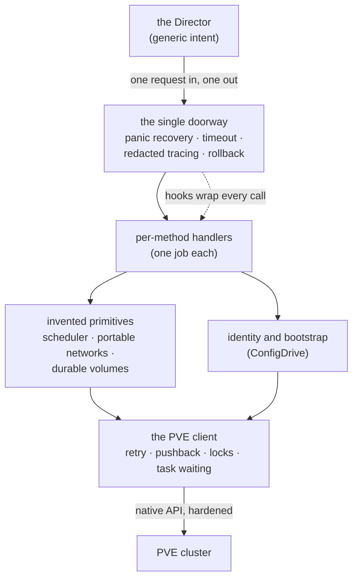

# Chapter 13 — The Whole Picture

We have walked the design one part at a time: the contract, the lifecycle, the inventions that fill PVE's gaps, and the work of surviving production. Seen up close, each chapter solved its own problem. Seen from a distance, they are not twelve separate solutions. They are one set of principles applied over and over to different material. This closing chapter steps back far enough to see that shape — the handful of ideas that recur, the architecture they quietly produce, and the honest edges where the design stops.

*The first principle of the whole system, restated: the CPI is a small factory that turns a single-cluster hypervisor into something BOSH can treat like a cloud — statelessly, idempotently, and honestly.*

## The principles that recur

A few ideas show up in chapter after chapter, wearing different clothes each time. Naming them together is the fastest way to understand the design as a whole.

- **The factory, not the translator**
A cloud CPI mostly maps generic intent onto a rich service that already exists. This one manufactures the service. The scheduler in [Chapter 6](06-scheduler.md), the portable networks in [Chapter 7](07-portable-networks.md), and the durable volumes in [Chapter 8](08-durable-volume.md) are all primitives PVE does not natively offer, stamped out by the CPI on demand.

- **Statelessness, and the search for a durable carrier**
The binary is invoked once per request and remembers nothing. So any fact that must outlive the call gets written into whatever durable thing already exists: the disk's own identifier string, a PVE high-availability rule, a parker VM's description, or a stateless ownership rule over names. The same constraint explains an astonishing amount of the design, from how a disk carries its own performance contract to how a placement decision survives the process that made it.

- **The chain from statelessness to honesty**
Statelessness forces idempotency, idempotency forces read-back operations so the Director can reconcile, and reconciliation forces an honest answer to one question on every failure: should I try again? That chain, drawn first in [Chapter 2](02-stateless-contract.md), is the backbone of the contract.

- **Locality is the spine**
Local-versus-shared storage and node-local-versus-cluster-wide networking are the same question asked of two different resources. A node-local resource pins the workload to one place; a cluster-global one lets it roam. Placement, migration, and disk co-location all fall out of which side of that line a deployment sits on.

- **Soft preference versus hard constraint**
Scoring weights are preferences a busy cluster can override. Disk co-location and strict pins are physics that must gate the decision outright. The recurring failure mode, in any infrastructure system, is using a preference where reality demands a constraint — or imposing a hard rule where a small cluster needs slack.

- **Fail open or fail closed, chosen per risk**
Every degradation path answers one question: can the system afford to lose this signal? A scoring axis fails open, because a worse-ranked node still works. Candidate enumeration, disk co-location, and the destroy-guards fail closed, because crossing them risks placing nothing or losing data.

- **The worst legal output is a typed, retriable error**
Never crash, never wedge the Director, never corrupt. Panic recovery, operation timeouts, and the retriability signal all enforce the same floor: when something goes wrong, degrade to a recoverable error the Director understands, never to silence or garbage.

- **Identity by namespace**
The synthetic identifier bands make lifecycle ownership a decidable property. That one mechanism powers both the foreign-disk guard that prevents data loss in [Chapter 10](10-safety.md) and the orphan recovery that makes cleanup safe in [Chapter 12](12-operating.md).

- **Hostile by default at the edges, additive by default in the config**
Extension points assume hostility — no shell, allowlists, scrubbed environments, refused internal targets, best-effort side channels that never fail the lifecycle. New configuration assumes the opposite intent toward the operator: every knob is inert until set, so an upgrade changes nothing unless asked.

## The architecture that emerges

None of these principles began as "let us build a layered architecture." The layering is a *consequence*. When every fact must live in a durable carrier, when cross-cutting safety must apply uniformly, and when the platform-specific work must stay quarantined from the platform-agnostic work, a particular shape falls out almost on its own.

*The layered shape is an effect, not a premise: cross-cutting safety collects at one doorway, handlers stay single-purpose, the invented primitives sit above a hardened client, and the platform-specific knowledge is confined to the bottom edge.*

Three things about this shape stand out. First, the doorway is the only place that knows about everything; every request walks through it and leaves wearing the same safety equipment, so no single handler has to remember to be safe. Second, the layers form a strict one-way dependency — the part that talks to PVE knows nothing about how machines are bootstrapped, and the bootstrap logic knows nothing about how requests are dispatched. That quarantine is what keeps the platform-specific blast radius small and the whole thing testable. Third, the resilience and safety machinery is not sprinkled through the handlers; it is concentrated at the edges — the doorway above and the hardened client below — so the business of each method stays small and legible.

That is the payoff of deriving an architecture from principles rather than drawing boxes first. The boxes we would have drawn are the boxes we end up with, but now we know *why* each one exists and what would break if we moved a responsibility across a line.

## Where the walls are

A design document that only lists triumphs is not trustworthy. The honest edges matter as much as the inventions, because they tell an operator where the guarantees stop.

- **Strict spreading on a small cluster fights high availability**
A hard anti-affinity rule that refuses to co-locate siblings can, on a two- or three-node cluster, leave high-availability failover with nowhere to evacuate a failing node. The strict constraint and the small cluster are in genuine tension; the design surfaces the choice rather than pretending it away.

- **Clearing a locked VM needs a privilege no role can grant**
PVE restricts the flag that destroys a locked VM to the literal root user, and that flag is governed by no privilege at all. Full least-privilege operation, the goal of [Chapter 11](11-hostile-by-default.md), therefore cannot clear locked VMs. The design states the trade-off plainly instead of quietly demanding root.

- **Cleanup and provenance are best-effort, not guaranteed**
The rollback that prevents a leaked VM can itself fail and leave one behind. The provenance written into a parker VM can be overwritten by a concurrent park. In both cases the durable physical fact — the resource state, the slot attachment — is protected; only the convenience record is at risk. That is a deliberate split, but it is a limit worth naming.

- **A node-local disk does not move itself**
Once a disk lands on local storage on one node, the CPI will not silently relocate it to another. Recreating its owner elsewhere is refused, not papered over; moving the bytes is an operator's deliberate act or a job for shared storage.

- **Some hypervisor limits are simply walls**
The storage lock timeout is baked into PVE and is not a knob. When contention is structural rather than transient, the CPI's job ends and the host operator's begins. The design absorbs the storms it can and is honest about the ones it cannot.

## The one-sentence version

Strip away the twelve chapters and one sentence remains. A general orchestrator refuses to learn any specific platform, and a capable hypervisor refuses to be a cloud; the CPI is the small, stateless, honest factory that stands on the seam between them and manufactures, on demand and at speed, every cloud primitive neither side will provide. Everything in this document — the clone that turns minutes into seconds, the scheduler built from a live read, the volume invented from a string, the storm absorbed, the secret never leaked — is a consequence of taking that one job seriously.

## Grounding in the implementation

- [Architecture overview](../architecture.md)
- [CPI methods](../cpi_methods.md)
- [Configuration](../configuration.md)
- [Documentation index](../index.md)
