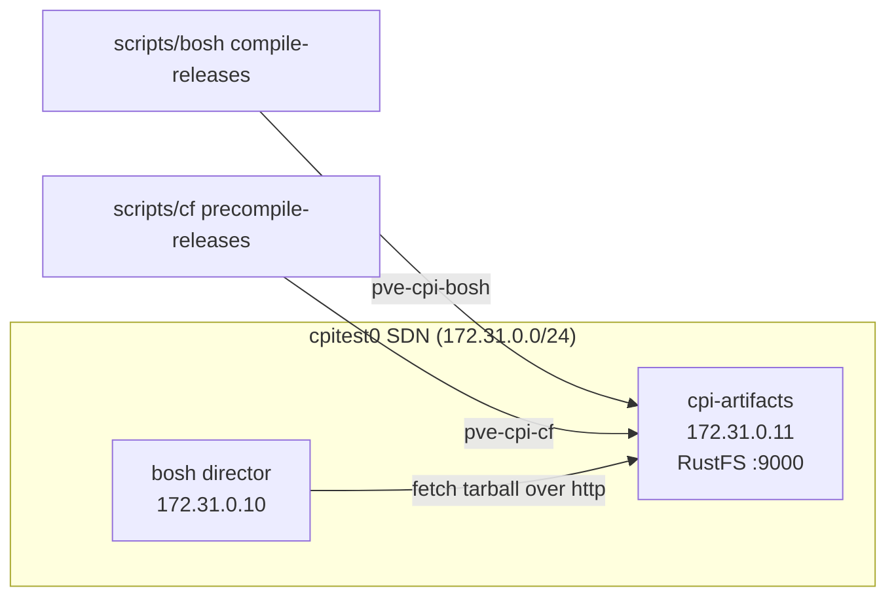

# Artifacts VM (RustFS S3 blobstore)

`./scripts/artifacts` stands up a small `cpi-artifacts` VM running
[RustFS](https://rustfs.com) — an Apache-2.0, S3-compatible, single-binary
object store — on the active env's isolated SDN network, parallel to the
create-env BOSH director. Once it is online, the compiled-release pipelines and
the director use it as a local S3 endpoint on the same network, instead of a
remote store or the local `file://` cache.

The whole feature is fail-open: when the artifacts VM is absent or unreachable,
every other script behaves exactly as it did before.

## Why

The director fetches compiled release tarballs by URL during `create-env` and
during CF deploys. A blobstore on the director's own SDN network keeps that
traffic local and removes the dependency on a remote S3 bucket, while still
exercising the same S3 code paths the CPI and BOSH use in production.



## Prerequisites

- The env's isolated network must exist first:
  `BOSH_PVE_ENV=cpitest ./scripts/bosh net-up`.
- `manifests/bosh/vars.yml` must carry the PVE connection (`pve_host`,
  `pve_node`, `pve_vm_storage`, and an `pve_api_token` or `pve_password`).
- Root SSH to the PVE host (the same channel `net-up` uses) and a route from
  your host to the SDN subnet (for example, an approved Tailscale subnet route
  for `172.31.0.0/24`) so the operator host can SSH the guest and reach `:9000`.
- The `aws` CLI on `PATH` for the bucket subcommands (`status`, `list-buckets`,
  `create-bucket`, `delete-bucket`). `bootstrap` itself creates buckets on the
  guest, so it does not need `aws` locally.

## Subcommands

| Command | What it does |
| --- | --- |
| `bootstrap` | Create and provision the VM, install RustFS, and ensure the `pve-cpi-bosh` and `pve-cpi-cf` buckets. Idempotent — safe to re-run. |
| `teardown` | Stop and destroy the VM and remove its state. Requires `--yes` (or `ARTIFACTS_CONFIRM=1`). |
| `status` | Show VM power state, the S3 endpoint, and whether `:9000` answers, plus the bucket list. |
| `info` \| `creds` | Print the S3 endpoint and credentials as shell `export`s. Secret masked unless `--reveal`. |
| `list-buckets` | List buckets on the RustFS endpoint. |
| `create-bucket <name>` | Create a bucket (idempotent). |
| `delete-bucket <name> [--force]` | Delete a bucket; `--force` empties it first. |

`status` and `info` use stable exit codes for scripting: `0` online/ok, `3` VM
present but S3 silent, `4` no VM / no state, `2` usage or confirmation error.

## Configuration

Every knob resolves in this order: the `ARTIFACTS_*` environment variable wins,
then the matching key in `manifests/envs/<env>/artifacts.yml`, then the built-in
default.

| Concern | Env var | `artifacts.yml` key | Default |
| --- | --- | --- | --- |
| VM IP | `ARTIFACTS_VM_IP` | `artifacts_vm_ip` | `172.31.0.11` |
| vCPU | `ARTIFACTS_VM_CPU` | `artifacts_vm_cpu` | `2` |
| RAM (MiB) | `ARTIFACTS_VM_MEMORY` | `artifacts_vm_memory` | `4096` |
| Root disk (GiB) | `ARTIFACTS_VM_DISK` | `artifacts_vm_disk_gib` | `100` |
| ZFS data disk (GiB) | `ARTIFACTS_DATA_DISK_GIB` | `artifacts_data_disk_gib` | unset (single root disk) |
| S3 port | `ARTIFACTS_S3_PORT` | `artifacts_s3_port` | `9000` |
| Console port | `ARTIFACTS_CONSOLE_PORT` | `artifacts_console_port` | `9001` |
| TLS mode | `ARTIFACTS_TLS_MODE` | `artifacts_tls_mode` | `disabled` (`self-signed` to enable) |
| Buckets | `ARTIFACTS_BUCKETS` | `artifacts_buckets` | `pve-cpi-bosh pve-cpi-cf` |
| S3 access key | `ARTIFACTS_S3_ACCESS_KEY` | `artifacts_s3_access_key` | generated hex |
| S3 secret key | `ARTIFACTS_S3_SECRET_KEY` | `artifacts_s3_secret_key` | generated hex |
| RustFS version | `ARTIFACTS_RUSTFS_VERSION` | `artifacts_rustfs_version` | `1.0.0-beta.3` |
| RustFS URL | `ARTIFACTS_RUSTFS_URL` | `artifacts_rustfs_url` | musl zip for the version |
| Cloud image URL | `ARTIFACTS_IMAGE_URL` | `artifacts_image_url` | Ubuntu 24.04 noble |

Credentials follow a both-or-generate rule: a key pair is honored only when
both the access key and the secret key are set; otherwise a fresh hex pair is
generated. RustFS beta's secret-key rotation is destructive, so a re-run never
re-seeds the credentials of a VM that already has a state file — to rotate, run
`teardown` then `bootstrap`.

### State and secrets

`bootstrap` writes `manifests/envs/<env>/artifacts-state.json` (the VMID,
endpoint, credentials, and bucket list) and a dedicated SSH keypair at
`manifests/envs/<env>/artifacts_ssh`. Both are git-ignored because the state
file carries the generated secret key. The git-tracked `artifacts.yml` is the
secret-free knob surface.

## How the other scripts use it

When an env is selected (`BOSH_PVE_ENV` set), its artifacts VM is online, and no
explicit `COMPILED_RELEASES_*` override is set, the compiled-release pipelines
store their tarballs in the artifacts VM:

- `scripts/bosh compile-releases` → bucket `pve-cpi-bosh`.
- `scripts/cf precompile-releases` → bucket `pve-cpi-cf`.

An explicit `COMPILED_RELEASES_STORE` or `COMPILED_RELEASES_S3_ENDPOINT` always
wins, and an unselected env never engages the artifacts VM.

`scripts/e2e` accepts `--with-artifacts`, which runs `artifacts bootstrap`
before the director so the compile and precompile steps land in RustFS; without
the flag, e2e is unchanged. `scripts/test` prints a one-line note when the
active env's artifacts VM is online (its `bosh` and `cf` tiers then route
through the same gate); the CPI lifecycle tiers do not use the blobstore.

## Typical flow

```bash
BOSH_PVE_ENV=cpitest ./scripts/bosh net-up
BOSH_PVE_ENV=cpitest ./scripts/artifacts bootstrap
BOSH_PVE_ENV=cpitest ./scripts/artifacts status

# compiled releases now route into the artifacts VM automatically
BOSH_PVE_ENV=cpitest ./scripts/bosh compile-releases
BOSH_PVE_ENV=cpitest ./scripts/bosh create-env

# tear it down when finished
BOSH_PVE_ENV=cpitest ./scripts/artifacts teardown --yes
```

## Notes and limitations

- RustFS is pinned to a single-node beta; treat the store as lab-only.
- TLS defaults to disabled because the SDN is private and SNAT-only; every
  consumer would otherwise have to trust the self-signed CA. Set
  `ARTIFACTS_TLS_MODE=self-signed` to enable HTTPS (clients then use
  `--no-verify-ssl`).
- The VM is a plain Ubuntu cloud image, not a BOSH stemcell, so the bosh-agent
  never races cloud-init at first boot. RustFS is installed post-boot over SSH
  because the PVE 9.x cloud-init snippet API is unavailable.
