# BOSH CPI Certification

Two paths exist for certifying this CPI release against the BOSH CPI v2 contract.

1. **Local lifecycle harness** — `scripts/lifecycle` in this repo. Exercises the 14 canonical lifecycle methods end-to-end against a live PVE cluster in a few minutes. No Concourse, no terraform, and no full BOSH director required. **Recommended for day-to-day development and pre-merge validation.**
2. **Upstream Concourse pipeline** — [`cloudfoundry/bosh-cpi-certification`](https://github.com/cloudfoundry/bosh-cpi-certification). Runs the full BOSH Acceptance Test (BAT) suite and the director-upgrade test in CI. **Required before publishing a release tarball for downstream consumers.** No `pve/` directory exists upstream yet; adding one is future work (see [Upstream Path](#upstream-path) below).

## Local Lifecycle Harness

### Prerequisites

- A reachable PVE 9.x cluster
- A PVE API token or root credentials with permission to create and destroy VMs, disks, and snapshots on the target node
- A BOSH stemcell tarball (`.tgz`) compatible with the PVE CPI — typically `bosh-stemcell-*-pve-ubuntu-jammy-go_agent.tgz` or a generic `qcow2` stemcell
- `jq` installed locally
- This repo built: `make bin/cpi`

### Configure

Create a CPI config file (e.g. `~/.bosh-pve-cpi/cpi.json`):

```json
{
  "host": "pve.example.com",
  "user": "root@pam",
  "api_token": "root@pam!harness=<token-uuid>",
  "node": "pve1",
  "vm_storage": "local-lvm",
  "disk_storage": "local-lvm",
  "stemcell_storage": "local-lvm",
  "network_bridge": "vmbr0",
  "verify_ssl": false,
  "agent_mode": "noagent",
  "vm_disk_format": "qcow2",
  "log_level": "info",
  "vmid_range_start": 9000
}
```

Notes:

- `agent_mode: noagent` is recommended for lifecycle tests — the harness validates CPI plumbing, not agent bootstrap. Set `cloudinit` to exercise the full agent handoff.
- `vmid_range_start: 9000` (or any value above your production VMID range) avoids conflicts with real workloads.
- Use an API token rather than a password — it appears in PVE audit logs as a distinct identity and can be revoked independently.

### Run

```bash
export CPI_CONFIG=~/.bosh-pve-cpi/cpi.json
export STEMCELL_PATH=/path/to/bosh-stemcell-*-pve-ubuntu-jammy-go_agent.tgz
./scripts/lifecycle
```

Optional overrides:

| Variable | Default | Purpose |
|---|---|---|
| `CPI_BIN` | `./bin/cpi` | Override binary path |
| `AGENT_ID` | `lifecycle-$$` | BOSH agent UUID in `create_vm` |
| `NETWORK_RANGE` | `192.168.1.0/24` | Test network CIDR |
| `NETWORK_GATEWAY` | `192.168.1.1` | Test network gateway |
| `NETWORK_IP` | `192.168.1.250` | Static IP for the test VM |
| `NETWORK_BRIDGE` | (from config) | Override `network_bridge` from `CPI_CONFIG` |
| `VM_CORES` | `1` | CPU cores for `create_vm` |
| `VM_MEMORY_MIB` | `1024` | Memory in MiB |
| `DISK_SIZE_MIB` | `1024` | Persistent disk size |
| `TRACE` | (unset) | Set non-empty to enable `bash -x` |

### What It Covers

The harness invokes every method a BOSH Director calls during a normal deploy/redeploy/teardown cycle:

```mermaid
flowchart LR
    info --> create_stemcell --> create_vm --> has_vm --> set_vm_metadata
    set_vm_metadata --> create_disk --> attach_disk --> get_disks --> snapshot_disk
    snapshot_disk --> detach_disk --> delete_snapshot --> delete_disk
    delete_disk --> delete_vm --> delete_stemcell
```



| Step | Method | Asserts |
|---|---|---|
| 1 | `info` | Returns `api_version: 2` + supported stemcell formats |
| 2 | `create_stemcell` | Stemcell template imported into PVE, returns stemcell CID |
| 3 | `create_vm` | VM cloned from template with requested cores/memory/network |
| 4 | `has_vm` | Returns `true` for the newly created VM |
| 5 | `set_vm_metadata` | PVE tags applied to VM |
| 6 | `create_disk` | Persistent disk allocated on `disk_storage` |
| 7 | `attach_disk` | Disk attached to VM (SCSI slot) |
| 8 | `get_disks` | Returned list includes the attached disk CID |
| 9 | `snapshot_disk` | Snapshot created on the attached disk |
| 10 | `detach_disk` | Disk removed from VM SCSI bus |
| 11 | `delete_snapshot` | Snapshot removed |
| 12 | `delete_disk` | Disk freed from storage pool |
| 13 | `delete_vm` | VM destroyed |
| 14 | `delete_stemcell` | Template removed |

### Failure Handling

The script uses an `EXIT` trap that tears down resources in LIFO order on any failure. If the run aborts after `create_vm` succeeds but before `delete_vm`, the trap still runs `delete_vm` (and cleans up any earlier resources). Cleanup is best-effort: leaked resources are logged but do not change exit status.

To inspect a failure in detail:

```bash
TRACE=1 ./scripts/lifecycle 2>&1 | tee lifecycle.log
```

Each step prints `==> <method>` before invocation; the failing step is the last one printed before the trap output.

### Cluster Topology Behavior

Read-path handlers — `has_vm`, `reboot_vm`, `set_vm_metadata`, `get_disks`, `delete_vm`, and `delete_snapshot` — locate VMs via a `/cluster/resources` scan rather than a single-node query. They find the correct node after a PVE HA failover without operator intervention or CPI reconfiguration.

`delete_network` has a per-path difference:

- **SDN path** — resolves the vnet by name from the SDN database, which is cluster-global. No node constraint applies.
- **Bridge path** — issues the bridge deletion against `Config.Node`. If HA moves the broker VM to a different node between `create_network` and `delete_network`, the bridge delete targets the original node and may fail.

**Operator requirement for bridge networks:** do not change `Config.Node` in `cpi.json` between creating and deleting the same network CID. See [CPI configuration reference](pve-settings.md) for the `node` field.

### Running a Single Step

The harness is a flat script; comment out steps you don't want to run. For ad-hoc invocation of one method, use `jq` + `bin/cpi` directly:

```bash
echo '{"method":"info","arguments":[],"context":{"request_id":"r1"},"api_version":2}' \
  | ./bin/cpi --config "$CPI_CONFIG"
```

## Upstream Path

The [`cloudfoundry/bosh-cpi-certification`](https://github.com/cloudfoundry/bosh-cpi-certification) repository is a Concourse pipeline framework, not a local test runner. It expects a full BOSH director, terraform-provisioned infrastructure, and a published CPI release tarball.

### Current Status

No `pve/` directory exists upstream. The repo ships `aws/`, `azure/`, `gcp/`, `vsphere/`, and `alicloud/`.

### What Would Be Needed

To wire PVE into the upstream certification suite, contribute a `pve/` directory to `cloudfoundry/bosh-cpi-certification`.

```text
pve/
├── assets/
│   ├── bats/
│   │   └── bats-spec.yml          # BAT manifest with PVE-specific properties
│   ├── terraform/
│   │   └── pve.tf                 # Test network + DNS provisioning (or stub for static cluster)
│   └── ops/
│       └── custom-cpi-release.yml # Pin the bosh-pve-cpi release version under test
├── configure                      # Bash entrypoint: bosh int + fly set-pipeline
└── pipeline.yml                   # Concourse pipeline definition
```

Reference: copy the `aws/` layout as a starting template and substitute:

- `INFRASTRUCTURE: aws` → `INFRASTRUCTURE: pve` in pipeline params
- `BAT_INFRASTRUCTURE: aws` → `BAT_INFRASTRUCTURE: pve`
- AWS-specific BAT tags (`--tag ~multiple_manual_networks`) with PVE-relevant exclusions
- AWS terraform with PVE-compatible infrastructure provisioning (typically a no-op stub pointing at a long-lived test cluster)

### Prerequisites Before Submitting

1. The `bosh-pve-cpi` release published to bosh.io or an S3/HTTP-accessible URL
2. A PVE cluster reserved for certification runs with the storage pools, networks, and capacity required by BATs
3. A Concourse instance with the credentials and resource workers to run the pipeline
4. PR template additions to BATs ([cloudfoundry/bosh-acceptance-tests](https://github.com/cloudfoundry/bosh-acceptance-tests/tree/master/templates)) so the BAT manifest template lives upstream

This is a release-time concern, not a development-time one. The local lifecycle harness covers the same CPI-method surface area and is sufficient for everything short of cutting a tagged release.
