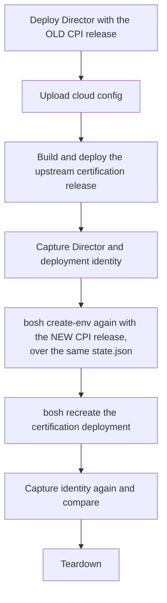

# BOSH Director Upgrade Test

The [BOSH CPI certification suite](https://github.com/cloudfoundry/bosh-cpi-certification) is the CloudFoundry community's release-gate harness for CPIs. It runs two scenarios: the acceptance suite, which we run separately with [`./scripts/bats`](bats.md), and the Director Upgrade Test, which nothing else covers.

BATS proves the CPI satisfies the Director contract at one version, on a Director that the same CPI built. The upgrade test proves something different and, for an operator, more consequential: that a running Director and the deployment it manages survive a CPI version change. Every disk CID and stemcell reference the old CPI wrote has to still mean the same thing to the new one. For a CPI whose disk CIDs are versioned envelopes and whose stemcells are cached as per-cluster templates, that is not a property anyone should assume.

We run it against a Proxmox VE lab with `./scripts/certify`, the same way `./scripts/bats` runs the acceptance suite: one command, the shared `ci/integration.yml` config, the same env bundles, and machine and prose artifacts at the end.

## The scenario

Read from upstream's `shared/tasks/test-upgrade.sh` and the `test-upgrade` job in `<iaas>/pipeline.yml`.



The second `create-env` reuses the first run's `state.json` and `creds.yml`. That is the whole point: the Director is upgraded over its own state rather than rebuilt from nothing, so the new CPI inherits a persistent disk that the old CPI created and named. A changed manifest makes `create-env` replace the Director VM itself, deleting the old one and attaching the preserved disk to a new one, so the new VM is built by the new CPI around storage the old CPI wrote.

## How the runner works

`./scripts/certify upgrade` performs these phases, each reported as PASS or FAIL steps in the summary table.

1. Preflight

   Verifies the tools (`uv`, `bosh`, `git`, `gh`), the config files, the `bosh-cpi-certification` checkout (cloned and refreshed under `.deps/`, or `BOSH_CPI_CERTIFICATION_DIR` for a local checkout), that the PVE API answers, and that the Director slot is free. See [Destructive by design](#destructive-by-design) below.

2. Resolve

   Resolves both CPI releases, both stemcells, and any `bosh` release overrides. A released CPI version is taken from `releases/` when committed, and otherwise downloaded from its GitHub release and verified against the published `.sha256` asset.

3. Deploy-old

   Brings up the env's SDN network when the env bundle owns one, runs `bosh create-env` with the old CPI release, aliases the Director, applies the cpi-config when the lab is multi-CPI, and uploads the cloud config with the certification vm_type layered on.

4. Deploy-cert

   Builds the upstream certification release from the checkout, uploads it and the stemcell, renders the deployment manifest for this lab, and deploys it.

5. Capture-pre

   Records the Director's VM CID and persistent disk CIDs from `state.json`, the deployment's VM and disk CIDs from the Director, the `bosh-pve-cpi` release version the Director runs, and the orphaned-disk count.

6. Upgrade

   Runs `bosh create-env` again with the new CPI release over the same `state.json`. This is the step under test.

7. Recreate

   Runs `bosh -n -d certification recreate`, rebuilding the deployment's VM through the new CPI while its persistent disk stays where the old CPI put it.

8. Capture-post

   The same capture, after the upgrade.

9. Verify

   Compares the two captures against the invariants below, checks every instance is running, and runs `bosh cloud-check`.

10. Finalize

    Writes the run report under `docs/certification/upgrade/runs/` and regenerates the `docs/certification/upgrade/README.md` summary.

11. Teardown

    Deletes the certification deployment, cleans up the Director, deletes the Director VM, and tears the SDN network back down when the env bundle owns one. Runs even when an earlier phase failed, and is skipped by `--keep`.

## What the run asserts

Upstream's task stops at the two BOSH commands exiting zero. That catches a Director that will not come back, and nothing else. We add the assertions that make the result mean something for this CPI.

| Invariant | What a failure would mean |
|---|---|
| Director VM CID changed | The second `create-env` was a no-op, so the new CPI never actually built anything and nothing was tested |
| Director persistent disk CIDs unchanged | The new CPI could not decode, or chose not to reuse, the disk CID the old CPI wrote |
| Certification deployment disk CIDs unchanged across the recreate | The recreated VM did not reattach the disk the old CPI created. This is the single most valuable assertion in the run |
| The two `create-env` legs deployed different CPI releases | The run compared a release against itself, so a passing result would prove nothing |
| Every instance reports `running` | The recreated VM never came back |
| Orphaned disk count did not grow | The upgrade or the recreate leaked storage |
| `bosh cloud-check` reports no problems | The Director's view of the IaaS and the IaaS itself disagree after the upgrade |

We deviate from upstream's manifest in one deliberate way: the certification instance group gets a persistent disk. Upstream's has none, which means its recreate proves only that a VM can be built. With a disk attached, the recreate exercises `attach_disk` against a CID a different CPI version wrote, which is exactly the compatibility surface a CPI upgrade puts at risk.

## Version matrix

The default matrix is **N and N-1 of the published GitHub releases**, resolved at run time rather than pinned in a file. That is the upgrade operators actually perform, and it stays correct without anyone editing config after cutting a release.

| Leg | Default before | Default after |
|---|---|---|
| CPI release | N-1, the previous published release | N, the latest published release |
| `bosh` release | Held at the `manifests/bosh/bosh-release.yml` pin | Held |
| Stemcell | The env's light stemcell | The same stemcell |

Holding the `bosh` release and the stemcell makes the CPI the single moving part, which is the variable this repo owns. Both are still pinnable per side, so a full upstream-faithful triple move needs flags rather than code:

```bash
./scripts/certify upgrade \
  --old-cpi 0.1.0 --new-cpi 0.1.2 \
  --old-bosh-release 281.0.0 \
  --old-stemcell /path/to/older-stemcell.tgz
```

A `bosh` release named this way is downloaded from bosh.io, checksummed, and pinned through a generated ops file layered over the repo's own pin.

## Destructive by design

The run takes over this repo's Director slot. It deploys, upgrades, and deletes the Director recorded in `manifests/bosh/state.json`, on the env bundle's Director IP. There is no way to run it beside a standing Director: a second Director would want the same address.

Preflight therefore refuses to start when `state.json` records a live Director. Either tear it down first:

```bash
BOSH_PVE_ENV=pve-cpi ./scripts/bosh teardown
```

or let the run do it:

```bash
./scripts/certify upgrade --env pve-cpi --force
```

Before anything is deployed, `state.json` and `creds.yml` are copied into the run directory. That copy is the difference between a recoverable failure and a lost Director.

Use a lab Director, never a production one.

## Prerequisites

- A reachable PVE 9.x cluster, with the storage pools, network, and capacity a Director plus one small VM need

- The `bosh` CLI, `git`, `uv`, and `gh` on PATH

  `gh` resolves the release matrix and downloads released CPI tarballs. It must be authenticated against the repository.

- At least two published CPI releases

  The default matrix needs N and N-1. With fewer, pass `--old-cpi` and `--new-cpi` explicitly.

- `ci/integration.yml` with a `certification:` section

  See [Configuration](#configuration) below.

- The env bundle the run targets, under `manifests/envs/<env>/`

## Configuration

The `certification:` section of `ci/integration.yml` declares the deployment shape. Everything with a sensible lab-wide answer defaults from the active env bundle, so most setups declare only `cpi_id`.

| Key | Required | Purpose |
|---|---|---|
| `deployment_name` | no | Deployment name (default `certification`) |
| `release_name` | no | Release name (default `certification`) |
| `az` | no | Cloud-config AZ the deployment lands in (default `z1`) |
| `network_name` | no | Cloud-config network name (default `default`) |
| `disk_type` | no | Cloud-config disk_type for the persistent disk (default `default`) |
| `network_bridge` | no | PVE bridge or SDN vnet; defaults to `pve_network_bridge` |
| `cpi_id` | when multi-CPI | cpi-config entry name for the AZ; a Director with a cpi-config applied rejects any AZ that does not name one, and one without rejects an AZ that does |
| `vm_cores` | no | Cores for the `certification` vm_type (default 2) |
| `vm_memory_mib` | no | Memory in MiB (default 2048) |
| `vm_disk_mib` | no | Root disk in MiB (default 8192) |
| `old_cpi_version` | no | Pin the before side; empty resolves to N-1 |
| `new_cpi_version` | no | Pin the after side; empty resolves to N |
| `timeout_s` | no | Wall-clock ceiling for the whole run (default 7200) |

`ci/integration.yml.example` carries a commented example block.

## Invocation

```bash
# The full test, N-1 to N, against the configured lab
make certify-upgrade

# Equivalent, with explicit env selection
./scripts/certify upgrade --env pve-cpi

# Tear down a standing Director first
./scripts/certify upgrade --env pve-cpi --force

# Keep the upgraded Director and the deployment for post-mortem
./scripts/certify upgrade --env pve-cpi --keep

# Print every command without executing anything
make certify-upgrade-dry-run

# Re-print the last run's summary
./scripts/certify report
```

Useful flags:

- `--old-cpi SPEC` and `--new-cpi SPEC`

  A version (`0.1.1`), a path to a `.tgz`, or `dev` to build from the working tree. `dev` on the new side is how you test an unreleased change against the last release.

- `--old-bosh-release VERSION` and `--new-bosh-release VERSION`

  Move the `bosh` release as well. Downloaded from bosh.io and pinned through a generated ops file.

- `--old-stemcell WHAT` and `--new-stemcell WHAT`

  `light` (the default) uses the env's light stemcell. A path uses that tarball instead.

- `--dry-run`

  Prints every command without executing anything. The primary validation path when no lab is reachable.

Expect 45 to 75 minutes: two `create-env` runs dominate, at roughly 8 to 15 minutes each, plus a deploy, a recreate, and teardown.

## Results and reports

Machine artifacts land in the gitignored `.e2e-results/<timestamp>/` directory:

- `console.log`

  The full command stream, with private key blocks scrubbed.

- `results.json` and `junit-steps.xml`

  Per-step results, statuses, and timings.

- `capture-pre.json` and `capture-post.json`

  The identity captures the verification compares.

- `certification.yml` and `certification-ops.yml`

  The rendered deployment manifest and the ops that shaped it.

- `state.json.pre-upgrade-test`, `creds.yml.pre-upgrade-test`, and `state.json.post-upgrade`

  Director state before the run and after the upgrade.

The committed record lives under `docs/certification/upgrade/`:

- `docs/certification/upgrade/runs/<date>.md`

  A generated per-run report: verdict, wall clock, the version matrix and where it came from, per-phase and per-step timing tables, the environment tuple, and the invariant table with before and after values.

- `docs/certification/upgrade/README.md`

  A generated summary regenerated on every run: the latest verdict plus a history table linking every recorded run.

Both are plain Markdown intended to be committed, so the repository carries a public, reviewable record of what was upgraded, from what to what, and with what result. The same convention the [BATS record](bats/README.md) follows.

## Relationship to the upstream pipeline

Upstream runs this scenario in Concourse, against terraform-provisioned infrastructure, for the IaaSes with a directory in the certification repo. No `pve/` directory exists there yet; [CPI certification](index.md#upstream-path) records what contributing one would take.

`scripts/certify` is the local equivalent, in the same spirit as `scripts/bats` standing in for the upstream BATs job. It runs the same scenario, with the same certification release, against a real lab. What it does not add is continuous automation on release triggers, which is what the pipeline is for.
