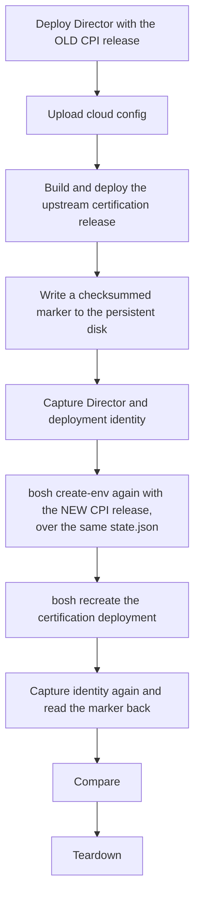

# BOSH Director Upgrade Test

The [BOSH CPI certification suite](https://github.com/cloudfoundry/bosh-cpi-certification) is the CloudFoundry community's release-gate harness for CPIs. It runs two scenarios: the acceptance suite, which we run separately with [`./scripts/bats`](bats.md), and the Director Upgrade Test, which nothing else covers.

BATS proves the CPI satisfies the Director contract at one version, on a Director that the same CPI built. The upgrade test proves something different and, for an operator, more consequential: that a running Director and the deployment it manages survive a CPI version change. Every disk CID and stemcell reference the old CPI wrote has to still mean the same thing to the new one. For a CPI whose disk CIDs are versioned envelopes and whose stemcells are cached as per-cluster templates, that is not a property anyone should assume.

We run it against a Proxmox VE lab with `./scripts/certify`, the same way `./scripts/bats` runs the acceptance suite: one command, the shared `ci/integration.yml` config, the same env bundles, and machine and prose artifacts at the end.

## The scenario

Read from upstream's `shared/tasks/test-upgrade.sh` and the `test-upgrade` job in `<iaas>/pipeline.yml`.


```mermaid
flowchart TD
    A[Deploy Director with the OLD CPI release] --> B[Upload cloud config]
    B --> C[Build and deploy the upstream certification release]
    C --> M[Write a checksummed marker to the persistent disk]
    M --> D[Capture Director and deployment identity]
    D --> E[bosh create-env again with the NEW CPI release,<br/>over the same state.json]
    E --> F[bosh recreate the certification deployment]
    F --> G[Capture identity again and read the marker back]
    G --> V[Compare]
    V --> H[Teardown]
```

The second `create-env` reuses the first run's `state.json` and `creds.yml`. That is the whole point: the Director is upgraded over its own state rather than rebuilt from nothing, so the new CPI inherits a persistent disk that the old CPI created and named. A changed manifest makes `create-env` replace the Director VM itself, deleting the old one and attaching the preserved disk to a new one, so the new VM is built by the new CPI around storage the old CPI wrote.

## How the runner works

`./scripts/certify upgrade` performs these phases, each reported as PASS or FAIL steps in the summary table.

1. Preflight

   Before anything else, the slot guard confirms that `BOSH_STATE_DIR` names a dedicated slot for this run's Director, and the run stops there when it doesn't. Preflight then verifies the tools (`uv`, `bosh`, `git`, `gh`), the config files, and the `bosh-cpi-certification` checkout (cloned and refreshed under `.deps/`, or `BOSH_CPI_CERTIFICATION_DIR` for a local checkout). Next, `./scripts/bosh check-vars` interpolates the Director manifest and the cloud config against the slot's vars, plus the cpi-config when the lab uses one, and the step fails with the name of every variable the vars files don't supply. A stale `LAB_BOSH_VARS_YML` secret therefore fails in seconds rather than at teardown. Only after that does preflight check that the PVE API answers and that the slot is free. See [Destructive by design](#destructive-by-design) below.

2. Resolve

   Resolves both CPI releases, both stemcells, and any `bosh` release overrides. A released CPI version is taken from `releases/` when committed, and otherwise downloaded from its GitHub release and verified against the published `.sha256` asset.

3. Deploy-old

   Brings up the env's SDN network when the env bundle owns one, runs `bosh create-env` with the old CPI release, aliases the Director, applies the cpi-config when the lab is multi-CPI, and uploads the cloud config with the certification vm_type layered on.

4. Deploy-cert

   Builds the upstream certification release from the checkout, uploads it and the stemcell, renders the deployment manifest for this lab, and deploys it.

5. Write-marker

   Runs `bosh -d certification ssh simple/0` and, as root, writes a fresh random nonce and 1 MiB of random data under `/var/vcap/store/upgrade-marker`, with the data's sha256 beside it. The script refuses to write unless `/var/vcap/store` is a mount point, so the marker can only land on the persistent disk. A failure here doesn't stop the run, but it fails `verify:disk-data-survived`.

6. Capture-pre

   Records the Director's VM CID and persistent disk CIDs from `state.json`, the deployment's VM and disk CIDs from the Director, the `bosh-proxmox-cpi` release version the Director runs, and the orphaned-disk count. It also decodes each persistent disk CID's `bpd-` stable id and reads, through the PVE API, which drive on the Director VM or a deployment VM carries that id as its `serial=`.

7. Upgrade

   Runs `bosh create-env` again with the new CPI release over the same `state.json`. This is the step under test.

8. Recreate

   Runs `bosh -n -d certification recreate`, rebuilding the deployment's VM through the new CPI while its persistent disk stays where the old CPI put it.

9. Capture-post

   The same capture, after the upgrade.

10. Read-marker

    Runs `bosh ssh` again, recomputes the marker data's sha256 on the recreated VM, and reads the nonce back.

11. Verify

   Compares the two captures against the invariants below, checks every instance is running, and runs `bosh cloud-check`.

12. Finalize

    Writes the run report under `docs/certification/upgrade/runs/` and regenerates the `docs/certification/upgrade/README.md` summary.

13. Teardown

    Deletes the certification deployment, cleans up the Director, and deletes the Director VM, all in the run's own slot. It leaves the env's SDN network up, because the main Director shares it. Teardown runs even when an earlier phase failed, and `--keep` skips it.

## What the run asserts

Upstream's task stops at the two BOSH commands exiting zero. That catches a Director that will not come back, and nothing else. We add the assertions that make the result mean something for this CPI.

| Invariant | What a failure would mean |
|---|---|
| Director VM CID changed | The second `create-env` was a no-op, so the new CPI never actually built anything and nothing was tested |
| Director persistent disk CIDs unchanged | The new CPI could not decode, or chose not to reuse, the disk CID the old CPI wrote |
| Certification deployment disk CIDs unchanged across the recreate | The recreated VM did not reattach the disk the old CPI created. This is the single most valuable assertion in the run |
| The two `create-env` legs deployed different CPI releases | The run compared a release against itself, so a passing result would prove nothing |
| Every instance reports `running` | The recreated VM never came back |
| Persistent disk marker read back with the same nonce and sha256 (`verify:disk-data-survived`) | The disk the recreated VM mounted is not the one the old CPI's VM wrote, or its contents changed across the upgrade |
| Every persistent disk's `bpd-` stable id is a drive's `serial=` before and after (`verify:disk-serial-stable`) | The new CPI attached the disk without the serial its CID promises, so the agent could resolve the wrong device, or the CID set itself changed |
| Orphaned disk count did not grow | The upgrade or the recreate leaked storage |
| `bosh cloud-check` reports no problems | The Director's view of the IaaS and the IaaS itself disagree after the upgrade |

We deviate from upstream's manifest in one deliberate way: the certification instance group gets a persistent disk. Upstream's has none, which means its recreate proves only that a VM can be built. With a disk attached, the recreate exercises `attach_disk` against a CID a different CPI version wrote, which is exactly the compatibility surface a CPI upgrade puts at risk.

## Version matrix

The default matrix is **N and N-1 of the published GitHub releases**, resolved at run time rather than pinned in a file. That is the upgrade operators actually perform, and it stays correct without anyone editing config after cutting a release.

| Leg | Default before | Default after |
|---|---|---|
| CPI release | N-1, the previous published release | N, the latest published release |
| `bosh` release | Held at the `manifests/bosh/bosh-release.yml` pin | Held |
| Stemcell | The env's light stemcell | The same stemcell |

Holding the `bosh` release and the stemcell makes the CPI the single moving part, which is the variable this repo owns. Both are still pinnable per side, so a full upstream-faithful triple move needs flags rather than code:

```bash
./scripts/certify upgrade \
  --old-cpi 0.1.0 --new-cpi 0.1.2 \
  --old-bosh-release 281.0.0 \
  --old-stemcell /path/to/older-stemcell.tgz
```

A `bosh` release named this way is downloaded from bosh.io, checksummed, and pinned through a generated ops file layered over the repo's own pin.

## Destructive by design

The run deploys, upgrades, and deletes a Director, so it runs in a slot of its own and never in this repo's default one. A slot is a directory that holds one Director's `state.json` and `creds.yml`. The default slot is `manifests/bosh/`, which is where the main Director lives, and `BOSH_STATE_DIR` names any other. `./scripts/bosh`, `./scripts/certify`, and `./scripts/bats` all honor it.

A slot guard stands between the run and any Director it doesn't own. The certify run checks it in preflight and again right before each step that tears down, deletes, or replaces a Director, and the guard refuses in each of these cases.

- The slot resolves to this checkout's default slot, or to the `manifests/bosh/` directory of any checkout, which we recognize by a `.git` two levels up or by the tracked `cpi.yml` and `cloud-config.yml` inside it.

- The slot is the main checkout's `manifests/bosh/`, or its `state.json` records the same Director, Director VM, or persistent disk as the main checkout's or the default slot's state. When git can't say which checkout is the main one, or one of those state files can't be read or isn't valid UTF-8 text, the guard refuses too, because it can't rule the copy out.

- `BOSH_PROTECTED_DIRECTOR_CIDS` is empty or malformed, or the slot's `state.json` records a VM that it lists. The variable holds the main Director's VM CIDs. On PVE a VM CID is the bare VMID, so the variable is a comma-separated list of positive whole numbers, with spaces allowed around each one and nothing else in it. A main Director in VM 3808 needs `BOSH_PROTECTED_DIRECTOR_CIDS=3808`, and a value such as `vm-3808` or `3808;3809` refuses. The guard also protects the VM that the main Director's `state.json` records whenever it can read that file, so the main Director's current VM stays protected on a workstation even when the list is out of date.

- The slot's `state.json` records anything, whether a Director, a VM, a persistent disk, or a stemcell, that this slot's own `create-env` didn't build. After every `create-env` in a dedicated slot, and after a `teardown` that leaves a state behind, `./scripts/bosh` writes `slot-owner.json` beside the state with the state's `director_id`, `current_vm_cid`, and `current_disk_id`, plus the CIDs of its disks and stemcells. A state copied, moved, or linked in from another slot has no matching owner record, so the guard says the state was not created in this slot. A slot that a release without this guard built has no owner record either, so we empty it before we reuse it. Because a command can run for minutes, `./scripts/bosh` checks the state it is about to record against the protected states and the deny list again, and when the state fails them it writes no record and the command fails. That failure says the command may have created a Director VM on the slot's IP, so we keep `state.json` and follow the same PVE check and hand deletion before we empty the slot.

- The slot's `creds.yml` holds the same CA certificates as the main Director's `creds.yml`, which means it is a copy, or one of the two files can't be read for that comparison. The guard compares SHA-256 digests of the public certificates in memory, and it never compares or prints the admin password. A copied `creds.yml` would let a command in the slot log in to the main Director.

- A command passes its own `--state` or `--vars-store` that resolves outside the slot's directory or to the main Director's files. `./scripts/bosh` already passes the slot's own `state.json` and `creds.yml`, so we leave those flags out.

Every `create-env` that rebuilds the main Director gives it a new VMID, so we update `BOSH_PROTECTED_DIRECTOR_CIDS` after each one, both in our shell and in the repository variable, with `gh variable set BOSH_PROTECTED_DIRECTOR_CIDS --body <new vmid>`. The CI runner's checkout holds no main Director state, so in CI the variable is the only thing that names the main Director's VM. When the guard reads the main state and finds a VM that the variable doesn't list, its refusal says that the variable is out of date.

The error says which case it hit and what to do. The run also exports `BOSH_REFUSE_DEFAULT_SLOT=1` to its own process and to every `./scripts/bosh` call. With it set, every `./scripts/bosh` command that talks to a Director, and the Director env the harnesses share, applies the same guard, so nothing that somehow resolves to the default slot can reach the main Director. In a dedicated slot `./scripts/bosh` applies the guard whether or not that variable is set, and it requires the deny list only when it is. That covers every command, including the ones `./scripts/bosh` hands straight to the bosh CLI, and each one also runs the `slot.yml` checks below.

A dedicated slot needs a `slot.yml` beside its state, with the values that must differ from the main Director's. `./scripts/bosh` layers it after every other vars file, so these keys win.

| Key | Required | Purpose |
|---|---|---|
| `internal_ip` | yes | The run's Director IP. It must be a free address inside the env's reserved band (`cpitest_reserved` on cpitest), and it must differ from the main Director's `internal_ip`, the gateway (`internal_gw`), and the artifacts VM's address |
| `bosh_alias` | no | The bosh CLI alias (default `pve-<slot directory name>`), so the run never repoints the main Director's `pve` alias. The guard refuses `pve` itself |
| `director_name` | no | The Director's name. It defaults to the `director_name` in `manifests/bosh/vars.yml` or the env's `vars.yml`, and to `ocfp-mgmt` when neither sets one |
| `pve_create_env_deployment` | yes | The deployment segment of the Director VM's name, so the two Director VMs are told apart in PVE. It must differ from the main Director's value |
| `cpitest_reserved` | on cpitest | The reserved bands of the run's cloud config. It replaces the env's list for this slot only, so it must keep every entry the env reserves and add the part of the dynamic range the main Director uses |

The guard reads the env's gateway to check the address against it, and it refuses when it can't read one.

Set one up like this, with an address that nothing else on the network uses. The directory must start empty, so never copy the main Director's `state.json` or `creds.yml` into it.

```bash
mkdir -p -m 0700 ~/.bosh-slots/certification
cat > ~/.bosh-slots/certification/slot.yml <<'EOF'
internal_ip: <free address on the env network>
bosh_alias: pve-certification
director_name: certification
pve_create_env_deployment: create-env-certification
cpitest_reserved:
- 172.31.0.1-172.31.0.19
- 172.31.0.20-172.31.0.149
- 172.31.0.190-172.31.0.199
- 172.31.0.200-172.31.0.254
EOF
export BOSH_STATE_DIR=~/.bosh-slots/certification
export BOSH_PROTECTED_DIRECTOR_CIDS=<main Director's VMID>
```

With those bands, the run's deployments can only take addresses from .150 to .189, while the main Director fills its range from .20 upward. [Scheduled runs](scheduled.md#how-the-two-directors-share-the-dynamic-range) explain the split.

On the cpitest network, pick the address from the reserved infra band (`cpitest_reserved`), so that no deployment's dynamic placement can land on it. The guard refuses an address outside that band. [Scheduled runs](scheduled.md) list the addresses the tracked files already claim.

Preflight refuses to start when the slot's `state.json` records a live Director. Either tear it down first:

```bash
BOSH_STATE_DIR=~/.bosh-slots/certification BOSH_PVE_ENV=pve-cpi ./scripts/bosh teardown
```

or let the run do it:

```bash
./scripts/certify upgrade --env pve-cpi --force
```

Before anything is deployed, the slot's `state.json`, `creds.yml`, and `slot-owner.json` are copied into the run directory. That copy is the difference between a recoverable failure and a lost Director. We restore the three files together, because the guard refuses a state whose owner record doesn't match it.

A `create-env` that is killed partway, for example by the step timeout, can leave a `state.json` without a matching owner record, or with a record that no longer matches it, as when an interrupted upgrade has already uploaded a new stemcell. An owner record from an earlier release of the guard, which kept fewer details, mismatches the same way. Every later command in the slot then refuses, as it would for a copied state, and the refusal says the state was not created in this slot. Check in PVE that the VM the state records carries this slot's Director name and IP, delete it there by hand if so, and then empty the slot. Emptying the slot first would leave that Director running on the slot's IP, and the next `create-env` would put a second Director on the same address.

Use a lab, never a production one. The run's Director shares the env network with the main Director, so its `slot.yml` must reserve the part of the dynamic range the main Director uses, as the example above does.

## Prerequisites

- A reachable PVE 9.x cluster, with the storage pools, network, and capacity a Director plus one small VM need

- The `bosh` CLI, `git`, `uv`, and `gh` on PATH

  `gh` resolves the release matrix and downloads released CPI tarballs. It must be authenticated against the repository.

- At least two published CPI releases

  The default matrix needs N and N-1. With fewer, pass `--old-cpi` and `--new-cpi` explicitly.

- `ci/integration.yml` with a `certification:` section

  See [Configuration](#configuration) below.

- The env bundle the run targets, under `manifests/envs/<env>/`

- A dedicated Director slot, named by `BOSH_STATE_DIR`

  See [Destructive by design](#destructive-by-design) above.

## Configuration

The `certification:` section of `ci/integration.yml` declares the deployment shape. Everything with a sensible lab-wide answer defaults from the active env bundle, so most setups declare only `cpi_id`.

| Key | Required | Purpose |
|---|---|---|
| `deployment_name` | no | Deployment name (default `certification`) |
| `release_name` | no | Release name (default `certification`) |
| `az` | no | Cloud-config AZ the deployment lands in (default `z1`) |
| `network_name` | no | Cloud-config network name (default `default`) |
| `disk_type` | no | Cloud-config disk_type for the persistent disk (default `default`) |
| `network_bridge` | no | PVE bridge or SDN vnet; defaults to `pve_network_bridge` |
| `cpi_id` | when multi-CPI | cpi-config entry name for the AZ; a Director with a cpi-config applied rejects any AZ that does not name one, and one without rejects an AZ that does |
| `vm_cores` | no | Cores for the `certification` vm_type (default 2) |
| `vm_memory_mib` | no | Memory in MiB (default 2048) |
| `vm_disk_mib` | no | Root disk in MiB (default 8192) |
| `old_cpi_version` | no | Pin the before side; empty resolves to N-1 |
| `new_cpi_version` | no | Pin the after side; empty resolves to N |
| `timeout_s` | no | Wall-clock ceiling for the whole run (default 7200) |

`ci/integration.yml.example` carries a commented example block.

## Invocation

```bash
# Every command below runs in the dedicated slot
export BOSH_STATE_DIR=~/.bosh-slots/certification

# The full test, N-1 to N, against the configured lab
make certify-upgrade

# Equivalent, with explicit env selection
./scripts/certify upgrade --env pve-cpi

# Tear down a standing Director first
./scripts/certify upgrade --env pve-cpi --force

# Keep the upgraded Director and the deployment for post-mortem
./scripts/certify upgrade --env pve-cpi --keep

# Print every command without executing anything (the slot guard still applies)
make certify-upgrade-dry-run

# Re-print the last run's summary
./scripts/certify report
```

Useful flags:

- `--old-cpi SPEC` and `--new-cpi SPEC`

  A version (`0.1.1`), a path to a `.tgz`, or `dev` to build from the working tree. `dev` on the new side is how you test an unreleased change against the last release.

- `--old-bosh-release VERSION` and `--new-bosh-release VERSION`

  Move the `bosh` release as well. Downloaded from bosh.io and pinned through a generated ops file.

- `--old-stemcell WHAT` and `--new-stemcell WHAT`

  `light` (the default) uses the env's light stemcell. A path uses that tarball instead.

- `--dry-run`

  Prints every command without executing anything. The primary validation path when no lab is reachable.

Expect 45 to 75 minutes: two `create-env` runs dominate, at roughly 8 to 15 minutes each, plus a deploy, a recreate, and teardown.

## Results and reports

Machine artifacts land in the gitignored `.e2e-results/<timestamp>/` directory:

- `console.log`

  The full command stream, with private key blocks scrubbed.

- `results.json` and `junit-steps.xml`

  Per-step results, statuses, and timings.

- `capture-pre.json` and `capture-post.json`

  The identity captures the verification compares. Each one carries a `disks` block with every persistent disk's `bpd-` stable id, every drive's `serial=` on the captured VMs, and which drive carries each stable id.

- `certification.yml` and `certification-ops.yml`

  The rendered deployment manifest and the ops that shaped it.

- `state.json.pre-upgrade-test`, `creds.yml.pre-upgrade-test`, and `state.json.post-upgrade`

  Director state before the run and after the upgrade.

The committed record lives under `docs/certification/upgrade/`:

- `docs/certification/upgrade/runs/<date>-<hhmmss>.md`

  A generated per-run report: verdict, wall clock, the version matrix and where it came from, per-phase and per-step timing tables, the environment tuple, and the invariant table with before and after values.

- `docs/certification/upgrade/README.md`

  A generated summary regenerated on every run: the latest verdict plus a history table linking every recorded run.

Both are plain Markdown intended to be committed, so the repository carries a public, reviewable record of what was upgraded, from what to what, and with what result. The same convention the [BATS record](bats/README.md) follows.

## Relationship to the upstream pipeline

Upstream runs this scenario in Concourse, against terraform-provisioned infrastructure, for the IaaSes with a directory in the certification repo. No `pve/` directory exists there yet; [CPI certification](index.md#upstream-path) records what contributing one would take.

`scripts/certify` is the local equivalent, in the same spirit as `scripts/bats` standing in for the upstream BATs job. It runs the same scenario, with the same certification release, against a real lab. What it does not add is continuous automation on release triggers, which is what the pipeline is for.
