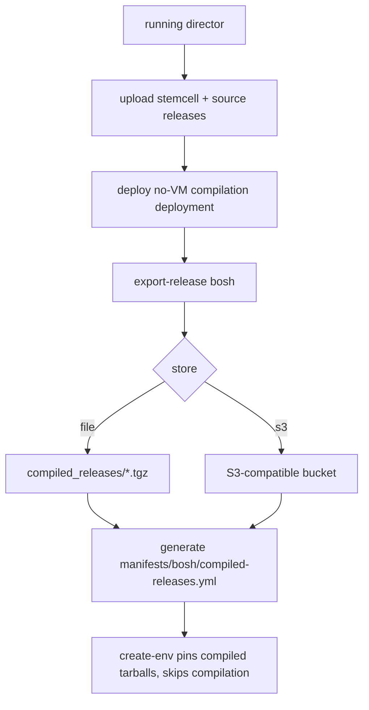

# Compiled releases for fast create-env

`bosh create-env` compiles the director's packages on the director VM every run.
On this lab that is ~18 min of the ~22 min total — dominated by the upstream
`bosh` release (`director-ruby`, `postgres`, the cloud CLIs). Upstream publishes
no compiled `bosh` release for ubuntu-noble, and the `bosh` release is not a
deployable deployment, so it cannot be `export-release`d directly.

`scripts/bosh compile-releases` closes that gap: it compiles the `bosh` release
once against the active stemcell, stores the compiled tarball, and pins it so
every later create-env skips that compilation. On this lab it cut a cached
create-env from **21m55s to 4m54s** (~78%).

The `bosh-pve-cpi` release is deliberately **not** compiled by default: create-env
runs the CPI binary on the **local host** (the `cloud_provider` driver), not on the
director VM, so a Linux-compiled CPI cannot execute on a non-Linux workstation
(`cannot execute binary file`). The CPI compiles locally for the create-env host's
OS/arch in ~30 s and is cached by bosh-init. Set `COMPILE_RELEASES_WITH_CPI=1` to
also pin a compiled CPI — valid **only** when create-env runs on the same OS/arch
as the compilation stemcell (e.g., a Linux CI host).

## How it works



1. Ensures the stemcell pinned in `manifests/bosh/vars.yml` is on the director.
2. Uploads the source `bosh` release (plus `bosh-pve-cpi` when
   `COMPILE_RELEASES_WITH_CPI=1`).
3. Deploys a placeholder deployment with **empty `instance_groups`** (no VMs) that
   merely references the release(s) + stemcell.
4. Runs `bosh export-release <name>/<version> <os>/<stemcell>` for each target,
   which compiles the packages on the director's compilation VMs and emits a
   compiled tarball.
5. Stores each tarball under a canonical, stemcell-encoded name
   (`<name>-<version>-<os>-<stemcell>.tgz`) and computes its `sha256`.
6. Writes `manifests/bosh/compiled-releases.yml` — a generated ops file pinning
   each release's compiled `url` + `sha1`, tagged with a `# stemcell:` marker.

`create-env` and `teardown` layer that ops file (after the source release ops, so
the compiled URLs win) **only when its `# stemcell:` marker matches the stemcell
in `vars.yml`**. A stale cache, or `COMPILE_RELEASES_DISABLE=1`, falls back to
compiling from source — so the cache is always safe to leave in place.

## Usage

Run once, after the director is up and aliased:

```bash
scripts/bosh create-env        # first run compiles from source (~22 min)
scripts/bosh alias-env
scripts/bosh compile-releases   # one-time ~15 min: compile + export + pin
```

Every subsequent create-env (after a teardown) reuses the cache:

```bash
scripts/bosh teardown
scripts/bosh create-env        # now skips package compilation
```

Force a source build (ignore the cache) for one run:

```bash
COMPILE_RELEASES_DISABLE=1 scripts/bosh create-env
```

## Storage

Select the store with `COMPILED_RELEASES_STORE`:

### `file` (default)

Tarballs are copied into a local directory and referenced as `file://`.

| Variable | Default | Meaning |
| --- | --- | --- |
| `COMPILED_RELEASES_DIR` | `<repo>/compiled_releases` | local store directory |

The directory and the generated `compiled-releases.yml` are gitignored.

### `s3` (S3-compatible)

Tarballs are uploaded with the `aws` CLI (`--endpoint-url`) and referenced via a
path-style `https` URL. Requires the `aws` CLI on `PATH`.

| Variable | Required | Meaning |
| --- | --- | --- |
| `COMPILED_RELEASES_S3_ENDPOINT` | yes | e.g. `https://s3.lab.example` or `minio.lab:9000` |
| `COMPILED_RELEASES_S3_BUCKET` | yes | bucket name |
| `COMPILED_RELEASES_S3_PREFIX` | no | key prefix |
| `COMPILED_RELEASES_S3_REGION` | no | `AWS_DEFAULT_REGION` |
| `COMPILED_RELEASES_S3_ACCESS_KEY` | no | `AWS_ACCESS_KEY_ID` |
| `COMPILED_RELEASES_S3_SECRET_KEY` | no | `AWS_SECRET_ACCESS_KEY` |

```bash
COMPILED_RELEASES_STORE=s3 \
COMPILED_RELEASES_S3_ENDPOINT=https://s3.lab.example \
COMPILED_RELEASES_S3_BUCKET=bosh-compiled \
COMPILED_RELEASES_S3_PREFIX=pve-cpi \
  scripts/bosh compile-releases
```

Uploads force path-style addressing (`AWS_S3_ADDRESSING_STYLE=path`) so the
object lands exactly where the path-style `https` reference URL later fetches it
(the `aws` CLI otherwise defaults to virtual-host `<bucket>.<endpoint>`).

The referenced object must be **readable by whoever later runs create-env**
(create-env fetches the `https` URL with no credentials). Use a public-read bucket
or a read-only path; presigned URLs are not generated.

## Operational notes

- **Single-flight.** The pipeline uses one shared deployment name
  (`compile-pve-cpi-releases`); do not run two `compile-releases` instances concurrently.
  A leftover deployment from a crashed run is overwritten cleanly by the next run.
- **A failed run leaves no active cache.** The ops file is written only after all
  exports succeed, so a partial run cannot be picked up by create-env (it may
  leave one orphan tarball in the store, which the next run overwrites by name).
- **Do not delete the store while a director is live.** With `file` storage,
  create-env *and* delete-env reference the `file://` tarballs. create-env/teardown
  verify the tarballs exist and fall back to source if they are gone, but
  keeping `compiled_releases/` intact for a director's lifetime avoids the
  source-fallback round trip.
- **`/tmp` space.** `export-release` writes each tarball to a temp dir under
  `/tmp` before it is copied/uploaded to the store; the compiled `bosh` tarball is
  hundreds of MB. Ensure `/tmp` (or `$TMPDIR`) has room.

## Stemcell coupling

A compiled tarball is valid **only** for the exact stemcell it was built against.
The stemcell is encoded in the tarball filename and recorded as a `# stemcell:`
marker in the generated ops file. If you bump `stemcell_url` in `vars.yml`,
re-run `compile-releases`. Until you do, create-env detects the mismatch and
compiles from source rather than using a cache that cannot match.

## Scope

Only `bosh` is compiled by default — it is the create-env compilation sink that
runs on the director VM. `bosh-pve-cpi` runs locally and compiles per create-env
host (opt in with `COMPILE_RELEASES_WITH_CPI=1` on same-OS/arch hosts). `bpm`,
`os-conf`, `uaa`, and `credhub` already arrive as compiled blobs from upstream and
are left untouched. CloudFoundry uses `cf-deployment`'s own
`operations/use-compiled-releases.yml` and is unaffected by this pipeline.
