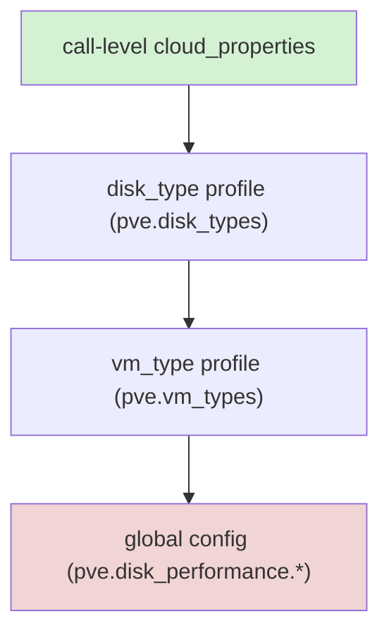
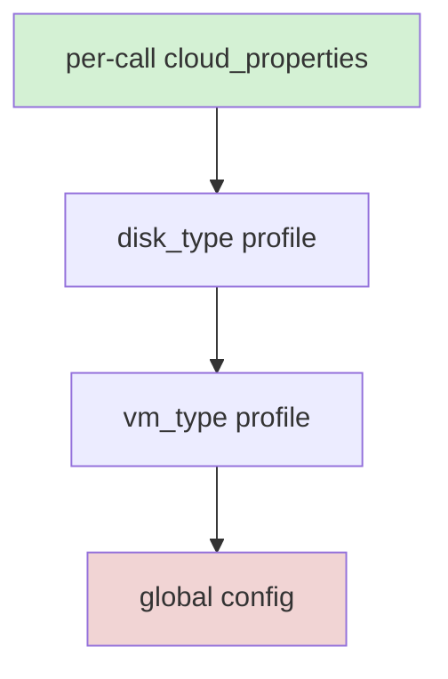

# Configuration

The CPI reads configuration from a BOSH deployment manifest. The job template renders the manifest properties into a JSON document that the binary reads with the `--config` flag. All properties correspond to fields in `jobs/pve_cpi/spec`.

| Property | Description | Default | Required |
|---|---|---|---|
| `pve.host` | PVE host (IP or FQDN) | - | yes |
| `pve.port` | PVE API port | `8006` | no |
| `pve.user` | PVE username (e.g. `root@pam` or `bosh@pve`) | - | yes |
| `pve.password` | PVE password. Mutually exclusive with `api_token`. Must be credhub-managed in production via `((pve_password))`. | `""` | one of password or api_token |
| `pve.api_token` | PVE API token (`<user>!<token-id>=<uuid>`). Mutually exclusive with `password`. Must be credhub-managed in production via `((pve_api_token))`. | `""` | one of password or api_token |
| `pve.realm` | Authentication realm | `pam` | no |
| `pve.node` | Default node for placement and bridge operations | - | yes |
| `pve.vm_storage` | Storage pool for VM root disks | - | yes |
| `pve.disk_storage` | Storage pool for persistent disks | - | yes |
| `pve.stemcell_storage` | Storage pool for stemcell qcow2 images. Must be a file-based PVE storage (`dir`, `nfs`, `cifs`, `glusterfs`, `cephfs`) — block-based storages (`lvm`, `lvmthin`, `zfspool`, `rbd`) cannot accept qcow2 uploads. Must also be shared across cluster nodes when the cluster has more than one node. Defaults to `vm_storage`; in that case `vm_storage` must satisfy the same constraints. | `""` (falls back to `vm_storage`) | no |
| `pve.iso_storage` | Storage pool (`dir`, `nfs`, or `cifs` with `iso` content enabled) used for per-VM ConfigDrive ISOs in `cloudinit` agent mode. Block storages (`lvm`, `lvmthin`, `zfspool`) cannot hold ISO files. The default `local` value places ISOs on node-local storage and is readable by any user with PVE node access — see [ConfigDrive ISO storage](operations.md#configdrive-iso-storage) for the dedicated-pool recommendation. | `local` | no |
| `pve.network_bridge` | Default Linux bridge for `create_vm` NIC attachment. Required regardless of `network_mode`. | `vmbr0` | no |
| `pve.network_mode` | Network creation mode for managed networks. `sdn` — PVE SDN vnet lifecycle. `bridge` — Linux bridge lifecycle. `auto` — SDN when `cloud_properties.zone` or `pve.sdn_zone` is set; bridge otherwise. See [Network configuration](networks.md). | `auto` | no |
| `pve.sdn_zone` | Default PVE SDN zone for vnet placement. When empty, the zone must be supplied per-call in `cloud_properties.zone`. See [Network configuration](networks.md). | `""` | no |
| `pve.sdn_zone_type` | Zone type the CPI uses when creating a zone (`simple`, `vlan`, `qinq`, `vxlan`, `evpn`). Only relevant when `sdn_auto_manage_zone` is `true`. | `simple` | no |
| `pve.sdn_auto_manage_zone` | When `true`, the CPI may create SDN zones on `create_network` and delete them on `delete_network` when all safety conditions are met. See [Network configuration](networks.md). | `false` | no |
| `pve.verify_ssl` | Verify the PVE API TLS certificate | `true` | no |
| `pve.ca_cert` | Optional PEM-encoded CA certificate bundle for verifying the Proxmox VE API TLS certificate. When empty (default), the system trust pool is used — behavior is byte-identical to prior releases. When set, the PEM is parsed and the resulting cert pool is used for PVE API HTTPS verification. Ignored when `verify_ssl` is `false`. Symmetric to `registry.ca_cert`. | `""` | no |
| `pve.agent_mode` | Agent bootstrap mode. `cloudinit` — cloud-init bootstrap (default). `registry` — BOSH registry at `registry.endpoint`. `noagent` — no agent bootstrap. `auto` — selects `cloudinit` when the stemcell's `api_version` is ≥ 2, falls back to `registry` for v1 stemcells (requires `registry.endpoint`). | `cloudinit` | no |
| `pve.vm_disk_format` | Disk image format (`qcow2`, `raw`, `vmdk`) | `qcow2` | no |
| `pve.hotplug` | PVE hotplug flags applied to every new VM. Comma-separated subset of `network,disk,cpu,memory,usb,cloudinit`, or `0` to disable hotplug entirely. Per-VM override via `cloud_properties.hotplug`. | `network,disk,cpu,memory` | no |
| `pve.numa` | Enable NUMA (`numa=1`) on every new VM. Required at create time for live memory hotplug to allocate DIMM slots; without it, memory hot-add silently no-ops. Per-VM override via `cloud_properties.numa`. | `true` | no |
| `pve.reboot_mode` | `reboot_vm` strategy: `soft` (graceful ACPI reboot, hard-reset fallback) or `hard` (immediate reset). | `soft` | no |
| `pve.reboot_timeout` | Seconds to wait for graceful shutdown before hard-reset fallback (soft mode only). Range 1–3600. | `60` | no |
| `pve.log_level` | Structured log level (`debug`, `info`, `warn`, `error`) | `info` | no |
| `pve.vmid_range_start` | First VMID used for VM allocation. VMs use `[vmid_range_start, vmid_range_end]`. Persistent disks use `[9000, 29999]`. | `100` | no |
| `pve.vmid_range_end` | Inclusive upper bound of the VM VMID range. Must be greater than `vmid_range_start` and must not overlap the disk or template range (with the default disk range starting at 9000, the effective maximum is 8999). The allocator scans this range from a randomized start so concurrent CPI invocations rarely pick the same VMID; a retry-on-conflict loop backstops the rare collision. | `8999` | no |
| `pve.disk_vmid_range_start` | First VMID used for persistent-disk container allocation. When unset (`0`), defaults to `9000`. Must not overlap the VM range or the template range. | `0` (→ `9000`) | no |
| `pve.disk_vmid_range_end` | Inclusive upper bound of the persistent-disk VMID range. When unset (`0`), defaults to `29999`. Must be greater than `disk_vmid_range_start`. | `0` (→ `29999`) | no |
| `pve.clone_mode` | Clone type used when `create_vm` clones a stemcell template. `auto` (default): linked clone for snapshot-capable backends (`dir`, `nfs`, `cifs`, `zfspool`, `lvmthin`, `rbd`, `cephfs`); full clone for `lvm`-thick (linked clone not supported). `linked`: force linked clone; returns an error on `lvm`-thick. `full`: force full clone on all backends. One of `auto`\|`linked`\|`full`. | `auto` | no |
| `pve.stemcell_template_vmid_range_start` | Starting VMID for stemcell template VM allocation — a dedicated band above the persistent-disk range. When unset (`0`), defaults to `30000`. Must not overlap the VM range or the persistent-disk range `9000–29999`. | `0` (→ `30000`) | no |
| `pve.stemcell_template_vmid_range_end` | Inclusive upper bound of the template VMID range. When unset (`0`), defaults to `30999`. Must be greater than `stemcell_template_vmid_range_start`. Must not overlap the persistent-disk range. | `0` (→ `30999`) | no |
| `pve.stemcell_template_pool` | Optional PVE resource pool to assign to newly created template VMs. When empty (default), templates are not assigned to any pool. An invalid pool name causes `create_stemcell` to return an error. | `""` | no |
| `pve.stemcell_template_node` | Optional PVE node on which template VMs are created. When empty (default), falls back to `pve.node`. When using local `stemcell_storage`, this must equal the node where that storage is mounted; pointing to a different node with local storage causes the template import to fail because the uploaded qcow2 is not visible from the other node. | `""` | no |
| `pve.vm_prefix` | Optional prefix prepended to every CPI-provisioned VM's PVE name. With `cpi`, names take the form `cpi-<deployment>-<job>-<index>`. Empty means the prefix is omitted. The prefix is cluster-wide — every VM created by this CPI deployment carries it. | `""` | no |
| `pve.create_env_deployment` | Synthetic deployment name used for VMs created by `bosh create-env`. bosh-init does not pass a deployment in env, so a stable placeholder is required for the `<deployment>` segment of the VM name. | `create-env` | no |
| `pve.allow_disk_ops_with_snapshots` | When `true`, bypasses the snapshot pre-flight guard in `attach_disk`, `detach_disk`, and `resize_disk`. Use only for emergency disk recovery — snapshot state becomes inconsistent after the operation. | `false` | no |
| `pve.require_snapshot_check_pass` | Controls behavior when the snapshot pre-flight check itself cannot reach PVE. `false` (default) logs a warning and proceeds (fail-open); `true` aborts the disk operation if the snapshot list cannot be fetched (fail-closed). | `false` | no |
| `pve.stemcell_staging_dir` | Optional absolute path. When set, all stemcell file reads and writes for director-supplied paths are scoped to this directory using Go's `os.Root` API, preventing access to files outside the declared root. When unset (default), behavior is unchanged from prior releases. Must be an absolute path to an existing directory on the CPI host. Defense-in-depth against unexpected stemcell paths. | `""` | no |
| `pve.fetch_credential_defaults` | Ordered list of URL-prefix-to-auth mappings used when fetching a light stemcell whose `cloud_properties.image_url` carries no per-stemcell `image_url_auth`. The entry with the longest matching `url_prefix` wins. Each entry requires a `url_prefix` string and an `auth` object with a required `type` field; supported types are `basic`, `bearer`, `s3`, `oci`, and `blobstore`. When unset or empty, light-stemcell fetches without per-stemcell credentials are unauthenticated. See [Light stemcells](light-stemcells.md) for full auth-object schemas. | `[]` | no |
| `agent.mbus` | URL the BOSH agent should bind/listen on inside the VM. Required for `bosh create-env`: bosh-init does not pass it via the per-call env argument, only via CPI config. When empty, the CPI derives `nats://<blobstore-host>:4222` from the blobstore endpoint if one is configured (loopback hosts rejected). | `""` | yes for `create-env` |
| `agent.blobstore` | Optional default blobstore settings for the agent's `settings.json` (mirrors `agent.blobstore` in `bosh.yml`). | `{}` | no |
| `registry.endpoint` | BOSH registry URL. Must use `https://` unless `registry.allow_insecure` is `true`. | `""` | yes when `agent_mode = registry` |
| `registry.user` | Registry HTTP basic-auth username | `""` | yes when `agent_mode = registry` |
| `registry.password` | Registry HTTP basic-auth password | `""` | yes when `agent_mode = registry` |
| `registry.allow_insecure` | When `true`, permits a plaintext `http://` registry endpoint. Default `false` rejects any non-`https` scheme so registry credentials never travel in cleartext. Set `true` only for lab and test deployments. | `false` | no |
| `registry.ca_cert` | Optional PEM-encoded CA certificate (or chain) appended to the host system trust pool when verifying the registry's TLS certificate. Use when the registry presents a certificate signed by a private CA. Empty means use the system pool unmodified. | `""` | no |
| `registry.allowed_hosts` | Optional list of host patterns that restrict the registry HTTP client to only contact matching hosts. Each entry is an exact host (e.g. `registry.example.com`) or a single-level wildcard prefix (e.g. `*.example.com`). When non-empty, the client rejects any request whose resolved host does not match at least one entry. Empty (default) disables allow-list filtering; the configuredHost invariant and disabled redirects still apply regardless. Defense-in-depth against SSRF via host mutation. | `[]` | no |

## Stemcell Storage

`stemcell_storage` must be a **file-based** PVE storage pool. The CPI uploads the qcow2 image via the PVE upload API, which only accepts file-based storages (`dir`, `nfs`, `cifs`, `glusterfs`, `cephfs`). Block-based storages (`lvm`, `lvmthin`, `zfspool`, `rbd`) reject uploads with `can't upload to storage type '<type>'` and are unusable for stemcells regardless of cluster topology.

For multi-node clusters, `stemcell_storage` must additionally be shared. The `create_stemcell` call enforces this: if the storage is local-only and the cluster has more than one node, the call fails immediately with a descriptive error. Single-node clusters may use local file-based storage (e.g. the default `local` dir at `/var/lib/vz`); the shared check is skipped when the cluster reports exactly one node.

Recommended shared backends: NFS, CIFS, CephFS, GlusterFS, or any other PVE storage type configured with `shared=1` in `/etc/pve/storage.cfg`.

The storage pool must have the `import` content type enabled. See [Proxmox VE Settings](pve-settings.md) for the steps to enable it.

## Stemcell Template Cloning

`create_stemcell` builds one frozen PVE template VM per stemcell and returns a `template:<vmid>` CID. `create_vm` then clones that template instead of running a full qcow2 block-copy per VM. On linked-clone–capable storage backends this reduces VM creation time from roughly four minutes to seconds.

The five properties in the table above (`clone_mode`, `stemcell_template_vmid_range_start`, `stemcell_template_vmid_range_end`, `stemcell_template_pool`, `stemcell_template_node`) are all optional. Zero configuration is required; the defaults produce the correct behavior for most deployments.

### Clone type by storage backend

| Storage backend | Default clone type | Notes |
|---|---|---|
| `dir`, `nfs`, `cifs`, `cephfs` | Linked (CoW) | Fastest; backed by qcow2 snapshots |
| `zfspool`, `lvmthin`, `rbd` | Linked (CoW) | Fastest; backed by ZFS/LVM-thin/RBD snapshots |
| `lvm` (thick) | Full | `lvm`-thick does not support linked clones |

Set `clone_mode: full` to force full clones everywhere, or `clone_mode: linked` to force linked clones and get an explicit error on `lvm`-thick rather than a silent fallback.

### VMID ranges

The CPI allocates three classes of VMID from disjoint, contiguous bands. Each band is operator-configurable; all default to clean, non-overlapping ranges:

| Class | Default range | Count | Config keys |
| --- | --- | --- | --- |
| VMs | `[100, 8999]` | 8,900 | `vmid_range_start`, `vmid_range_end` |
| Persistent disks | `[9000, 29999]` | 21,000 | `disk_vmid_range_start`, `disk_vmid_range_end` |
| Stemcell templates | `[30000, 30999]` | 1,000 | `stemcell_template_vmid_range_start`, `stemcell_template_vmid_range_end` |

The disk band is sized at roughly 2× the VM ceiling so a foundation never exhausts persistent-disk identifiers before VMs. The template band is small because the live count of stemcell templates (one per stemcell name/version tuple) is tens, not thousands.

Override example (the full default layout, written out):

```yaml
pve:
  vmid_range_start: 100
  vmid_range_end: 8999
  disk_vmid_range_start: 9000
  disk_vmid_range_end: 29999
  stemcell_template_vmid_range_start: 30000
  stemcell_template_vmid_range_end: 30999
```

The three ranges must not overlap one another. The validator cross-checks all pairs at CPI startup and rejects overlapping configurations. There is no hard ceiling on the VM range — it may grow as large as you like, provided you relocate the disk and template bands so nothing collides.

### Cross-node and multi-node considerations

Template VMs are created on `stemcell_template_node` (or `pve.node` if unset). For shared storage backends (NFS, CIFS, CephFS, GlusterFS, RBD), any cluster node can clone the template — no additional configuration is needed.

For local storage backends (`dir`, `zfspool`, `lvmthin`, `lvm`) on multi-node clusters, the template and the VM being cloned must be on the same node. Options:

- Pin `stemcell_template_node` and set `cloud_properties.target_node` in your BOSH VM types to the same node.

- Use shared storage for `stemcell_storage` (recommended for production multi-node clusters).

The CPI does not auto-migrate templates between nodes. If a clone lands on the wrong node, the workaround is to manually live-migrate the resulting VM in the PVE UI after `create_vm` completes.

### Back-compatibility

Stemcells uploaded before this feature was introduced continue to work without operator action. When `create_vm` receives a pre-upgrade CID (a `<storage>:import/<file>` or `light:...` form), it looks for a matching template by content hash. If a template is found the fast clone path runs; if not the original slow `import-from=` path runs. No re-upload is required.

## Authentication

Exactly one of `pve.password` or `pve.api_token` must be set. API tokens are preferred for production deployments; they support per-token revocation and per-token privilege separation in PVE 9.

See [pve-api-permissions.md](pve-api-permissions.md) for token creation and the minimum-privilege `bosh@pve` user setup.

## SDN Network Management

When the Director's cloud-config marks a network as `managed: true`, the CPI calls `create_network` and `delete_network` to provision and remove the network resource. The CPI supports two backends: PVE SDN vnets and Linux bridges on a node.

### Prerequisites — SDN Mode

1. PVE SDN must be enabled at the datacenter level. The **Datacenter > SDN** menu appears in PVE 7.2+ and requires `libpve-network-perl` installed on all cluster nodes.

2. At least one SDN zone must exist before `create_network` is called, unless `sdn_auto_manage_zone: true` is set to let the CPI create it. The zone name must match `cloud_properties.zone` or `pve.sdn_zone`.

3. The PVE API token or user must hold the `SDN.Allocate` privilege on `/sdn`.

### Manifest Example — SDN Mode

```yaml
properties:
  pve:
    host: pve.example.com
    user: root@pam
    api_token: root@pam!bosh=<token>
    node: pve1
    vm_storage: local-lvm
    disk_storage: local-lvm
    network_bridge: vmbr0
    network_mode: sdn
    sdn_zone: boshzone
    sdn_zone_type: simple
    sdn_auto_manage_zone: false
```

Cloud-config managed network:

```yaml
networks:
- name: bosh-net
  type: manual
  managed: true
  cloud_properties:
    zone: boshzone
    vnet: boshvn
  subnets:
  - range: 10.200.0.0/24
    gateway: 10.200.0.1
```

### Manifest Example — Bridge Mode

```yaml
properties:
  pve:
    network_mode: bridge
    network_bridge: vmbr0
```

Cloud-config managed network:

```yaml
networks:
- name: bosh-bridge
  type: manual
  managed: true
  cloud_properties:
    bridge: vmbr1
  subnets:
  - range: 10.201.0.0/24
    gateway: 10.201.0.1
```

### Notes

- Most deployments pre-configure networks and do not set `managed: true`. The `create_network` and `delete_network` handlers run only when the Director's cloud-config marks a network as managed.

- `pve.network_bridge` remains required for `create_vm` NIC attachment regardless of `network_mode`. It is the default bridge VMs attach to at boot.

- SDN changes are staged by the PVE API and committed by the CPI via a `PUT /cluster/sdn` apply call after each create or delete operation. This is PVE's two-phase commit model. On error, the CPI issues a rollback to clear any staged-but-unapplied changes.

- Zone auto-deletion (`sdn_auto_manage_zone: true`) is opt-in and disabled by default. When enabled, `delete_network` removes the zone only when all three conditions hold: `sdn_auto_manage_zone` is `true`, the zone name does not match `pve.sdn_zone` (the operator-pinned default zone is never auto-deleted), and the zone has zero remaining vnets after the vnet is removed. Leave `sdn_auto_manage_zone: false` unless the CPI should own the full zone lifecycle.

## MBus Fallback

When `agent.mbus` is empty but a blobstore endpoint is configured, the CPI derives `nats://<blobstore-host>:4222` from the blobstore host and uses it as the agent's NATS URL. Explicit `agent.mbus` values always win. Loopback hosts (`127.0.0.1`, `localhost`, `::1`, `0.0.0.0`) are rejected — the MBus stays empty so the misconfiguration fails loudly instead of being silently misrouted to a non-routable URL.

This matches the typical BOSH topology where NATS and the DAV blobstore are colocated on the Director (or on the `create-env` machine during initial bootstrap, when the Director does not yet exist to advertise an MBus URL).

## Placement

The placement engine scores cluster nodes at `create_vm` time using live resource metrics. When `placement.enabled` is `false`, the CPI falls back to `pve.node` (static single-node behavior). An explicit `cloud_properties.target_node` always overrides the scorer.

| Property | Type | Default | Description |
|---|---|---|---|
| `pve.placement.enabled` | Boolean | `true` | Enables live node scoring. Set `false` to restore static single-node behavior. |
| `pve.placement.weights.mem` | Float | `0.0` (→ 1.0) | Scorer weight for free-memory headroom. Higher = stronger preference for RAM-rich nodes. |
| `pve.placement.weights.storage` | Float | `0.0` (→ 0.5) | Scorer weight for free-storage fraction. |
| `pve.placement.weights.cpu` | Float | `0.0` (→ 0.5) | Scorer weight for free-CPU headroom. |
| `pve.placement.weights.guest_count` | Float | `0.0` (→ 0.3) | Scorer weight for inverse guest count. Spreads load by penalizing busy nodes. |
| `pve.placement.az_map` | Map | `{}` | Maps AZ names to PVE node lists. `{us-east-1a: [pve01, pve02]}`. When set, a VM's `cloud_properties.availability_zone` must match a key or `create_vm` returns an error. |
| `pve.placement.anti_affinity.enabled` | Boolean | `false` | Spreads members of the same BOSH instance group across nodes at create time (soft anti-affinity). Advisory under resource pressure. |
| `pve.placement.anti_affinity.use_ha_rules` | Boolean | `false` | When `true` (and `anti_affinity.enabled`), registers each VM as a PVE HA resource and maintains a cluster-level negative resource-affinity rule keyed on the instance group. Enforces spreading at the hypervisor level. |
| `pve.placement.anti_affinity.strict` | Boolean | `false` | When `true`, the PVE HA rule is strict (hard spread): PVE refuses to place or failover a VM onto a node already hosting another member. Can block HA failover on small clusters. Only meaningful when `anti_affinity.use_ha_rules` is `true`. |
| `pve.placement.dlb.enabled` | Boolean | `false` | Enables PVE 9.2+ Dynamic Load Balancer (CRS dynamic mode). Every VM is registered as a PVE HA resource with `auto-rebalance=1`. |
| `pve.placement.dlb.az_name` | String | `"dlb"` | Sentinel AZ name. A VM whose `cloud_properties.availability_zone` equals this value is treated as DLB-delegated even when `dlb.enabled` is `false`. Set to `""` to disable the sentinel trigger. |
| `pve.placement.dlb.manage_cluster_crs` | Boolean | `false` | When `true`, the CPI sets the cluster CRS option to `ha=dynamic` before registering a DLB VM. When `false`, the CPI logs a warning if DLB is requested but the cluster is not in dynamic mode. Writing the cluster CRS option affects all HA guests cluster-wide. |
| `pve.placement.dlb.require_shared_storage` | Boolean | `true` | Skips DLB registration for VMs on local storage (cannot be live-migrated). Set `false` to register regardless; not recommended unless all storage is shared. |
| `pve.placement.exclude_maintenance_nodes` | Boolean | `true` | Excludes nodes in a PVE HA maintenance or error state, or carrying any tag from `placement.maintenance_node_tags`, from placement candidates. |
| `pve.placement.maintenance_node_tags` | List | `[]` (→ `["maintenance"]`) | PVE node tags that mark a node as in maintenance. A node carrying any listed tag is excluded when `exclude_maintenance_nodes` is `true`. |
| `pve.placement.az_fallback_order` | List | `[]` | Ordered AZ names appended as fallback candidates after `cloud_properties.availability_zones` are exhausted. Expresses a cluster-wide AZ preference order. |
| `pve.placement.az_shuffle` | Boolean | `false` | Randomizes AZ order before scoring. Distributes VMs across AZs non-deterministically when `true`. |
| `pve.placement.pin_az_via_ha_rules` | Boolean | `false` | Creates a PVE HA node-affinity rule (`bosh-na-{vmid}`) binding each VM to its AZ's node set after scoring. Makes AZ placement durable across HA failover and DLB rebalance. `delete_vm` removes the rule. Incompatible with the DLB sentinel AZ. See [DLB-Aware Placement](dlb-aware-placement.md). |
| `pve.placement.pin_az_strict` | Boolean | `true` | Controls strictness of the `pin_az_via_ha_rules` rule. `true` = hard AZ guarantee (HA will not relocate off-AZ even if every AZ node is down). `false` = preferred pin (allows off-AZ relocation on total AZ failure). Ignored when `pin_az_via_ha_rules` is `false`. |
| `pve.placement.fallback_max` | Integer | `0` | Maximum alternate candidate nodes to try after a transient clone or start failure on the initially selected node. `0` = single attempt. Valid range: 0–5. Recommended operational value: 2. |
| `pve.antiaffinity_verify` | Boolean | `false` | After recreating an anti-affinity rule, re-lists HA rules and asserts the target VM is present. Surfaces concurrent-writer drops as a retriable error. |
| `pve.max_inflight_per_node` | Integer | `0` | Maximum concurrent mutating operations (`create_vm`, `delete_vm`, `create_disk`, `attach_disk`, `create_stemcell`) against a single node. `0` = unlimited. |

## Hooks

Hooks are built-in middleware that fire around CPI method calls. List enabled hooks by name in `pve.hooks`; an unknown name fails startup. Zero overhead when `pve.hooks` is empty.

| Property | Type | Default | Description |
|---|---|---|---|
| `pve.hooks` | List | `[]` | Ordered list of hook names to activate. Built-in names: `audit_log`, `notes_audit`, `lb_register`, `external_command`. |
| `pve.vm_firewall` | Boolean | `false` | Applies `firewall=1` to every NIC of newly created VMs. Per-NIC `cloud_properties.firewall` overrides this global default. Enabling the NIC flag alone does not activate packet filtering — the VM-level firewall must also be enabled (done automatically when `security_groups` is set). |

### audit_log

Logs each CPI call's duration and outcome. Never logs argument content. No configuration required.

### notes_audit

Writes the BOSH deploy identity into the PVE VM Notes after `create_vm`. No configuration required.

### lb_register

Registers and deregisters the VM in an HAProxy backend via the Data Plane API on `create_vm` and `delete_vm`. Registration is best-effort: a Data Plane API failure is logged and never fails the CPI call.

| Property | Type | Default | Description |
|---|---|---|---|
| `pve.lb_register.endpoint` | String | `""` | HAProxy Data Plane API base URL (e.g. `https://lb.example:5555`). Required when `lb_register` is listed in `pve.hooks`. |
| `pve.lb_register.backend` | String | `""` | HAProxy backend name. Required when `lb_register` is listed in `pve.hooks`. |
| `pve.lb_register.port` | Integer | `0` | Server port registered for each VM. `0` leaves the port unset on the server entry. |
| `pve.lb_register.user` | String | `""` | HAProxy Data Plane API basic-auth username. |
| `pve.lb_register.password` | String | `""` | HAProxy Data Plane API basic-auth password. |
| `pve.lb_register.ca_cert` | String | `""` | Optional PEM-encoded CA certificate pinning the HAProxy Data Plane API server certificate. Empty uses the system trust store. |
| `pve.lb_register.allow_private_ip` | Boolean | `false` | When `false` (default), an endpoint resolving to a private or loopback address is rejected (SSRF guard). Set `true` only for a Data Plane API on a trusted private network. |
| `pve.lb_register.timeout_ms` | Integer | `0` (→ 10 s) | Per-call timeout for HAProxy Data Plane API requests. |

### external_command

Runs an allowlisted host command on selected CPI methods. The command runs without a shell, with a scrubbed environment, and with a timeout.

| Property | Type | Default | Description |
|---|---|---|---|
| `pve.external_command.command` | String | `""` | Absolute path of the executable to run. Must also appear in `external_command.allowlist`. Required when `external_command` is in `pve.hooks`. |
| `pve.external_command.args` | List | `[]` | Arguments passed verbatim as discrete argv (no shell interpretation). The CPI also injects `CPI_METHOD` and `CPI_VMID` into the scrubbed environment. |
| `pve.external_command.allowlist` | List | `[]` | Allowlist of absolute executable paths permitted to run. An empty allowlist makes the hook inert. |
| `pve.external_command.env_passlist` | List | `[]` | Names of environment variables passed through from the CPI process to the child. Everything else is scrubbed. |
| `pve.external_command.timeout_ms` | Integer | `0` (→ 30 s) | Per-invocation timeout. The child process is killed when the deadline passes. |
| `pve.external_command.methods` | List | `[]` | CPI methods that trigger the command. Empty runs it on `create_vm` and `delete_vm`. |

## Disk Performance

Global disk performance defaults apply to every disk the CPI creates. Per-disk `cloud_properties` override these globals; `pve.disk_types` profiles sit between the two.



Per-call always wins. Global config is the lowest-precedence layer.

| Property | Type | Default | Description |
|---|---|---|---|
| `pve.disk_performance.iothread` | Boolean | unset | Enables the PVE `iothread` option on every disk. Reduces contention on the QEMU main loop. Applicable to `virtio-scsi-single` and `virtio-blk` buses; ignored on `ide`/`sata`. Overridden per disk by `cloud_properties.iothread`. |
| `pve.disk_performance.cache` | String | unset | Default PVE disk cache mode. Valid values: `none`, `writethrough`, `writeback`, `unsafe`, `directsync`. `writeback` suits most workloads; `none` is required for data safety on Ceph/RBD. |
| `pve.disk_performance.discard` | Boolean | unset | Passes `discard=on` to every disk, enabling TRIM/UNMAP passthrough. Effective only on thin-provisioned backends (`lvmthin`, `zfspool`, `rbd`). |
| `pve.disk_performance.ssd` | Boolean | unset | Marks every disk as SSD-backed (`rotation=0` in the guest). Signals to the guest OS that the device is solid-state. |
| `pve.disk_performance.mbps_rd` | Float | unset | Default read throughput cap in MB/s. `0` or unset means no cap. Fractional values accepted (e.g. `100.5`). |
| `pve.disk_performance.mbps_wr` | Float | unset | Default write throughput cap in MB/s. `0` or unset means no cap. |
| `pve.disk_performance.iops_rd` | Integer | unset | Default read IOPS cap. `0` or unset means no cap. |
| `pve.disk_performance.iops_wr` | Integer | unset | Default write IOPS cap. `0` or unset means no cap. |
| `pve.disk_performance.virtio_scsi_single` | Boolean | unset | Sets the SCSI controller to `virtio-scsi-single` mode for every VM, giving each disk its own dedicated virtio-scsi controller. Required to use `iothread` per disk on `virtio-scsi`. |
| `pve.disk_perf_invariant_mode` | String | `""` (→ `enforce`) | Controls enforcement of creation-time disk-performance invariants at `attach_disk` time. When global config introduces a structural option (`cache`, `iothread`, `ssd`) not present when the disk was created, the recorded options diverge from the runtime profile. `enforce` — reject the attach with a non-retriable error. `warn` — log the divergence and proceed. `off` — skip the check. Throttle options (`mbps_*`, `iops_*`) and `discard` are never enforced. |

## Layered Cloud-Property Profiles

Operator-named profiles define reusable cloud_properties templates. A VM selects a `vm_type` profile via `cloud_properties.vm_type`; a disk selects a `disk_type` profile via `cloud_properties.disk_type`. Resolution order (highest to lowest precedence):

1. Per-call `cloud_properties`

2. `disk_type` profile (`pve.disk_types`)

3. `vm_type` profile (`pve.vm_types`)

4. Global config (`pve.disk_performance.*`)



| Property | Type | Default | Description |
|---|---|---|---|
| `pve.vm_types` | Map | `{}` | Named VM-type profiles. Each key is a profile name; each value has a `cloud_properties` object with defaults for that profile. Selected via `cloud_properties.vm_type`. |
| `pve.disk_types` | Map | `{}` | Named disk-type profiles. Each key is a profile name; each value has a `cloud_properties` object. Selected via `cloud_properties.disk_type`. Disk-type profiles take precedence over `vm_type` profiles when both define the same attribute. |
| `pve.storage_tiers` | Map | `{}` | Named storage tiers. Each key is a tier label; each value has `types` (list of PVE storage types) and `shared` (bool). The CPI selects the first live cluster storage matching the criteria. Selected via `cloud_properties.storage_tier`. |
| `pve.security_groups` | List | `[]` | Global default list of PVE firewall group names applied to every VM that does not carry a per-call or per-profile `security_groups` override. Each entry must be a group name that already exists in the PVE firewall configuration. |

## Stemcell Management

Controls stemcell template replication, provenance recording, orphan pruning, and fast-path delete.

Stemcell CIDs take the form `template:<vmid>` (e.g. `template:30042`). All upload paths — heavy, pre-uploaded, and CPI-fetch — produce this format. See [Light Stemcells](light-stemcells.md) for the full stemcell lifecycle.

| Property | Type | Default | Description |
|---|---|---|---|
| `pve.stemcell_replicate_local` | Boolean | `false` | When `true`, `create_stemcell` uploads the qcow2 independently to every candidate cluster node's local storage and creates a per-node template VM tagged `bosh-stemcell-node-<node>`. Enables `create_vm` on local-storage nodes in multi-node clusters. `delete_stemcell` removes all replicas (best-effort; a single-node failure is logged and skipped). When `false` (default), local stemcell storage on a multi-node cluster is rejected at `create_stemcell` time. |
| `pve.replica_adopt_timeout_sec` | Integer | `0` | Adopt-and-wait bound (seconds) for a racing concurrent template-replica clone. When > 0, `create_stemcell` probes for an in-flight winner building the same replica and waits up to this many seconds for it to settle before adopting it. A winner that never settles causes the node to be skipped. `0` disables the adopt path (byte-identical behavior). Conventional value: `300`. |
| `pve.stemcell_replication_concurrency` | Integer | `0` | Maximum nodes receiving a stemcell replica upload concurrently during `create_stemcell`. Only meaningful when `stemcell_replicate_local` is `true`. `0` resolves to `1` (serial). Set a positive value up to `64` to replicate multiple nodes in parallel. Per-node failures are best-effort. |
| `pve.stemcell.provenance` | Boolean | `false` | When `true`, stamps BOSH provenance into each uploaded stemcell template: the Notes field receives a JSON object (stemcell name, version, OS type, disk format, content hash, source, owning Director) and the template is tagged with `bosh-stemcell-sha-<sha8>` and related tags. Assists orphan detection and audit. |
| `pve.stemcell.director_id` | String | `""` | Identity string for the owning BOSH Director, stamped into the provenance Notes object and used to scope orphan-prune operations to templates uploaded by this Director only. Required for `prune_orphans`; when unset, orphan pruning is skipped with a warning. |
| `pve.stemcell.prune_orphans` | Boolean | `false` | When `true`, the `delete_stemcell` call performs an opt-in garbage-collection pass over `bosh-stemcell`-tagged templates owned by this Director that no longer have a referencing linked clone. Pruning is best-effort: failures are logged and do not cause `delete_stemcell` to fail. Requires `stemcell.director_id` to be set. |
| `pve.stemcell.prune_dry_run` | Boolean | `false` | When `true` and `prune_orphans` is enabled, the GC pass logs each candidate it would delete but performs no deletions. Use to audit orphan accumulation before enabling live pruning. Has no effect when `prune_orphans` is `false`. |
| `pve.fast_path_delete` | Boolean | `false` | When `true`, `delete_vm` and `delete_disk` issue the PVE destroy call and return immediately without awaiting the task's terminal state. `delete_vm` additionally stamps a `bosh-deleting` tag on the VM before issuing the destroy; subsequent fast-path calls sweep for and re-issue destroys on stalled VMs. `delete_disk` carries no marker (PVE disk volumes cannot hold tags). Eventual consistency: a subsequent `has_vm` or `has_disk` call may briefly still see the resource. Default `false` (synchronous, fully-consistent). |

## Health Check

When enabled, `create_vm` polls the QEMU guest agent after the VM starts, waiting for a ping response before returning. Boot failures surface earlier, and diagnostics are folded into the timeout error.

| Property | Type | Default | Description |
|---|---|---|---|
| `pve.health_check.enabled` | Boolean | `false` | When `true`, `create_vm` polls the QEMU guest agent via ping after the start task completes. On timeout, VM diagnostics are folded into the error before rollback. Default `false` (no polling; `create_vm` returns as soon as PVE reports the start task complete). |
| `pve.health_check.timeout_sec` | Integer | `0` (→ 300 s) | Maximum seconds to wait for the QEMU guest agent to respond after VM start. Valid range 1–3600. `0` applies the built-in 300 s default. Ignored when `health_check.enabled` is `false`. |
| `pve.health_check.interval_sec` | Integer | `0` (→ 5 s) | Seconds between successive agent ping attempts. `0` applies the built-in 5 s default. Set to `0` for back-to-back pings (fast test mode). Ignored when `health_check.enabled` is `false`. |
| `pve.health_check.expected_agent_sha256` | String | `""` | Expected SHA-256 hex digest of `/var/vcap/bosh/bin/bosh-agent` inside the booted VM. When non-empty and `health_check.enabled` is `true`, `create_vm` runs `sha256sum` via the QEMU guest agent after the ping succeeds and fails (destroying the VM) only on a confirmed digest mismatch. Any inability to verify (guest-agent error, non-zero exit, unparseable output) is fail-open. Must be 64 hex characters when set. |

## Retry Tuning

Exponential-backoff parameters for storage imports, VMID allocation, task polling, and HTTP 429 pushback. All properties default to `0`, applying the built-in value described in each row. Override only when the built-in values are unsuitable for your cluster's latency profile.

| Property | Type | Default | Description |
|---|---|---|---|
| `pve.retry.storage_import.max_attempts` | Integer | `0` (→ handler budget) | Maximum attempts for the storage-import retry loop (serialized disk/template imports under a storage lock). `0` keeps the built-in per-handler budget (`create_vm`: 10). Raise on slow Ceph where lock windows are wide. |
| `pve.retry.storage_import.base_ms` | Integer | `0` (→ 2000 ms) | Base delay in milliseconds for the storage-import exponential backoff (`base × 1.5^attempt`). |
| `pve.retry.storage_import.cap_ms` | Integer | `0` (→ 30000 ms) | Maximum delay in milliseconds for the storage-import backoff. Must be ≥ `base_ms` when both are set. |
| `pve.retry.storage_import.jitter_pct` | Integer | `0` (→ 30%) | Plus/minus jitter percentage (0–100) applied to each storage-import backoff delay. |
| `pve.retry.vmid_alloc.max_attempts` | Integer | `0` (→ handler default) | Maximum attempts for VMID-conflict retries. `0` falls back to the per-handler default (`create_vm`: 10, `create_disk`: 5). |
| `pve.retry.vmid_alloc.base_ms` | Integer | `0` (→ 50 ms) | Lower bound in milliseconds of the uniform VMID-conflict retry jitter window. |
| `pve.retry.vmid_alloc.cap_ms` | Integer | `0` (→ 250 ms) | Upper bound in milliseconds of the uniform VMID-conflict retry jitter window. Must be ≥ `base_ms` when set. |
| `pve.retry.task_poll.base_ms` | Integer | `0` (→ 2000 ms) | PVE task poll interval in milliseconds. Raise to reduce API pressure on large clusters. |
| `pve.retry.task_poll.cap_ms` | Integer | `0` (→ 10000 ms) | Maximum PVE task poll interval in milliseconds; the poller backs off toward this value. Clamped up to `base_ms` if smaller. |
| `pve.retry.task_poll.jitter_pct` | Integer | `0` (→ 10%) | Plus/minus jitter percentage (0–100) applied to each task poll interval. |
| `pve.retry.pushback.base_ms` | Integer | `0` (→ 5000 ms) | Initial backoff in milliseconds for HTTP 429 pushback responses from PVE. Longer than the storage-lock curve by design. |
| `pve.retry.pushback.cap_ms` | Integer | `0` (→ 60000 ms) | Maximum pushback backoff in milliseconds. Clamped up to `base_ms` if smaller. |

## Operation Timeouts

Opt-in per-method deadline envelopes. When enabled, each CPI method runs under a context deadline. A wedged retry/poll combination converts to a retriable timeout the Director can act on, rather than holding a queue slot indefinitely.

| Property | Type | Default | Description |
|---|---|---|---|
| `pve.operation_timeout.enabled` | Boolean | `false` | Opt-in per-method deadline envelope. When `true`, each CPI method runs under a context deadline sized by its class. Default `false` (no deadline; behavior identical to prior releases). |
| `pve.operation_timeout.create_sec` | Integer | `0` (→ 1800 s) | Deadline in seconds for `create_*` methods. `0` applies the built-in 1800 s. Honored only when `operation_timeout.enabled` is `true`. |
| `pve.operation_timeout.delete_sec` | Integer | `0` (→ 900 s) | Deadline in seconds for `delete_*` methods. `0` applies the built-in 900 s. Honored only when `operation_timeout.enabled` is `true`. |
| `pve.operation_timeout.query_sec` | Integer | `0` (→ 120 s) | Deadline in seconds for read-only methods (`info`, `has_vm`, `has_disk`, `get_disks`, `calculate_vm_cloud_properties`). `0` applies the built-in 120 s. Honored only when `operation_timeout.enabled` is `true`. |
| `pve.operation_timeout.default_sec` | Integer | `0` (→ 600 s) | Deadline in seconds for all other mutating methods (`reboot_vm`, `attach_disk`, `detach_disk`, `resize_disk`, `snapshot_disk`, `set_*_metadata`, `update_disk`). `0` applies the built-in 600 s. Honored only when `operation_timeout.enabled` is `true`. |

## Transport Timeouts

Fine-grained HTTP transport timeouts for the stemcell-fetch client and the PVE API client. All default to `0` (built-in defaults apply). Override when the CPI host has unusual network latency to PVE or artifact mirrors.

| Property | Type | Default | Description |
|---|---|---|---|
| `pve.stemcell_fetch_dial_timeout_sec` | Integer | `0` (→ 30 s) | TCP dial timeout for stemcell-fetch HTTP requests (`https` and `bosh+blobstore` sources). Lower values surface stalled handshakes faster. |
| `pve.stemcell_fetch_tls_handshake_timeout_sec` | Integer | `0` (→ 15 s) | TLS handshake timeout for stemcell-fetch HTTPS requests. |
| `pve.stemcell_fetch_response_header_timeout_sec` | Integer | `0` (→ 120 s) | Timeout waiting for response headers after a stemcell-fetch request is sent. Guards against slow-loris drips on the response-header phase; the body transfer is bounded by the 30-minute outer deadline. |
| `pve.stemcell_fetch_idle_conn_timeout_sec` | Integer | `0` (→ 90 s) | How long an idle keep-alive stemcell-fetch connection stays in the pool before being closed. |
| `pve.api_dial_timeout_sec` | Integer | `0` (SDK default) | TCP dial timeout for PVE API HTTP requests. `0` leaves the transport at the SDK default (no explicit dial timeout). |
| `pve.api_tls_handshake_timeout_sec` | Integer | `0` (SDK default) | TLS handshake timeout for PVE API HTTPS requests. `0` leaves the transport at the SDK default. |
| `pve.api_max_idle_conns_per_host` | Integer | `0` (SDK default) | Maximum idle (keep-alive) connections retained in the transport pool per PVE host. Higher values reduce connection-setup latency under burst load; lower values conserve file descriptors. |
| `pve.api_idle_conn_timeout_sec` | Integer | `0` (SDK default) | How long an idle keep-alive PVE API connection remains in the pool before being closed. |
| `pve.api_tcp_keepalive_sec` | Integer | `0` (Go default) | TCP keep-alive probe interval for PVE API connections, in seconds. A positive value enables periodic TCP keep-alive probes, which helps detect silently-dropped connections on stateful firewalls. |

## IP Conflict Detection

The CPI can check for duplicate IP addresses before provisioning a VM. The static scan (`ensure_no_ip_conflicts`) checks VM configurations; the agent probe (`ip_conflict_probe: agent`) also queries running VMs via the QEMU guest agent to catch dynamically assigned addresses.

| Property | Type | Default | Description |
|---|---|---|---|
| `pve.ensure_no_ip_conflicts` | Boolean | `true` | When `true` (default), `create_vm` checks that no existing VM on the candidate node already holds the requested static IP before provisioning. Set `false` only for dynamic (DHCP) networks where IP pre-assignment is not meaningful. |
| `pve.ip_conflict_probe` | String | `""` (→ `off`) | Active IP-conflict probe mode. `off` or empty: no active probe (default). `agent`: additionally calls the QEMU guest agent on each running VM to collect dynamically assigned IPs and checks them against the target IPs. The probe is fail-open: a guest-agent error is logged and that guest is skipped, never blocking provisioning. Valid values: `""`, `"off"`, `"agent"`. Only meaningful when `ensure_no_ip_conflicts` is `true`. |

## Cluster Locking

Anti-affinity rule updates require a read-modify-write on a shared PVE HA rule. Without a lock, two concurrent `create_vm` calls for the same instance group can silently drop a member. The cluster lock serializes this operation.

| Property | Type | Default | Description |
|---|---|---|---|
| `pve.cluster_lock_mode` | String | `""` (→ `off`) | Cross-process mutex for serializing anti-affinity rule read-modify-writes. `pool`: acquires a sentinel resource pool (`bosh-lock-{key}`) via `POST /pools` (pmxcfs-serialized, create-or-fail) around the anti-affinity read-modify-write. `off` or empty: no lock (default, byte-identical to prior releases). Valid values: `""`, `"off"`, `"pool"`. |
| `pve.cluster_lock_timeout_sec` | Integer | `0` (→ 60 s) | Seconds to wait to acquire the cluster lock before returning a retriable error. Also serves as the lock TTL: a holder whose recorded expiry has passed is treated as crashed and its lock is stolen. Only meaningful when `cluster_lock_mode` is `"pool"`. |

## Network SDN Convergence

After `UpdateSdn`, data-plane realization (ifupdown2 reload, pmxcfs propagation) is asynchronous and per-node. These properties gate `create_network` and `create_vm` on SDN convergence to prevent NICs from attaching to bridges that do not yet exist on the target node.

| Property | Type | Default | Description |
|---|---|---|---|
| `pve.network_resolve_retries` | Integer | `0` | Poll budget for freshly created SDN networks. When > 0, `create_network` polls the running cluster SDN config until the new vnet converges, and `create_vm` confirms each SDN-managed NIC bridge is present on the target node. `0` disables both gates (byte-identical to prior releases). Conventional value: `60`. Only SDN-managed vnets are gated; static Linux bridges (e.g. `vmbr0`) pass straight through. |
| `pve.network_resolve_timeout_sec` | Integer | `0` (→ 60 s) | Absolute time bound (seconds) on the SDN convergence poll. Polling stops once this many seconds have elapsed, even if the retry budget is not yet spent. Only meaningful when `network_resolve_retries` > 0. |

## Disk Deletion Guard

These properties govern defensive behavior during disk resize and deletion, and control the lifecycle of detached disks. See [Persistent Disk Strategy](persistent-disk-strategy.md) for a detailed analysis of the detached-disk ownership problem and the parked strategy trade-offs.

| Property | Type | Default | Description |
|---|---|---|---|
| `pve.disk_delete_state_guard` | String | `""` (→ `off`) | Controls whether `delete_disk` checks the lock state of the hosting VM before deleting. `on`: `delete_disk` scans the cluster for the VM currently referencing the volume; if that VM holds a destructive in-flight config lock (backup, clone, migrate, snapshot, rollback, or create), the delete is deferred with a retriable error. `off` or empty: no attachment lookup (byte-identical to prior releases). The guard is fail-open: a disk attached to no VM passes straight through. Valid values: `""`, `"off"`, `"on"`. |
| `pve.detached_disk_strategy` | String | `""` (→ `"free"`) | Lifecycle strategy for persistent disks in the detached state (between `detach_disk` and the next `attach_disk` or `delete_disk`). `""` or `"free"`: detached disks float as unattached volumes in their synthetic VMID container — byte-identical to prior releases, but PVE has no first-class volume object, so an operator scanning for unused VMs can delete the container and destroy the disk. `"parked"`: detached disks are attached to a dedicated parker VM (`bosh-parker-<n>`) in an active scsi slot (`scsi0`–`scsi30`) with `protection=1` and `onboot=0`; the parker VM is never started, but its presence in the PVE UI makes ownership visible and the protection flag blocks accidental deletion. Valid values: `""`, `"free"`, `"parked"`. See [Persistent Disk Strategy](persistent-disk-strategy.md). |
| `pve.parked_disk_vmid_range_start` | Integer | `0` (→ `90000` when strategy is `"parked"`) | Inclusive lower bound of the VMID range reserved for parker VMs. Each parker VM holds up to 31 parked disks in `scsi0`–`scsi30` slots. When `detached_disk_strategy` is `"parked"` and this is unset (`0`), `ApplyDefaults` fills it to `90000`. Must not overlap the VM range, the persistent-disk range, or the stemcell-template range. |
| `pve.parked_disk_vmid_range_end` | Integer | `0` (→ `90999` when strategy is `"parked"`) | Inclusive upper bound of the parker VM VMID range. Must be greater than `parked_disk_vmid_range_start`. When `detached_disk_strategy` is `"parked"` and this is unset (`0`), `ApplyDefaults` fills it to `90999`. Must not overlap the VM range, the persistent-disk range, or the stemcell-template range. |
| `pve.ephemeral_disk_min_ratio` | Float | `0` | Minimum size floor as a multiple of VM RAM for a dedicated ephemeral disk (`ephemeral_disk_size_mb` cloud property). When set, `create_vm` asserts `ephemeral_GiB ≥ ratio × (RAM_MiB / 1024)`. `0` disables the check. Conventional value: `2`. The check is also skipped when no dedicated ephemeral disk is requested. |
| `pve.ephemeral_disk_min_mode` | String | `""` (→ `enforce`) | Action when the `ephemeral_disk_min_ratio` invariant is violated. `enforce` (default): rejects `create_vm` with a non-retriable error naming the deficit. `warn`: logs the deficit and proceeds. No effect unless `ephemeral_disk_min_ratio` is set. Valid values: `""`, `"enforce"`, `"warn"`. |
| `pve.resize_wait_for_convergence` | Boolean | `false` | When `true`, `resize_disk` polls the VM config after the PVE resize task completes until the reported disk size matches the requested size. Corrects size-metadata lag on asynchronous backends (Ceph RBD, LVM-thin). Poll is best-effort: if size has not converged within `resize_convergence_timeout_sec`, a warning is logged and `resize_disk` returns success. |
| `pve.resize_convergence_timeout_sec` | Integer | `0` (→ 120 s) | Bounds the `resize_wait_for_convergence` poll, in seconds. Independent of the `operation_timeout` envelope. `0` applies the built-in 120 s. Only meaningful when `resize_wait_for_convergence` is `true`. |

## Debug and Observability

| Property | Type | Default | Description |
|---|---|---|---|
| `pve.debug.keep_failed_vms` | Boolean | `false` | When `true`, a VM that fails mid-creation is not destroyed. Instead it is tagged `bosh-create-failed` (plus deployment/job derived from the BOSH env) and `create_vm` returns an error naming the VMID and node, leaving the VM intact for post-mortem. This deliberately breaks the no-orphan guarantee — for debugging only. |
| `pve.task_poll_adaptive` | Boolean | `false` | When `true`, PVE task polling derives its interval from the task's reported progress (clamped 1–10 seconds) for long operations such as clone and move-disk, instead of the fixed task-poll cadence. Tasks reporting no progress fall back to the fixed cadence. Reduces poll pressure early in a long operation and tightens polling as it nears completion. |
| `pve.redact_logs` | Boolean | `false` | When `true`, emits a debug-level trace of each call's request arguments and result, with credentials masked. The NATS mbus URL's embedded credentials, blobstore `secret_access_key`/`password`, registry credentials, and any other sensitive-named key are replaced with `<redacted>` while the structure is preserved. When `false` (default), no payload trace is emitted. |
| `pve.strict_config_validation` | Boolean | `false` | When `true`, the CPI fails at startup on unknown top-level config keys and these cross-field contradictions: `use_ha_rules` without `anti_affinity.enabled`; `network_mode: sdn` without `sdn_zone` or `sdn_auto_manage_zone`; and `dlb.require_shared_storage` while DLB is disabled. When `false` (default), unknown keys are logged as warnings. |

## Registry

The registry client activates when `agent_mode` is `registry`. Properties `registry.endpoint`, `registry.user`, `registry.password`, `registry.allow_insecure`, `registry.ca_cert`, and `registry.allowed_hosts` appear in the main property table above.

| Property | Type | Default | Description |
|---|---|---|---|
| `registry.allow_private_ip` | Boolean | `false` | When `true`, disables the private/loopback IP rejection guard on the registry endpoint. Default `false`: the registry client rejects endpoints whose resolved IP is private (RFC 1918: 10/8, 172.16/12, 192.168/16), loopback (127/8, ::1), link-local (169.254/16, fe80::/10), or unspecified. Set `true` only for lab or test deployments where the registry is intentionally on a private network. |

## Example

```yaml
properties:
  pve:
    host: pve.example.com
    port: 8006
    user: root
    realm: pam
    password: ((pve_password))
    node: pve1
    vm_storage: local-lvm
    disk_storage: local-lvm
    stemcell_storage: nfs-shared
    network_bridge: vmbr0
    verify_ssl: true
    agent_mode: cloudinit
    vm_disk_format: qcow2
    log_level: info
```

`nfs-shared` is a PVE NFS storage pool with the `import` content type enabled and `shared=1`. Both `vm_storage` and `stemcell_storage` must be accessible from all cluster nodes in a multi-node cluster.

## Custom Tags

Operators may attach arbitrary tags to VMs and persistent disks via the `tags` cloud-property on `vm_types` and `disk_types`. Tags surface in the PVE UI for filtering, cost allocation, ownership tracking, and ad-hoc grouping.

The `tags` cloud-property is a map of `key: value` pairs. Each pair is sanitized and emitted as a `<key>--<value>` entry in the PVE tags field (PVE allows only `[A-Za-z0-9-]` in tag values; other bytes are replaced with `-`). Multiple entries are joined with `;`.

Example cloud-config snippet:

```yaml
vm_types:
- name: tagged
  cloud_properties:
    cpu: 2
    memory: 1024
    tags:
      env: prod
      owner: platform-team

disk_types:
- name: small
  disk_size: 1024
  cloud_properties:
    tags:
      tier: bronze
```

Notes:

- Tags are sanitized: a key like `bad key` becomes `bad-key`, a value like `with spaces` becomes `with-spaces`.

- The combined tag string is capped at 255 bytes; entries past the cap are dropped at a `;` boundary so partial entries are never emitted.

- The CPI reserves three tag-key prefixes: `director--`, `deployment--`, and `job--`. These are rebuilt from BOSH-supplied metadata on every `set_vm_metadata` call. Custom tags survive those re-syncs.

- PVE has no native disk-volume tag field. Tags on a `disk_type` are written to the tag field of the VM the disk is attached to and recorded in the VM description sentinel under `bosh_disk_tags`. Disk tags become visible only once the disk is attached to a VM; if `create_disk` is called without a `vm_cid` hint, the tags are deferred and applied on the next `set_disk_metadata` call.

