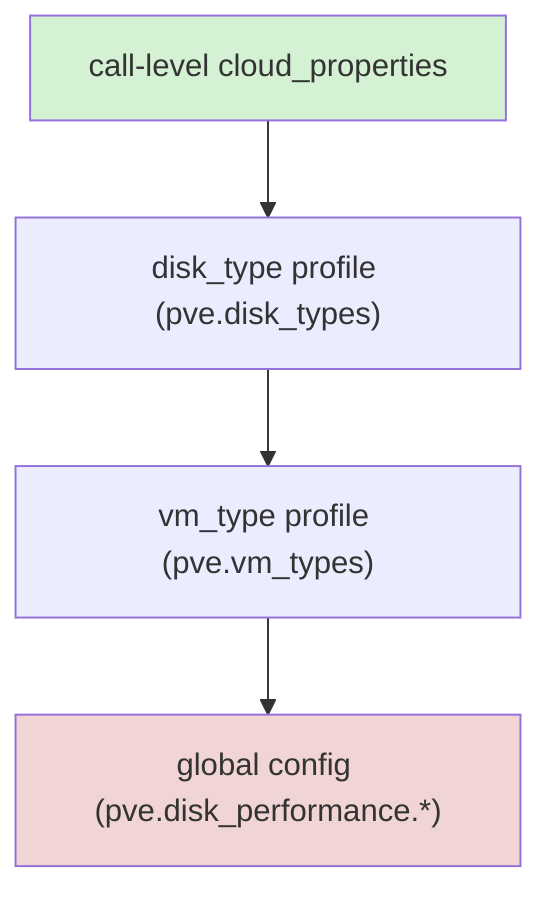
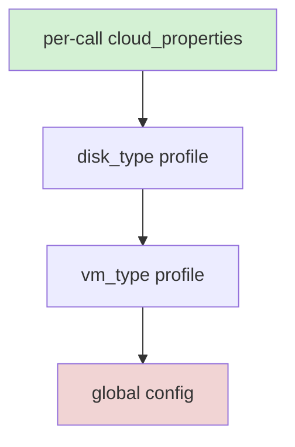

# Configuration

The CPI reads configuration from a BOSH deployment manifest. The job template renders the manifest properties into a JSON document the binary reads with the `--config` flag. All properties correspond to fields in `jobs/pve_cpi/spec`.

## Minimal Configuration

Config validation requires five properties: `host`, `user`, one of `password` or `api_token`, `vm_storage`, and `disk_storage` (`network_bridge` is also validated, but the job spec always renders its `vmbr0` default, so a manifest that omits it still passes). In practice, also set `node`: it is where `create_stemcell` builds cache templates by default and where `create_vm` falls back when placement scoring is disabled or a call does not resolve a target node.

```yaml
properties:
  pve:
    host: pve.example.com
    user: root@pam
    api_token: root@pam!bosh=((pve_api_token))
    node: pve1
    vm_storage: local-lvm
    disk_storage: local-lvm
```

With just this manifest: `create_vm` attaches every NIC to the pre-existing `vmbr0` Linux bridge (see [Networks — Pattern A: operator-managed bridges](networks.md#pattern-a-operator-managed-bridges) — no SDN prerequisites), stemcells and VM disks share `local-lvm`, and every VM and stemcell cache template is auto-assigned into a create-if-missing `bosh` / `bosh-templates` resource pool pair (see [Resource Pools](#resource-pools) below). `stemcell_storage` defaults to `vm_storage`, but PVE only accepts qcow2 uploads on **file-based** storage (`dir`, `nfs`, `cifs`, `glusterfs`, `cephfs`) — a block-based `vm_storage` such as `local-lvm` works for VM and persistent disks but not for stemcells, so set `stemcell_storage` explicitly to a file-based pool once one is available. See [Zero-config baseline](#zero-config-baseline) at the end of this document for every other default that applies with no further configuration, and the full property table below for everything else.

| Property | Description | Default | Required |
|---|---|---|---|
| `pve.host` | PVE host (IP or FQDN) | - | yes |
| `pve.port` | PVE API port | `8006` | no |
| `pve.user` | PVE username (e.g. `root@pam` or `bosh@pve`) | - | yes |
| `pve.password` | PVE password. Mutually exclusive with `api_token`. Must be credhub-managed in production via `((pve_password))`. | `""` | one of password or api_token |
| `pve.api_token` | PVE API token (`<user>!<token-id>=<uuid>`). Mutually exclusive with `password`. Must be credhub-managed in production via `((pve_api_token))`. | `""` | one of password or api_token |
| `pve.realm` | Authentication realm | `pam` | no |
| `pve.node` | Default node for placement and bridge operations | - | no (but set it in practice — see above) |
| `pve.vm_storage` | Storage pool for VM root disks | - | yes |
| `pve.disk_storage` | Storage pool for persistent disks | - | yes |
| `pve.stemcell_storage` | Storage pool for stemcell qcow2 images. Must be a file-based PVE storage (`dir`, `nfs`, `cifs`, `glusterfs`, `cephfs`) — block-based storages (`lvm`, `lvmthin`, `zfspool`, `rbd`) cannot accept qcow2 uploads. Must also be shared across cluster nodes when the cluster has more than one node. Defaults to `vm_storage`; in that case `vm_storage` must satisfy the same constraints. | `""` (falls back to `vm_storage`) | no |
| `pve.iso_storage` | Storage pool (`dir`, `nfs`, or `cifs` with `iso` content enabled) used for per-VM ConfigDrive ISOs in `cloudinit` agent mode. Block storages (`lvm`, `lvmthin`, `zfspool`) cannot hold ISO files. Whenever the ISO ends up on the node-local `local` pool it is readable by any user with PVE node access — see [ConfigDrive ISO storage](operations.md#configdrive-iso-storage) for the dedicated-pool recommendation. Note that `pve.iso_storage_follow_vm_storage` (below) treats this property's `local` default as "unset" and follows `vm_storage` when that pool is eligible. The ISO stays attached for the VM's whole life, so a node-local pool also blocks live migration and HA recovery — see [ConfigDrive — Migration and HA interaction](configdrive.md#migration-and-ha-interaction). | `local` | no |
| `pve.require_shared_iso_for_ha` | Escalates the config-drive ISO migration-safety warning to a `create_vm` error. The warning (and, when this is `true`, the error) fires whenever `create_vm` registers the VM under `placement.dlb`, `placement.pin_az_via_ha_rules`, or `placement.anti_affinity.use_ha_rules` while `iso_storage` resolves to a pool `/storage` does not report as shared. | `false` | no |
| `pve.iso_storage_follow_vm_storage` | When unset (the default) or `true`, resolves the ConfigDrive ISO pool to `vm_storage` instead of the `iso_storage` default, provided `vm_storage` advertises PVE content type `iso` and is shared. Evaluated once at CPI process startup. Because BOSH always renders the `"local"` spec default for `iso_storage` whether or not the operator set it, this flag treats `iso_storage` resolving to the literal value `"local"` as the "unset" signal — an operator who deliberately sets `iso_storage: local` while also enabling this flag gets `vm_storage`-following behavior instead; set `iso_storage` to any other value to pin a literal pool this flag will never override. Falls back to `iso_storage` unchanged with a warning when `vm_storage` lacks `iso` content, is not shared, or cannot be resolved. Set `false` to always use `iso_storage` as configured. | `~` (→ `true`) | no |
| `pve.network_bridge` | Default Linux bridge for `create_vm` NIC attachment and the VLAN zone's underlay bridge. Required regardless of `network_mode`. | `vmbr0` | no |
| `pve.network_mode` | Default network creation path for managed networks; an unambiguous network spec overrides it (a `zone`/`vnet` spec takes the SDN path under `bridge`, a `bridge`-only spec takes the bridge path under `sdn`). `bridge` (default) — Linux bridge lifecycle via the nodes API; a plain pre-existing Linux bridge needs no SDN prerequisites and no CPI-side provisioning. `sdn` — PVE SDN vnet lifecycle (opt-in; cluster SDN must be enabled). `auto` — legacy heuristic (opt-in): SDN when `cloud_properties.zone` or `pve.sdn_zone` is set; bridge otherwise. This setting governs `create_network`/`delete_network` only — it has no effect on `create_vm`'s NIC attachment: `mtu=1` vnet-MTU inheritance and `cloud_properties.vlan` tagging are decided by the actual SDN vnet list in every mode. See [Networks — Pattern A vs Pattern B](networks.md). | `bridge` | no |
| `pve.sdn_zone` | Default PVE SDN zone for vnet placement. When empty and `sdn_auto_manage_zone` is on, the CPI uses the turnkey zone `bosh`, creating it on demand. See [Network configuration](networks.md). | `""` (→ turnkey zone `bosh`) | no |
| `pve.sdn_zone_type` | Zone type the CPI uses when creating a zone. `vxlan` (default) — cluster-wide L2 overlay with peers derived from the online cluster nodes. `simple` — isolated per-node bridge (opt-in, single-node). `vlan`/`qinq` — tagged segments on an existing bridge (opt-in). `evpn` — never CPI-created; the operator pre-creates the zone and its controller and the CPI manages only vnets and subnets inside it. Only relevant when `sdn_auto_manage_zone` is `true`. | `vxlan` | no |
| `pve.sdn_auto_manage_zone` | When `true` (default), the CPI may create SDN zones on `create_network` and delete them on `delete_network` when all safety conditions are met (EVPN zones are never created or deleted). Set `false` to keep zones operator-owned. See [Network configuration](networks.md). | `true` | no |
| `pve.sdn_vxlan_peers` | Explicit VXLAN peer IPs for CPI-created vxlan zones. When empty (default), peers are derived from the online cluster nodes via `GET /cluster/status`. Set when tunnel traffic must ride a dedicated underlay whose addresses differ from the management IPs. | `[]` | no |
| `pve.sdn_vni_range_start` | First tag of the VNI/VLAN auto-allocation band for vnets in tag-carrying zones (`vxlan`, `evpn`, `vlan`, `qinq`). `0` applies the built-in default: `5000`, or `2000` when `sdn_zone_type` is `vlan`/`qinq` (the band must fit the 4094 VLAN ID cap). Per-network override via `cloud_properties.vnet_tag`. | `0` (→ `5000`, vlan/qinq `2000`) | no |
| `pve.sdn_vni_range_end` | Inclusive upper bound of the VNI/VLAN auto-allocation band. `0` applies the built-in default: `5999`, or `2999` for `vlan`/`qinq` zone types. Must be ≥ `sdn_vni_range_start`; for `vlan`/`qinq` an explicit band ending above 4094 fails validation at load time. | `0` (→ `5999`, vlan/qinq `2999`) | no |
| `pve.sdn_zone_mtu` | Explicit MTU for CPI-created SDN zones. `0` (default) lets PVE derive it from the underlay (1500 → 1450 for vxlan). Set only for unusual underlays, e.g. jumbo frames. Valid range 576–65520 when set. | `0` (→ PVE-derived) | no |
| `pve.verify_ssl` | Verify the PVE API TLS certificate | `true` | no |
| `pve.ca_cert` | Optional PEM-encoded CA certificate bundle for verifying the Proxmox VE API TLS certificate. When empty (default), the system trust pool is used — behavior is byte-identical to prior releases. When set, the PEM is parsed and the resulting cert pool is used for PVE API HTTPS verification. Ignored when `verify_ssl` is `false`. | `""` | no |
| `pve.reject_tls_downgrade_overrides` | Hardens the per-request `pve_*` context override mechanism used for BOSH cpi-config multi-cluster routing. When `true`, a request whose context carries `pve_verify_ssl: false` against a job-level config that itself verifies (`verify_ssl: true`) is rejected with a non-retriable error instead of the default warn-and-proceed behavior. A job-level config that already has `verify_ssl: false` is never rejected by this knob. When `false` (default), the downgrade is still logged at Warn but the request proceeds — byte-identical to prior releases. | `false` | no |
| `pve.agent_mode` | Agent bootstrap mode. `cloudinit` — cloud-init bootstrap (default). `noagent` — no agent bootstrap. `auto` — always selects configdrive (registry-less) bootstrap for all stemcells. | `cloudinit` | no |
| `pve.vm_disk_format` | Disk image format (`qcow2`, `raw`, `vmdk`) | `qcow2` | no |
| `pve.cpu_type` | Emulated CPU type/model written to every new VM's `cpu` config key (e.g. `host`, `x86-64-v2-AES`). Empty (default) resolves to `host`: the guest sees the physical CPU's full feature set — the best-performing choice, and safe on the homogeneous clusters typical of BOSH deployments. On clusters that mix CPU generations and rely on live migration (HA, DLB, maintenance evacuations), override with a portable named model: `x86-64-v2-AES` (PVE's own creation-wizard default since 8.0) keeps AES-NI and live-migrates across CPU generations from roughly 2010 onward; for older hardware, set the cluster's lowest-common-denominator named model. The sentinel `pve-default` writes no `cpu` key at all, restoring PVE's API-level `kvm64` fallback. `cloud_properties.cpu_type` (per-instance-group, resolved through the same layered `vm_type`/`disk_type` resolver as other create_vm knobs; the sentinel works there too) overrides this global value; `cloud_properties.pve_config.cpu` is a separate raw escape hatch applied after VM creation and always wins as the final write. Existing VMs keep their CPU type until recreated. PVE validates the model name itself; the CPI passes the value through verbatim. | `""` (→ `host`) | no |
| `pve.balloon` | Memory-balloon setting written to every new VM's `balloon` config key. Empty (default) resolves to `"0"`: the balloon device is disabled — BOSH sizes VMs deterministically from the manifest, and PVE's default auto-ballooning would reclaim guest memory beneath the Director's assumptions. A positive integer (MiB) enables PVE auto-ballooning with that floor; the CPI fails fast when the value exceeds the VM's memory. The sentinel `pve-default` leaves no `balloon` key on the VM (clearing the template-inherited value on clones), restoring PVE's own default (device enabled, balloon = memory). `cloud_properties.balloon` (per-instance-group, resolved through the same layered `vm_type`/`disk_type` resolver; the sentinel works there too) overrides this global value. Applies on VM creation; existing VMs keep their balloon setting until recreated. | `"0"` | no |
| `pve.hotplug` | PVE hotplug flags applied to every new VM. Comma-separated subset of `network,disk,cpu,memory,usb,cloudinit`, or `0` to disable hotplug entirely. Per-VM override via `cloud_properties.hotplug`. Fine-grained toggles `cpu_hotplug` and `memory_hotplug` are `create_vm` cloud properties documented in [CPI Methods](cpi_methods.md). | `network,disk,cpu,memory` | no |
| `pve.numa` | Enable NUMA (`numa=1`) on every new VM. Required at create time for live memory hotplug to allocate DIMM slots; without it, memory hot-add silently no-ops. Per-VM override via `cloud_properties.numa`. | `true` | no |
| `pve.reboot_mode` | `reboot_vm` strategy: `soft` (graceful ACPI reboot, hard-reset fallback) or `hard` (immediate reset). `hard` issues a QEMU reset and does not apply any pending PVE config change queued against the VM; `soft` restarts the QEMU process and does apply pending changes. Informational only — the CPI never leaves a config change pending on a VM it manages. | `soft` | no |
| `pve.reboot_timeout` | Seconds to wait for graceful shutdown before hard-reset fallback (soft mode only). Range 1–3600. | `60` | no |
| `pve.log_level` | Structured log level (`debug`, `info`, `warn`, `error`) | `info` | no |
| `pve.vmid_range_start` | First VMID used for VM allocation. VMs use `[vmid_range_start, vmid_range_end]`. Persistent disks use `[9000, 29999]`. | `100` | no |
| `pve.vmid_range_end` | Inclusive upper bound of the VM VMID range. Must be greater than `vmid_range_start` and must not overlap the disk or template range (with the default disk range starting at 9000, the effective maximum is 8999). The allocator scans this range from a randomized start so concurrent CPI invocations rarely pick the same VMID; a retry-on-conflict loop backstops the rare collision. | `8999` | no |
| `pve.disk_vmid_range_start` | First VMID used for persistent-disk container allocation. When unset (`0`), defaults to `9000`. Must not overlap the VM range or the template range. | `0` (→ `9000`) | no |
| `pve.disk_vmid_range_end` | Inclusive upper bound of the persistent-disk VMID range. When unset (`0`), defaults to `29999`. Must be greater than `disk_vmid_range_start`. | `0` (→ `29999`) | no |
| `pve.clone_mode` | Clone type used when `create_vm` clones a stemcell template. A linked clone's overlay volume always lands on the *template's own* storage pool (PVE does not honor a `Storage` override for linked clones), never on `vm_storage` — only a full clone can be placed on `vm_storage`. `auto` (default): linked clone when the template's storage supports it (all backends except `lvm`-thick) **and** `vm_storage` is the same pool as the template's storage; full clone otherwise, including whenever `vm_storage` differs from the template's storage (the `vm_storage` in effect when the template was built), so the root disk always lands where `vm_storage` points. `linked`: force linked clone; returns an error if the template's storage does not support linked clones, or if `vm_storage` differs from the template's storage (which would silently misplace the disk). `full`: force full clone on all backends. One of `auto`\|`linked`\|`full`. | `""` (→ `auto`) | no |
| `pve.root_disk_bus` | PVE bus the root (system) disk is created on. `virtio` (default when empty): root disk lands on `virtio0` — byte-identical to every release before this property existed. `scsi`: root disk lands on `scsi0`, on the same virtio-scsi controller persistent disks already use, unlocking TRIM (`discard`) and `ssd` auto-resolution on the root disk itself (both unavailable on virtio-blk). Persistent-disk slot allocation is unaffected either way — `scsi0` has always been reserved for the root disk and `attach_disk`'s free-slot search has always started at `scsi1`, so there is no slot collision to manage. **Clone-path requirement:** `create_vm`'s dominant path clones a pre-built stemcell template (every `:light:`/`:heavy:` stemcell CID resolves to one — see [Light Stemcells](light-stemcells.md)), and a clone inherits its source's exact disk layout. Templates are built once by `create_stemcell` and reused by content-hash tag match, so flipping this setting does not retroactively rebuild existing templates — `create_vm` compares the resolved bus against the matched template's actual root disk key before cloning and fails with a clear, non-retriable error on a mismatch rather than silently producing a root disk on the wrong bus. Re-run `create_stemcell` for affected stemcells after changing this value so new templates are built on the matching bus. One of `virtio`\|`scsi`. | `""` (→ `virtio`) | no |
| `pve.stemcell_template_vmid_range_start` | Starting VMID for stemcell template VM allocation — a dedicated band above the persistent-disk range. When unset (`0`), defaults to `30000`. Must not overlap the VM range or the persistent-disk range `9000–29999`. | `0` (→ `30000`) | no |
| `pve.stemcell_template_vmid_range_end` | Inclusive upper bound of the template VMID range. When unset (`0`), defaults to `30999`. Must be greater than `stemcell_template_vmid_range_start`. Must not overlap the persistent-disk range. | `0` (→ `30999`) | no |
| `pve.stemcell_template_pool` | PVE resource pool assigned to newly created template VMs. The CPI creates this pool if it does not already exist, tagging it with a `managed by bosh-pve-cpi` provenance comment, before the first template VM is assigned to it. Set explicitly to `""` to opt out entirely — no pool assignment and no pool creation. Must not equal `pve.vm_pool` (validated at config load — pools are the ACL boundary between workload VMs and shared stemcell templates), and must not start with `bosh-lock-` (reserved cluster-lock namespace). Must be a flat PVE poolid (no `/`). See [Resource Pools](#resource-pools) below. | `bosh-templates` | no |
| `pve.vm_pool` | PVE resource pool assigned to every VM `create_vm` provisions, on both the import path and the clone path (PVE's create and clone endpoints both accept `pool` directly). The CPI creates the resolved pool if it does not already exist, tagging it with a `managed by bosh-pve-cpi` provenance comment. Resolution precedence (highest wins, first non-empty selected): call-level `cloud_properties.pool` > `vm_type` profile `cloud_properties.pool` > `pve.vm_pool_template` (rendered) > this global value. Set explicitly to `""` to opt this layer out — a higher-precedence layer still applies if set, and when every layer resolves empty no pool is assigned, byte-identical to every release before this property existed. Lets an operator scope the CPI's VM.\* ACL grants to `/pool/<name>` instead of cluster-wide `/vms`, shrinking the blast radius of a compromised CPI token on a shared cluster — see [PVE API permissions — shared-cluster variant](pve-api-permissions.md#7-shared-cluster-variant-scoping-vm-mutation-to-a-resource-pool) for the reduced ACL table and its one gap (cloning still needs `VM.Clone` on the template's own vmid/pool). Must not equal `stemcell_template_pool`, and must not start with `bosh-lock-` (reserved for the cluster-lock sentinel pool namespace) — both are rejected at config load. Must be a flat PVE poolid (no `/`). See [Resource Pools](#resource-pools) below. | `bosh` | no |
| `pve.vm_pool_template` | Optional director-level pool-name template rendered at `create_vm` time when neither the call-level nor the `vm_type`-level `cloud_properties.pool` is set (precedence position above the `pve.vm_pool` global default). Supports four variables: `{prefix}` (`pve.vm_prefix`), `{director}`, `{deployment}`, and `{instance_group}`; any other `{...}` token is rejected at config load. The rendered name is sanitized (repeated separators collapsed to one, leading/trailing `-` trimmed); a render that collapses to `""` falls through to `pve.vm_pool`. Must not contain `/` — flat names only, the CPI never creates nested pools. Empty (default) disables this layer entirely. See [Resource Pools](#resource-pools) below. | `""` | no |
| `pve.pool_reap_empty` | When `true`, `delete_vm` deletes a CPI-managed pool (tagged with the `managed by bosh-pve-cpi` provenance comment) once the destroyed VM's pool membership, captured before destroy, is reported empty by PVE. An operator-created pool without that provenance comment is never reaped, and a pool that is still non-empty or already gone (a race with another creator) is tolerated silently — never failing `delete_vm`. Only the main `delete_vm` path reaps; the fast-path delete does not. Requires the CPI's PVE token to hold `Pool.Allocate` and `Pool.Audit` on the pool being reaped — `Pool.Audit` backs the pre-delete provenance-comment read, `Pool.Allocate` the delete itself. Default `false`: empty pools accumulate and are left for the operator to manage. See [Resource Pools](#resource-pools) below. | `false` | no |
| `pve.stemcell_template_node` | Optional PVE node on which template VMs are created. When empty (default), falls back to `pve.node`. When using local `stemcell_storage`, this must equal the node where that storage is mounted; pointing to a different node with local storage causes the template import to fail because the uploaded qcow2 is not visible from the other node. | `""` | no |
| `pve.vm_prefix` | Optional prefix prepended to every CPI-provisioned VM's PVE name. With `cpi`, names take the form `cpi-<deployment>-<job>-<index>`. Empty means the prefix is omitted. The prefix is cluster-wide — every VM created by this CPI deployment carries it. | `""` | no |
| `pve.create_env_deployment` | Synthetic deployment name used for VMs created by `bosh create-env`. bosh-init does not pass a deployment in env, so a stable placeholder is required for the `<deployment>` segment of the VM name. | `create-env` | no |
| `pve.allow_disk_ops_with_snapshots` | When `true`, bypasses the snapshot pre-flight guard in `attach_disk`, `detach_disk`, and `resize_disk`. Use only for emergency disk recovery — snapshot state becomes inconsistent after the operation. | `false` | no |
| `pve.require_snapshot_check_pass` | Controls behavior when the snapshot pre-flight check itself cannot reach PVE. `false` (default) logs a warning and proceeds (fail-open); `true` aborts the disk operation if the snapshot list cannot be fetched (fail-closed). | `false` | no |
| `pve.stemcell_staging_dir` | Optional absolute path. When set, all stemcell file reads and writes for director-supplied paths are scoped to this directory using Go's `os.Root` API, preventing access to files outside the declared root. When unset (default), behavior is unchanged from prior releases. Must be an absolute path to an existing directory on the CPI host. Defense-in-depth against unexpected stemcell paths. | `""` | no |
| `pve.fetch_credential_defaults` | Ordered list of URL-prefix-to-auth mappings used when fetching a light stemcell whose `cloud_properties.image_url` carries no per-stemcell `image_url_auth`. The entry with the longest matching `url_prefix` wins. Each entry requires a `url_prefix` string and an `auth` object with a required `type` field; supported types are `basic`, `bearer`, `s3`, `oci`, and `blobstore`. When unset or empty, light-stemcell fetches without per-stemcell credentials are unauthenticated. See [Light stemcells](light-stemcells.md) for full auth-object schemas. | `[]` | no |
| `agent.mbus` | URL the BOSH agent should bind/listen on inside the VM. Required for `bosh create-env`: bosh-init does not pass it via the per-call env argument, only via CPI config. When empty, the CPI derives `nats://<blobstore-host>:4222` from the blobstore endpoint if one is configured (loopback hosts rejected). | `""` | yes for `create-env` |
| `agent.blobstore` | Optional default blobstore settings for the agent's `settings.json` (mirrors `agent.blobstore` in `bosh.yml`). | `{}` | no |

## Stemcell Storage

`stemcell_storage` must be a **file-based** PVE storage pool. The CPI uploads the qcow2 image via the PVE upload API, which accepts only file-based storages (`dir`, `nfs`, `cifs`, `glusterfs`, `cephfs`). Block-based storages (`lvm`, `lvmthin`, `zfspool`, `rbd`) reject uploads with `can't upload to storage type '<type>'` and are unusable for stemcells regardless of cluster topology.

For multi-node clusters, `stemcell_storage` must also be shared. The `create_stemcell` call enforces this: if the storage is local-only and the cluster has more than one node, the call fails immediately with a descriptive error. Single-node clusters may use local file-based storage (e.g. the default `local` dir at `/var/lib/vz`); the shared check is skipped when the cluster reports exactly one node.

Recommended shared backends: NFS, CIFS, CephFS, GlusterFS, or any other PVE storage type configured with `shared=1` in `/etc/pve/storage.cfg`.

The storage pool must have the `import` content type enabled. See [Proxmox VE Settings](pve-settings.md) for the steps to enable it.

## Stemcell Template Cloning

`create_stemcell` builds (or reuses) a frozen PVE template VM per stemcell as a per-cluster clone-source cache — see [Light Stemcells](light-stemcells.md) for the full `:light:`/`:heavy:` CID model this cache sits behind; the template's own VMID is internal and never appears in the returned CID. `create_vm` then clones the cache template instead of running a full qcow2 block-copy per VM. On linked-clone–capable storage backends this reduces VM creation time from roughly four minutes to seconds.

The five properties in the table above (`clone_mode`, `stemcell_template_vmid_range_start`, `stemcell_template_vmid_range_end`, `stemcell_template_pool`, `stemcell_template_node`) are all optional; the defaults produce the correct behavior for most deployments.

### Clone type by storage backend

The template's root disk lives on `vm_storage` — `stemcell_storage` only hosts the uploaded qcow2 the template imports from — so the backend that decides the clone type below is `vm_storage`'s, and the file-based upload constraint on `stemcell_storage` does not limit which backends can serve linked clones.

| Storage backend | Default clone type | Notes |
|---|---|---|
| `dir`, `nfs`, `cifs`, `glusterfs`, `cephfs` | Linked (CoW) | Fastest; backed by qcow2 snapshots |
| `zfspool`, `lvmthin`, `rbd` | Linked (CoW) | Fastest; backed by ZFS/LVM-thin/RBD snapshots |
| `lvm` (thick) | Full | `lvm`-thick does not support linked clones |

Set `clone_mode: full` to force full clones everywhere, or `clone_mode: linked` to force linked clones and get an explicit error on `lvm`-thick rather than a silent fallback.

### Choosing between the template cache and a direct import

| Property | Type | Default | Description |
|---|---|---|---|
| `pve.stemcell_strategy` | String | `template` | How `create_vm` materializes a VM root disk from a stemcell CID. `template` (default): clone the per-cluster stemcell cache template described above — CoW-fast; the cache is built eagerly by `create_stemcell` and reused by every `create_vm` on the cluster. `import`: import the stemcell qcow2 directly into the VM root disk — a full copy per VM, slower, but independent of the template cache; useful when clones must not share a base volume. Per-VM override: `vm_type`/resource-pool `cloud_properties.stemcell_strategy`. Valid values: `""`, `"template"`, `"import"`. |

### `vm_storage` must match the template's storage for a linked clone

A linked clone is a copy-on-write overlay chained to the template's own base volume, so PVE always creates it on the *template's* storage pool — the `Storage` clone parameter is only honored on full clones. The template's pool is the `vm_storage` that was configured when `create_stemcell` built it, and `create_vm` reads the template's actual root-disk volid rather than trusting configuration, so a mismatch arises when `vm_storage` changed after the template was built, or when another CPI configuration with a different `vm_storage` clones the same cluster's template cache. In that case `clone_mode: auto` downgrades to a full clone so the root disk still lands on `vm_storage` as configured; `clone_mode: linked` instead fails `create_vm` with a `CloudError` before any clone is submitted, since a linked clone there would silently place the disk on the template's pool instead. Two storage IDs that resolve to the same physical backing (two names for one NFS export or dir path) are treated as a match, not a mismatch. After changing `vm_storage`, templates built from then on land on the new pool, but a stemcell's existing cache template is reused as-is — so its clones stay full until that template is deleted (`delete_stemcell`, or a new stemcell version) and rebuilt. Accept the `auto` downgrade to full in the meantime.

### VMID ranges

The CPI allocates three classes of VMID from disjoint, contiguous bands. Each band is operator-configurable and defaults to a clean, non-overlapping range:

| Class | Default range | Count | Config keys |
| --- | --- | --- | --- |
| VMs | `[100, 8999]` | 8,900 | `vmid_range_start`, `vmid_range_end` |
| Persistent disks | `[9000, 29999]` | 21,000 | `disk_vmid_range_start`, `disk_vmid_range_end` |
| Stemcell templates | `[30000, 30999]` | 1,000 | `stemcell_template_vmid_range_start`, `stemcell_template_vmid_range_end` |

The disk band is sized at roughly 2× the VM ceiling so a foundation never exhausts persistent-disk identifiers before VMs. The template band is small because the live count of stemcell templates (one per stemcell name/version tuple) is in the tens, not thousands.

Override example (the full default layout, written out):

```yaml
pve:
  vmid_range_start: 100
  vmid_range_end: 8999
  disk_vmid_range_start: 9000
  disk_vmid_range_end: 29999
  stemcell_template_vmid_range_start: 30000
  stemcell_template_vmid_range_end: 30999
```

The three ranges must not overlap. The validator cross-checks all pairs at CPI startup and rejects overlapping configurations. There is no hard ceiling on the VM range — it may grow as large as needed, provided you relocate the disk and template bands so nothing collides.

### Cross-node and multi-node considerations

Template VMs are created on `stemcell_template_node` (or `pve.node` if unset). For shared storage backends (NFS, CIFS, CephFS, GlusterFS, RBD), any cluster node can clone the template — no additional configuration is needed.

For local storage backends (`dir`, `zfspool`, `lvmthin`, `lvm`) on multi-node clusters, the template and the VM being cloned must reside on the same node. Options:

- Pin `stemcell_template_node` and set `cloud_properties.target_node` in your BOSH VM types to the same node.

- Use shared storage for `stemcell_storage` (recommended for production multi-node clusters).

The CPI does not auto-migrate templates between nodes. If a clone lands on the wrong node, manually live-migrate the resulting VM in the PVE UI after `create_vm` completes.

### No legacy CID compatibility

`create_stemcell` and `delete_stemcell` accept only the current path-identity CID grammar (`:light:<storage>:import/<file>` or `:heavy:<storage>:import/<file>`, see [Light Stemcells](light-stemcells.md)). Every earlier grammar — a bare `<storage>:import/<file>`, a `light:...`/`template:<vmid>` prefix, or a bare integer VMID — is rejected as a hard, non-retriable parse error. There is no fallback path: re-upload every stemcell with a CPI at this CID grammar before deploying against it.

## Resource Pools

PVE resource pools group VMs (and, separately, stemcell templates) under a named identifier that can anchor ACL grants — see [PVE API permissions — shared-cluster variant](pve-api-permissions.md#7-shared-cluster-variant-scoping-vm-mutation-to-a-resource-pool). Two independent pools exist: `pve.vm_pool` for workload VMs and `pve.stemcell_template_pool` for stemcell templates. They must always differ — pools are the CPI's ACL boundary, and sharing one pool would let a `create_vm`-scoped grant also touch stemcell templates.

### VM pool resolution

`create_vm` resolves the pool for every VM it provisions, on both the import path and the clone path, from the first non-empty candidate in this list, highest precedence first:

| Precedence | Source | Notes |
|---|---|---|
| 1 | call-level `cloud_properties.pool` | Set per instance group via a BOSH resource pool or vm_extension; the Director merges this into the call's cloud properties before the CPI sees them. |
| 2 | `vm_type` profile `cloud_properties.pool` | From `pve.vm_types`, selected via `cloud_properties.vm_type`. A `disk_type` profile's `pool` key has no vote here — pool assignment is a VM-level concept, not a disk-level one. |
| 3 | `pve.vm_pool_template` (rendered) | Director-level template; see below. |
| 4 | `pve.vm_pool` | Global default, `bosh`. |

When every layer resolves to an empty string — including an explicit `pve.vm_pool: ""` with no template or per-call override in play — no pool is assigned, identical to every release before this feature existed.

### Pool-name template

`pve.vm_pool_template` renders a pool name from four variables, used only when neither the call-level nor the `vm_type`-level layer sets `pool`:

| Variable | Value |
|---|---|
| `{prefix}` | `pve.vm_prefix` |
| `{director}` | The BOSH director name, derived from `env.bosh.group`. Empty when it cannot be derived, for example on a `create-env` path. |
| `{deployment}` | The BOSH deployment name. Falls back to `pve.create_env_deployment` for `create-env`. |
| `{instance_group}` | The instance group (job) name. |

Any other `{...}` token in the template is rejected at config load. After substitution, repeated `-` separators collapse to one and leading/trailing `-` is trimmed; a render that collapses to `""` (every variable resolving empty, for example) falls through to the `pve.vm_pool` global default rather than producing an empty or malformed pool id.

### Create-if-missing and provenance

Both `pve.vm_pool` and `pve.stemcell_template_pool` are create-if-missing: the CPI creates the resolved pool the first time a VM or template needs it, tagging it with the comment `managed by bosh-pve-cpi` (plus ` (director <name>)` when the director name is derivable). Two CPI processes racing to create the same pool are both satisfied — PVE serializes pool creation, and the CPI treats a duplicate-create response as success.

A pool that already exists when the CPI first resolves it — whether operator-created or left over from a previous run — is used as-is; the create-if-missing call no-ops on the already-exists response and never rewrites an existing pool's comment.

### Flat names only

A resolved pool name — from a call-level override, a `vm_type` profile, or a rendered template — must not contain `/`. Every resolved name is validated against the flat PVE poolid charset (letters, digits, `.`, `_`, `-`) and checked against the reserved `bosh-lock-` cluster-lock namespace (see [Cluster pool lock](architecture.md#cluster-pool-lock)). The CPI never creates a nested pool.

### Opt-in empty-pool reaping

`pve.pool_reap_empty` (default `false`) lets `delete_vm` clean up a pool once it becomes empty. Before destroying the VM, the CPI records its pool membership; after the destroy completes, the CPI checks whether that pool carries the `managed by bosh-pve-cpi` provenance comment and, if so, attempts to delete it. A pool that is still non-empty, already gone, or missing the provenance comment is left alone — the reaper only ever removes pools it created, and race conditions with another creator are tolerated silently. Only the primary `delete_vm` path reaps; the fast-path delete (`pve.fast_path_delete`) does not.

## Authentication

Exactly one of `pve.password` or `pve.api_token` must be set. API tokens are preferred for production deployments; they support per-token revocation and privilege separation in PVE 9.

See [pve-api-permissions.md](pve-api-permissions.md) for token creation and the minimum-privilege `bosh@pve` user setup.

## SDN Network Management

When the Director's cloud-config marks a network as `managed: true`, the CPI calls `create_network` and `delete_network` to provision and remove the network resource. The CPI supports two backends: Linux bridges (the default) and PVE SDN vnets (opt-in). See [Networks](networks.md) for the full Pattern A (operator-managed bridges) versus Pattern B (CPI-managed SDN) treatment, including the per-NIC `cloud_properties` reference table; this section covers only the `create_network`/`delete_network` provisioning path for `managed: true` networks.

### Prerequisites — SDN Mode (opt-in)

1. PVE SDN must be enabled at the datacenter level. The **Datacenter > SDN** menu appears in PVE 7.2+ and requires `libpve-network-perl` on all cluster nodes.

2. The PVE API token or user must hold the `SDN.Allocate` privilege on `/sdn`. Required only when a managed network actually routes to the SDN path — either `network_mode: sdn`/`auto`, or a `bridge`-mode network whose `cloud_properties` names a `zone` or `vnet`.

3. A pre-existing SDN zone is required only when `sdn_auto_manage_zone: false` (the CPI never creates zones then) or when `sdn_zone_type: evpn` (EVPN zones and their controllers are always operator-created). With `sdn_auto_manage_zone` at its default (`true`), the CPI creates the turnkey vxlan zone `bosh` on demand.

### Manifest Example — Opt-in Cluster-wide VXLAN Overlay

Set `network_mode: sdn`; the CPI then creates the vxlan zone `bosh` with peers derived from the online cluster nodes on the first `create_network` call:

```yaml
properties:
  pve:
    host: pve.example.com
    user: root@pam
    api_token: root@pam!bosh=<token>
    node: pve1
    vm_storage: local-lvm
    disk_storage: local-lvm
    network_bridge: vmbr0
    network_mode: sdn
```

Cloud-config managed network:

```yaml
networks:
- name: bosh-net
  type: manual
  managed: true
  cloud_properties:
    vnet: boshvn
  subnets:
  - range: 10.200.0.0/24
    gateway: 10.200.0.1
```

### Manifest Example — Simple Zone (opt-in)

For a single node or a deliberately node-local segment:

```yaml
properties:
  pve:
    # ...connection basics as above...
    network_mode: sdn
    sdn_zone: boshzone
    sdn_zone_type: simple
```

The vnet becomes an isolated per-node bridge; deployments spanning nodes need the vxlan default instead.

### Manifest Example — VLAN (vnet-per-VLAN)

For clusters segmented by 802.1Q VLANs in the physical fabric. The VLAN tag lives on the SDN vnet — VMs join by bridge selection alone:

```yaml
properties:
  pve:
    # ...connection basics as above...
    network_bridge: vmbr0     # VLAN-aware underlay bridge on every node
    sdn_zone_type: vlan
```

Cloud-config managed network, one per VLAN:

```yaml
networks:
- name: vlan59-net
  type: manual
  managed: true
  subnets:
  - range: 10.59.0.0/24
    gateway: 10.59.0.1
    cloud_properties:
      vnet: vlan59
      vnet_tag: 59           # the 802.1Q VLAN ID (≤ 4094)
```

The CPI creates the vlan zone with `network_bridge` as underlay, the vnet with tag 59, and returns `bridge: vlan59` for VM attachment. Pre-created vnets work without `managed: true` — point `cloud_properties.bridge` at the vnet name. See [Networks — VLAN (vnet-per-VLAN)](networks.md#vlan-vnet-per-vlan-managed-true) for the full walkthrough and [Operations — SDN VLAN operations](operations.md#sdn-vlan-operations) for fabric prerequisites.

### Manifest Example — Bridge Mode (the default)

No `network_mode` to set — this is the out-of-the-box behavior. Requires only a pre-existing Linux bridge on the target node(s); no SDN prerequisites:

```yaml
properties:
  pve:
    network_bridge: vmbr0
```

Cloud-config managed network:

```yaml
networks:
- name: bosh-bridge
  type: manual
  managed: true
  cloud_properties:
    bridge: vmbr1
  subnets:
  - range: 10.201.0.0/24
    gateway: 10.201.0.1
```

### Notes

- Most deployments pre-configure networks and do not set `managed: true`. The `create_network` and `delete_network` handlers run only when the Director's cloud-config marks a network as managed.

- `pve.network_bridge` is required for `create_vm` NIC attachment regardless of `network_mode`. It is the default bridge VMs attach to at boot.

- SDN changes are staged by the PVE API and committed by the CPI via a `PUT /cluster/sdn` apply call after each create or delete operation. This is PVE's two-phase commit model. On error, the CPI issues a rollback to clear staged-but-unapplied changes.

- Zone auto-management (`sdn_auto_manage_zone`) is on by default. `delete_network` removes the zone only when all four conditions hold: `sdn_auto_manage_zone` is `true`, the zone name does not match `pve.sdn_zone` (the operator-pinned default zone is never auto-deleted), the zone is not an EVPN zone (operator-owned fabric, never CPI-deleted), and the zone has zero remaining vnets after the vnet is removed. Set `sdn_auto_manage_zone: false` when the operator should own the full zone lifecycle.

## MBus Fallback

When `agent.mbus` is empty but a blobstore endpoint is configured, the CPI derives `nats://<blobstore-host>:4222` from the blobstore host and uses it as the agent's NATS URL. Explicit `agent.mbus` values always win. Loopback hosts (`127.0.0.1`, `localhost`, `::1`, `0.0.0.0`) are rejected — the MBus stays empty so the misconfiguration fails loudly instead of routing silently to a non-routable URL.

This matches the typical BOSH topology where NATS and the DAV blobstore are colocated on the Director (or on the `create-env` machine during initial bootstrap, when the Director does not yet exist to advertise an MBus URL).

## Placement

The placement engine scores cluster nodes at `create_vm` time using live resource metrics. When `placement.enabled` is `false`, the CPI falls back to `pve.node` (static single-node behavior). An explicit `cloud_properties.target_node` always overrides placement scoring.

| Property | Type | Default | Description |
|---|---|---|---|
| `pve.placement.enabled` | Boolean | `true` | Enables live node scoring. Set `false` to restore static single-node behavior. |
| `pve.placement.weights.mem` | Float | `0.0` (→ 1.0) | Scorer weight for free-memory headroom. Higher = stronger preference for RAM-rich nodes. |
| `pve.placement.weights.storage` | Float | `0.0` (→ 0.5) | Scorer weight for free-storage fraction. |
| `pve.placement.weights.cpu` | Float | `0.0` (→ 0.5) | Scorer weight for free-CPU headroom. |
| `pve.placement.weights.guest_count` | Float | `0.0` (→ 0.3) | Scorer weight for inverse guest count. Spreads load by penalizing busy nodes. |
| `pve.placement.az_map` | Map | `{}` | Maps AZ names to PVE node lists. `{us-east-1a: [pve01, pve02]}`. When set, a VM's `cloud_properties.availability_zone` must match a key or `create_vm` returns an error. |
| `pve.placement.anti_affinity.enabled` | Boolean | `false` | Spreads members of the same BOSH instance group across nodes at create time (soft anti-affinity). Advisory under resource pressure. |
| `pve.placement.anti_affinity.use_ha_rules` | Boolean | `false` | When `true` (and `anti_affinity.enabled`), registers each VM as a PVE HA resource and maintains a cluster-level negative resource-affinity rule keyed on the instance group. Enforces spreading at the hypervisor level. |
| `pve.placement.anti_affinity.strict` | Boolean | `false` | When `true`, the PVE HA rule is strict (hard spread): PVE refuses to place or failover a VM onto a node already hosting another member. Can block HA failover on small clusters. Only meaningful when `anti_affinity.use_ha_rules` is `true`. |
| `pve.placement.dlb.enabled` | Boolean | `false` | Enables PVE 9.2+ Dynamic Load Balancer (CRS dynamic mode). Every VM is registered as a PVE HA resource with `auto-rebalance=1`. |
| `pve.placement.dlb.az_name` | String | `"dlb"` | Sentinel AZ name. A VM whose `cloud_properties.availability_zone` equals this value is treated as DLB-delegated even when `dlb.enabled` is `false`. Set to `""` to disable the sentinel trigger. |
| `pve.placement.dlb.manage_cluster_crs` | Boolean | `false` | When `true`, the CPI sets the cluster CRS option to `ha=dynamic` before registering a DLB VM. When `false`, the CPI logs a warning if DLB is requested but the cluster is not in dynamic mode. Writing the cluster CRS option affects all HA guests cluster-wide. |
| `pve.placement.dlb.require_shared_storage` | Boolean | `true` | Skips DLB registration for VMs on local storage (cannot be live-migrated). Set `false` to register regardless; not recommended unless all storage is shared. |
| `pve.placement.exclude_maintenance_nodes` | Boolean | `true` | Excludes nodes in a PVE HA maintenance or error state, or carrying any tag from `placement.maintenance_node_tags`, from placement candidates. |
| `pve.placement.maintenance_node_tags` | List | `[]` (→ `["maintenance"]`) | PVE node tags that mark a node as in maintenance. A node carrying any listed tag is excluded when `exclude_maintenance_nodes` is `true`. |
| `pve.placement.az_fallback_order` | List | `[]` | Ordered AZ names appended as fallback candidates after `cloud_properties.availability_zones` are exhausted. Expresses a cluster-wide AZ preference order. |
| `pve.placement.az_shuffle` | Boolean | `false` | Randomizes AZ order before scoring. Distributes VMs across AZs non-deterministically when `true`. |
| `pve.placement.pin_az_via_ha_rules` | Boolean | `false` | Creates a PVE HA node-affinity rule (`bosh-na-{vmid}`) binding each VM to its AZ's node set after scoring. Makes AZ placement durable across HA failover and DLB rebalance. `delete_vm` removes the rule. Incompatible with the DLB sentinel AZ. See [DLB-Aware Placement](dlb-aware-placement.md). |
| `pve.placement.pin_az_strict` | Boolean | `true` | Controls strictness of the `pin_az_via_ha_rules` rule. `true` = hard AZ guarantee (HA will not relocate off-AZ even if every AZ node is down). `false` = preferred pin (allows off-AZ relocation on total AZ failure). Ignored when `pin_az_via_ha_rules` is `false`. |
| `pve.placement.fallback_max` | Integer | `0` | Maximum alternate candidate nodes to try after a transient clone or start failure on the initially selected node. `0` = single attempt. Valid range: 0–5. Recommended operational value: 2. |
| `pve.antiaffinity_verify` | Boolean | `false` | After recreating an anti-affinity rule, re-lists HA rules and asserts the target VM is present. Surfaces concurrent-writer drops as a retriable error. |
| `pve.max_inflight_per_node` | Integer | `0` | Maximum concurrent mutating operations (`create_vm`, `delete_vm`, `create_disk`, `attach_disk`, `create_stemcell`) against a single node. `0` = unlimited. |

## Storage Capacity

Independent of the `placement.reserve_storage_headroom` fixed-byte filter above, `pve.storage.max_utilization_pct` adds a proportional utilization ceiling that gates `create_vm` placement, `create_disk`, `resize_disk`, and (warn-only) `snapshot_disk`. See [Operations — Storage capacity](operations.md#storage-capacity-utilization-bands-and-the-cpi-ceiling-gate) for the CoW-degradation and Ceph-watermark rationale, and [DLB-Aware Placement](dlb-aware-placement.md#storage-utilization-ceiling-gate) for how it fits into the placement flow. That same Operations section also covers a zfspool-specific caveat for this headroom math: PVE's zfspool default is thick provisioning (every zvol reserves its full size up front), not the thin/on-demand allocation the CoW-degradation model above otherwise assumes for ZFS.

| Property | Type | Default | Description |
|---|---|---|---|
| `pve.storage.max_utilization_pct` | Integer | `0` | Ceiling on projected storage-pool utilization (0-100). `0` disables the gate (byte-identical to prior releases). When set, gates four evaluation points: `create_vm` placement (reject/warn a candidate node whose pool would exceed the ceiling after the VM's disk footprint), `create_disk` (checked before allocation), `resize_disk` (checked before the resize call), and `snapshot_disk` (always warn-only, regardless of `max_utilization_mode` — snapshot growth is unbounded and cannot be estimated ahead of time). Fails open with a logged warning when storage facts cannot be determined. Recommended operational value: `80`. |
| `pve.storage.max_utilization_mode` | String | `"enforce"` | Enforcement mode when `max_utilization_pct` is exceeded. `enforce` = `create_vm` rejects the candidate node; `create_disk`/`resize_disk` return a retriable cloud error (capacity can be freed, so the director should re-drive). `warn` = the same facts are logged and the operation proceeds unblocked. Ignored by `snapshot_disk`, which is always warn-only. Only meaningful when `max_utilization_pct` is `> 0`. |

## Hooks

Hooks are built-in middleware that fire around CPI method calls. List enabled hooks by name in `pve.hooks`; an unknown name fails startup. When `pve.hooks` is empty, there is no overhead.

| Property | Type | Default | Description |
|---|---|---|---|
| `pve.hooks` | List | `[]` | Ordered list of hook names to activate. Built-in names: `audit_log`, `notes_audit`, `lb_register`, `external_command`. |
| `pve.vm_firewall` | Boolean | `false` | Applies `firewall=1` to every NIC of newly created VMs. Per-NIC `cloud_properties.firewall` overrides this global default. Enabling the NIC flag alone does not activate packet filtering — the VM-level firewall must also be enabled (done automatically when `security_groups` is set). None of this is enforced unless the PVE **datacenter firewall master switch** is also on — see [Firewall](#firewall). |

### audit_log

Logs each CPI call's duration and outcome. Never logs argument content. No configuration required.

### notes_audit

Writes the BOSH deploy identity into the PVE VM Notes after `create_vm`. No configuration required.

### lb_register

Registers and deregisters the VM in an HAProxy backend via the Data Plane API on `create_vm` and `delete_vm`. Registration is best-effort: a Data Plane API failure is logged and does not fail the CPI call.

| Property | Type | Default | Description |
|---|---|---|---|
| `pve.lb_register.endpoint` | String | `""` | HAProxy Data Plane API base URL (e.g. `https://lb.example:5555`). Required when `lb_register` is listed in `pve.hooks`. |
| `pve.lb_register.backend` | String | `""` | HAProxy backend name. Required when `lb_register` is listed in `pve.hooks`. |
| `pve.lb_register.port` | Integer | `0` | Server port registered for each VM. `0` leaves the port unset on the server entry. |
| `pve.lb_register.user` | String | `""` | HAProxy Data Plane API basic-auth username. |
| `pve.lb_register.password` | String | `""` | HAProxy Data Plane API basic-auth password. |
| `pve.lb_register.ca_cert` | String | `""` | Optional PEM-encoded CA certificate pinning the HAProxy Data Plane API server certificate. Empty uses the system trust store. |
| `pve.lb_register.allow_private_ip` | Boolean | `false` | When `false` (default), an endpoint resolving to a private or loopback address is rejected (SSRF guard). Set `true` only for a Data Plane API on a trusted private network. |
| `pve.lb_register.timeout_ms` | Integer | `0` (→ 10 s) | Per-call timeout for HAProxy Data Plane API requests. |

### external_command

Runs an allowlisted host command on selected CPI methods. The command runs without a shell, with a scrubbed environment and a timeout.

| Property | Type | Default | Description |
|---|---|---|---|
| `pve.external_command.command` | String | `""` | Absolute path of the executable to run. Must also appear in `external_command.allowlist`. Required when `external_command` is in `pve.hooks`. |
| `pve.external_command.args` | List | `[]` | Arguments passed verbatim as discrete argv (no shell interpretation). The CPI also injects `CPI_METHOD` and `CPI_VMID` into the scrubbed environment. |
| `pve.external_command.allowlist` | List | `[]` | Allowlist of absolute executable paths permitted to run. An empty allowlist makes the hook inert. |
| `pve.external_command.env_passlist` | List | `[]` | Names of environment variables passed through from the CPI process to the child. Everything else is scrubbed. |
| `pve.external_command.timeout_ms` | Integer | `0` (→ 30 s) | Per-invocation timeout. The child process is killed when the deadline passes. |
| `pve.external_command.methods` | List | `[]` | CPI methods that trigger the command. Empty runs it on `create_vm` and `delete_vm`. |

## Firewall

PVE enforces firewall rules at three levels — datacenter, host, VM — and a packet is filtered only when all three levels between it and its destination allow it. This CPI programs the VM level: `pve.vm_firewall` and per-NIC `cloud_properties.firewall` set the per-NIC flag, `pve.security_groups` / per-call `cloud_properties.security_groups` attach firewall groups and enable the VM-level firewall, and `cloud_properties.allowed_address_pairs` (see [CPI Methods — `create_vm`](cpi_methods.md#create_vm)) seeds `ipfilter-netN` ipsets for VIP/VRRP use cases. All of these API calls succeed independent of the datacenter-level switch below — the CPI has no way to detect from a single VM's perspective whether its own rules are actually being enforced cluster-wide.

### The datacenter firewall master switch defaults off

PVE ships with the datacenter firewall master switch (`Datacenter > Firewall > Options > Enable`) **disabled**. With it off, every VM-level rule this CPI programs is inert: `security_groups`, `allowed_address_pairs`, and the per-NIC `firewall=1` flag all succeed at the API level but filter zero packets. Whenever `create_vm` is asked to configure any of these features, it probes `GET /cluster/firewall/options` once per CPI process and logs a Warn if the master switch is off, naming the gap and the fix. The probe requires `Sys.Audit`; on a token that lacks it (or any other probe failure) the CPI logs that enforcement status could not be verified and proceeds — the probe is diagnostic only and never blocks or fails `create_vm`.

### Enabling it is a cluster-wide, anti-lockout-sensitive change

Enabling the master switch activates **host-level** firewall enforcement across every node in the cluster, not just VM-level enforcement for CPI-managed guests — a change with a real lockout risk if the host-level ruleset does not already permit essential traffic. Before enabling it:

- Ensure a management allow rule exists for the source addresses/networks used to reach the PVE API and SSH (typically the same management network referenced in [PVE API Permissions](pve-api-permissions.md)).
- Ensure explicit allowances exist for cluster and storage traffic already in use, for example: Ceph (public/cluster network ports, when using `rbd`/`cephfs` storage), VXLAN UDP 4789 (when using the default `sdn_zone_type: vxlan`; see [Network configuration](networks.md)), and BGP TCP 179 (when using an EVPN zone with a BGP controller).
- Test the change on a single node or a maintenance window first where practical; a misconfigured host-level ruleset can cut off the very management access needed to fix it.

## Disk Performance

Global disk performance defaults apply to every disk the CPI creates. Per-disk `cloud_properties` override these globals; `pve.disk_types` profiles sit between them.



Per-call always wins. Global config is the lowest-precedence layer.

| Property | Type | Default | Description |
|---|---|---|---|
| `pve.disk_performance.iothread` | Boolean | `true` | Enables the PVE `iothread` option on every disk. Reduces contention on the QEMU main loop. Applicable to `virtio-scsi-single` and `virtio-blk` buses; ignored on `ide`/`sata`. Overridden per disk by `cloud_properties.iothread`. Default `true` (earlier releases left it unset/off); set `false` to restore the off default. Create/attach-time bake only — see the note below the table. |
| `pve.disk_performance.cache` | String | unset | Default PVE disk cache mode. Valid values: `none`, `writethrough`, `writeback`, `unsafe`, `directsync`. `writeback` suits most workloads; `none` is required for data safety on Ceph/RBD. |
| `pve.disk_performance.aio` | String | unset | Default PVE AsyncIO backend. Valid values: `native`, `io_uring`, `threads`. Unset (default) omits the key and PVE applies its own default (`io_uring` on modern PVE hosts). Overridden per disk by `cloud_properties.aio`. Structural — baked at create time, invariant-tracked on re-attach like `cache`/`iothread`/`ssd`. See the AIO backend selection note below. |
| `pve.disk_performance.discard` | Tri-state (`true`\|`false`\|unset) | unset (→ auto) | Passes `discard=on` to a disk, enabling TRIM/UNMAP passthrough. `true`/`false` force the value on or off regardless of storage backend. Unset (default) auto-resolves per disk from the actual resolved storage pool's TRIM capability — see [Discard/SSD auto-resolution](#discardssd-auto-resolution) below. Overridden per disk by `cloud_properties.discard` (same three states). |
| `pve.disk_performance.ssd` | Tri-state (`true`\|`false`\|unset) | unset (→ auto) | Marks a disk as SSD-backed (`rotation=0` in the guest). Same three states and the same TRIM-capability auto-resolution as `discard` — see [Discard/SSD auto-resolution](#discardssd-auto-resolution) below. Only ever reaches a disk on the `scsi` bus; the virtio-blk bus filter drops it from the VM root disk unconditionally. Overridden per disk by `cloud_properties.ssd`. |
| `pve.disk_performance.mbps_rd` | Float | unset | Default read throughput cap in MB/s. `0` or unset means no cap. Fractional values accepted (e.g. `100.5`). |
| `pve.disk_performance.mbps_wr` | Float | unset | Default write throughput cap in MB/s. `0` or unset means no cap. |
| `pve.disk_performance.iops_rd` | Integer | unset | Default read IOPS cap. `0` or unset means no cap. |
| `pve.disk_performance.iops_wr` | Integer | unset | Default write IOPS cap. `0` or unset means no cap. |
| `pve.disk_performance.virtio_scsi_single` | Boolean | `true` | Sets the SCSI controller to `virtio-scsi-single` mode for every VM, giving each disk its own dedicated virtio-scsi controller. Required to use `iothread` per disk on `virtio-scsi`. Default `true` (earlier releases left it unset/off, meaning `virtio-scsi-pci`); set `false` to restore that default. Create-time only; the root disk stays on the virtio-blk bus regardless of this setting. |
| `pve.disk_perf_invariant_mode` | String | `""` (→ `enforce`) | Controls enforcement of creation-time disk-performance invariants at `attach_disk` time. When global config introduces a structural option (`cache`, `iothread`, `ssd`, `aio`) not present when the disk was created, the recorded options diverge from the runtime profile. `enforce` — reject the attach with a non-retriable error. `warn` — log the divergence and proceed. `off` — skip the check. Throttle options (`mbps_*`, `iops_*`) and `discard` are never enforced. |

**AIO backend selection:** `io_uring` is PVE's modern default and generally the best choice on a current kernel. `native` (Linux AIO) pairs with `cache=none` on block-backed storage (`lvmthin`, `zfspool`, `rbd`, `lvm`) for the lowest-overhead path to raw/thin-provisioned block devices — the classic `aio=native` + `cache=none` combination for high-IOPS workloads on block-native pools. `threads` uses a userspace thread pool and is the safest fallback for file-backed storage (`dir`, `nfs`, `cifs`) or older kernels where `io_uring` is unavailable or unstable.

**Default flip and existing disks:** `iothread` and `virtio_scsi_single` now default to `true`; both are baked in only at create time (`create_vm`, `create_disk`) or on the next `attach_disk`, never rewritten retroactively into an existing VM's live config or an existing disk CID's recorded structural options. A disk created before this flip that recorded at least one structural option (e.g. an explicit `cache` setting) will hit `pve.disk_perf_invariant_mode` on its next `attach_disk` if the newly-resolved `iothread` default diverges from its creation-time record — this is the same drift-governance mechanism that already applies to any other `disk_performance` configuration change, not new behavior introduced by this flip. A disk created with zero recorded structural options is unaffected by the invariant check (nothing to compare against) and simply picks up the new default on its next attach, matching how an unconfigured disk has always picked up whatever the current global defaults are.

### Discard/SSD auto-resolution

Copy-on-write and thin-provisioned storage backends only reclaim guest-deleted blocks when the guest issues TRIM/discard and the storage layer passes it through. Without `discard=on`, a thin pool grows monotonically as data is written and deleted, even though the guest filesystem shows the space as free. `pve.disk_performance.discard` and `.ssd` default to "auto" (unset) specifically so this reclamation happens automatically wherever it is actually effective, without forcing it onto backends where it does nothing.

Auto-resolution runs once per disk, at the point its PVE volid options are baked — `create_disk` (persistent disks), `create_vm` (the root disk), and `attach_disk` (re-resolving the global-default layer on every attach). It classifies the disk's **actual resolved storage pool**, not a config guess:

| Storage pool type | Disk format | `discard` auto-resolves | `ssd` auto-resolves |
|---|---|---|---|
| `lvmthin`, `zfspool`, `rbd` | any (format is irrelevant — no file format on block-native pools) | `on` | `1` |
| `dir`, `nfs`, `cifs` (file-backed) | `qcow2` | `on` | `1` |
| `dir`, `nfs`, `cifs` (file-backed) | `raw` | omitted | omitted |
| `lvm` (thick), `cephfs`, `glusterfs`, `pbs`, any unrecognized type | any | omitted | omitted |

`ssd`'s auto-resolved value is further filtered by bus: even when auto-resolution says "1", the virtio-blk bus filter strips `ssd` unconditionally, because `ssd` is only meaningful on the `scsi` bus. The default `virtio0` root disk is virtio-blk, so this filter always applies to it. Setting `pve.root_disk_bus` to `scsi` moves the root disk to `scsi0` — the same bus persistent disks already use — so `ssd` is retained there too.

An explicit `true` or `false` at any layer — `cloud_properties.discard`/`.ssd` (including a `disk_type`/`vm_type` profile), or this global default — always wins over auto-resolution, exactly as an explicit value wins over any other default in this CPI. Setting `true` forces the option on a backend where auto-resolution would have omitted it (PVE decides whether to accept or reject that); setting `false` suppresses it everywhere, including on a TRIM-capable pool.

`ssd` participates in `pve.disk_perf_invariant_mode` exactly like `cache` and `iothread`: a disk created before auto-resolution existed (or before it was requested) that later re-resolves `ssd=1` on re-attach is a structural divergence from its creation-time record, governed by the invariant mode setting. `discard` is deliberately **not** invariant-tracked — like before auto-resolution existed, PVE can toggle discard on a live device without a structural reconfiguration, so a discard divergence is silently applied rather than rejected or warned about.

## Layered Cloud-Property Profiles

Operator-named profiles define reusable `cloud_properties` templates. A VM selects a `vm_type` profile via `cloud_properties.vm_type`; a disk selects a `disk_type` profile via `cloud_properties.disk_type`. Resolution order (highest to lowest precedence):

1. Per-call `cloud_properties`

2. `disk_type` profile (`pve.disk_types`)

3. `vm_type` profile (`pve.vm_types`)

4. Global config (`pve.disk_performance.*`)



| Property | Type | Default | Description |
|---|---|---|---|
| `pve.vm_types` | Map | `{}` | Named VM-type profiles. Each key is a profile name; each value has a `cloud_properties` object with defaults for that profile. Selected via `cloud_properties.vm_type`. |
| `pve.disk_types` | Map | `{}` | Named disk-type profiles. Each key is a profile name; each value has a `cloud_properties` object. Selected via `cloud_properties.disk_type`. Disk-type profiles take precedence over `vm_type` profiles when both define the same attribute. |
| `pve.storage_tiers` | Map | `{}` | Named storage tiers. Each key is a tier label; each value has `types` (list of PVE storage types), `shared` (*bool), and `encrypted` (*bool). The CPI selects the first live cluster storage matching all specified criteria. Selected via `cloud_properties.storage_tier`. See [Encrypted Storage](#encrypted-storage) for the `encrypted` field. |
| `pve.security_groups` | List | `[]` | Global default list of PVE firewall group names applied to every VM that does not carry a per-call or per-profile `security_groups` override. Each entry must be a group name that already exists in the PVE firewall configuration. Rules attached from these groups are unenforced unless the PVE **datacenter firewall master switch** is also on — see [Firewall](#firewall). |

**Give every `vm_type` explicit sizing.** When no layer sets `cores`/`cpu`, `sockets`, or `memory`/`ram`, the CPI falls back to `cores: 2`, `sockets: 1`, `memory: 512` MiB — the two-core floor follows PVE guidance (never single-thread a guest), but 512 MiB still starves the BOSH agent and job processes on anything but the most trivial workload. This fallback exists so `create_vm` never fails outright on a missing size, not as a usable default. Set `cores`/`cpu` and `memory` explicitly in every `vm_type` profile (and in any `compilation` VM definition, which resolves through the same profile layering), rather than relying on the built-in fallback. An explicit `cores: 1` is honored as given.

## Stemcell Management

Controls stemcell template replication, orphan pruning, and fast-path delete. Provenance recording is unconditional — no property controls it — and director identity is never configured: every CPI call carries the calling BOSH director's identity in its request context, which the CPI stamps onto each template as a `director--<uuid>` tag.

Stemcell CIDs identify the qcow2 file, not any PVE VMID — see [Light Stemcells](light-stemcells.md) for the full `:light:`/`:heavy:` CID grammar and lifecycle. The properties below tune the per-cluster cache template that backs every stemcell CID: replication, provenance recording, orphan pruning, and fast-path delete.

| Property | Type | Default | Description |
|---|---|---|---|
| `pve.stemcell_replicate_local` | Boolean | `false` | When `true`, `create_stemcell` uploads the qcow2 independently to every candidate cluster node's local storage and creates a per-node template VM tagged `bosh-stemcell-node-<node>`. Enables `create_vm` on local-storage nodes in multi-node clusters. `delete_stemcell` removes all replicas (best-effort; a single-node failure is logged and skipped). When `false` (default), local stemcell storage on a multi-node cluster is rejected at `create_stemcell` time. |
| `pve.replica_adopt_timeout_sec` | Integer | `0` | Adopt-and-wait bound (seconds) for a racing concurrent template-replica clone. When > 0, `create_stemcell` probes for an in-flight winner building the same replica and waits up to this many seconds for it to settle before adopting it. A winner that never settles causes the node to be skipped. `0` disables the adopt path (byte-identical behavior). Conventional value: `300`. |
| `pve.stemcell_replication_concurrency` | Integer | `0` | Maximum nodes receiving a stemcell replica upload concurrently during `create_stemcell`. Only meaningful when `stemcell_replicate_local` is `true`. `0` resolves to `1` (serial). Set a positive value up to `64` to replicate multiple nodes in parallel. Per-node failures are best-effort. |
| `pve.stemcell.prune_orphans` | Boolean | `false` | When `true`, the `delete_stemcell` call performs an opt-in garbage-collection pass over `bosh-stemcell`-tagged templates carrying the calling director's `director--<uuid>` tag (director identity comes from the request context every CPI call carries — no configuration needed) that no longer have a referencing linked clone. Pruning is best-effort: failures are logged and do not cause `delete_stemcell` to fail. A request without a director UUID in its context skips the pass with a warning. |
| `pve.stemcell.prune_dry_run` | Boolean | `false` | When `true` and `prune_orphans` is enabled, the GC pass logs each candidate it would delete but performs no deletions. Use to audit orphan accumulation before enabling live pruning. Has no effect when `prune_orphans` is `false`. |
| `pve.fast_path_delete` | Boolean | `false` | When `true`, `delete_vm` and `delete_disk` issue the PVE destroy call and return immediately without awaiting the task's terminal state. `delete_vm` additionally stamps a `bosh-deleting` tag on the VM before issuing the destroy; subsequent fast-path calls sweep for and re-issue destroys on stalled VMs. `delete_disk` carries no marker (PVE disk volumes cannot hold tags). Eventual consistency: a subsequent `has_vm` or `has_disk` call may briefly still see the resource. Default `false` (synchronous, fully-consistent). The fast-path destroy uses `skiplock=true`, which PVE honors only for the literal `root@pam` superuser (password auth) — not for any API token, including one owned by `root@pam`, and not for any other identity. The CPI logs a startup Warn naming the configured identity when `fast_path_delete` is enabled under any other identity, but never blocks config load over it. |

## Health Check

When enabled, `create_vm` polls the QEMU guest agent after the VM starts, waiting for a ping response before returning. Boot failures surface earlier and diagnostics are folded into the timeout error.

| Property | Type | Default | Description |
|---|---|---|---|
| `pve.health_check.enabled` | Boolean | `false` | When `true`, `create_vm` polls the QEMU guest agent via ping after the start task completes. On timeout, VM diagnostics are folded into the error before rollback. Default `false` (no polling; `create_vm` returns as soon as PVE reports the start task complete). |
| `pve.health_check.timeout_sec` | Integer | `0` (→ 300 s) | Maximum seconds to wait for the QEMU guest agent to respond after VM start. Valid range 1–3600. `0` applies the built-in 300 s default. Ignored when `health_check.enabled` is `false`. |
| `pve.health_check.interval_sec` | Integer | `0` (→ 5 s) | Seconds between successive agent ping attempts. `0` applies the built-in 5 s default. Set to `0` for back-to-back pings (fast test mode). Ignored when `health_check.enabled` is `false`. |
| `pve.health_check.expected_agent_sha256` | String | `""` | Expected SHA-256 hex digest of `/var/vcap/bosh/bin/bosh-agent` inside the booted VM. When non-empty and `health_check.enabled` is `true`, `create_vm` runs `sha256sum` via the QEMU guest agent after the ping succeeds and fails (destroying the VM) only on a confirmed digest mismatch. Any inability to verify (guest-agent error, non-zero exit, unparseable output) is fail-open. Must be 64 hex characters when set. |

## Retry Tuning

Exponential-backoff parameters for storage imports, VMID allocation, task polling, and HTTP 429 pushback. All properties default to `0`, applying the built-in value described in each row. Override only when the built-in values do not suit your cluster's latency profile.

| Property | Type | Default | Description |
|---|---|---|---|
| `pve.retry.storage_import.max_attempts` | Integer | `0` (→ handler budget) | Maximum attempts for the storage-import retry loop (serialized disk/template imports under a storage lock). `0` keeps the built-in per-handler budget (`create_vm`: 10). Raise on slow Ceph where lock windows are wide. |
| `pve.retry.storage_import.base_ms` | Integer | `0` (→ 2000 ms) | Base delay in milliseconds for the storage-import exponential backoff (`base × 1.5^attempt`). |
| `pve.retry.storage_import.cap_ms` | Integer | `0` (→ 30000 ms) | Maximum delay in milliseconds for the storage-import backoff. Must be ≥ `base_ms` when both are set. |
| `pve.retry.storage_import.jitter_pct` | Integer | `0` (→ 30%) | Plus/minus jitter percentage (0–100) applied to each storage-import backoff delay. |
| `pve.retry.vmid_alloc.max_attempts` | Integer | `0` (→ handler default) | Maximum attempts for VMID-conflict retries. `0` falls back to the per-handler default (`create_vm`: 10, `create_disk`: 5). |
| `pve.retry.vmid_alloc.base_ms` | Integer | `0` (→ 50 ms) | Lower bound in milliseconds of the uniform VMID-conflict retry jitter window. |
| `pve.retry.vmid_alloc.cap_ms` | Integer | `0` (→ 250 ms) | Upper bound in milliseconds of the uniform VMID-conflict retry jitter window. Must be ≥ `base_ms` when set. |
| `pve.retry.task_poll.base_ms` | Integer | `0` (→ 2000 ms) | PVE task poll interval in milliseconds. Raise to reduce API pressure on large clusters. |
| `pve.retry.task_poll.cap_ms` | Integer | `0` (→ 10000 ms) | Maximum PVE task poll interval in milliseconds; the poller backs off toward this value. Clamped up to `base_ms` if smaller. |
| `pve.retry.task_poll.jitter_pct` | Integer | `0` (→ 10%) | Plus/minus jitter percentage (0–100) applied to each task poll interval. |
| `pve.retry.pushback.base_ms` | Integer | `0` (→ 5000 ms) | Initial backoff in milliseconds for HTTP 429 pushback responses from PVE. Longer than the storage-lock curve by design. |
| `pve.retry.pushback.cap_ms` | Integer | `0` (→ 60000 ms) | Maximum pushback backoff in milliseconds. Clamped up to `base_ms` if smaller. |
| `pve.retry.storage_lock.max_attempts` | Integer | `0` (→ 10) | Maximum attempts for the inner PVE storage-lock retry loop (`"got timeout waiting for worker"` / `"storage locked"` signal) in `create_disk` and `create_vm`. Primary knob; `storage_import.max_attempts` is honored as a legacy fallback when this is unset. |
| `pve.retry.storage_lock.base_ms` | Integer | `0` (→ 2000 ms) | Base delay in milliseconds for the storage-lock exponential backoff (`base × 1.5^attempt`). |
| `pve.retry.storage_lock.cap_ms` | Integer | `0` (→ 30000 ms) | Maximum delay in milliseconds for the storage-lock backoff. Must be ≥ `base_ms` when both are set. |
| `pve.retry.storage_lock.jitter_pct` | Integer | `0` (→ 30%) | Plus/minus jitter percentage (0–100) applied to each storage-lock backoff delay. |

## Operation Timeouts

Opt-in per-method deadline envelopes. When enabled, each CPI method runs under a context deadline. A wedged retry/poll combination converts to a retriable timeout the Director can act on, rather than holding a queue slot forever.

| Property | Type | Default | Description |
|---|---|---|---|
| `pve.operation_timeout.enabled` | Boolean | `false` | Opt-in per-method deadline envelope. When `true`, each CPI method runs under a context deadline sized by its class. Default `false` (no deadline; behavior identical to prior releases). |
| `pve.operation_timeout.create_sec` | Integer | `0` (→ 1800 s) | Deadline in seconds for `create_*` methods. `0` applies the built-in 1800 s. Honored only when `operation_timeout.enabled` is `true`. |
| `pve.operation_timeout.delete_sec` | Integer | `0` (→ 900 s) | Deadline in seconds for `delete_*` methods. `0` applies the built-in 900 s. Honored only when `operation_timeout.enabled` is `true`. |
| `pve.operation_timeout.query_sec` | Integer | `0` (→ 120 s) | Deadline in seconds for read-only methods (`info`, `has_vm`, `has_disk`, `get_disks`, `calculate_vm_cloud_properties`). `0` applies the built-in 120 s. Honored only when `operation_timeout.enabled` is `true`. |
| `pve.operation_timeout.default_sec` | Integer | `0` (→ 600 s) | Deadline in seconds for all other mutating methods (`reboot_vm`, `attach_disk`, `detach_disk`, `resize_disk`, `snapshot_disk`, `set_*_metadata`, `update_disk`). `0` applies the built-in 600 s. Honored only when `operation_timeout.enabled` is `true`. |

## Transport Timeouts

Fine-grained HTTP transport timeouts for the stemcell-fetch client and the PVE API client. All default to `0` (built-in defaults apply). Override when the CPI host has unusual network latency to PVE or to artifact mirrors.

| Property | Type | Default | Description |
|---|---|---|---|
| `pve.stemcell_fetch_dial_timeout_sec` | Integer | `0` (→ 30 s) | TCP dial timeout for stemcell-fetch HTTP requests (`https` and `bosh+blobstore` sources). Lower values surface stalled handshakes faster. |
| `pve.stemcell_fetch_tls_handshake_timeout_sec` | Integer | `0` (→ 15 s) | TLS handshake timeout for stemcell-fetch HTTPS requests. |
| `pve.stemcell_fetch_response_header_timeout_sec` | Integer | `0` (→ 120 s) | Timeout waiting for response headers after a stemcell-fetch request is sent. Guards against slow-loris drips on the response-header phase; the body transfer is bounded by the 30-minute outer deadline. |
| `pve.stemcell_fetch_idle_conn_timeout_sec` | Integer | `0` (→ 90 s) | How long an idle keep-alive stemcell-fetch connection stays in the pool before being closed. |
| `pve.api_dial_timeout_sec` | Integer | `0` (SDK default) | TCP dial timeout for PVE API HTTP requests. `0` leaves the transport at the SDK default (no explicit dial timeout). |
| `pve.api_tls_handshake_timeout_sec` | Integer | `0` (SDK default) | TLS handshake timeout for PVE API HTTPS requests. `0` leaves the transport at the SDK default. |
| `pve.api_max_idle_conns_per_host` | Integer | `0` (SDK default) | Maximum idle (keep-alive) connections retained in the transport pool per PVE host. Higher values reduce connection-setup latency under burst load; lower values conserve file descriptors. |
| `pve.api_idle_conn_timeout_sec` | Integer | `0` (SDK default) | How long an idle keep-alive PVE API connection remains in the pool before being closed. |
| `pve.api_tcp_keepalive_sec` | Integer | `0` (Go default) | TCP keep-alive probe interval for PVE API connections, in seconds. A positive value enables periodic TCP keep-alive probes, which helps detect silently-dropped connections on stateful firewalls. |

## IP Conflict Detection

The CPI can check for duplicate IP addresses before provisioning a VM. The static scan (`ensure_no_ip_conflicts`) checks VM configurations; the agent probe (`ip_conflict_probe: agent`) also queries running VMs via the QEMU guest agent to catch dynamically assigned addresses.

| Property | Type | Default | Description |
|---|---|---|---|
| `pve.ensure_no_ip_conflicts` | Boolean | `true` | When `true` (default), `create_vm` scans the whole cluster's VMs and checks that none already holds the requested static IP before provisioning. Set `false` only for dynamic (DHCP) networks where IP pre-assignment is not meaningful. |
| `pve.ip_conflict_probe` | String | `""` (→ `off`) | Active IP-conflict probe mode. `off` or empty: no active probe (default). `agent`: additionally calls the QEMU guest agent on each running VM to collect dynamically assigned IPs and checks them against the target IPs. The probe is fail-open: a guest-agent error is logged and that guest is skipped, never blocking provisioning. Valid values: `""`, `"off"`, `"agent"`. Only meaningful when `ensure_no_ip_conflicts` is `true`. |

## Cluster Locking

Anti-affinity rule updates require a read-modify-write on a shared PVE HA rule. Without a lock, two concurrent `create_vm` calls for the same instance group can silently drop a member. The cluster lock serializes these operations.

| Property | Type | Default | Description |
|---|---|---|---|
| `pve.cluster_lock_mode` | String | `""` (→ `off`) | Cross-process mutex for serializing anti-affinity rule read-modify-writes. `pool`: acquires a sentinel resource pool (`bosh-lock-{key}`) via `POST /pools` (pmxcfs-serialized, create-or-fail) around the anti-affinity read-modify-write. `off` or empty: no lock (default, byte-identical to prior releases). Valid values: `""`, `"off"`, `"pool"`. |
| `pve.cluster_lock_timeout_sec` | Integer | `0` (→ 60 s) | Seconds to wait to acquire the cluster lock before returning a retriable error. Also serves as the lock TTL: a holder whose recorded expiry has passed is treated as crashed and its lock is stolen. Only meaningful when `cluster_lock_mode` is `"pool"`. |

## Network SDN Convergence

After `UpdateSdn`, data-plane realization (ifupdown2 reload, pmxcfs propagation) is asynchronous and per-node. These properties gate `create_network` and `create_vm` on SDN convergence to prevent NICs from attaching to bridges that do not yet exist on the target node.

| Property | Type | Default | Description |
|---|---|---|---|
| `pve.network_resolve_retries` | Integer | unset (→ `30`) | Poll budget for freshly created SDN networks — SDN state propagates over inter-node SSH, so one broken node can leave a change silently pending cluster-wide while the apply task still reports success. When > 0 (default `30`, ~30 s at the 1 s poll cadence), `create_network` polls the running cluster SDN config until the new vnet converges, and `create_vm` confirms each SDN-managed NIC bridge is present on the target node, converting the silent race into a retriable error. Set explicitly to `0` to disable both gates and restore the earlier ungated behavior. Only SDN-managed vnets are gated; static Linux bridges (e.g. `vmbr0`) always pass straight through, and SDN-membership lookup failures fail the gate open. See [Troubleshooting — vnet bridge missing on some nodes](troubleshooting.md#vnet-bridge-missing-on-some-nodes--sdn-state-stuck-pending). |
| `pve.network_resolve_timeout_sec` | Integer | `0` (→ 60 s) | Absolute time bound (seconds) on the SDN convergence poll. Polling stops once this many seconds have elapsed, even if the retry budget is not yet spent. Only meaningful when `network_resolve_retries` > 0. |

## Disk Deletion Guard

These properties govern defensive behavior during disk resize and deletion and control the lifecycle of detached disks. See [Persistent Disk Strategy](persistent-disk-strategy.md) for a detailed analysis of the detached-disk ownership problem and the parked strategy trade-offs.

| Property | Type | Default | Description |
|---|---|---|---|
| `pve.disk_delete_state_guard` | String | `""` (→ `on`) | Controls whether `delete_disk` checks the lock state of the hosting VM before deleting. `on` (the default): `delete_disk` scans the cluster for the VM currently referencing the volume; if that VM holds a destructive in-flight config lock (backup, clone, migrate, snapshot, rollback, or create), the delete is deferred with a retriable error — closing the race window against nightly vzdump/PBS backups and other in-flight operations. `off`: no attachment lookup, restoring the earlier unguarded behavior. The guard is fail-open: a disk attached to no VM passes straight through, and any resolution uncertainty defers rather than blocks or fails outright — the worst case of the default is a delayed delete during a backup window, never a hard failure. Valid values: `""`, `"off"`, `"on"`. |
| `pve.detached_disk_strategy` | String | `""` (→ `"parked"`) | Lifecycle strategy for persistent disks in the detached state (between `detach_disk` and the next `attach_disk` or `delete_disk`). `""` or `"parked"`: detached disks are attached to a dedicated parker VM (`bosh-parker-<n>`) in an active scsi slot (`scsi0`–`scsi30`) with `protection=1` and `onboot=0`; the parker VM is never started, but its presence in the PVE UI makes ownership visible and the protection flag blocks accidental deletion, at the cost of a few extra API calls per detach and attach. `"free"`: detached disks float as unattached volumes in their synthetic VMID container — the pre-parking behavior, but PVE has no first-class volume object, so an operator scanning for unused VMs can delete the container and destroy the disk. The parker band still resolves under `"free"`, so disks parked earlier are recognized and unparked on their next `attach_disk` or `delete_disk`; the switch only stops new detaches from parking. Valid values: `""`, `"parked"`, `"free"`. Overridable per cpi-config entry as `pve_detached_disk_strategy`. When the strategy is left unset and no parker band is configured, a built-in band that would overlap a configured VMID band stands the parked default down for that load with a warning rather than failing the config. Each cpi-config entry re-decides that for itself against its own bands, so an entry with room for the band still parks and an entry without one does not fail. See [Persistent Disk Strategy](persistent-disk-strategy.md). |
| `pve.parked_anchor_strict` | Boolean | unset (→ `true`) | Anchor-missing invariant for the parked strategy. A disk created under `"parked"` carries a promise in its CID that a parker VM holds it whenever it is detached. When the cluster-wide holder scan finds no holder at all, or a parker the scan identified vanishes before it can be read or unparked, the anchor is missing: a parker VM was deleted out-of-band. Strict (unset or `true`, the default) makes `attach_disk`, `create_vm` with `disk_cids`, and `delete_disk` refuse with an error naming the recovery instead of proceeding against a volume whose protected home silently disappeared. Set `false` to restore the permissive treat-as-free-floating behavior, for labs that intentionally delete parker VMs. Disks without the promise in their CID (created before this release, or under `"free"`) are always handled permissively. See [Persistent Disk Strategy](persistent-disk-strategy.md) and [Troubleshooting](troubleshooting.md#parker-anchor-missing-parked-disk-with-no-holder). |
| `pve.disk_cid_compression` | Boolean | `false` | Opt-in: when a disk CID's standard `pvd-` envelope would exceed 255 characters, emit the gzip-compressed `pvz-` envelope instead so the CID fits the `VARCHAR(255)` `disk_cid` column of MySQL-backed Directors (and the `dynamic_disks` table on every backend). CIDs that fit 255 characters are unaffected, and the CPI decodes every previously emitted format regardless of this setting, so the flag can be toggled at any time without migrating existing disks. Leave `false` on PostgreSQL-backed Directors, whose classic disk tables store CIDs as unbounded `text`. See [Persistent Disks](persistent-disks.md). |
| `pve.parked_disk_vmid_range_start` | Integer | `0` (→ `90000`) | Inclusive lower bound of the VMID range reserved for parker VMs. Each parker VM holds up to 31 parked disks in `scsi0`–`scsi30` slots. The band resolves under every strategy — under `"parked"` it is where parker VMs are allocated; under `"free"` it is read-only and lets disks parked earlier be recognized and unparked. An unset (`0`) bound resolves to `90000` independently of the upper bound. Must not overlap the VM range, the persistent-disk range, or the stemcell-template range under `"parked"`; under `"free"` nothing allocates a parker VMID, so an overlap is accepted. |
| `pve.parked_disk_vmid_range_end` | Integer | `0` (→ `90999`) | Inclusive upper bound of the parker VM VMID range. Must be greater than `parked_disk_vmid_range_start`. An unset (`0`) bound resolves to `90999` independently of the lower bound, under every strategy. Must not overlap the VM range, the persistent-disk range, or the stemcell-template range under `"parked"`; under `"free"` the overlap is accepted. |
| `pve.ephemeral_disk_min_ratio` | Float | `0` | Minimum size floor as a multiple of VM RAM for a dedicated ephemeral disk (`ephemeral_disk_size_mb` cloud property). When set, `create_vm` asserts `ephemeral_GiB ≥ ratio × (RAM_MiB / 1024)`. `0` disables the check. Conventional value: `2`. The check is also skipped when no dedicated ephemeral disk is requested. |
| `pve.ephemeral_disk_min_mode` | String | `""` (→ `enforce`) | Action when the `ephemeral_disk_min_ratio` invariant is violated. `enforce` (default): rejects `create_vm` with a non-retriable error naming the deficit. `warn`: logs the deficit and proceeds. No effect unless `ephemeral_disk_min_ratio` is set. Valid values: `""`, `"enforce"`, `"warn"`. |
| `pve.resize_wait_for_convergence` | Boolean | `false` | When `true`, `resize_disk` polls the VM config after the PVE resize task completes until the reported disk size matches the requested size. Corrects size-metadata lag on asynchronous backends (Ceph RBD, LVM-thin). Poll is best-effort: if size has not converged within `resize_convergence_timeout_sec`, a warning is logged and `resize_disk` returns success. |
| `pve.resize_convergence_timeout_sec` | Integer | `0` (→ 120 s) | Bounds the `resize_wait_for_convergence` poll, in seconds. Independent of the `operation_timeout` envelope. `0` applies the built-in 120 s. Only meaningful when `resize_wait_for_convergence` is `true`. |
| `pve.destroy_unreferenced_disks` | Boolean | `false` | When `true`, `delete_vm` passes `DestroyUnreferencedDisks=true` to PVE's destroy call on every non-retain delete (synchronous path, fast path, and the fast-path straggler sweep). PVE's semantics: free every volume on the VM's storages that is not referenced in the destroyed VM's config *and* carries a VMID matching the VM being destroyed — a storage-wide scan by VMID, not scoped to this VM's own config. **Multi-cluster data-loss hazard:** safe only on storage dedicated to a single PVE cluster, where it sweeps up orphaned own-VMID volumes (e.g. a disk left behind by an interrupted create) that the config-scoped guards never touch. Leave `false` the moment `vm_storage`/`disk_storage`/`iso_storage` is shared with a second, independent PVE cluster — a second BOSH-Proxmox AZ pointed at the same NFS/dir export can allocate an overlapping VMID band, and this flag would then free that *other* cluster's live disks, indistinguishable from this cluster's view as a genuine orphan. On shared storage, keep this `false` and rely on disjoint per-CPI VMID banding instead; orphaned own-cluster volumes then accumulate and are visible to `scripts/disk-audit` rather than being auto-freed. See [Multi-cluster deployments](multi-cluster.md#shared-storage-rules). |

## Encrypted Storage

The CPI can restrict disk placement to storage tiers the operator has marked as encrypted. Encryption is performed by PVE (or the underlying storage backend, such as ZFS native encryption or LUKS on LVM). The CPI only filters; it cannot verify that a pool is actually encrypted — marking a tier `encrypted: true` is the operator's responsibility, and a warning is logged whenever an encrypted tier is selected.

Resolution order for the `encrypted` flag (highest to lowest precedence):

1. Per-call `cloud_properties.encrypted`

2. Global `pve.encrypted`

| Property | Type | Default | Description |
|---|---|---|---|
| `pve.encrypted` | Boolean | `false` | Global opt-in for encrypted-storage disk placement. When `true`, `create_disk` and ephemeral disk creation restrict storage-tier selection to tiers that have `encrypted: true` in `pve.storage_tiers`. A per-call `cloud_properties.encrypted` overrides this global. When `false` or absent (default), no encrypted filter is applied. |

### storage_tiers encrypted field

Each entry in `pve.storage_tiers` accepts an `encrypted` field:

| Field | Type | Default | Description |
|---|---|---|---|
| `types` | List | `[]` | Allowed PVE storage type strings (e.g. `lvmthin`, `zfspool`, `rbd`). |
| `shared` | Boolean | unset | Requires shared (`true`) or local (`false`) storage. Unset accepts any. |
| `encrypted` | Boolean | unset | When `true`, only storages the operator has designated as encrypted satisfy this tier. When `false`, only non-encrypted storages match. Unset accepts any. At least one of `types`, `shared`, or `encrypted` must be present in each tier entry. |

Example:

```yaml
pve:
  storage_tiers:
    fast:
      types: [lvmthin, zfspool]
      shared: true
    fast-encrypted:
      types: [zfspool]
      shared: true
      encrypted: true
  encrypted: false  # per-call cloud_properties.encrypted=true selects fast-encrypted
```

## Debug and Observability

| Property | Type | Default | Description |
|---|---|---|---|
| `pve.debug.keep_failed_vms` | Boolean | `false` | When `true`, a VM that fails mid-creation is not destroyed. Instead it is tagged `bosh-create-failed` (plus deployment/job derived from the BOSH env) and `create_vm` returns an error naming the VMID and node, leaving the VM intact for post-mortem. This deliberately breaks the no-orphan guarantee — for debugging only. |
| `pve.task_poll_adaptive` | Boolean | `false` | When `true`, PVE task polling derives its interval from the task's reported progress (clamped 1–10 seconds) for long operations such as clone and move-disk, instead of the fixed task-poll cadence. Tasks reporting no progress fall back to the fixed cadence. Reduces poll pressure early in a long operation and tightens polling as it nears completion. |
| `pve.redact_logs` | Boolean | `false` | When `true`, emits a debug-level trace of each call's request arguments and result, with credentials masked. The NATS mbus URL's embedded credentials, blobstore `secret_access_key`/`password`, and any other sensitive-named key are replaced with `<redacted>` while the structure is preserved. When `false` (default), no payload trace is emitted. |
| `pve.strict_config_validation` | Boolean | `false` | When `true`, the CPI fails at startup on unknown top-level config keys and these cross-field contradictions: `use_ha_rules` without `anti_affinity.enabled`; `network_mode: sdn` without `sdn_zone` or `sdn_auto_manage_zone`; and `dlb.require_shared_storage` while DLB is disabled. When `false` (default), unknown keys are logged as warnings. |

## Per-RPC Metrics

The CPI can write one JSON-line sample per CPI call to a file on the CPI host. This is distinct from the `audit_log` hook: `audit_log` writes to the structured log stream, while metrics writes a separate machine-readable file suited for ingestion by external tooling. When disabled (the default), the MetricsHook is never registered and adds no dispatch-path overhead.

| Property | Type | Default | Description |
|---|---|---|---|
| `pve.metrics.enabled` | Boolean | `false` | When `true`, appends one JSON-line sample per CPI call to `metrics.file_path`. When `false` (default), no file is written and no overhead is added. |
| `pve.metrics.file_path` | String | `""` | Absolute path of the metrics file on the CPI host. The CPI opens, appends, and closes the file per call (atomic line append). Write failures are logged at `warn` level and never fail the CPI call. Required when `metrics.enabled` is `true`; config validation fails with a clear error when absent. |

Each line written to the file is a JSON object with the following fields:

| Field | Type | Description |
|---|---|---|
| `ts` | String | Call start timestamp in RFC3339Nano format (UTC). |
| `method` | String | CPI method name (e.g. `create_vm`, `delete_disk`). |
| `duration_ms` | Float | Elapsed time in milliseconds from call start to method return. |
| `outcome` | String | `ok` when the method returned no error; `error` when it returned an error. |
| `request_id` | String | BOSH request ID from the JSON-RPC envelope. |

Example entry:

```json
{"ts":"2026-06-15T12:00:00.123456789Z","method":"create_vm","duration_ms":4231.5,"outcome":"ok","request_id":"abc-123"}
```

Example configuration:

```yaml
pve:
  metrics:
    enabled: true
    file_path: /var/vcap/sys/log/pve_cpi/metrics.jsonl
```

## OTel Tracing, Logs, and Metrics

The CPI supports three independent OpenTelemetry signals — traces, logs, and metrics — each opt-in and off by default via `pve.otel.enabled`, `pve.otel.logs.enabled`, and `pve.otel.metrics.enabled` respectively. Enabling one signal has no effect on the others: a deployment can export metrics without traces, logs without metrics, or any combination. Every signal shares the same operational contract:

- Disabled by default. With all three flags false, no provider is built for any signal, no network connection is opened, and the CPI's behavior is unchanged from a release with no OTel code at all.

- Loud on misconfiguration, fail-open at runtime. An invalid `pve.otel.*` configuration (an enabled signal with no endpoint, an unknown protocol, an out-of-range sample ratio) fails fast at template render or CPI startup, before any request is served — a typo cannot silently disable telemetry. Past validation, the signals differ at pipeline construction: a trace pipeline that cannot be built keeps its long-standing hard-fail contract and stops the CPI, while a logs or metrics pipeline that cannot be built is logged at `Warn` and that signal is disabled. Once running, export failure (an unreachable or slow collector) is fail-open for every signal: logged to stderr, never failing or blocking a CPI action.

- No ambient configuration. The exporters never read the `OTEL_EXPORTER_OTLP_*` environment variables that other OpenTelemetry tooling honors — only the explicit `pve.otel.*` properties below activate export, so an operator's shell environment cannot silently turn on telemetry or redirect it to an unexpected collector.

- Never on stdout. Telemetry data is exported over OTLP to the configured collector; stdout remains the JSON-RPC channel exclusively.

`pve.otel.protocol` selects the OTLP wire format used by whichever signals are enabled: `"http"` (default, OTLP/HTTP protobuf, the collector's conventional port 4318) or `"grpc"` (OTLP/gRPC, conventional port 4317). One protocol setting applies uniformly across traces, logs, and metrics — there is no per-signal override.

### Traces

When `pve.otel.enabled` is `true`, the CPI emits one root span per CPI action plus child spans for the PVE API calls it makes, exported via OTLP to `pve.otel.exporter_endpoint`. Spans are buffered in-process and flushed once at process exit, bounded by `pve.otel.export_timeout_ms`. When enabled, structured log lines also gain `trace_id`/`span_id` fields for correlation with the emitted spans.

### Logs (beta)

When `pve.otel.logs.enabled` is `true`, the CPI exports its structured stderr logs as OpenTelemetry log records via OTLP to `pve.otel.logs.exporter_endpoint` (or, if that is left empty, `pve.otel.exporter_endpoint`). This signal is independent of tracing — logs can be exported with `pve.otel.enabled` false.

The upstream OpenTelemetry Go logs SDK is still pre-1.0 (a `0.x` release), unlike the trace and metrics SDKs, which are both at a stable `1.x` release. We treat the logs signal as beta: its wire behavior may shift as that upstream SDK moves toward 1.0, whereas traces and metrics rest on a stable foundation.

### Metrics

When `pve.otel.metrics.enabled` is `true`, the CPI records one histogram, `cpi.action.duration` (in milliseconds), for every dispatched CPI action, tagged with `cpi.method` and `outcome` (`success`, `error`, or `marshal_error`) attributes, exported via OTLP to `pve.otel.metrics.exporter_endpoint` (or, if that is left empty, `pve.otel.exporter_endpoint`). This signal is independent of tracing — metrics can be exported with `pve.otel.enabled` false.

| Property | Type | Default | Description |
|---|---|---|---|
| `pve.otel.enabled` | Boolean | `false` | When `true`, the CPI emits OpenTelemetry traces for each RPC and the PVE API calls it makes, exported via OTLP to `pve.otel.exporter_endpoint`. Default `false`; when `false` no tracer provider is built, no network connection is opened, and PVE API calls bypass the tracing layer entirely. |
| `pve.otel.exporter_endpoint` | String | `""` | Base URL of the OTLP collector endpoint (host:port or full URL) used for traces. Required when `pve.otel.enabled` is `true`; ignored otherwise. Also serves as the fallback endpoint for logs and metrics when their own endpoint properties are left empty. |
| `pve.otel.insecure` | Boolean | `false` | When `true`, the OTLP exporter connects over plain HTTP/gRPC instead of TLS. Default `false` (TLS). Only relevant when a signal is enabled. |
| `pve.otel.service_name` | String | `"bosh-pve-cpi"` | Value of the `service.name` resource attribute attached to every emitted span, log record, and metric, identifying this CPI instance to the observability backend. |
| `pve.otel.sample_ratio` | Float | `1.0` | Fraction of traces sampled: greater than `0.0`, up to `1.0` (all). Values outside that range fail at template render time; to emit no traces, leave `pve.otel.enabled` `false`. Only relevant when `pve.otel.enabled` is `true`. |
| `pve.otel.export_timeout_ms` | Integer | `5000` | Upper bound, in milliseconds, on how long telemetry export is allowed to block during process shutdown — each enabled signal's final flush (traces, logs, and metrics) gets its own deadline of this length. Export failures after this deadline are logged at `Warn` level and never fail the CPI action. A value of `0` is treated as unset and yields the `5000` default; negative values fail validation at CPI startup when tracing is enabled. |
| `pve.otel.protocol` | String | `"http"` | OTLP wire protocol used by every enabled signal: `"http"` (OTLP/HTTP protobuf) or `"grpc"` (OTLP/gRPC). Applies uniformly to traces, logs, and metrics — there is no per-signal override. |
| `pve.otel.logs.enabled` | Boolean | `false` | When `true`, the CPI exports its structured stderr logs as OpenTelemetry log records. Independent of `pve.otel.enabled`. Beta: see the Logs section above. |
| `pve.otel.logs.exporter_endpoint` | String | `""` | OTLP collector endpoint for the logs signal. Falls back to `pve.otel.exporter_endpoint` when left empty and `pve.otel.logs.enabled` is `true`. |
| `pve.otel.metrics.enabled` | Boolean | `false` | When `true`, the CPI records and exports the `cpi.action.duration` histogram. Independent of `pve.otel.enabled`. |
| `pve.otel.metrics.exporter_endpoint` | String | `""` | OTLP collector endpoint for the metrics signal. Falls back to `pve.otel.exporter_endpoint` when left empty and `pve.otel.metrics.enabled` is `true`. |

Example configuration:

```yaml
properties:
  pve:
    otel:
      enabled: true
      exporter_endpoint: "otel-collector.example.internal:4318"
      service_name: "bosh-pve-cpi"
      sample_ratio: 1.0
      export_timeout_ms: 5000
      protocol: "http"
      logs:
        enabled: true
      metrics:
        enabled: true
```

The example above enables all three signals over OTLP/HTTP and lets logs and metrics fall back to the shared `exporter_endpoint`. To use OTLP/gRPC instead, set `protocol: "grpc"` and point `exporter_endpoint` at the collector's gRPC port (conventionally 4317). To send logs or metrics to a different collector than traces, set `logs.exporter_endpoint` or `metrics.exporter_endpoint` explicitly.

## Removed: BOSH Registry

The BOSH registry agent mode has been removed. Setting `pve.agent_mode: registry` or including any `registry.*` key in the CPI config now produces a config validation error at startup. This matches the upstream BOSH deprecation of the registry component.

If your manifest uses `agent_mode: registry` or any `registry.*` properties, remove them and set `pve.agent_mode: cloudinit` (or omit `agent_mode` — `cloudinit` is the default).

## Migration / Upgrade Notes

**`pve.vm_pool` default changed from unassigned to `"bosh"`.** Before this release, an unset `pve.vm_pool` meant no pool assignment at all. It now defaults to `"bosh"`, and the CPI creates that pool automatically the first time it is needed. A deployment that upgrades and changes nothing now gets every new VM assigned into an auto-created `bosh` pool. To keep the old no-pool behavior, set `pve.vm_pool: ""` explicitly.

**New ACL requirement for the default path.** Because the default `bosh` pool is now created on demand, the CPI's PVE token needs both `Pool.Allocate` and `Pool.Audit` in addition to the privileges documented in [PVE API permissions](pve-api-permissions.md), unless `pve.vm_pool` and `pve.stemcell_template_pool` are both explicitly set to `""`. `Pool.Audit` is required because the CPI reads each configured pool at startup to fail fast on a missing grant; a denial there is fatal, so a token without it will not boot. `Permissions.Modify` is not required — verified against a live PVE 9.2.4 cluster.

**`pve.stemcell_template_pool` now defaults to `"bosh-templates"`.** Previously unset (no pool assignment); it now also creates that pool on demand. Set it to `""` explicitly to restore the previous no-pool behavior.

**No other behavior changed.** VMs and templates created before this upgrade keep whatever pool membership (or lack of it) they already had; the CPI never retroactively moves an existing VM or template into a new pool.

## Example

```yaml
properties:
  pve:
    host: pve.example.com
    port: 8006
    user: root
    realm: pam
    password: ((pve_password))
    node: pve1
    vm_storage: local-lvm
    disk_storage: local-lvm
    stemcell_storage: nfs-shared
    network_bridge: vmbr0
    verify_ssl: true
    agent_mode: cloudinit
    vm_disk_format: qcow2
    log_level: info
```

`nfs-shared` is a PVE NFS storage pool with the `import` content type enabled and `shared=1`. Both `vm_storage` and `stemcell_storage` must be accessible from all cluster nodes in a multi-node deployment.

## Custom Tags

Operators may attach arbitrary tags to VMs and persistent disks via the `tags` cloud-property on `vm_types` and `disk_types`. Tags surface in the PVE UI for filtering, cost allocation, ownership tracking, and ad-hoc grouping.

The `tags` cloud-property is a map of `key: value` pairs. Each pair is sanitized and emitted as a `<key>--<value>` entry in the PVE tags field (PVE allows only `[A-Za-z0-9-]` in tag values; other bytes are replaced with `-`). Multiple entries are joined with `;`.

Example cloud-config snippet:

```yaml
vm_types:
- name: tagged
  cloud_properties:
    cpu: 2
    memory: 1024
    tags:
      env: prod
      owner: platform-team

disk_types:
- name: small
  disk_size: 1024
  cloud_properties:
    tags:
      tier: bronze
```

Notes:

- Tags are sanitized: a key like `bad key` becomes `bad-key`, a value like `with spaces` becomes `with-spaces`.

- The combined tag string is capped at 255 bytes; entries past the cap are dropped at a `;` boundary, so partial entries are never emitted.

- The CPI reserves five tag-key prefixes: `director--`, `deployment--`, `instance-group--`, `job--`, and `index--`. These are rebuilt from BOSH-supplied metadata on every `set_vm_metadata` call. Custom tags survive those re-syncs.

- PVE has no native disk-volume tag field. Tags on a `disk_type` are written to the tag field of the VM the disk is attached to and recorded in the VM description sentinel under `bosh_disk_tags`. Disk tags become visible only once the disk is attached to a VM; if `create_disk` is called without a `vm_cid` hint, the tags are deferred and applied on the next `set_disk_metadata` call.

## Zero-Config Baseline

Every default listed below applies with the [Minimal Configuration](#minimal-configuration) manifest and no further properties set. "PVE grants" lists only what each default adds beyond the baseline token privileges in [PVE API permissions](pve-api-permissions.md); "-" means no additional grant is needed.

| Property | Default | What it touches | PVE grants beyond baseline |
|---|---|---|---|
| `network_mode` | `bridge` | `create_vm` NIC attachment uses the named `network_bridge` (`vmbr0`) directly, with no SDN API calls unless a network spec names a `zone`/`vnet`. `create_network`/`delete_network` (only reachable via `managed: true` networks) also take the bridge path. | - (the named bridge must already exist on the placement node; operator-managed) |
| `stemcell_strategy` | `template` | `create_vm` clones the per-cluster cache template built by `create_stemcell` instead of importing the qcow2 directly into every VM's root disk. | - |
| `iso_storage_follow_vm_storage` | unset → `true` | Resolved once at CPI startup: the ConfigDrive ISO pool follows `vm_storage` instead of the `iso_storage` spec default (`local`), provided `vm_storage` advertises PVE content type `iso` and is shared. Falls back to `iso_storage` (`local`) with a warning when `vm_storage` does not qualify. | - |
| `destroy_unreferenced_disks` | `false` | `delete_vm` does not pass `DestroyUnreferencedDisks=true` to PVE's destroy call; orphaned own-VMID volumes on shared storage are left for `scripts/disk-audit` rather than swept automatically. Safety default — see the property's full description above for the shared-storage hazard it avoids. | - |
| `vm_pool` / `stemcell_template_pool` | `bosh` / `bosh-templates` | Every VM and stemcell cache template is assigned into its pool, which the CPI creates on first use (tagged `managed by bosh-pve-cpi`). A pool-creation or pool-assignment failure is fatal to `create_vm`/`create_stemcell`. | `Pool.Allocate` on `/pools` |
| `balloon` | unset → `"0"` | Every new VM's PVE `balloon` config key is `0` (device disabled) — BOSH sizes VMs deterministically from the manifest, so PVE's own auto-ballooning default would reclaim memory beneath the Director's assumptions. | - |
| `cpu_type` | unset → `host` | Every new VM's PVE `cpu` config key is `host` — the guest sees the physical CPU's full feature set. **Assumes a homogeneous cluster**: a `host`-typed guest can crash when live-migrated to a node with a different CPU generation. Clusters that mix CPU models and rely on live migration (HA, DLB, maintenance evacuations) should set `cpu_type: x86-64-v2-AES` or a lower-common-denominator named model. | - |
| cores / sockets / memory | fallback `2` / `1` / `512` MiB | Only fires when no `vm_type`/`disk_type`/call-level layer sets a size — a floor that keeps `create_vm` from failing outright on a missing size, not a usable production default. See "Give every `vm_type` explicit sizing" above. | - |
| `ensure_no_ip_conflicts` | `true` | `create_vm` runs a full-cluster static-IP scan (`ListResources` plus a per-VM config fan-out) before provisioning any VM with a static IP. | read access to list cluster VMs and their config (already required for placement) |
| `placement.enabled` | `true` | `create_vm` scores cluster nodes on live memory/CPU/storage/guest-count facts instead of using `pve.node` unconditionally. An explicit `cloud_properties.target_node` always wins. | read access to node/cluster status (already required) |
| `placement.exclude_maintenance_nodes` | `true` | Excludes nodes in HA maintenance/error state from placement candidates. Fails open with a per-`create_vm` warning if the HA status call errors (e.g. missing HA read privilege). | HA status read (fail-open if absent) |
| `network_resolve_retries` | unset → `30` | Gates `create_network`'s SDN convergence poll and `create_vm`'s per-bridge SDN-membership check. On an all-bridge cluster this costs one `ListSdnVnets` call per unique bridge per `create_vm` (fail-open, pass-through for non-SDN bridges); it only blocks anything when the bridge genuinely is an SDN vnet still converging. | - |

Everything not listed here — hooks, OTel, metrics, DLB, anti-affinity, encrypted storage, disk-performance overrides, retry tuning, transport timeouts, and the rest — defaults to off/unset and adds no PVE grant and no behavior beyond the [Minimal Configuration](#minimal-configuration) manifest.

