# Proxmox VE CPI — Cross-CPI Comparison Matrix and Improvement Analysis

A comprehensive re-analysis of the Proxmox VE (PVE) BOSH CPI against six upstream
CPI implementations, measured against the canonical BOSH CPI API v2 contract. The
goal is to mine proven patterns from a far broader reference set than the prior
report covered, confirm which earlier recommendations have shipped, and rank the
capabilities still worth adding — with a PVE-specific rationale and a concrete
build approach for each.

This supersedes `docs/cpi-comparison-and-roadmap.md`. That report compared against
two reference CPIs (AWS, vSphere) and recommended a Tier 1–4 roadmap; most of its
Tier 1–3 items have since been implemented. This report widens the comparison to
six reference CPIs, records what shipped, and identifies the next layer of genuinely
missing capability — including a new class of latent multi-node coupling bugs that
the newly shipped placement intelligence introduced.

## 1. Reference Set and Method

Six reference CPIs were inventoried in depth (real handler source, not just READMEs),
then compared against the current PVE CPI through six cross-cutting capability themes.

| CPI | Language | API/SDK surface |
|-----|----------|-----------------|
| AWS | Ruby | EC2/EBS/ELB/ALB, v1/v2/v3 API versions |
| vSphere | Ruby | vSphere SDK + NSX-T Manager/Policy, cpi_plugins |
| OpenStack (Go) | Go | Gophercloud — Nova/Cinder/Neutron/Octavia |
| Google | Go | GCE/Compute, target pools + backend services |
| Azure | Ruby | ARM — managed disks, Compute Gallery, LB/App Gateway |
| Alicloud | Go | ECS/SLB/NLB, legacy SDK + Tea OpenAPI SDK |
| **Proxmox (PVE)** | **Go** | **`pve-apiclient-go` v3 — this repository** |

Each reference CPI received a dedicated deep-read producing a method-by-method status
inventory plus a standout-feature list. The PVE CPI received the same treatment, with
explicit cross-checks of which prior-roadmap items are now implemented. Six thematic
analyses (placement, networking, storage, stemcell/agent, resiliency/observability,
extensibility/ops-UX) then compared the reference behaviors against the current PVE
code and classified each capability as already-done, or as a Tier 1–4 / not-recommended
gap. Every Tier-1 headline below was re-verified directly against PVE source.

## 2. Executive Summary

**Status as of this round.** Every gap §7.1–§7.25 below is now **shipped and
source-verified**: a feature-group-by-feature-group re-read of `src/pve_cpi` confirmed each
"Shipped." claim against the real control flow, with file-and-function citations now folded
into each section (the "In this codebase" / "Shipped" blocks). Two things changed as a
result of going deeper. First, the verification surfaced honest caveats the original
DONE-prose had glossed — fail-open windows, method-class-global (not per-call) timeouts,
text-pattern pushback fragility, post-import (not pre-commit) checksum, reactive-only orphan
GC — now recorded as "Limits" under each feature. Second, the wider reference re-read turned
up **ten genuinely new gaps (§7.26–§7.35)**, none of which appeared in the prior report; they
are extensions of the shipped work (enforce the invariants §7.9 records, monitor the resizes
§7.24 sizes, make the polling §7.25 fixed adaptive, and so on) and are all still **open**.
The §3 matrix gained one correction (Azure `update_disk` is a full method, now `Y`), and the
§6 standout list was corrected against source in several places — most notably that
process-level panic recovery (§7.4) is *not* unique to OpenStack-Go (Google has it too). The
remainder of this summary is the original framing that motivated §7.1–§7.25, retained for
provenance.

**The prior roadmap largely succeeded.** Of its eight ranked items, the entire Tier 1
and most of Tier 3 have shipped: live node scoring at `create_vm`, BOSH-group
anti-affinity via PVE HA rules, AZ-to-node mapping, pre-create IP-conflict detection,
per-VM/per-NIC firewall with security groups, dispatcher hook middleware, and — beyond
the original scope — opt-in PVE 9.2 Dynamic Load Balancer (CRS) integration. By method
count and by depth of resiliency infrastructure, the PVE CPI now equals or exceeds
every CPI in the reference set in several areas (error taxonomy, retry curves, clone
intelligence, three stemcell modes, three agent-delivery modes).

**The widened comparison surfaces three findings the two-CPI study could not:**

1. **The new placement intelligence introduced a class of latent multi-node coupling
   bugs.** Live scoring, anti-affinity, and DLB all move a VM to a node chosen at
   create time — but three other subsystems still assume the create-time node is
   fixed and reachable: the stemcell template lives on a single node, persistent disks
   on node-local storage are pinned to their creation node, and the scorer has no
   notion of a node being drained for maintenance. On a multi-node cluster with
   node-local storage (the documented lab topology), each of these turns the placement
   feature into a correctness bug. Closing them is the headline of this report.

2. **The shipped IP-conflict detector covers the easier half of the failure it was
   built for.** It scans static `ipconfig{N}` entries only; its own source comments
   note it "cannot detect DHCP-assigned addresses" and does not see physical hosts or
   non-PVE devices. The documented CF NATS-churn incident was caused by exactly that
   uncovered half — a BOSH VM IP that also answered ARP from a physical device on the
   shared LAN. An active ARP/guest-agent probe closes the class.

3. **Structural-safety primitives that every robust CPI has are still absent.** There
   is no `recover()` anywhere in the dispatch path (a handler panic becomes an opaque
   non-zero exit with no typed error, no `request_id`, no method context), and no
   per-operation timeout envelope (the documented wedged-task incident — an
   un-cancellable poll holding a director queue slot forever — is exactly what a
   deadline would convert into a retriable error).

The highest-value work is therefore **not** new breadth. It is closing the multi-node
coupling bugs the new placement features created, adding the active IP probe that
finishes the job the static detector started, and installing the two missing
structural-safety primitives (panic recovery, operation deadlines).

## 3. Method Implementation Matrix

Measured against the CPI v2 canonical method set. `Y` = real handler logic;
`~` = partial (registered but stubbed, raises `NotImplemented`, or no-op); `N` = absent.

| Method | AWS | vSphere | OpenStack-Go | Google | Azure | Alicloud | Proxmox |
|--------|-----|---------|--------------|--------|-------|----------|---------|
| `info` | Y | ~ (pong) | Y | Y | Y | Y | Y |
| `create_stemcell` | Y | Y | Y | Y | Y | Y | Y |
| `delete_stemcell` | Y | Y | Y | Y | Y | Y | Y |
| `create_vm` | Y | Y | Y | Y | Y | Y | Y |
| `delete_vm` | Y | Y | Y | Y | Y | Y | Y |
| `has_vm` | Y | Y | Y | Y | Y | Y | Y |
| `reboot_vm` | Y | Y | Y | Y | Y | Y | Y |
| `set_vm_metadata` | Y | Y | Y | Y | Y | Y | Y |
| `calculate_vm_cloud_properties` | Y | Y | Y | Y | Y | ~ (empty) | Y |
| `create_disk` | Y | Y | Y | Y | Y | Y | Y |
| `delete_disk` | Y | Y | Y | Y | Y | Y | Y |
| `has_disk` | Y | Y | Y | Y | Y | Y | Y |
| `attach_disk` | Y | Y | Y | Y | Y | Y | Y |
| `detach_disk` | Y | Y | Y | Y | Y | Y | Y |
| `get_disks` | Y | N | Y | Y | Y | Y | Y |
| `resize_disk` | Y | N (raises) | Y | Y | Y | Y | Y |
| `set_disk_metadata` | Y | ~ (no-op) | Y | N | ~ (raises) | Y | Y |
| `snapshot_disk` | Y | N | Y | Y | Y | Y | Y |
| `delete_snapshot` | Y | N | Y | Y | Y | Y | Y |
| `create_network` | N | Y (NSX-T) | N | N | N | N | Y (SDN/bridge) |
| `delete_network` | N | Y (NSX-T) | N | N | N | N | Y (SDN/bridge) |
| `update_disk` (extension) | N | N | N | N | Y¹ | N | Y |

¹ **Corrected this round.** Azure `update_disk` was previously marked `~` (partial). A
source re-read shows a full implementation (`cloud.rb:460`, `disk_manager2.rb:49`) for
managed disks — size grow, account-type/tier, IOPS, and MBPS — with two deliberate,
documented refusals (caching mode is creation-time-only and disk shrink is rejected). It is
a complete method with constraints, not a stub, so it is now `Y`.

Two other re-reads were checked against source and the existing cells held: AWS
`calculate_vm_cloud_properties` is real (`cloud_v1.rb:419`, maps `cpu`/`ram`/
`ephemeral_disk_size` → `instance_type` + `ephemeral_disk`), so it stays `Y`; Alicloud
`calculate_vm_cloud_properties` is genuinely an empty stub (`action/calculate_vm_properties.go`
returns `NewVMCloudPropsFromMap(nil)`), so it stays `~ (empty)`. OpenStack-Go `get_disks` was
confirmed a real handler (`cpi/methods/get_disks.go:26`). Google `set_disk_metadata` and
`update_disk` were confirmed absent in source (previously inferred).

Takeaway, reconfirmed across six references and re-verified against source: **surface
coverage is a settled strength.** PVE implements all 22 canonical methods with real logic
plus the `update_disk` extension, and is one of only two CPIs (with vSphere) to implement
network lifecycle. Every remaining improvement is depth within methods, not new method stubs.

## 4. What the PVE CPI Already Does Well

Stated explicitly so the roadmap does not regress these. Items marked **(new since
prior report)** were recommendations in the previous roadmap that have since shipped.

- **Live node scoring at `create_vm` (new).** A weighted filter-and-scorer over live
  cluster facts (free-memory fraction, free-storage fraction, CPU headroom, inverse
  guest density) with repeatable-random tie-break and AZ filtering — the direct
  analogue of the vSphere placement pipeline, and richer than any cloud CPI's
  flavor/AZ selection.

- **Dual anti-affinity (new).** Both a soft scoring penalty and cluster-enforced PVE HA
  negative resource-affinity rules keyed on the BOSH instance group, self-cleaning on
  delete, with an optional strict mode — the analogue of vSphere DRS anti-affinity.

- **AZ-to-node mapping (new).** BOSH `availability_zone` maps to a restricted candidate
  node set; a missing AZ is a hard error, matching AWS/Google/Azure AZ selection.

- **DLB / CRS integration (new).** Opt-in PVE 9.2+ Dynamic Load Balancer registration
  with version, cluster-size, and shared-storage guards — a continuous-rebalance
  equivalent of vSphere DRS that no cloud CPI has, correctly delegated to the platform.

- **Pre-create IP-conflict detection (new, partial coverage).** Parallel cluster scan
  for duplicate static `ipconfig` IPs on the target bridge. (Covers CPI-managed static
  IPs; see §6 for the DHCP/foreign-device half still open.)

- **Per-VM/per-NIC firewall and security groups (new).** Cluster-level firewall group
  references attached to VMs via the PVE firewall API, with per-NIC override.

- **Dispatcher hook middleware (new).** A zero-cost-when-unused `Before`/`After`
  middleware chain with a static registry and config validation — the vSphere
  cpi_plugin analogue (currently one built-in hook: audit logging).

- **Full v2 contract** including `info` with `api_version=2`, `disk_hint` return on
  `attach_disk`, and `network_info` return on `create_vm`.

- **Three agent-delivery modes** — cloudinit/configdrive, registry, noagent — matching
  AWS's registry-optional design and exceeding vSphere (env ISO only).

- **Three stemcell modes** — heavy tarball, light pre-uploaded, light fetch over
  HTTPS/S3/BOSH-blobstore/OCI — with magic-byte format detection and `os.Root`
  extraction sandboxing; a broader fetch surface than AWS light AMIs.

- **Mature, differentiated retry infrastructure.** Three distinct backoff curves
  (transient, storage-lock, combined) with exponential growth, ±30% jitter, caps, and
  `ctx.Done()` short-circuit; VMID-conflict allocate-retry; async UPID task polling
  with retriable poll-fault handling. At parity with Azure and beyond OpenStack-Go.

- **PVE-aware fault classification.** The error mapper classifies SDK 4xx/5xx, net
  timeouts, and — uniquely — Perl `die()` strings inside UPID task bodies (storage-lock
  timeout, pmxcfs race, LVM timeout, VMID conflict, clone-source-missing,
  snapshot-blocked, volume-missing). No reference CPI is this platform-aware because
  PVE leaks failure detail as strings in task bodies rather than HTTP codes.

- **Richest error taxonomy in the set.** `TypeCloud`/`TypeRetriableCloud` plus 14
  specialized typed errors — richer than AWS, Google, or OpenStack-Go.

- **`create_vm` rollback.** A rollback defer (stop + purge, idempotent on 404,
  transient-retry-wrapped, survives caller cancel via context-without-cancel) — matching
  Azure parallel cleanup, vSphere delete-on-NSX-failure, and OpenStack delete-ports.

- **Per-call `request_id` propagation** threaded through context into every structured
  log line and the dispatcher — matching vSphere and Azure.

- **Clone-mode intelligence.** Auto linked-vs-full clone by storage-backend capability,
  with cross-node shared-storage handling and per-disk format negotiation
  (qcow2/raw/vmdk with block-storage auto-omit) — exceeds the reference set's clone
  handling.

- **Snapshot-aware disk guards.** Attach/detach/resize pre-flight checks for active
  snapshots, which neither reference cloud CPI needs but Proxmox's snapshot model does.

## 5. Prior-Roadmap Status

| Prior item | Prior tier | Status |
|------------|-----------|--------|
| Availability-aware placement (live scoring) | Tier 1 | **Done** |
| Anti-affinity via PVE HA rules | Tier 1 | **Done** |
| AZ → node-group mapping | Tier 1 | **Done** |
| Pre-create IP-conflict detection | Tier 1 | **Done (static IPs); DHCP/foreign-device half open** |
| Firewall / security groups (PVE firewall API) | Tier 3 | **Done** |
| Plugin / lifecycle-hook middleware | Tier 3 | **Done (framework + 1 hook); catalog + rollback contract open** |
| Disk-CID storage-pattern stickiness | Tier 2 | **Open** |
| Storage selection priority chain | Tier 2 | **Open** |
| Director retryability-signal audit | Tier 3 | **Open** |
| NIC grouping | Tier 4 | **Open (deferred, no use case)** |
| Per-disk encryption | Not recommended | Reaffirmed not recommended |
| VIP / elastic-IP / LB registration | Not recommended (core) | Reaffirmed; deliver via VIP ipfilter + external hook |

## 6. Standout Features Worth Mining (by reference CPI)

The capabilities below are where the reference CPIs are genuinely ahead and the pattern
transfers to a PVE primitive. They feed the gap analysis in §7.

- **vSphere** — `DirectorDiskCID` encoding (`<uuid>.<base64url-json>`, the exact §7.7
  pattern), state-free placement stickiness; on-demand DRS anti-affinity (`AntiAffinityRuleSpec`)
  and VM-host affinity (`VmHostRuleInfo`) rule automation; storage-policy (PBM)
  compatible-datastore discovery; **`cpi_plugins` pre/post hooks on every method with plugin
  rollback on post-hook failure** (the model §7.19 adopted); IP-conflict pre-detection;
  **adaptive, progress-aware task polling** — interval `= (elapsed·100/progress − elapsed)/5`
  clamped 1–10s, so a slow clone is polled less often (the model for new gap §7.28);
  **HA/vSAN-aware delete delay (a 15s sleep before removal to avoid quorum alarms)**;
  primary-plus-fallback disk placement with retry on `GenericVmConfigFault` (the model for
  new gap §7.31); multi-cluster placement with datastore fallback; a vCenter custom-field
  created as a distributed mutex (platform-native locking).

- **AWS** — three-way AZ consensus (volume + subnet + vm_type), but applied *piecemeal*
  per operation (`create_disk` picks an AZ from the instance, `create_vm` re-checks via
  `common_availability_zone`), not as a single monolithic gate; per-disk `iops`/`throughput`/
  type and KMS encryption; **`VMCreationFailed.new(retryable)` signaling that gates fallback
  decisions** (a bidding failure is non-retriable→fall back to on-demand, an instance failure
  is retriable→retry) — `DiskNotAttached(retryable)` exists in the broader taxonomy but is
  not actively raised by the AWS CPI; ELB + ALB target-group registration **at create only,
  with no delete-side deregistration** (contrast §7.19's rollback contract);
  `wait_until_running` is a **waiter that raises `VMCreationFailed(retryable)` on timeout**
  (not Azure-style serial-console capture); an `AbruptlyTerminated` retry loop (up to 2×) for
  launch races (the model for new gap §7.31); **`fast_path_delete`** that tags and returns
  without polling for terminated state (the model for new gap §7.32); a volume-modification
  wait loop (`ResourceWait.for_volume_modification`, the model for new gap §7.27).

- **Azure** — managed-disk caching/tier baked into the disk CID; **Compute Gallery
  stemcell replication that is automatic at the platform layer** — the CPI calls
  `ensure_gallery_image_in_target_location` only to *validate* replicas exist, it does not
  orchestrate the push (the "validate, don't orchestrate" lesson §7.2 follows); three-level
  Gallery namespacing (gallery/image-definition/version) with stemcell reference-counting
  tags for idempotent re-upload; `keep_failed_vms` forensic mode (the §7.20 model); parallel
  rollback on create failure; telemetry + per-request-ID correlation; **native `update_disk`
  (size grow / tier / IOPS / MBPS) that explicitly rejects caching-mode changes and disk
  shrink as `NotSupported`** (the creation-time-invariant model for new gap §7.26); optional
  Disk Encryption Set (BYOK) per managed disk. *(The earlier "per-backend-pool
  LB/App-Gateway assignment" claim could not be confirmed in the CPI handlers
  (`cloud.rb`/`vm_manager.rb`) and is withdrawn pending a source citation.)*

- **Google** — LB target-pool/backend-service registration at create; cross-project
  (XPN) networking; **operator-controlled local-SSD opt-in (`ephemeral_disk_type: local-ssd`)
  plus CPU-aware custom machine types** (corrected — there is no automatic SSD auto-scaling
  by machine series); remote-tarball SHA-1 verification before import (the verify-before-write
  model §7.6's caveat aspires to); an operation waiter with exponential backoff capped at
  **~782s (≈13 min: `maxTries=100`, `maxSleepExponent=3`)** — corrected from "~1100s";
  multi-zone disk-set conflict rejection; **process-level panic recovery
  (`main/main.go:29`, `defer logger.HandlePanic`)** — see §7.4; VM `cloud_properties` that
  override network-level defaults (the cross-property-override model for new gap §7.34).

- **OpenStack-Go** — `allowed_address_pairs` + VRRP port check for in-deployment VIPs
  (the §7.14 model), re-applied idempotently on re-attach (a refinement §7.14 does not yet
  cover); LB pool membership automation with metadata tracking and cleanup; shuffled
  multi-AZ with per-failure next-AZ fallback (§7.10); stale Neutron-port cleanup on retry
  (a cloud-specific network-orphan pattern with no direct PVE analogue, since PVE networks
  are cluster-wide); process-level panic handler (§7.4 — *not* unique to OpenStack-Go);
  **a single global `state_timeout`** on async operations — coarser than PVE's per-method-class
  envelope (§7.15), which is a PVE strength to claim; SDK-level connection pooling / TCP
  keepalive tuning (the model for new gap §7.30); configdrive injection of an **expected
  agent checksum for post-boot self-verification** (the model for new gap §7.29).

- **Alicloud** — **`ClientToken` that is *regenerated* on `IdempotentFailed`** (a new token
  on collision), distinct from AWS/Azure same-token retry — the two-response idempotency model
  feeding new gap §7.33's contrast; classic SLB + modern NLB dual integration (both registered
  at create, both deregistered at delete) with backward-compatible structured/flat manifest
  forms; KMS image-copy encryption; capacity-reservation tag mapping from `env.Bosh.Group`;
  proactive ENI cleanup on delete; an `Invoker`/`Catcher` abstraction giving **per-operation
  retry budgets** (15–60 retries × 5–15s, tuned per call) rather than a few global curves (the
  finer-grained take on the shipped §7.25); multipart parallel image upload (`oss.Routines(5)`,
  5 MB parts — the model for new gap §7.35); callback-based state-machine polling that embeds per-operation
  recovery (auto-stop, cleanup) inside the poll loop.

## 7. Gap Analysis

Gaps are deduplicated across themes and grouped by tier. Each states what the reference
CPIs do, why it matters specifically on Proxmox (the documented lab incidents are cited
where they apply), and a concrete build approach on PVE primitives. All additions follow
the established additive-optional convention: validate only when set, omit from VM config
when empty, zero behavior change for existing manifests.

### Tier 1 — Correctness and latent-bug closure (do first)

These six are not enhancements; they are bugs or missing safety primitives. The first
three exist *because* placement intelligence shipped: each subsystem still assumes the
create-time node is fixed and reachable.

#### 7.1 DONE — Maintenance / unhealthy-node exclusion in the scorer

*References: vSphere, Google.* The scorer's `Filter()` rejects a node only when it is
offline or outside the candidate set; node facts never read HA or maintenance state.
Worse, the free-memory weight makes the scorer **actively prefer a node being drained**
— a draining node is emptying, so it has the most free memory and scores highest. An
operator drains node N for a PVE/kernel upgrade, the scorer lands a CF diego-cell or
HAProxy on N, N reboots, the VM dies, and BOSH resurrects it back onto N. This is the
same "placed a workload where it must not live" class as the documented NATS incident.

**Build:** add per-node `Maintenance`/`Healthy` to the node facts, sourced from
`GET /cluster/ha/status/current` and/or an operator node tag; add a hard rejection in
`Filter()` behind `placement.exclude_maintenance_nodes` (default on). Fail-open per node
on a status-fetch error, exactly like the existing storage-facts gathering, so a
diagnostics gap never fails `create_vm`.

**In this codebase.** `GatherNodeFacts` (`internal/placement/facts.go:161-191`) reads
`GET /cluster/ha/status/current` and a configurable per-node operator tag list
(`MaintenanceNodeTags`), marking a node `InMaintenance` when its HA state is
`maintenance`, `error`, `fence`, or `recovery`, or when it carries a maintenance tag.
`Filter()` (`internal/placement/scorer.go:158-160`) then hard-rejects those nodes before
scoring whenever `Request.ExcludeMaintenanceNodes` is set. A status-fetch error fails open
per node (`InMaintenance` stays false). **Why it matters here.** This removes the
draining-node foot-gun directly: an operator can put a node into PVE HA maintenance — or
just tag it — for a kernel/PVE upgrade, and the scorer stops landing diego-cells or
HAProxy there instead of preferring it for its transiently high free memory. The dual
HA-state plus operator-tag path gives both an automatic and a manual lever, which matters
in a lab where maintenance windows are frequent. **Limits.** Fail-open means a flapping HA
API can momentarily leave a draining node eligible; the tag list is maintained separately
from PVE HA state and has no auto-cleanup when a tag is removed.

#### 7.2 DONE — Multi-node template reachability (per-node stemcell replication)

*References: vSphere, Azure, AWS, Alicloud.* The stemcell template is created on a single
node, and `create_vm` clones from it. The clone path sets a cross-node `Target` only
when storage is **shared**; on node-local storage (dir/LVM/LVM-thin/local-ZFS — the lab
runs per-node local ZFS) a template that lives only on node A cannot be cloned onto
node B. The shipped live scorer and DLB will pick a best-fit node that may not hold the
template, turning the new placement intelligence into a clone failure.

**Build:** read the storage `shared` attribute (the backend resolver already reads
storage types). If shared, no-op. If node-local, after `MakeTemplate` replicate per
candidate node via `qm clone --target` (full) or ZFS storage replication; identity via
the existing sha8 content tag; resolve the template VMID on the chosen node at
`create_vm`. Make it lazy and best-effort (replicate on first `create_vm` targeting a
node that lacks it), behind `stemcell.replicate_local` (default off). `delete_stemcell`
removes all per-node replicas (mirror vSphere parallel replica deletion).

**In this codebase.** Replicas are indexed by PVE VM tags rather than a side table: a
replica carries both `bosh-stemcell-sha-<sha8>` (content identity) and
`bosh-stemcell-node-<node>` (replica marker). `ResolveTemplateVMIDForNode`
(`internal/pve/template.go:425-511`) scans a node's guests and returns the replica VMID
when both tags are present, or the primary VMID when the node tag is absent;
`resolveTargetNode` (`internal/cpi/handlers/create_vm.go:673`) consults this during
placement. The tag format is deterministic (`dnsSafeStemcellPart` sanitization) so
replication and lookup agree across CPI processes. **Why it matters here.** A best-fit node
chosen by the scorer or DLB no longer fails its clone just because the template happens to
live on a different node; on the lab's per-node local ZFS this converts a hard clone
failure into a local, fast clone, and on slow inter-node links a local replica cuts clone
time substantially. **Limits.** Use is opportunistic — the CPI consumes a replica if one
exists but does not itself create it on every node; there is no replica lifecycle
(re-sync after a stemcell change, periodic GC) beyond the sha-tag sweep on delete.

#### 7.3 DONE — VM-disk fault-domain co-location

*References: AWS, Google, Azure, OpenStack-Go.* `create_disk` resolves only a storage
pool name with no node/AZ awareness, and `attach_disk` does not validate that a disk's
backing storage is reachable from the VM's landed node. On node-local storage a disk
created on node A becomes **un-attachable** once anti-affinity or DLB later places the
VM on node B — failing late and opaquely at attach time. Every reference CPI treats
VM-disk fault-domain co-location as a hard invariant (AWS three-way AZ consensus, Google
rejects multi-zone disk sets, Azure migrates a regional disk into the VM's zone).

**Build:** detect node-local backends via the existing resolver; record the disk's home
node (carried in the CID encoding of §7.7). When `create_vm` receives existing disk CIDs
in its `disks` argument, constrain candidate nodes to those that can reach the disks
(all online for shared, home-node only for local). Pre-flight `attach_disk`: if backing
storage is local and absent on the VM's node, return a clear error instead of an opaque
PVE failure. Extend the DLB shared-storage requirement to cover the local-disk +
anti-affinity combination.

**In this codebase.** `deriveDiskFaultConstraints`
(`internal/cpi/handlers/create_vm.go:1210-1298`) reads the `Node`/`AZ` labels carried in
each existing disk CID (via `ParseEncodedDiskCID`, the §7.7 codec) and classifies the
backend through the storage resolver: local-backed disks impose a single hard node pin
(all local disks must share one node, else a non-retriable `CloudError`), shared-backed
disks with AZ labels add to a required-AZ set. Those constraints feed `resolveTargetNode`
*before* AZ selection (`create_vm.go:820-824`), so a VM can only score onto a node that can
actually reach its disks. **Why it matters here.** This is the fix that makes placement and
node-local storage coexist: once anti-affinity or DLB can move a VM, a persistent disk
created on node A would otherwise become un-attachable when the VM lands on node B, failing
late and opaquely at attach. It closes the orphan/unreachable-disk path and matches the
hard fault-domain invariant every cloud CPI enforces. **Limits.** Bare legacy CIDs carry no
metadata and therefore impose no constraint (backward-compatible, but unprotected);
backend classification is best-effort (a `/cluster/storage` fetch error fails open, dropping
the AZ constraint); and there is no runtime check that the disk volume still physically
exists on the chosen node.

#### 7.4 DONE — Process-level panic recovery in the dispatch path

*References: OpenStack-Go, Google.* There is no `recover()` anywhere in `internal/` or
`cmd/cpi/main.go` (verified). A nil-deref or index panic in any of the 22 handlers —
config decode, ipconfig parsing, and placement scoring all do pointer/slice/map work on
PVE API responses and cloud_properties — crashes the process; the director then receives
empty stdout and a non-zero exit with no typed `CloudError`, no `request_id`, and no
method context. This is the clearest structural-safety gap versus the reference set.

**Build:** add a deferred `recover()` in the dispatcher around the handler call plus a
backstop in `main.go`; convert the recovered value to `Cloud("panic in %s: %v", method, r)`,
log the stack at error level with `request_id` attached. Mirrors the OpenStack-Go panic
handler. Zero new dependencies.

**In this codebase.** Recovery is two-layered. The dispatcher's `Handle`
(`internal/cpi/dispatcher.go:165-175`) captures `method` and `request_id` *before* calling
the handler, wraps the call in `defer recover()`, logs `runtime/debug.Stack()` at error
level, and converts any panic into a non-retriable `CloudError` carrying the method name.
A second backstop in `main.go`'s `dispatchOne` (`cmd/cpi/main.go:416-434`) catches panics
outside the dispatcher (e.g. in response writing), resets the buffered writer to discard
corrupted partial output, and emits a clean error response. **Why it matters here.** A
nil-deref or slice/map panic in any of the 22 handlers — config decode, ipconfig parsing,
and placement scoring all do pointer/slice/map work over untrusted PVE responses and
`cloud_properties` — no longer kills the process and hands the director an empty stdout with
no typed error or context; the CPI stays alive to serve the rest of the deploy.
**Comparative note (corrected this round).** PVE is *not* the only-or-second CPI with this:
Google also installs process-level recovery (`main/main.go:29`, `defer logger.HandlePanic`),
and OpenStack-Go has it too. PVE's placement at the *handler* boundary is architecturally
stronger — the process survives and the director can retry *other* methods — but the
recovered value is returned non-retriable, so panic recovery prevents process death; it
does not make the failed operation succeed.

#### 7.5 PARTIAL — Active IP-conflict probe (ARP / guest-agent) for DHCP and foreign devices

*References: vSphere, OpenStack-Go, AWS, Alicloud.* The shipped detector scans static
`ipconfig{N}` entries only; its source notes it cannot detect DHCP-assigned addresses
and does not see physical hosts, containers, or non-PVE devices. The documented CF
NATS-churn incident was caused by exactly that uncovered half — a BOSH VM IP that also
answered ARP from a physical device on the shared LAN. The detector covers the easy half
and leaves the half that bit the deployment uncovered.

**Build:** add an opt-in active-probe mode under the existing `ensure_no_ip_conflicts`
flag (e.g. `ip_conflict_probe: arp`). Before boot, for each target static IP on the
bridge, run `arping -c2 -w1 -I <bridge> <ip>` via node exec (or read `/proc/net/arp`
after a ping sweep) to catch any responder, physical or virtual. Optionally fan out the
QEMU guest-agent `network-get-interfaces` across running guests to catch DHCP-assigned
addresses not in `ipconfig`. Reuse the existing conflict error path. Keep the cheap
static scan as default; gate the active probe opt-in since it needs node exec.

**Status:** the guest-agent half shipped — opt-in `ip_conflict_probe: agent` fans out
`network-get-interfaces` across running guests to catch DHCP-assigned addresses absent
from `ipconfig`, fail-open, reusing the conflict error path. The host-level ARP half is
NOT shipped: the CPI client is PVE-API-only and PVE exposes no arbitrary host shell
(`/nodes/{node}/execute` is a bulk API-call runner, not a shell), so `arping` on the
bridge is not reachable without adding node SSH. Detecting physical/non-PVE responders
therefore remains open; the config is an enum so an `arp` mode can be added if node SSH
is introduced. The physical-device vector from the NATS-churn incident is separately
mitigated by the isolated-SDN migration.

**In this codebase.** Phase 1 (`internal/cpi/handlers/create_vm_ipconflict.go`,
`detectIPConflict`) is always-on when `ensure_no_ip_conflicts` is set: it lists cluster
VMs, fetches each config in parallel (bounded at 16 workers), parses `ipconfig{N}` for
static IPs on the target bridge, and cancels the remaining workers the instant a conflict
is found. Phase 2 (`create_vm_ipconflict_agent.go`, `probeGuestAgentIPConflict`, opt-in
`ip_conflict_probe: agent`) fans `network-get-interfaces` across running guests (also 16
parallel, fail-open per guest) to catch DHCP-assigned addresses absent from `ipconfig`.
Both share a `context.WithCancel` early-abort. **Why it matters here.** The static scan
covers CPI-managed IPs; the guest-agent phase closes the DHCP half that the original
detector's own comments admitted it could not see — the exact uncovered half implicated in
the CF NATS-churn duplicate-IP incident. **Limits.** Neither phase can see physical hosts
or non-PVE devices on a shared LAN: the client is PVE-API-only and PVE exposes no arbitrary
host shell, so the `arping`-on-bridge path remains unbuilt (the config is an enum so an
`arp` mode can be added if node SSH is ever introduced). The physical-device vector is
mitigated structurally instead, by the isolated test SDN.

#### 7.6 DONE — Stemcell image checksum verification

*References: Google, Alicloud, OpenStack-Go.* PVE validates magic bytes and a size cap
and computes a sha256 **after** import for the identity tag, but never compares against
an expected digest. The light-fetch surface (HTTPS, S3, BOSH blobstore, OCI) is the
broadest and most failure-prone, and the documented Tailscale LAN-route and
Cloudflare-tunnel hazards make truncated reads plausible. Because the sha8 tag is
computed from whatever bytes arrived, a corrupt fetch is then permanently reused via the
dedup fast-path. Verifying against an expected digest converts silent corruption into a
clean retriable error.

**Build:** accept an expected digest from `cloud_properties.sha1`/`sha256` or the
stemcell manifest; wrap the download reader in a hash and compare on completion. On
mismatch raise a checksum-mismatch error — retriable for network sources, non-retriable
for local heavy tarballs. With no expected digest supplied, keep compute-only behavior
but warn that integrity was unverified.

**Shipped.** `verifyExpectedDigest` (`internal/cpi/handlers/create_stemcell.go:2202-2268`)
compares an operator-supplied `expected_sha256`/`expected_sha1` against the hash computed
in-flight: the light-fetch path streams the remote body through an `io.MultiWriter`+
`TeeReader` into a temp file while hashing (`create_stemcell.go:1445-1451`), and the heavy
path hashes the inner `.img` during tar extraction. A mismatch is non-retriable for local
sources and retriable for network sources, with SHA-256 taking precedence over SHA-1; an
empty expected digest logs an integrity-unverified warning and proceeds. **Why it matters
here.** The documented Tailscale LAN-route and Cloudflare-tunnel hazards make truncated
fetches plausible, and because the dedup fast-path keys on the post-import sha8 tag, a
corrupt fetch would otherwise be cached and reused forever; an expected digest turns that
silent corruption into a clean, retriable failure. **Limits (verified this round).**
Verification is client-side and *after* download/extraction, so a deterministically corrupt
source re-verifies to the same bad hash on retry (unlike Google's server-side
verify-before-write); and the retriable network-mismatch path has no internal exponential
backoff — it relies entirely on director-level retry. This is the open half that new gap
§7.29 (boot-path agent integrity) and the verify-before-commit lesson address.

### Tier 2 — Operability

#### 7.7 DONE — CID-encoded placement and storage stickiness

*References: vSphere, Azure.* The disk CID is a bare `<storage>:<volid>`; the chosen
pool, tier, and home node are forgotten on detach. In tiered clusters (ceph-nvme hot
vs local-zfs bulk) a re-attach after node failure or migration can silently relocate a
fast-pool disk to a slow pool, and there is no durable carrier for the disk home node
that §7.3 needs. This is the exact vSphere base64-JSON disk-CID pattern.

**Build:** extend the CID codec with an optional, backward-compatible base64-JSON suffix
carrying `{pool, node, az}`; bare legacy CIDs continue to parse unchanged (the
delete path already tolerates `light:`-prefixed and bare CIDs). `create_disk` records
pool + home node; `attach_disk` and scoring read it. Ship this before §7.3, which
depends on it.

**Shipped.** `EncodeDiskCID` (`internal/pve/disk.go:127-138`) appends a base64url-JSON
suffix to the bare CID behind a pipe separator — `<storage>:<volid>|<base64url>` — carrying
`{Pool, Node, AZ, Opts}` (`DiskCIDMeta`, `disk.go:86-107`). `create_disk` writes it
(`create_disk.go:451-456`); `attach_disk`, `update_disk`, and placement decode via
`ParseEncodedDiskCID`. Pool is always recorded, Node for local backends, AZ when
`cloud_properties.availability_zone` is supplied. **Why it matters here.** This is the
durable carrier the §7.3 fault-domain fix reads, and it makes re-attach deterministic — in a
tiered cluster (ceph-nvme hot vs local-zfs bulk) a fast-pool disk can no longer silently
relocate to a slow pool after a node failure or migration. It is the exact vSphere
`DirectorDiskCID` (`<uuid>.<base64url-json>`) pattern. **Limits.** Legacy bare CIDs still
parse, carry no metadata, and therefore impose no §7.3 constraint; the metadata is advisory —
PVE API calls always use the bare volid extracted from the encoded form.

#### 7.8 DONE — Layered cloud_properties resolution (vm_type → disk_type → global)

*References: vSphere, AWS, Azure, Alicloud.* PVE config is single-level: only per-call
cloud_properties override global config. Storage resolves
`cloud_properties.storage_pool → storage alias → config.disk_storage` with no
vm_type/disk_type tier between, so operators cannot express "all database VMs persist on
the fast pool" without stamping cloud_properties on every disk in every manifest. This is
the keystone operator-UX gap and the open prior-roadmap storage-chain item. Four of six
reference CPIs ship the chain (vSphere PBM, OpenStack default volume type, Azure vm_type
root/ephemeral, Google per-root/per-disk).

**Build:** a pure config/resolution change, no new PVE API. Generalize the existing
storage-resolver precedence into a typed resolver over an ordered slice:
`disk_type.cloud_properties → vm_type.cloud_properties → global`. Apply it to attributes
that already have a single home — storage pool, disk format, clone mode, bridge/vnet/zone,
security groups, firewall, placement weights/AZ. Optionally match by PVE storage
attributes from `/cluster/storage` (type, shared) so a `storage_tier: fast` resolves by
attribute, mirroring vSphere PBM.

**Shipped.** A generic layered resolver now applies the precedence `per-call
cloud_properties → disk_type profile → vm_type profile → global config` to every attribute
named above. Because the BOSH director merges vm_type/disk_type cloud_properties into one
flat dict before the CPI call (the CPI never receives the type name), profiles are defined
in CPI config (`vm_types`, `disk_types`) and selected per deployment via the
`cloud_properties.vm_type` / `cloud_properties.disk_type` keys — mirroring vSphere
storage-policy-by-name. `create_vm` now honors a profile- or call-selected root/ephemeral
storage pool (previously only `config.vm_storage`, the keystone gap). `storage_tier`
attribute matching is implemented: `cloud_properties.storage_tier` resolves against live
`/cluster/storage` using operator-defined `storage_tiers` criteria (allowed types and a
shared/local predicate), returning the first matching pool; an unknown tier or no match is
a non-retriable error rather than a silent fallback. A global default `security_groups`
list and a per-profile firewall toggle are also resolved through the chain. Every property
is opt-in: with no profiles, selectors, or tiers configured, resolution is byte-identical
to prior releases.

#### 7.9 DONE — Per-disk performance options (iothread / cache / discard / ssd / IO limits)

*References: AWS, Azure, Alicloud.* The PVE-native analogue of AWS `iops`/`throughput`
and Azure `iops`/`mbps`. QEMU disks accept per-disk options governing performance and
data safety: `iothread=1` (recommended with `virtio-scsi-single`), `cache`, `discard=on`
(TRIM/UNMAP — important for thin pools to release freed space), `ssd=1`, and
`mbps_*`/`iops_*` throttles. None are set today: `create_vm` hard-codes
`scsihw=virtio-scsi-pci` with no options on the root disk, and `attach_disk` never
populates the SDK's `AttachOpts.Extra`. This is the cheapest high-impact storage item
because the SDK already merges arbitrary disk params via `AttachOpts.Extra` — it is one
struct field away on attach.

**Build:** add optional disk cloud_properties (`iothread`, `cache`, `discard`, `ssd`,
optional `mbps_rd/wr` + `iops_rd/wr`) plus vm_type/global defaults resolved through §7.8.
On `attach_disk` marshal enabled options into `AttachOpts.Extra`. On `create_vm` set the
same on the root disk and switch the controller to `virtio-scsi-single` when `iothread`
is requested. Validate-only-when-set, omit-when-empty.

**Shipped.** All eight options (`iothread`, `cache`, `discard`, `ssd`, `mbps_rd`,
`mbps_wr`, `iops_rd`, `iops_wr`) plus an opt-in `virtio_scsi_single` controller toggle now
resolve through the §7.8 layered resolver (per-call cloud_properties → `disk_type` profile →
`vm_type` profile → a global `disk_performance` config block). Options are baked into the
PVE disk value string (`scsi1: store:vol,iothread=1,cache=writeback,…`), reusing the disk
option codec already proven in `update_disk` — not `AttachOpts.Extra`, which the SDK merges
as top-level VM config keys rather than per-disk options. Because `attach_disk` receives no
cloud_properties (CPI v2 passes only `vm_cid` and `disk_cid`), `create_disk` resolves the
options and encodes them into the disk CID metadata; `attach_disk` decodes them and merges
over any global defaults, with the per-disk values winning. On `create_vm` the resolved
options are applied to the `virtio0` root disk on both the import and clone paths, and
`scsihw` switches to `virtio-scsi-single` only when explicitly opted in (default stays
`virtio-scsi-pci`). Resolution is bus-aware: `ssd` is dropped on the virtio-blk root disk
(invalid there) but kept for scsi persistent disks. Cache mode and non-negative throttles
are validated at config-load and call time, surfacing a non-retriable error on bad input
rather than a late PVE rejection. Every option is opt-in: with none set, the encoded CID,
the attach call, and the create parameters are byte-identical to prior releases.

#### 7.10 DONE — Multi-AZ candidate spread with next-AZ fallback

*References: OpenStack-Go, AWS, vSphere.* `availability_zone` is a single string yielding
one candidate set; if that AZ is full, all in maintenance (§7.1), or yields no viable
candidate, `create_vm` fails rather than spilling to a sibling AZ. Small on-prem clusters
(three nodes modeled as three single-node AZs) are exactly where one AZ being full or
drained is routine; OpenStack demonstrates shuffled multi-AZ with next-AZ retry.

**Build:** accept `cloud_properties.availability_zones` (plural) or
`placement.az_fallback_order`; build candidate sets per AZ in operator/shuffled order,
run the existing filter+score per set, advance to the next AZ on empty-after-filter.
Reuse the scorer unchanged — only the candidate-set loop is new. Default to current
single-AZ strict behavior (opt-in, since it relaxes the AZ guarantee).

**Shipped.** `buildAZOrder` (`create_vm.go:1120-1180`) turns a singular `availability_zone`
into a one-element list, passes a plural `availability_zones` through as-is, and appends
`placement.az_fallback_order` after an optional shuffle. `resolveTargetNodeWithRNG`
(`create_vm.go:870-1040`) gathers node facts once and runs filter→score→pick per AZ,
advancing to the next AZ on an empty-after-filter pass and falling back to `config.node`
only when all AZs are exhausted. **Why it matters here.** On a three-node lab modeled as
three single-node AZs, one AZ being full or drained (§7.1) is routine; the waterfall spills
to a sibling AZ instead of failing the deploy, with no sequential per-AZ retry delay.
**Limits.** The legacy singular form yields no AZ fallback (only the ultimate `config.node`
fallback); the `config.node` fallback is silent (debug log) and steps outside the AZ
topology; the transient-vs-permanent decision on an exhausted run is the §7.23 heuristic.

#### 7.11 DONE — Retryability-flag boundary audit across all 22 handlers

*References: AWS, Google, Alicloud.* The taxonomy and the error mapper exist, but not
every error return is confirmed to set the retriable bit on the correct boundary
(prior-roadmap item, still open). Mis-signaling is deploy-cost-bearing: a transient
fault mis-classified as permanent fails a whole CF deploy; a permanent fault
mis-classified as retriable burns the director's retry budget. Directly relevant given
the documented NATS-churn, wedged-task, and orphan-VM fragility.

**Build:** a mechanical pass over all 22 handlers ensuring every error return routes
through the wrap functions so the classifier sets the retriable bit; add table-driven
boundary tests asserting `IsRetriable()` for representative SDK error shapes per handler.

**Shipped.** Classification lives in `WrapError` (`internal/pve/error_map.go:29-97`):
404→non-retriable, 5xx/429→retriable, other 4xx→non-retriable, transport faults
(`ConnectionError`/`TimeoutError`/`net.Timeout`) retriable, and task-body strings
(storage-lock, pmxcfs race, pushback phrases) matched to typed predicates
(`error_map.go:65-96`). The boolean rides `*cpierrors.Error.retriable`, and `dispatchError`
(`dispatcher.go:386-401`) projects it into the JSON-RPC `ok_to_retry` the director reads.
**Why it matters here.** A momentary network blip on a single-node lab is retried instead of
failing a CF deploy; a real 404 fails fast instead of burning the director's retry budget —
the exact boundary the NATS-churn, wedged-task, and orphan-VM incidents are sensitive to.
**Limits (verified this round).** Retryability is a single binary flag: an intra-CPI retry
loop (`RetryOnTransient`, `AllocateWithRetry`) that exhausts its budget surfaces the *last*
attempt's classification — which may have flipped from retriable to non-retriable — and
there is no coordination between the CPI's own retry budget and the director's.

#### 7.12 DONE — Post-boot guest-agent / VM health verification

*References: AWS, Azure.* `create_vm` returns once the start task completes; it never
verifies the VM booted or that the QEMU/BOSH agent is reachable. The documented emptyvm
pre-start NATS hazard (agent dead from a long synchronous apt wedging the pre-start
canary) and the orphan-VM duplicate-IP incident are exactly the class a post-boot health
gate would surface earlier with actionable diagnostics. AWS babysits with
`wait_until_running`; Azure captures boot diagnostics/serial console.

**Build:** after the start-task await, config-gated poll
`nodes/{node}/qemu/{vmid}/agent/ping` until ready or deadline; on failure scrape
`qm status` and the last serial lines via the API and fold them into the error before
rollback. Reuse the task-waiter poll-fault classification.

**Shipped.** Opt-in via `health_check.enabled`: after the start task, `waitUntilAgentReady`
(`create_vm.go` ~2300-2380) polls `CreateQemuAgentPing` on an interval of
`max(config, 1s)` until `health_check.timeout_sec`, retrying transient ping errors and
failing fast on permanent ones (4xx/auth); both the deadline and parent-context cancel are
checked each iteration. On timeout it calls `gatherHealthDiagnostics`
(`ListQemuStatusCurrent`) and folds the result into the error before the standard
`create_vm` rollback. **Why it matters here.** It stops `create_vm` from returning an IP and
a "ready" signal for a VM whose agent is wedged from a long synchronous apt — the emptyvm
pre-start NATS hazard — surfacing it with diagnostics at create time instead of as a later
canary failure. **Limits (verified this round).** Diagnostics are gathered only on the
failure path (no success-path boot metrics), and the 1s poll-interval floor (`health_seam.go`)
is hard-coded with no operator override.

#### 7.13 DONE — Stemcell provenance metadata and orphaned-template GC

*References: vSphere, AWS, Azure.* PVE encodes name + version in the template name and a
sha8 content tag, but does not store full BOSH stemcell metadata (version, os_type,
source, owning director) as queryable PVE notes/tags, and there is no sweep for
templates orphaned by an interrupted `create_stemcell` or for stale per-node replicas
(after §7.2). As cluster density grows — multiple directors, light + heavy + per-node
replicas — provenance and cruft become operability problems; templates also consume the
9000–29999 VMID range. The documented orphan-VM and wedged-task incidents show this
cluster accumulates cruft from interrupted operations.

**Build:** at template finalization, set the notes field to a JSON provenance block and
add stable `bosh-stemcell*` tags (reusing the tag-sanitization path). In
`delete_stemcell`, best-effort remove all sha-tag matches across nodes (covers §7.2
replicas); add an opt-in prune of `bosh-stemcell`-tagged templates with no referencing
clones (cross-check `/cluster/resources`). Best-effort, config-gated, warn-never-fail.

**Shipped.** At template finalization, when `pve.stemcell.provenance` is enabled the CPI
stamps the template Notes field with a JSON provenance block containing name, version,
os_type, disk_format, sha8, source, director_id, and created timestamp, and adds stable
tags: a bare `bosh-stemcell` marker plus `bosh-stemcell-name-<v>`,
`bosh-stemcell-version-<v>`, and `director--<id>` (sanitized), alongside the existing
`bosh-stemcell-sha-<sha8>` content tag. Both the primary template and per-node replica
templates (§7.2) receive the same stamps. The feature is off by default; with it unset,
template config is byte-identical to prior releases.

`delete_stemcell` now always performs a best-effort cross-node sweep: it resolves the
stemcell sha8 from the primary template, then deletes every template across the cluster
carrying `bosh-stemcell-sha-<sha8>` (discovered via `/cluster/resources`), covering
replicas created by §7.2. Errors are warned, never fatal.

Opt-in orphan pruning is available via `pve.stemcell.prune_orphans` (with
`pve.stemcell.prune_dry_run` for a preview pass). The prune runs as a tail of
`delete_stemcell` and is director-scoped: it requires `pve.stemcell.director_id`,
enumerates all `bosh-stemcell`-tagged templates owned by that director, and attempts
deletion for each. Rather than pre-scanning linked clones, it relies on Proxmox to
atomically refuse removal of a base volume still referenced by a linked clone — such
templates are skipped with a warning. Best-effort, config-gated, warn-never-fail.

**Limits (verified this round).** The orphan prune is *reactive only* — it fires as a tail
of `delete_stemcell` (`delete_stemcell.go:260-340`), never on a schedule, so an interrupted
`create_stemcell` leaves a template until the next delete of a same-content stemcell. Owner
matching is by the `director--<id>` tag, but the tag sanitizer silently strips special
characters (`stemcell_provenance.go`), so a `director_id` containing colons or semicolons is
mangled and the prune assumes the sanitized form — keep director IDs to tag-safe characters.

#### 7.14 DONE — Allowed-address-pairs / VIP ipfilter for in-deployment floating VIPs

*References: OpenStack-Go, AWS, Google, Azure.* Now that the per-VM firewall has shipped,
its default anti-spoof `ipfilter` can silently drop traffic for a floated VIP that is not
the NIC's primary IP — so the firewall feature itself becomes a foot-gun for the classic
on-prem HA-LB pattern. This lab fronts CF with HAProxy and a floating frontend, which is
precisely a VRRP/keepalived VIP case. OpenStack exposes `allowed_address_pairs` for
exactly this.

**Build:** add `cloud_properties.allowed_address_pairs` (or network-level
`vip_addresses`). After the firewall-enable step in `create_vm`, populate the per-NIC
`ipfilter-net{N}` ipset (the ipset API is already exercised by the firewall work) with
the declared VIPs so the anti-spoof filter permits them. Additive, best-effort,
omit-when-empty.

**Shipped.** A per-NIC network cloud property `allowed_address_pairs` (a list of IP or
CIDR strings) now declares the floating VIPs a NIC may source traffic from. When a
firewalled NIC carries this property, `create_vm` seeds the PVE `ipfilter-net{N}` ipset
for every firewalled NIC with that NIC's own primary IP as a `/32` plus the declared VIP
entries, then enables the VM-level firewall and `ipfilter` option in a single call so the
anti-spoof allowlist is actually enforced. Because the PVE `ipfilter` option is VM-wide
and the QEMU ipset is the complete source allowlist (the primary IP is not auto-added),
every firewalled NIC is seeded with its own IP first — so turning on the filter never
locks a NIC out of its own network. Bare IPs are normalized to `/32`; a CIDR entry permits
that whole range as a source, so prefer host `/32` entries unless a subnet is intended.

The feature is opt-in by the presence of the property: with no `allowed_address_pairs` on
any network, `create_vm` makes no firewall-ipset calls and leaves `ipfilter` off, so
behavior is byte-identical to prior releases. Application is best-effort and ordered for
safety: all ipset entries are written before `ipfilter` is enabled, and any PVE API
failure leaves `ipfilter` off and the VM working (logged as a warning) rather than risk an
incomplete allowlist. Two configurations are skipped with a warning instead of enabling a
filter that would break connectivity: a firewalled NIC using DHCP/dynamic addressing (its
runtime IP is unknown at create time) and a firewalled NIC whose static IP does not parse.
Malformed entries are rejected before the VM is created, so a typo fails the deploy fast
rather than silently leaving an unprotected VIP.

Operator note for VRRP/keepalived: the PVE per-NIC `macfilter` (on by default) blocks the
RFC-3768 virtual MAC, so run keepalived without `use_vmac` — ARP and VRRP advertisements
then use the NIC's real MAC and pass the filter, while `allowed_address_pairs` permits the
floated IP at layer 3.

### Tier 3 — Integration and hardening

#### 7.15 DONE — Per-operation deadline / timeout envelope

*References: OpenStack-Go, Google.* No `context.WithTimeout`/`WithDeadline` wraps handler
execution (verified). Retry budgets bound individual SDK calls, but a pathological
storage-lock-retries × task-await-polls combination has no single ceiling — this is how
the documented wedged-task incident (an un-cancellable poll holding a director queue slot
forever) escapes. OpenStack-Go has `state_timeout`; Google's waiter caps at ~1100s.

**Build:** wrap handler dispatch in `context.WithTimeout` with a per-method-class budget
from config (create 30m, delete 15m, has/get 2m defaults). The existing retry loops
already honor `ctx.Done()`, so this composes cleanly and converts the wedged-poll hang
into a retriable timeout the director can act on.

**Shipped.** Opt-in via the `operation_timeout` block: `WithMethodTimeouts`
(`dispatcher.go:219-225`, resolver `:356-377`, wired at `cmd/cpi/main.go:207-222`)
classifies each method into create/delete/query/default budget classes and wraps the
handler context in `context.WithTimeout`; when the deadline fires *and* the handler returned
an error, the dispatcher converts it to a retriable `Timeout` `CloudError`. Parent-context
cancellation (process shutdown) is explicitly excluded so a clean shutdown is not reported
as a per-op overrun. **Why it matters here.** A pathological storage-lock-retries ×
task-await-polls combination — the wedged-task incident — gets a single ceiling and becomes
a retriable timeout instead of a poll holding a director queue slot forever; in a
draining-node scenario the `create_vm` timeout fires and the director retries elsewhere.
PVE's per-method-class budget (create 30m / delete 15m / has-get 2m defaults) is
finer-grained than OpenStack-Go's single global `state_timeout`. **Limits (verified this
round).** The budget is method-class *global* (all `create_vm` share one timeout, no
per-stemcell override); inner retry loops (`AllocateWithRetry`) are not deadline-aware; and
a nil-error success is returned even if the deadline just fired — the envelope only acts on
a non-nil error.

#### 7.16 DONE — PVE pushback handling (429 / lock-storm / bounded in-flight)

*References: Azure, AWS, Alicloud.* PVE classifies 5xx as retriable but has no explicit
handling of PVE's own pushback — pvedaemon/pveproxy worker saturation, `/cluster/tasks`
queue pressure, pmxcfs lock contention. Parallel BOSH deploys can saturate the small
fixed per-node worker pool, and the CPI itself becomes the cause of the storm.

**Build:** classify HTTP 429 and PVE "worker busy" / "lock-acquire timeout" strings as a
distinct retriable subtype with longer backoff than generic 5xx; add a client-side
bounded semaphore over outstanding mutating calls per node (reuse the bounded-goroutine
pattern from the IP-conflict scan); bound the poll duration and surface a retriable error
rather than holding a queue slot (reinforces §7.15).

**Shipped.** HTTP 429 and the conservative pushback phrase set (worker busy, lock-acquire
timeout, too many requests) are classified as a distinct retriable subtype that backs off
on a longer curve (5s base, 60s cap) than the generic transient (1s/15s) and storage-lock
(2s/30s) curves. The curve is folded into the central retry helpers, so every mutating call
site inherits it, and is tunable through `pve.retry.pushback.{base_ms,cap_ms}`. An opt-in
`pve.max_inflight_per_node` caps concurrent mutating operations per node through a
per-node semaphore across create_vm, delete_vm, create_disk, attach_disk, and
create_stemcell; zero (the default) means unlimited and is byte-identical to prior
releases. A semaphore-wait cancellation returns a retriable error rather than a fatal one.
The task poller's empty-exit-on-timeout path now returns a retriable error so a wedged
await re-queues instead of holding a Director slot. The only always-on change is the 429
reclassification (previously a fatal 4xx); everything else is opt-in.

**Limits (verified this round).** Detection is text-pattern plus HTTP-429 only
(`error_map.go:439-474`, `IsPVEPushback`): a 429 returned for a non-rate-limit reason (a
custom middleware, say) is still treated as pushback and backed off, and the plain-text
phrase set is matched against task output, so a PVE error-wording change requires updating
the phrase list. The in-flight cap (`inflight.go`) gates at placement-decision time via a
per-node semaphore, *not* at every API call — so the placement scan itself (§7.1 scorer +
§7.5 IP probe) runs outside the cap and is the first thing to saturate the cluster under a
large parallel deploy (see new gaps §7.28 and §7.30).

#### 7.17 DONE — Fail-fast config validation (schema strictness)

*References: vSphere, OpenStack-Go, Azure.* `ApplyDefaults` is permissive — no rejection
of unknown keys, contradictory combinations, or out-of-range values. A typo'd
`storage_pool` or invalid `network_mode` surfaces only mid-deploy at the first PVE API
call. The CPI now has many interacting optional blocks (placement, anti-affinity, DLB,
hooks, SDN, firewall, registry TLS) with cross-field constraints enforced ad hoc.

**Build:** add a `Validate()` phase after `ApplyDefaults`: reject unknown top-level keys,
enforce enums, enforce documented cross-field rules (HA anti-affinity requires
anti-affinity enabled; DLB shared-storage requirement only with DLB enabled; SDN mode
requires a zone), and validate ranges (non-overlapping VMID ranges, weights ≥ 0).

**Shipped.** Enum validation and range validation (non-overlapping VMID bands, weights ≥ 0,
backoff bounds) were already enforced unconditionally. The remaining strictness is gated
behind an opt-in `pve.strict_config_validation` flag so existing manifests keep loading
unchanged by default. When enabled, the validator rejects unknown top-level keys and three
documented cross-field contradictions: `use_ha_rules` without anti-affinity enabled,
`network_mode: sdn` without a zone or `sdn_auto_manage_zone`, and a DLB
`require_shared_storage` setting while the dynamic load balancer is disabled. Each rejection
names the offending key or combination so the failure is actionable at start-up rather than
mid-deploy. Unknown-key checking is top-level only, matching the build scope.

**Why it matters here.** The CPI now has many interacting optional blocks (placement,
anti-affinity, DLB, hooks, SDN, firewall, registry TLS) whose contradictions previously
surfaced only at the first PVE API call mid-deploy; failing at start-up with an
accumulated, semicolon-delimited list of every violation (`config.go:1744-1767`) cuts the
MTTR for a misconfigured cluster. **Limits.** Strict mode is opt-in (default off for
backward compatibility); unknown-key detection is top-level only, because `cloud_properties`
are intentionally free-form maps the CPI does not prescribe.

#### 7.18 DONE — Static-IP-in-range validation and gateway/DNS propagation audit

*References: AWS, vSphere, Google, OpenStack-Go.* The network spec's
range/gateway/netmask are captured but not consumed; a BOSH static IP outside the
declared range surfaces only as a non-booting VM. Reference CPIs fail fast on such
inconsistencies. Google also injects DNS via metadata; PVE parses DNS but it is unconfirmed
that it reaches the guest.

**Build:** when a static IP is present, parse range + netmask into a CIDR and verify
containment; return an error listing the offending IP + range if outside. Separately
audit ipconfig assembly to confirm gateway + DNS from the network spec reach the guest;
add if missing. Additive, no behavior change for already-correct manifests.

**Shipped.** The network spec now decodes its `range`, and create_vm validates containment
before any VM is allocated: a manual network whose static IP falls outside its declared
range CIDR fails with a non-retriable error naming the network, IP, and range, so a bad
manifest fails fast instead of producing a non-booting VM. Validation is skipped when the
range is absent, the network is dynamic, or no IP is set, so correct manifests are
unaffected. The ipconfig audit confirmed gateway and DNS nameservers already reach the
guest; the one gap — `searchdomain` was never set — is closed by propagating a search
domain from the network's `search_domain`/`dns_search`/`domain` cloud property when present
(omitted otherwise, byte-identical). A manual network with a static IP but no gateway is
logged as a warning rather than silently accepted.

**Why it matters here.** A BOSH static IP outside its declared subnet otherwise produces a
silently non-booting VM discovered only at the canary; `validateNetworkContainment`
(`create_vm.go:3385-3418`) turns that into an actionable pre-allocation error naming the
network, IP, and range, and the search-domain injection closes the DNS path for agents that
reference hosts by domain rather than bare IP. **Limits.** Containment is an `IP ∈ CIDR`
check only — it does not confirm the netmask and gateway are mutually consistent with the
range — and is skipped entirely when no range is declared (dynamic networks).

#### 7.19 DONE — External LB registration hook and expanded hook catalog with rollback contract

*References: vSphere, AWS, OpenStack-Go, Google, Azure, Alicloud.* All six reference CPIs
register VMs into an LB at create and deregister at delete. PVE has no native LB
primitive, so a verbatim port is wrong-layer — but the hook middleware was built for
exactly this and ships with only audit logging. The lab literally fronts Cloud Foundry
with HAProxy; today adding or removing a CF router instance requires editing HAProxy out
of band. Separately, the hook framework has no post-hook failure recovery (hooks observe
only), and vSphere deletes the VM and re-raises on a post-create hook failure to prevent
orphans — and the documented orphan-VM-duplicate-IP incident shows orphans are a real
class here.

**Build:** (1) add a rollback contract — when a `create_vm` post-hook errors, the
dispatcher invokes the existing delete cleanup before propagating (middleware-level, not
per-handler); (2) add useful built-in hooks on PVE primitives — an `lb_register` hook
calling the HAProxy Data Plane API (REST add/remove-server, no config-file editing,
best-effort), a notes-audit hook writing deploy/job/index into guest Notes for PVE-UI
visibility, and an allowlisted `external_command` hook (the right vehicle for the
not-recommended VIP/LB/IPAM items); (3) keep the static registry + config-name validation.

**Shipped.** The dispatch middleware now carries a rollback contract: a `create_vm`
post-hook that turns success into a failure triggers cleanup of the just-created VM before
the error propagates, closing the orphan window the audit-only hook framework left open.
Cleanup is a stack — each participant registers its own undo — so a post-hook failure
unwinds both the VM teardown and any LB registration. The rollback path is panic-safe and
fires at most once, never double-cleaning with the handler's own failure defer. Three
built-in hooks ship: `notes_audit` writes the BOSH deploy identity into the guest Notes for
PVE-UI visibility; `lb_register` registers and deregisters the VM in an HAProxy backend via
the Data Plane API (best-effort, with a dial-time private-IP guard and redirect blocking,
and a deregister-on-rollback so a rolled-back create never leaves a stale backend entry);
and `external_command` runs an operator-allowlisted host command with no shell, an
absolute-path allowlist resolved through symlinks, a scrubbed environment, a timeout, and
process-group kill. Each hook's config is validated at start-up (an active `lb_register`
requires an endpoint and backend; an active `external_command` requires a non-empty
absolute-path allowlist containing the command). All hooks are opt-in and omitted from the
rendered config when unset, so an existing manifest is byte-identical.

**Why it matters here.** The lab fronts Cloud Foundry with HAProxy, so adding or removing a
router instance previously meant editing HAProxy out of band; the `lb_register` hook does it
transparently through the Data Plane API, and the rollback contract
(`middleware.go:62-92`) closes the orphan-VM window the audit-only framework left open by
unwinding the VM and any LB registration (LIFO) when a post-`create_vm` hook turns success
into failure. **Limits.** Every hook except the rollback contract is best-effort (failures
are logged, not propagated); `external_command` is synchronous with no shell or stdin
(quick actions only); and the catalog is static — hooks are registered from config names at
start-up, with no dynamic discovery.

#### 7.20 DONE — Keep-failed-VM diagnostic mode

*Reference: Azure.* `create_vm` always rolls back, correct for production but destructive
of the evidence operators need to debug the wedged-pre-start and dead-agent failures this
project repeatedly hits. Azure's `keep_failed_vms` leaves the VM intact with a
resource-listing error for post-mortem.

**Build:** gate the rollback cleanup on `debug.keep_failed_vms`; when set, tag the VM
(`bosh-create-failed` plus director/deployment/job via the existing tag sync) and return
an error naming VMID + node instead of destroying it.

**Shipped.** An opt-in `debug.keep_failed_vms` flag gates the post-clone rollback. When set,
a VM that fails mid-creation is preserved instead of destroyed: it is tagged
`bosh-create-failed` plus the deployment and instance group derived from the BOSH env
(merged into the VM's existing tags rather than overwriting them), and `create_vm` returns a
non-retriable error naming the VMID and node — non-retriable so the director does not
re-create and strand a second failed VM. Only the final post-clone rollback is gated; the
per-attempt cleanups inside the VMID-allocation retry loop still destroy their throwaway
attempts, so the mode preserves exactly one VM. The gate also honors the post-hook rollback
and panic paths, and it composes with the LB hook (a preserved-but-failed VM is still pulled
from the load balancer so it stops receiving traffic). Default off — byte-identical to prior
releases.

**Why it matters here.** The agent-dead and pre-start-wedged failures this project hits
repeatedly are exactly the ones whose evidence the default rollback destroys; preserving the
VM (`create_vm.go:3176-3226`) lets an operator read its serial console, `qm status`, and
logs post-mortem, and the non-retriable error stops the director from re-creating and
stranding a second failed VM. **Limits.** It preserves only the final post-clone attempt
(VMID-allocation retries still clean up their throwaways), tagging is best-effort, and there
is no automated reaper — preserved VMs accumulate until an operator deletes them.

#### 7.21 DONE — Positive node-affinity HA pin (durable AZ guarantee)

*References: vSphere, Google.* Only negative resource-affinity is built; the AZ map pins
placement at create time only and does not survive HA failover or DLB rebalance — a VM
scored into an AZ at birth can later migrate out. PVE 9.x HA also offers node-affinity
(pin to a node set), unused by the CPI. Relevant for licensed-host or storage-tier
locality deployments needing a durable AZ guarantee.

**Build:** when the AZ map is set and `placement.pin_az_via_ha_rules` is enabled, after
scoring create a PVE HA node-affinity rule binding the VM to the AZ node set, reusing the
existing HA-rule plumbing; self-clean on delete; reject the node-affinity + DLB-sentinel-AZ
combination at config-validate time (DLB intentionally un-pins).

**Shipped.** When `placement.pin_az_via_ha_rules` is enabled and an AZ map is set, create_vm
writes a per-VM PVE HA node-affinity rule (`bosh-na-<vmid>`, distinct from the anti-affinity
`bosh-aa-` rules) binding the VM to its AZ's node set after scoring, so the AZ placement
survives HA failover and DLB rebalance. The pinned AZ is derived from the node the scorer
actually chose, so it works for both the singular `availability_zone` and the plural
`availability_zones` forms. Strictness is operator-selectable via `placement.pin_az_strict`
(default true — a hard AZ guarantee that keeps the VM on its node set even under total
node-set failure; set false for a preferred pin that lets HA relocate off-AZ). The rule and
its HA resource self-clean on delete and on any create_vm rollback. Config validation
rejects the pin without an AZ map and the pin combined with the DLB sentinel AZ (DLB
intentionally un-pins), and the runtime additionally skips pinning for the sentinel AZ.
Best-effort and non-fatal: a pin failure is logged, never failing create_vm, since the VM is
already on a correct AZ node from scoring. Default off — byte-identical when unset. Live PVE
9 validation of the `node-affinity` rule type is pending.

**Limits (verified this round).** Because the pin is best-effort and fail-open
(`placement_nodeaffinity.go:80-118`), a transient HA-API outage at create time leaves the VM
*unpinned* — placement still put it on a correct AZ node, but the durable guarantee is
silently absent until the next create that re-asserts it. If the AZ map changes between the
scoring read and the pin write (rare, dynamic config), the rule's node set may not match the
node actually chosen.

#### 7.22 DONE — Agent registry-less auto-selection and settings-completeness assertion

*References: AWS, OpenStack-Go, Google, Alicloud.* All three agent modes ship and exceed
vSphere, but mode selection is config-driven, not auto-negotiated from the stemcell's
advertised `api_version` (the reference Go CPIs gate registry-less on
`stemcell_api_version ≥ 2`), and there is no assertion that a v2 stemcell's configdrive
payload carries every setting the agent needs. With configdrive now the default for all
deployments, a mis-paired mode or a missing field silently mis-bootstraps — the same
agent-dead/pre-start-NATS failure class already documented.

**Shipped.** A new `agent_mode: auto` reads the stemcell `api_version` from the create_vm
request context (previously discarded) and selects registry-less configdrive for v2+ and
registry for v1. At boot the configdrive agent is always built, and a registry agent is
built too when `registry_endpoint` is set; a v1 stemcell with no registry agent fails
early with a clear error rather than mis-bootstrapping. A missing `api_version` fails open
to configdrive, the modern default. The api_version parse accepts float, integer, and
numeric-string forms so a v1 stemcell is never silently misread. A settings-completeness
assertion now guards the registry-less path: a configdrive boot with an empty mbus or
agent_id, or no networks, fails `create_vm` immediately instead of booting a
half-configured agent. The registry and noagent paths are unchanged, and the explicit
`cloudinit`, `registry`, and `noagent` modes keep their existing behavior. Covered by a
v1/v2 × mode test matrix.

**Why it matters here.** With configdrive now the default for every deployment, a
mis-paired mode or a missing settings field silently mis-bootstraps the agent — the same
agent-dead / pre-start-NATS failure class documented elsewhere; auto-selection plus the
completeness assertion (`internal/agent/settings.go:40-88`) surface that as a clean
`create_vm` failure at create time rather than as a task-join hang. **Limits.** The MBus
assertion is non-retriable (a present blobstore with an empty mbus fails the create
outright), and MBus derivation inspects only the blobstore endpoint host, so a blobstore
whose credentials live elsewhere can still trip it.

#### 7.23 DONE — Placement-failure retryability signaling

*References: vSphere, AWS, Google.* A hard placement failure (no viable candidate after
filter) surfaces as a non-retriable error. With strict HA anti-affinity on a small
cluster, no node may momentarily satisfy all constraints — but that impossibility is
usually transient (a node frees up, a drain completes). Signaling it non-retryable makes
the director give up instead of backing off, harming the small-cluster CF deploys this
project runs.

**Build:** when the filter returns empty due to a transiently-clearable cause
(maintenance, capacity, or strict anti-affinity) return a retriable error with the
rejection map in the message; keep a permanent error for permanent causes (e.g. a
misconfigured AZ name). This is the placement slice of §7.11.

**Shipped.** `classifyFilterResult` (`create_vm.go:1361-1393`) inspects the scorer's
rejection reasons; `isTransientRejectionReason` whitelists self-healing causes (node
offline, node in maintenance, insufficient CPU/memory, not in candidate set). When every
node is rejected and all reasons are transient, an exhausted run returns `cpierrors.Retriable`
(`create_vm.go:1031-1044`); any permanent reason (e.g. a misconfigured AZ name) returns
`cpierrors.Cloud`. **Why it matters here.** On a small cluster with strict HA anti-affinity,
no node may *momentarily* satisfy all constraints even though the situation clears in
seconds as a node frees up or a drain completes; signaling that retriable keeps the director
backing off rather than giving up and failing the small-cluster CF deploys this project
runs. **Limits (verified this round).** Classification is heuristic — a rejection string not
in the whitelist is conservatively treated as permanent; there is no internal timeout, so
retries continue for as long as the director (or the §7.15 envelope) allows.

#### 7.24 DONE — Stemcell-driven root/ephemeral disk sizing and dedicated ephemeral pool

*References: Azure, OpenStack-Go, Google, AWS, Alicloud.* PVE clones the template disk
as-is and the agent carves an ephemeral partition from the grown root — functional, but
operators cannot request a larger root or place ephemeral on a separate (e.g.
fast-volatile local-NVMe) pool to keep churn off Ceph. Reference CPIs size root/ephemeral
from stemcell + cloud_properties and offer a separate ephemeral disk.

**Shipped.** The root-disk resize now reads the actual template disk size from the VM
config after clone and grows by the correct delta, fixing a latent bug where the delta was
computed against a hardcoded 5 GiB assumption (wrong for any other template size). The
requested size comes from a new `root_disk_size` cloud_property (the existing `disk` key
still works); a request smaller than the template is rejected with a clear error instead
of being silently ignored. A transient failure to read the template size surfaces as a
retriable error rather than fabricating a wrong delta. Separately, setting
`ephemeral_disk_size_mb` creates a dedicated ephemeral disk on a `ephemeral_storage_pool`
resolved through the layered cloud_properties resolver (falling back to the VM storage),
attaches it on the next free scsi slot (never scsi0, which would collide with the virtio
root), and surfaces its stable by-id device path to the agent as `disks.ephemeral`. A
created volume is cleaned up if the follow-on attach fails. Both knobs are opt-in: with
neither set, the proven grow-root-then-agent-carves-ephemeral path is byte-identical to
before.

#### 7.25 DONE — Configurable per-method retry/backoff policy

*References: OpenStack-Go, Alicloud, Azure, Google.* Two hard-coded backoff classes
exist; only the VMID-alloc attempt count is tunable. PVE serializes storage imports under
cluster locks, and lock-timeout windows differ wildly between a three-node lab and a
large Ceph cluster — the documented cold-e2e and CF-deploy work shows storage-lock
serialization is a real lever. Operator-tunable retry lets ops widen the import budget on
slow Ceph without recompiling.

**Build:** add a retry config block (`retry.{default,storage_import,vmid_alloc,task_poll}.{max_attempts,base_ms,cap_ms,jitter_pct}`)
wired into the existing backoff seam (the curves already exist; this parameterizes them).
Keep current values as defaults — additive and behavior-preserving when unset.

**Shipped.** `EffectiveRetryPolicy` (`internal/config/config.go:1543-1603`) exposes
`RetryStorageImport`, `RetryVMIDAlloc`, `RetryTaskPoll`, and `RetryPushback`, each reading a
`retry.<method>` block (`base_ms`/`cap_ms`/`max_attempts`/`jitter_pct`) and falling back to
the shipped defaults. They drive three curves in `internal/pve/retry.go` —
`StorageLockBackoff` (2s×1.5^n, ±30% jitter, 30s cap), `TransientBackoff` (1s×1.5^n, ±30%,
15s cap), and `PushbackBackoff` (5s/60s default) — selected by the `RetryOn*` helpers.
**Why it matters here.** Storage-lock serialization is a measured lever in the cold-e2e and
CF-deploy work; an operator can widen the import budget for a slow Ceph cluster, or tighten
it for a fast lab, without recompiling. **Limits.** Config is read once at startup (no live
re-tune); `max_attempts ≤ 0` silently reverts to the built-in default;
curves are pure and deterministic except for seeded jitter.

### Tier 4 — Optional / deployment-driven

- **Multi-host PVE API endpoint failover** *(Azure, Alicloud, AWS)* — the PVE endpoint
  *is* one of your hypervisors, so a single-host config makes one node a SPOF for all
  BOSH ops even though the cluster API answers on every node. Accept `hosts: [...]` with
  round-robin/failover, optionally discovering peers from `/cluster/status`. Tier 4 only
  because the lab runs on one host today; this rises in priority the moment a second node
  carries production load.

- **Richer scheduling/perf cloud_properties** *(Azure, Google, AWS)* — per-VM CPU
  type/flags, NUMA topology, ballooning, `cpuunits`/`cpulimit`. On a shared cluster these
  are the real defenses against a noisy neighbor. Resolve through §7.8; PVE supports all
  natively; omit-when-unset.

- **Metadata-encoded snapshot description** *(AWS, OpenStack-Go, Google, Azure)* — set
  the PVE snapshot description from BOSH deployment/job/index for forensic traceability.
  Cosmetic; the CID already round-trips.

- **Multi-NIC grouping** *(AWS, vSphere)* — multiple logical networks onto one vNIC.
  Deferred again: no concrete use case (CF and the director use one network per NIC).

- **Per-create_vm root-disk storage-tier override** *(OpenStack-Go, Azure)* — pass
  `--storage` to `qm clone` from `cloud_properties.root_storage_pool`. Niche; clone-to-same
  works for the common case.

- **Out-of-band telemetry hook** *(Azure)* — a metrics hook on the existing middleware
  chain emitting method + duration + outcome. Low value: the audit-log hook already
  carries the signal for a log pipeline.

### Newly identified gaps (this round — OPEN)

These ten did not appear in the prior report. They surfaced from the deeper reference
re-read and the source-level verification of the shipped features above. Unlike §7.1–7.25
(all shipped), every item here is **open**. Each follows the same additive-optional
convention the shipped work established: validate only when set, omit from VM config when
empty, zero behavior change for existing manifests. They are ordered roughly by
effort-to-value, not severity.

#### 7.26 OPEN — Enforce creation-time disk-performance invariants on re-attach

*References: Azure, AWS.* §7.9 bakes `cache`/`iothread`/`ssd`/bus into the disk-CID
metadata and merges global `disk_performance` defaults at `attach_disk` time — but nothing
*rejects* drift. If the global config changes between create and a later re-attach, the disk
silently comes back with a different cache mode than its create-time CID records, so its
runtime profile diverges from its recorded one. Recording an invariant is worthless if no
code path enforces it. Azure makes this explicit: `update_disk` rejects a caching-mode change
as `NotSupported` (caching is creation-time-only), and AWS waits out a volume modification
before treating it as applied. **Build:** in the §7.9 attach-codec merge, compare the
incoming `cache`/bus/`iothread` against the values encoded in the CID at create time and
reject a divergence with a non-retriable `CloudError`. The values already round-trip through
the CID (§7.7), so the comparison is nearly free. Opt-in: with no encoded options, behavior
is unchanged.

#### 7.27 OPEN — Disk-resize completion monitoring

*Reference: AWS.* `resize_disk` issues the PVE resize and returns immediately. On
asynchronous backends (Ceph RBD, LVM-thin) the agent can read the *old* size, or a
subsequent operation can race the still-in-flight resize. §7.24 fixed the sizing *math*
(delta against the real template size) but not post-resize *convergence*. AWS's
`ResourceWait.for_volume_modification` waits for the EBS modification to reach
`completed`/`optimizing` before returning. **Build:** after the resize call, poll the
reported disk size (via `qm config` / storage status) until it matches the request, bounded
by the §7.15 timeout envelope and the §7.25 backoff curves. Opt-in and best-effort so the
default stays byte-identical.

#### 7.28 OPEN — Progress-aware adaptive task-poll interval

*References: vSphere, Alicloud.* §7.25 uses fixed per-method backoff curves. PVE UPID tasks
expose a `progress` field for long operations (clone, move-disk), which the poller ignores.
A fixed curve polls too often early — adding to the §7.16 pushback pressure that §11 flags
as the unquantified scale risk — and too slowly late. vSphere derives its interval from the
ETA: `(elapsed·100/progress − elapsed)/5`, clamped 1–10s. **Build:** when a UPID task
reports `progress`, derive the next poll interval from elapsed/progress clamped to 1–10s;
fall back to the §7.25 fixed curve when progress is absent. Folds into the existing poll
loop; directly reduces poll storms under the large parallel CF-deploy scenario.

#### 7.29 OPEN — Boot-path agent integrity / checksum verification

*Reference: OpenStack-Go.* §7.12 pings the guest agent and §7.6 verifies the *stemcell*
digest (post-import, per its own caveat). Neither verifies that the BOSH **agent binary**
inside the booted guest is the expected one — a tampered or partially-written agent passes
both checks. OpenStack-Go injects an expected agent checksum into the configdrive for
boot-time self-verification. **Build:** when the stemcell manifest carries an agent
checksum, inject it into agent settings (cloudinit/configdrive/registry) for boot-time
self-verify, and optionally assert it via a guest-agent file read inside the §7.12 health
gate. Opt-in; reuses §7.12 machinery.

#### 7.30 OPEN — PVE API client connection-pool / keepalive tuning

*Reference: OpenStack-Go.* §11 flags the placement fan-out (the scorer plus the IP scan,
which run on *every* `create_vm`) as unmeasured and interacting with §7.16 pushback. The
SDK's `http.Transport` tuning is currently unspecified, so under a parallel deploy each scan
call may be a fresh TLS handshake against pmxcfs, amplifying both load and latency — and
because the §7.16 in-flight cap gates at placement-decision time, the scan itself runs
*outside* the cap. **Build:** audit and explicitly set `http.Transport`
(`MaxIdleConnsPerHost ≥ node count`, `IdleConnTimeout`, TCP keepalive, a bounded dial
timeout) and surface it as optional config. A named resilience lever the report previously
omitted; pairs with §7.28 as the two pre-timing-pass mitigations for the scale risk.

#### 7.31 OPEN — Post-selection fallback placement on transient create/start failure

*References: vSphere, AWS.* §7.10 ships multi-AZ candidate fallback at *placement-decision*
time, but once a node is chosen and the clone or start fails transiently (ephemeral storage
briefly full, a node momentarily wedged), there is no retry-on-alternate — an immediately
failing clone is treated as permanent. vSphere keeps a primary-plus-fallback placement list
and retries the next placement on `GenericVmConfigFault`; AWS retries up to twice on
`AbruptlyTerminated`. **Build:** on a transient create/start failure after node selection,
fall through to the next-ranked candidate from the §7.10 scorer (which already produces a
ranked list) instead of failing `create_vm`, using the §7.23 classifier to decide
retry-vs-fail. The post-selection analogue of the already-shipped pre-selection fallback.

#### 7.32 OPEN — Fast-path delete (tag-and-return without terminal-state poll)

*Reference: AWS.* `delete_vm`/`delete_disk` always wait for the resource to disappear. The
documented wedged-task incident — a `get_task` poll that never returns, holding a director
queue slot — is the cost of synchronously waiting on a pathological task. AWS's
`fast_path_delete` tags the resource and returns immediately. **Build:** an opt-in
`fast_path_delete` that tags the VM `deleting`, issues the destroy, and returns without
polling terminal state; pair it with the §7.13 orphan-GC sweep to reap leftovers. It must
*bypass* the §7.15 envelope (inverse philosophy: skip the wait rather than bound it). The
two are complementary fixes for the same queue-slot hazard — bound the wait (§7.15) and skip
the wait (§7.32) cover different operations.

#### 7.33 OPEN — Articulate the idempotency-collision model

*References: Alicloud (regenerate identity), AWS/Azure (retry same identity).* PVE's
VMID allocate-with-retry already regenerates the VMID on conflict — which is correct — but
the report never states the classification rule, so the reasoning is implicit. There are two
correct responses to a collision: *regenerate identity* when the collision means "taken"
(Alicloud regenerates its `ClientToken` on `IdempotentFailed`; PVE regenerates the VMID),
versus *retry the same identity* when it means "in flight" (AWS/Azure retry the same token).
Retrying the same identity against a real conflict loops forever. **Build:** mostly
documentation and a hardening assertion — confirm the §7.23 classifier treats "VMID already
in use" as regenerate-identity (it does, via allocate-retry) and document this as the
chosen model, contrasting same-token-retry clouds. Low effort; closes a reasoning gap that
makes the existing behavior auditable.

#### 7.34 OPEN — Network-property override precedence (VM props override network defaults)

*Reference: Google.* §7.8 layered resolution covers disk and VM properties, but network
settings (bridge, vnet, firewall, MTU) resolve from the per-NIC spec only. There is no
documented precedence for a VM-level property overriding a network-level default; Google
models this explicitly (`create_vm.go:162-170`, VM props override `IPForwarding`/
`EphemeralExternalIP`). **Build:** extend the §7.8 layered model to network attributes so a
VM `cloud_properties.network_defaults` overrides the per-NIC spec where present. Additive,
opt-in; mostly a resolver extension over the seam §7.8 already established.

#### 7.35 OPEN — Multipart / parallel stemcell upload for large heavy tarballs

*Reference: Alicloud.* The heavy-tarball import streams serially to storage; over a
constrained link to the artifacts/RustFS VM, serial upload is the long pole. Alicloud uploads
in parallel parts (`MultipartUploadFile`, `oss.Routines(5)`, 5 MB parts). The §7.6 digest
work already wraps the upload reader, so a chunked path is adjacent. **Build:** for backends
that support chunked or parallel writes (the S3-backed RustFS import path), upload parts with
bounded concurrency. Performance-only, no correctness impact — list as Tier-4
deployment-driven.

### Explicitly not recommended as core CPI work

| Item | Demonstrated by | Why not |
|------|-----------------|---------|
| Per-disk / per-image encryption toggle | AWS, Azure, Alicloud | At-rest encryption is a PVE storage-backend property (ZFS/LUKS/Ceph), not a per-volume API. Select it via §7.8 (point a vm_type at an encrypted storage), mirroring OpenStack/Google delegation. |
| Spot / preemptible / capacity-reservation | AWS, Google, Azure, Alicloud | Cloud-economic constructs with no PVE primitive. |
| Floating / elastic IP as a standalone primitive | AWS, OpenStack, Azure, Alicloud | No PVE elastic-IP primitive. Deliver the value via §7.14 (self-hosted VRRP VIP) and §7.19 (external hook). |
| Routes / advertised-routes / `source_dest_check` | AWS, Google | Routing lives in the guest OS, the SDN zone (EVPN/OSPF via frr), or the fabric — not a CPI-layer route table. |
| Multi-region / cross-cluster stemcell manifest | AWS, Alicloud, Azure | A CPI instance targets one PVE cluster; "region" has no PVE primitive. The in-cluster analogue is §7.2. |
| CPI-driven live-migration / rebalance loop | vSphere | Delegated to PVE DLB/CRS; a CPI is a stateless per-call process with no daemon for a control loop. |
| `ClientToken` idempotency keys | Alicloud | VMID allocate-with-retry already gives create-once semantics on PVE's reservation model. |
| In-process distributed tracing (OTel/Jaeger) | (none ship it) | A single-shot per-RPC CLI has no long-lived span; `request_id` is the correct correlation point. |
| First-class metrics/telemetry pipeline | Azure, vSphere | Wrong layer; BOSH (bosh-monitor, Prometheus) owns this. Offer as an optional hook only. |

## 8. Consolidated Prioritized Roadmap

```mermaid
graph TD
    subgraph T1["Tier 1 — correctness & safety"]
        A1[Maintenance/unhealthy-node exclusion]
        A2[Per-node template replication]
        A3[VM-disk fault-domain co-location]
        A4[Panic recovery in dispatch]
        A5[Active IP probe ARP/guest-agent]
        A6[Stemcell checksum verification]
    end
    subgraph T2["Tier 2 — operability"]
        B1[CID-encoded stickiness]
        B2[Layered cloud_properties]
        B3[Disk performance options]
        B4[Multi-AZ fallback]
        B5[Retryability boundary audit]
        B6[Post-boot health gate]
        B7[Stemcell provenance + GC]
        B8[VIP ipfilter / allowed-address-pairs]
    end
    subgraph T3["Tier 3 — integration & hardening"]
        C1[Operation timeout envelope]
        C2[PVE pushback / 429 / in-flight cap]
        C3[Fail-fast config validation]
        C4[Static-IP range + DNS audit]
        C5[LB hook + rollback contract]
        C6[Keep-failed-VM mode]
        C7[Positive node-affinity HA pin]
        C8[Agent mode auto-select]
        C9[Placement retryability signal]
        C10[Root/ephemeral sizing]
        C11[Configurable retry policy]
    end
    subgraph OPEN["Newly identified this round — OPEN"]
        D1[7.26 Disk-perf invariant enforce]
        D2[7.27 Resize completion monitor]
        D3[7.28 Adaptive task-poll]
        D4[7.29 Boot-path agent integrity]
        D5[7.30 API connection-pool tuning]
        D6[7.31 Post-selection fallback]
        D7[7.32 Fast-path delete]
        D8[7.33 Idempotency-collision model]
        D9[7.34 Network-property override]
        D10[7.35 Multipart stemcell upload]
    end
    B1 --> A3
    A2 --> A3
    B2 --> B3
    B2 --> C10
    C1 --> C2
    B3 --> D1
    C10 --> D2
    C11 --> D3
    C2 --> D5
    B4 --> D6
    C1 --> D7
    B6 --> D4
    B2 --> D9
```

The OPEN cluster shows each new gap hanging off the shipped work it extends: the
disk-performance invariant (7.26) and resize monitor (7.27) build on disk performance (7.9)
and root/ephemeral sizing (7.24); adaptive polling (7.28) and connection-pool tuning (7.30)
build on the retry policy (7.25) and pushback handling (7.16) and are the two pre-timing-pass
mitigations for the scale risk in §11; fast-path delete (7.32) is the skip-the-wait
complement to the bound-the-wait timeout envelope (7.15); post-selection fallback (7.31)
extends multi-AZ fallback (7.10); the network-property override (7.34) extends the layered
resolver (7.8); boot-path agent integrity (7.29) extends the post-boot health gate (7.12).

**Sequencing notes.**

- **Tier 1 is a coherent unit, not a menu.** Items 7.1–7.3 close the multi-node coupling
  bugs the placement features created; 7.4–7.6 install missing safety primitives. The
  CID-encoding work (7.7) is a prerequisite for the disk fault-domain fix (7.3), so it is
  worth pulling forward from Tier 2 and doing alongside Tier 1.

- **The layered resolver (7.8) is a keystone.** Disk performance options (7.9),
  root/ephemeral sizing (7.24), and richer perf properties all read through it; building
  it first makes the rest small additions.

- **Disk performance options (7.9) is the best effort-to-value ratio in the report** —
  one `AttachOpts.Extra` field, native PVE/QEMU support, and it covers `discard` (thin-pool
  space reclaim), `iothread` (throughput), and IO throttling (noisy-neighbor defense).

## 9. Cross-CPI Engineering Lessons

These are the transferable principles behind the specific gaps — the "why," distilled from
reading six mature CPIs against this one. They are worth keeping in view independent of any
single feature.

- **Enforce creation-time invariants; do not merely record them.** Azure rejects a
  caching-mode mutation outright. PVE records disk-performance attributes in the CID (§7.9)
  but no path rejects drift on re-attach (§7.26). Metadata is only as good as the code that
  checks it.

- **Error classification is a control signal, not telemetry.** AWS's
  `VMCreationFailed.new(retryable)` and its two spot-failure classes (bidding → fall back,
  instance → retry) *drive* the fallback decision. PVE's §7.23 classifier should likewise
  gate post-selection fallback (§7.31), not just tag the error. The retriable bit is an
  instruction to the director, so its boundary is a correctness concern (§7.11).

- **Idempotency has two correct responses to a collision.** Regenerate identity when the
  collision means "taken" (Alicloud's token, PVE's VMID); retry the same identity when it
  means "in flight" (AWS/Azure tokens). Pick by meaning, and state the rule (§7.33) — the
  wrong choice either loops forever or duplicates the resource.

- **Verify before commit beats verify after commit when the platform allows it.** Google
  validates the image SHA server-side before the import writes it; PVE computes the hash
  *after* import (§7.6), so a deterministically corrupt download re-verifies to the same bad
  hash and enters the dedup cache. The same logic motivates boot-path agent integrity
  (§7.29).

- **Progress-aware polling beats fixed backoff for long platform operations.** vSphere's
  ETA-proportional interval and Alicloud's per-operation retry budgets adapt to the specific
  operation; fixed curves (§7.25) pay a polling-storm tax exactly when load is highest
  (§7.28).

- **Delegate to the platform — validate, don't orchestrate.** Azure's Compute Gallery
  replication is platform-automatic; the CPI only checks that replicas exist. PVE's §7.2
  correctly *uses* replicas opportunistically rather than driving replication itself, and DLB
  (CRS) is delegated to PVE entirely. Do not reimplement what the platform already does; gate
  on its result.

- **Hooks-vs-hardcoding is a real tradeoff, and on-prem favors hooks.** AWS bakes ELB/ALB
  registration into `create_vm` (fewer failure modes, but create-only, no deregister). PVE
  made LB integration a post-hook with a rollback contract (§7.19) — more failure surface,
  but the right call when the load balancer is an operator-chosen HAProxy/keepalived rather
  than a managed cloud primitive.

- **The wedged-wait hazard has two complementary fixes; keep both.** Bound the wait (the
  §7.15 timeout envelope) and skip the wait (the §7.32 fast-path delete) cover different
  operations against the same queue-slot incident class. One is not a substitute for the
  other.

- **A coarse global bound is worth less than a per-class one.** OpenStack-Go uses a single
  `state_timeout`; PVE's per-method-class envelope (create 30m / delete 15m / has-get 2m,
  §7.15) is the more useful granularity — a strength to preserve, not flatten.

## 10. Patterns to Adopt Verbatim

These reference patterns transfer with little adaptation:

- **DONE — Base64-JSON metadata appended to a CID, backward-compatible with bare CIDs** (vSphere
  disk CID) — the state-free carrier for storage tier and disk home node. (7.7)

- **DONE — Process-level `recover()` translating panic to a typed CloudError with method +
  request_id** (OpenStack-Go) — the minimum structural-safety primitive. (7.4)

- **DONE — Filter-and-scorer placement pipeline with repeatable-random tie-break** (vSphere) —
  already adopted; extended the filter with maintenance/health state. (7.1)

- **DONE — Group-named anti-affinity rule keyed on the BOSH instance group, self-cleaning on
  delete** (vSphere) — already adopted; mirrored the same self-cleaning for per-node
  template replicas. (7.2)

- **DONE — Shuffled multi-AZ with per-failure next-AZ fallback** (OpenStack-Go) — the spill
  behavior small on-prem clusters need. (7.10)

- **DONE — `wait_until_running` post-create health babysitting with serial/agent diagnostics
  folded into the failure** (AWS, Azure). (7.12)

- **DONE — Expected-digest verification of fetched images before they enter the dedup cache**
  (Google). (7.6)

- **DONE — Per-operation retry budgets and a retryability flag returned to the director**
  (AWS `VMCreationFailed(retryable)`) — retryability boundary audit complete (7.11, 7.23);
  per-operation budgets shipped as the opt-in operation-timeout envelope (7.15) and the
  configurable retry/backoff block (7.25). (7.11, 7.15, 7.23, 7.25)

## 11. What This Analysis May Still Be Missing

Stated plainly so the next iteration can close these. Each notes what *this* round was able
to narrow.

- **No live cluster was queried.** Still a static comparison. But this round read the actual
  `src/pve_cpi` source and confirmed every §7.1–§7.25 claim matches its shipped code, so
  implementation fidelity is no longer in question — only real-world blast radius remains
  unmeasured. The open item is therefore narrower: the *blast radius and timing* of the
  draining-node foot-gun (§7.1) and the local-storage clone failure (§7.2) under the live
  storage topology and HA configuration, which an integration-harness run would quantify.

- **Test-suite depth was only partly compared.** Reference magnitudes are now in hand —
  Google carries ~3,500 lines of table-driven cloud-property, lifecycle, and mock tests;
  AWS, vSphere, and Azure carry large suites with explicit placement/failure-path tests
  (vSphere's selection pipeline, AWS's `ResourceWait`). PVE's failure-path *testability* is
  competitive: injection seams (`pushback_seam`, `health_seam`, `task_poll_seam`),
  deterministic backoff via an injected zero-duration context, and a seeded scorer RNG.
  Still open: a coverage-*number* comparison (PVE is gated at 80%, ~85.6% actual) and a
  placement-scorer property-test comparison.

- **LXD, Docker, and Warden were still excluded** per the brief; the OpenStack qualifier is
  now precise because this round read the **Go** OpenStack CPI directly. LXD remains the
  highest-value unread cousin (on-prem, single-cluster, template/profile-clone model) and is
  the recommended next dedicated read.

- **CPI API v1 → v2 → v3 evolution — forward-compat models are now concrete.** AWS reads
  `stemcell_api_version` once at startup (set-and-forget); PVE's §7.22 reads it dynamically
  per `create_vm`, so one deployment can mix v1 and v2 stemcells. Google advertises
  `api_version: 2` while supporting a v1 (no-return) and v2 (returns disk path) dual attach
  path; Azure runs dual-mode `has_disk?` with three-level Compute Gallery namespacing. PVE's
  additive-optional property convention is the property-level analogue of AWS's method-level
  version inheritance — the right model for introducing the §7.26–§7.35 properties without
  breaking manifests. What v3 specifically adds is still unmined.

- **Director-side behavior is still assumed, but the signal it receives is now precisely
  characterized.** No director code was read. However: §7.11 confirms retryability is a
  single binary JSON-RPC flag and that an exhausted intra-CPI retry surfaces the *last*
  attempt's classification (which may have flipped retriable→non-retriable); §7.15 confirms
  the timeout envelope acts only on a non-nil error (a nil-error success past the deadline is
  still returned). Confirming the director's own retry and timeout policy against these
  signals would strengthen §7.11, §7.15, and §7.23.

- **Performance/scale of the placement code is still unmeasured, but now has a named
  mitigation path.** The scorer and IP-conflict scan fan out on every `create_vm`, and §7.16
  verification shows the in-flight cap gates at placement-*decision* time — so the scan
  itself runs *outside* the cap and is the first thing to saturate the cluster under a large
  parallel CF deploy. The two pre-timing-pass mitigations are now identified: adaptive
  task-polling (§7.28) and API connection-pool/keepalive tuning (§7.30). A timing pass under
  concurrent create load remains the way to confirm whether the scan needs a bound before the
  cluster does.

- **Two §6 claims could not be fully source-verified and are flagged in place** rather than
  silently kept: Azure "per-backend-pool LB/App-Gateway assignment" (withdrawn pending a
  handler citation) and the exact seed model of OpenStack-Go's shuffled multi-AZ (random vs
  seeded) versus PVE's repeatable-random tie-break.
