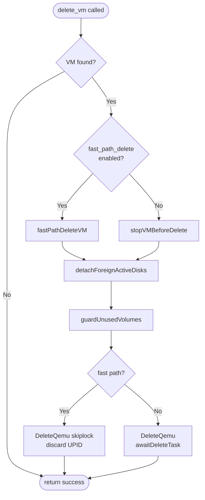
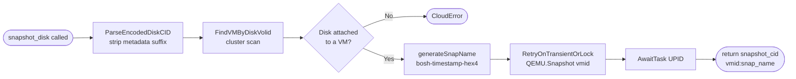

# CPI Methods Reference

The BOSH PVE CPI implements the full BOSH CPI v2 specification: 21 canonical methods plus `update_disk`, a PVE-specific extension inherited from the prior implementation.

The CPI communicates over JSON-RPC on stdin/stdout. Each invocation handles one request and exits. Logs go to stderr.

---

## BOSH CPI v2 Differences from v1

These changes apply when using CPI v2 (i.e., when the stemcell's `api_version` field is 2):

- `configure_networks` is removed. Networks are configured only at `create_vm` time.

- `create_vm` returns `[vm_cid, networks_with_mac]` — an array — instead of the v1 bare string `vm_cid`.

- `attach_disk` returns disk hints (e.g., `{"path": "/dev/sdd"}`) instead of void.

- Agent settings are injected into the VM's ConfigDrive at `create_vm` time. With `api_version: 2` stemcells, the agent reads from the IaaS metadata service directly; no registry is involved.

---

## Info

### `info`

**Type:** Required v2

**Args:** none

**Returns:** `Hash` — `{ "api_version": 2, "stemcell_formats": ["openstack-qcow2", "openstack-raw", "pve-qcow2", "general-qcow2", "general-raw"] }`

**Errors:** none

**Notes:** The Director calls `info` first to determine the CPI's API version and supported stemcell formats. This CPI always returns `api_version: 2`.

The CPI advertises `openstack-qcow2` and `openstack-raw` because OpenStack qcow2/raw stemcells are byte-compatible with what PVE imports via `qm importdisk` — PVE treats the format name opaquely; only the on-disk image bytes matter. Operators running existing `bosh-openstack-kvm-*` stemcells can upload them directly without conversion. The `pve-*` and `general-*` aliases remain accepted for forward compatibility.

---

## Stemcell

### `create_stemcell`

**Type:** Required v2

**Args:**

- `args[0]` (String): `image_path` — absolute path to the extracted stemcell image file on the local filesystem
- `args[1]` (Hash): `cloud_properties` — parsed `cloud_properties` section from `stemcell.MF`

**Returns:** `String` — `stemcell_cid`

**Errors:** `Bosh::Clouds::CloudError` on PVE API failure or storage error

**Notes:** The CPI uploads the disk image to `stemcell_storage` as a qcow2 file under the `import` content type. If the image is a gzip+tar tarball (as produced by the BOSH stemcell builder), the CPI extracts the disk image before uploading. The CPI computes a SHA-256 of the disk image and builds a content-addressed filename:

```
bosh-stemcell-<name>-<version>-<sha8>.qcow2
```

After upload, the CPI creates a frozen PVE template VM from the qcow2 in the template VMID range and tags it with `bosh-stemcell-sha-<sha8>`. For CPI-owned images (heavy and light-fetch), the CPI deletes the intermediate upload volume after freezing the template. For operator-preuploaded light stemcell images, the upload volume is preserved.

Template creation is idempotent: if a template VM named `bosh-stemcell-<name>-<version>` already exists, its VMID is reused.

The returned `stemcell_cid` is `template:<vmid>` (e.g. `template:6042`), identifying the frozen template VM.

`cloud_properties` must include `name` and `version`; both are required to build the deterministic template name. `stemcell_storage` must be a shared storage pool accessible from all cluster nodes.

**Light stemcell cloud_properties:**

The following `cloud_properties` keys select the image source. They are mutually exclusive — set at most one:

| Key | Type | Description |
|---|---|---|
| `image_id` | String | Pre-uploaded volume CID in PVE (`<storage>:import/<file>`). The operator has already placed the image in PVE storage. The CPI does not fetch or verify the image bytes; the volume is used directly. |
| `image_url` | String | Remote URL (https, s3, bosh+blobstore, oci) from which the CPI fetches the image on the Director host and then uploads to PVE. Optional `image_url_auth` provides per-stemcell credentials. |
| `source_url` | String | Remote URL that PVE downloads server-side (requires PVE 7.2+). The CPI issues a single `POST /nodes/{node}/storage/{storage}/download-url` request; PVE streams the bytes directly without the CPI buffering them locally. When `sha256` is also set, the CPI forwards the checksum to PVE, which verifies it server-side and fails the task on a mismatch; when `sha256` is absent, no checksum is sent and the CPI logs a weak-identity warning. Use this to avoid routing large image bytes through the Director host. |

When none of these keys is set, `create_stemcell` uploads the local tarball extracted from `image_path` (the standard heavy-stemcell path).

---

### `delete_stemcell`

**Type:** Required v2

**Args:**

- `args[0]` (String): `stemcell_cid` — CID returned by `create_stemcell`

**Returns:** `null`

**Errors:** `Bosh::Clouds::CloudError` on PVE API failure

**Notes:** Routes on the stemcell CID format:

- `template:<vmid>` — destroys the template VM with `purge=true` (removes all associated disks). Idempotent: an absent VM is treated as success.
- `<storage>:import/<filename>` — deletes the qcow2 upload volume. Absent volumes are treated as success.
- `light:...` — no-op (operator-managed image; the CPI never deletes it).
- Integer-only CIDs — no-op (pre-upgrade legacy scrub).

From the Director's perspective a running VM has no lifecycle dependency on the template it was cloned from, so deleting the stemcell never disturbs deployed VMs. The block-level relationship depends on the clone type: a full clone is an independent byte copy, while a linked clone — the default on copy-on-write backends — shares the template's read-only base image and stays bound to it for as long as it lives. That dependency is safe by construction. PVE's storage layer refuses to remove a base volume while any linked clone still references it, and `delete_stemcell` destroys a `template:` VM only when it is the last stemcell reference (tracked in the template's `stemcell_refs`), preserving it otherwise. A base can therefore never be pulled out from under a VM that still needs it.

---

## VM

### `create_vm`

**Type:** Required v2

**Args:**

- `args[0]` (String): `agent_id` — ID the Director has selected for the BOSH agent
- `args[1]` (String): `stemcell_cid` — CID of the stemcell to clone. `template:<vmid>` for stemcells uploaded by this CPI version; `<storage>:import/<filename>` or `light:...` for pre-upgrade stemcells (the CPI opportunistically upgrades to the clone path)
- `args[2]` (Hash): `cloud_properties` — resource pool properties from the manifest (e.g., `cpu`, `memory`, `ephemeral_disk_size_mb`)
- `args[3]` (Hash): `networks` — NetworkSpec map; each key is a network name, each value has `type`, `ip`, `netmask`, `gateway`, `dns`, and `cloud_properties`
- `args[4]` (Array of String): `disk_cids` — persistent disks likely to be attached (for placement optimization)
- `args[5]` (Hash): `environment` — resource pool env merged with BOSH-appended properties

**Returns:** `Array` — `[vm_cid, networks_with_mac]`

**Errors:**

- `Bosh::Clouds::VMCreationFailed` if VM creation fails (CPI must clean up partial resources)
- `Bosh::Clouds::CloudError` on PVE API failure

**Notes:** Creates a VM by cloning a stemcell template. The `stemcell_cid` drives dispatch:

- **`template:<vmid>`** — clones the identified template VM directly. On linked-clone-capable storage backends (`dir`, `nfs`, `cifs`, `zfspool`, `lvmthin`, `rbd`, `cephfs`), this is a copy-on-write clone that completes in seconds. On `lvm`-thick storage a full clone is performed. Clone type is controlled by `pve.clone_mode` (default `auto`).
- **Pre-upgrade CID** (`<storage>:import/<file>` or `light:...`) — the CPI extracts the sha8 from the filename and searches for a matching template by PVE tag. If a template is found, it clones it (fast path). If not, it falls back to the original `import-from=` block-copy (slow path, roughly four minutes for a typical stemcell). Re-upload is not required for pre-upgrade stemcells.

A VMID is allocated from `[vmid_range_start, vmid_range_end]` (default: `[100, 8999]`). After the clone task completes, the CPI configures NICs, attaches any pre-existing persistent disks, writes agent settings, and starts the VM. The returned `networks_with_mac` hash augments the input networks map with MAC addresses PVE assigned.

`cloud_properties.tags` (map of `key: value`) is applied to the PVE tags field on the new VM as sanitized `<key>--<value>` entries. The BOSH-managed `director--`, `deployment--`, and `job--` triple is not known at create time and is added later by `set_vm_metadata`. See [Custom Tags](configuration.md#custom-tags).

**Disk sizing:** `cloud_properties.root_disk_size` (Integer, GB) sets an explicit root disk size at clone time. `cloud_properties.ephemeral_disk_size_mb` (Integer, MB) attaches a dedicated ephemeral disk in addition to the root disk. When `ephemeral_disk_size_mb` is omitted, the BOSH agent carves ephemeral space from the root disk at boot. Both fields are optional.

**VIP and firewall:** `cloud_properties.allowed_address_pairs` (list of IP strings) seeds PVE `ipfilter-netN` ipsets with the VM's primary IP and the listed VIPs across all firewalled NICs. This enables VIP/VRRP use cases. Requires `pve.vm_firewall` to be enabled.

**PCI passthrough:** `cloud_properties.pci_passthroughs` (list of objects) passes host PCI devices through to the VM:

- Each object has a single field: `address` (String) — the PCI device address in `DDDD:BB:SS.F` format (e.g. `"0000:01:00.0"`), matching the address the PVE node's hardware PCI list reports.
- The CPI validates all addresses before creating any VM resource. An invalid or empty address is a non-retriable error.
- At placement time, the CPI restricts candidate nodes to those that expose all requested addresses via `/nodes/{node}/hardware/pci`.
- A strict single-node HA pin (`bosh-na-<vmid>`) is applied automatically to prevent live migration, which is incompatible with PCI passthrough. This pin is applied regardless of whether `pve.placement.pin_az_via_ha_rules` is set.
- The host must have IOMMU enabled. IOMMU group isolation is the operator's responsibility; the CPI does not validate group boundaries.

**Router/NAT VMs:** Two `cloud_properties` fields support VMs that forward traffic between networks:

- `cloud_properties.advertised_routes` (list of objects) — SDN subnets to register for this VM. Each object has:
  - `vnet` (String) — the PVE SDN vnet name (1–8 lowercase alphanumeric characters, e.g. `"vnet01"`)
  - `destination` (String) — the CIDR that should be routed via this VM's interface (e.g. `"10.64.0.0/16"`)

  The CPI creates each subnet via `POST /cluster/sdn/vnets/{vnet}/subnets` and calls `PUT /cluster/sdn` to commit the change to the FRR-managed logical-router fabric. Subnets that already exist are accepted without error (idempotent). On rollback, the CPI removes created subnets on a best-effort basis and logs any it could not remove for operator cleanup. Requires an EVPN SDN zone — the only zone type with a routing control plane; on any other zone type PVE may accept the subnet but injects no route, so the CPI warns and continues — and SDN write permissions. Each route also stamps a provenance tag (`advrt-<vnet>-<hash>`) on the VM so `delete_vm` can remove the recorded subnets (refcounted against other live VMs carrying the same tag, entirely fail-open). See [Networks — advertised_routes](networks.md#vm-level-advertised_routes).

- `networks.<name>.cloud_properties.ip_forwarding` (Boolean, default `false`) — set on individual NIC entries in the `networks` map. When `true`, the CPI disables the PVE firewall flag on that NIC and excludes the NIC from `ipfilter-netN` ipset seeding. Use on router/NAT-facing NICs that must forward packets across network boundaries without per-packet IP filtering.

**Ephemeral disk retention:** `cloud_properties.retain_ephemeral_on_delete` (Boolean, default `false`) — when `true`, the CPI stamps the tag `bosh-retain-ephemeral` on the VM at create time. On `delete_vm`, this tag suppresses destruction of the ephemeral disk: the disk slot is unlinked from the VM config (moved to `unusedN` then removed without freeing storage), and the backing volume survives. The WARN log names the volume for operator recovery. When `nil` or `false`, the ephemeral disk is destroyed with the VM. See [delete_vm](#delete_vm) for the interaction with this tag.

**Hotplug:** Two cloud_properties keys fine-tune the PVE hotplug token string after the base value is resolved from `cloud_properties.hotplug`, vm_type profile, and `pve.hotplug` config:

- `cloud_properties.cpu_hotplug` (Boolean, optional) — `true` ensures the `"cpu"` token is present; `false` removes it; absent leaves the resolved string unchanged.
- `cloud_properties.memory_hotplug` (Boolean, optional) — `true` ensures the `"memory"` token is present and forces `numa=1` (PVE requires NUMA enabled to allocate DIMM slots for memory hotplug). `false` removes the `"memory"` token. `true` overrides an explicit `cloud_properties.numa: false`.

**Lifecycle hooks:** After VM creation, lifecycle hooks fire in order (`notes_audit`, `lb_register`, `external_command`, `audit_log`). On failure, the `lb_register` hook deregisters the VM from the load balancer as part of the rollback chain. Hook configuration is documented in [configuration.md](configuration.md).

**Health gate:** When `pve.health_check.enabled` is `true`, `create_vm` polls for an agent response before returning. `pve.health_check.timeout_sec` controls the poll timeout. If the agent does not respond in time, the VM is destroyed via the standard rollback path.

**Placement:** The CPI selects a node using AZ map, anti-affinity scoring, DLB integration, and post-selection fallback. When `pve.placement.pin_az_via_ha_rules` is enabled, a PVE HA node-affinity rule (`bosh-na-{vmid}`) pins the VM to its AZ node set, surviving DLB rebalance and HA failover. See [dlb-aware-placement.md](dlb-aware-placement.md) and [configuration.md](configuration.md) for tuning options.

**Failure inspection:** `pve.debug.keep_failed_vms=true` preserves the VM and skips rollback on `create_vm` failure, for operator inspection.

---

### `delete_vm`

**Type:** Required v2

**Args:**

- `args[0]` (String): `vm_cid` — CID returned by `create_vm`

**Returns:** `null`

**Errors:** `Bosh::Clouds::CloudError` if deletion is not certain (to prevent orphaned VMs)

**Notes:** Stops the VM if running, then destroys it. Two destroy paths are available:

- **Sync path** (default): issues `DeleteQemu` and awaits the returned UPID task to completion before returning. The Director never observes a still-pending volume on the storage backend.
- **Fast path** (`pve.fast_path_delete=true`): issues stop and destroy fire-and-forget, discards the UPID, and returns immediately. Eventual consistency — `has_vm` may briefly still see the VM while PVE's async destroy runs. The `bosh-deleting` tag marks such VMs; `sweepFastDeleteStragglers` reaps stalled fast-path destroys on the next `delete_vm` call.

Both paths protect persistent disks before destroying the VM. `detachForeignActiveDisks` detects disks whose volume ID belongs to a different VMID (foreign disks), detaches them from the VM config, and preserves them. Destroy is blocked (fail-closed, retriable) if a detach cannot be confirmed. `guardUnusedVolumes` then checks the `unusedN` slots and refuses to proceed if a persistent volume cannot be confirmed absent from storage. If the VM does not exist, the call returns success.

**Ephemeral disk retention:** When the VM carries the `bosh-retain-ephemeral` tag (set by `cloud_properties.retain_ephemeral_on_delete: true` at `create_vm` time), `delete_vm` unlinks the ephemeral disk slot from the VM config without freeing storage, then proceeds to destroy the VM. The ephemeral volume survives and is logged at WARN level for operator recovery. Without this tag, the ephemeral disk is destroyed with the VM.



---

### `has_vm`

**Type:** Required v2

**Args:**

- `args[0]` (String): `vm_cid`

**Returns:** `Boolean`

**Errors:** `Bosh::Clouds::CloudError` on PVE API failure

**Notes:** Used by the BOSH cloudcheck tool to detect orphaned or missing VMs.

---

### `reboot_vm`

**Type:** Required v2

**Args:**

- `args[0]` (String): `vm_cid`

**Returns:** `null`

**Errors:** `Bosh::Clouds::CloudError` on PVE API failure

**Notes:** Reboots the VM using the strategy set by `pve.reboot_mode` (default `soft`).

- **soft** (default): sends a graceful ACPI reboot via the PVE API and waits up to `pve.reboot_timeout` seconds (default 60) for the guest to respond. If the guest does not shut down in time, or the reboot call fails for any reason other than a 404, the CPI falls back to a hard reset. A 404 response raises `Bosh::Clouds::CloudError`.
- **hard**: issues an immediate hard reset (power cycle) with no grace period. This was the only behavior before the `reboot_mode` option was introduced.

If the VM is stopped when `reboot_vm` is called, the CPI starts it so the VM ends up running, matching the BOSH expectation. The BOSH wire contract is unchanged: `reboot_vm` accepts only `vm_cid`.

---

### `set_vm_metadata`

**Type:** Required v2

**Args:**

- `args[0]` (String): `vm_cid`
- `args[1]` (Hash): `metadata` — arbitrary key-value pairs; the CPI must not require specific keys

**Returns:** `null`

**Errors:** `Bosh::Clouds::CloudError` on PVE API failure

**Notes:** Stores metadata as PVE VM tags and/or description. The Director passes standard keys such as `director`, `deployment`, `instance_group`, `job`, `id`, `name`, `index`, and `created_at`. Do not override or filter these.

The handler reads the VM's existing PVE tags, strips entries with the reserved prefixes `director--`, `deployment--`, and `job--`, rebuilds the triple from the incoming metadata, and merges the result with any operator-supplied custom tags already on the VM. Custom tags from `create_vm` therefore survive Director re-syncs without manual reconciliation. An `index--<value>` tag is also emitted alongside the `director--`, `deployment--`, and `job--` entries. Tag values are truncated so the joined PVE tags string stays within 255 characters.

As a side effect, `set_vm_metadata` renames the PVE VM display name to `<vm_prefix>-<deployment>-<job>-<index>` (e.g., `cpi-cf-api-0`). When `pve.vm_prefix` is empty, the prefix segment is omitted. This makes BOSH instances filterable by name in the PVE UI. The rename happens on every `set_vm_metadata` call; the name written at `create_vm` time (`vm-<vmid>`) is overwritten.

---

### `calculate_vm_cloud_properties`

**Type:** Optional v2

**Args:**

- `args[0]` (Hash): `desired_instance_size`
  - `cpu` (Integer): virtual core count
  - `ram` (Integer): RAM in MiB
  - `ephemeral_disk_size` (Integer): ephemeral disk size in MB
  - `storage` (String, optional): overrides `pve.vm_storage` for this call only; the returned `target_storage` reflects it

**Returns:** `Hash` — `cloud_properties` suitable for use in a BOSH VM type

**Errors:** `Bosh::Clouds::NotSupported` when no node satisfies the request. The message names the requested cpu/ram and storage, and lists CPU/RAM-qualifying nodes that failed the storage check.

**Notes:** Selects a node storage-first: only nodes where the effective storage is active and `images`-capable are considered; among those, the node with the most free RAM wins. This prevents placing a VM on a node where the storage is unavailable, which previously failed later in `create_vm` with an opaque PVE error. Returns the minimum PVE `cloud_properties` (cores, sockets, memory, target node, target storage) satisfying the requested size. May oversize. Used by the BOSH CLI `interpolate` and `env` commands.

---

## Disk

### `create_disk`

**Type:** Required v2

**Args:**

- `args[0]` (Integer): `size` — disk size in MiB
- `args[1]` (Hash): `cloud_properties` — from the deployment manifest disk pool
- `args[2]` (String): `vm_cid` — VM where the disk will likely be attached (for placement optimization)

**Returns:** `String` — `disk_cid`

**Errors:** `Bosh::Clouds::CloudError` on storage or PVE API failure

**Notes:** Allocates a disk on `disk_storage`. The disk CID encodes the storage pool and disk identifier. Disks use VMIDs in `[disk_vmid_range_start, disk_vmid_range_end]` (default `[9000, 29999]`).

`cloud_properties.tags` (map of `key: value`) is applied to the PVE tags field on the VM identified by `vm_cid`. PVE has no native disk-volume tag field — tags ride on the hosting VM. When `vm_cid` is empty (Director is creating an unattached disk), the tags are deferred and applied on the next `set_disk_metadata` call. See [Custom Tags](configuration.md#custom-tags).

`cloud_properties.retain_on_delete` (Boolean, optional) — when `true`, the CPI encodes `retain_on_delete=1` into the disk CID metadata. On `delete_vm`, this flag causes the disk to appear in WARN logs as operator-retained rather than incidentally foreign. Persistent disks are already protected by the foreign-VMID guard; this field adds an explicit audit trail. The encoded intent is carried in the disk CID and is readable without querying PVE VM config.

---

### `delete_disk`

**Type:** Required v2

**Args:**

- `args[0]` (String): `disk_cid`

**Returns:** `null`

**Errors:** `Bosh::Clouds::CloudError` if deletion is not certain (to prevent orphaned disks)

**Notes:** The disk must be detached before deletion. The Director calls `detach_disk` first.

**Parked disk strategy:** When `pve.detached_disk_strategy: parked` is configured, detached disks are held on dedicated parker VMs (VMID range 90000–90999 by default) rather than left free-floating. When `delete_disk` is called, the CPI first unparks the disk from its parker VM before deleting the volume. Unpark failure returns a retriable error; the disk remains safely on the parker VM and the next Director retry re-attempts the unpark. When the strategy is not active, `delete_disk` proceeds directly to volume deletion with no extra API calls.

---

### `has_disk`

**Type:** Required v2

**Args:**

- `args[0]` (String): `disk_cid`

**Returns:** `Boolean`

**Errors:** `Bosh::Clouds::CloudError` on PVE API failure

**Notes:** Used by cloudcheck to detect orphaned or missing persistent disks.

The disk CID may carry an optional encoded metadata suffix (see [Disk CID Encoding](persistent-disks.md#disk-cid-encoding)); the CPI strips the suffix before any PVE API call.

- Returns `false` (not an error) when the volume is absent or when PVE returns HTTP 404.

- For block-backed storage backends (lvmthin, zfspool), PVE may return HTTP 500 with a message such as "Failed to find logical volume". The CPI treats this as `false` via `ExistsTolerant`, giving operators on these backends a clean `has_disk=false` rather than a retriable error when a disk has been deleted.

- For local storage backends, the CPI scans all cluster nodes via `NodeForExisting` to locate the owning node before querying storage content. When no node holds the volume, the scan returns `false`.

---

### `attach_disk`

**Type:** Required v2

**Args:**

- `args[0]` (String): `vm_cid`
- `args[1]` (String): `disk_cid`

**Returns:** `Hash` — disk hints, e.g. `{"path": "/dev/sdd"}`

**Errors:** `Bosh::Clouds::CloudError` on PVE API failure

**Notes:** Attaches the disk to the VM's PVE config and awaits the PVE task. Returns the kernel device path assigned to the disk. This is a v2 change: v1 returned void and updated the registry instead. A snapshot pre-flight guard runs first: if the VM has snapshots, attach is rejected with an actionable error, because a disk attached after a snapshot is invisible to that snapshot on rollback. Set `pve.allow_disk_ops_with_snapshots` to bypass. See [Snapshot guard on disk operations](#snapshot-guard-on-disk-operations).

**Parked disk strategy:** When `pve.detached_disk_strategy: parked` is configured, `attach_disk` runs an unpark step before the snapshot guard and slot selection. The CPI detaches the disk from its parker VM, making the volume free-floating so the normal attach path can proceed. Unpark failure returns a retriable error; the disk remains safely parked and the Director retries. When the strategy is not active, no extra API calls are made.

---

### `detach_disk`

**Type:** Required v2

**Args:**

- `args[0]` (String): `vm_cid`
- `args[1]` (String): `disk_cid`

**Returns:** `null`

**Errors:** `Bosh::Clouds::CloudError` on PVE API failure

**Notes:** Removes the disk from the VM's PVE config and awaits the PVE task. The Director notifies the agent of the detach directly; the CPI makes no additional calls after the PVE task completes. A snapshot pre-flight guard runs first: if the VM has snapshots that reference the disk, detach is rejected with an actionable error naming the blocking snapshots (PVE would otherwise reject it with a raw message). Set `pve.allow_disk_ops_with_snapshots` to bypass. See [Snapshot guard on disk operations](#snapshot-guard-on-disk-operations).

**Parked disk strategy:** When `pve.detached_disk_strategy: parked` is configured, `detach_disk` parks the disk on a dedicated parker VM after the physical detach completes. A park failure returns a retriable error; the disk remains free-floating and the Director retries. On retry, if the disk is already parked, the handler returns success without making further API calls (idempotent). If the disk arrives at `detach_disk` already in the detached state (a retry scenario), the CPI checks whether it is already parked and re-parks it if not. Parker VMs use VMIDs in the range configured by `pve.parked_disk_vmid_range_start` and `pve.parked_disk_vmid_range_end` (default 90000–90999). See [persistent-disks.md](persistent-disks.md) for the full parked disk lifecycle.

---

### `get_disks`

**Type:** Required v2

**Args:**

- `args[0]` (String): `vm_cid`

**Returns:** `Array of String` — disk CIDs currently attached to the VM

**Errors:** `Bosh::Clouds::CloudError` on PVE API failure

**Notes:** Used by cloudcheck to reconcile disk attachment state.

The following slots are always excluded from results: `scsi0` (SCSI root disk), `virtio0` (virtio root disk), `ide0`, and `ide2`. Disks whose PVE option string contains `media=cdrom` are excluded regardless of slot. Returned CIDs are bare volids (`<storage>:<volume>`) without option strings.

The CPI locates the VM via a cluster scan (`FindVMNodeViaCluster`) before fetching its config, so the result is authoritative after an HA failover.

---

### `snapshot_disk`

**Type:** Required v2

**Args:**

- `args[0]` (String): `disk_cid`
- `args[1]` (Hash): `metadata` — key-value snapshot annotations

**Returns:** `String` — `snapshot_cid`

**Errors:** `Bosh::Clouds::CloudError` on PVE API failure

**Notes:** PVE has no per-disk snapshot primitive. The CPI locates the VM currently hosting the disk and creates a VM-level snapshot on it, so all disks on that VM are included. The returned `snapshot_cid` has the form `<vmid>:<snap_name>`, where `vmid` is the ID of the hosting VM at snapshot time — not the disk CID. Example: `100:bosh-1718000000-ab12ef34`. The snap name is `bosh-<unix_timestamp>-<8hex>`.

The disk must be attached to exactly one VM at call time. Calling `snapshot_disk` on an unattached disk returns a `CloudError`.

Only the `description` key from the metadata hash is forwarded to PVE as the snapshot description; all other keys are ignored. The snapshot and its underlying task are retried on transient transport errors and storage lock timeouts via `RetryOnTransientOrLock`.



---

### `delete_snapshot`

**Type:** Required v2

**Args:**

- `args[0]` (String): `snapshot_cid`

**Returns:** `null`

**Errors:** `Bosh::Clouds::CloudError` on PVE API failure

**Notes:** Deletes the VM snapshot named in `snapshot_cid`. The format is `<vmid>:<snap_name>` (matching the value returned by `snapshot_disk`). The CPI locates the VM via a cluster scan before issuing the delete, so the call works after an HA failover.

Idempotent: a missing snapshot (HTTP 404) or a missing VM returns success, matching BOSH Director expectations for delete operations that may be retried after partial failures.

PVE deletes snapshots asynchronously. After the delete call returns, the CPI waits up to 120 seconds for the snapshot to disappear (`WaitForSnapshotAbsent`) before returning success. This prevents spurious snapshot-guard failures on immediately subsequent `detach_disk` calls, which reject operations when live snapshots exist.

---

### `resize_disk`

**Type:** Required v2

**Args:**

- `args[0]` (String): `disk_cid`
- `args[1]` (Integer): `new_size` — target size in MiB

**Returns:** `null`

**Errors:**

- `Bosh::Clouds::NotSupported` when `new_size` is less than the current disk size (shrink rejected; Director falls back to create-new + copy-data)
- `Bosh::Clouds::CloudError` on PVE API failure

**Notes:** The Director calls this only when `director.enable_cpi_resize_disk: true`. The disk must be attached to a VM at call time; the handler uses `FindVMByDiskVolid` to locate the hosting VM and determine the current disk size before issuing the resize. If the disk is not attached, the call errors. A snapshot pre-flight guard runs first: if the VM has snapshots, resize is rejected with an actionable error. PVE cannot resize disks on LVM-thin or ZFS storage while snapshots exist; on qcow2/raw the resize would succeed but leave snapshot data inconsistent. Set `pve.allow_disk_ops_with_snapshots` to bypass. See [Snapshot guard on disk operations](#snapshot-guard-on-disk-operations).

---

#### Snapshot guard on disk operations

`attach_disk`, `detach_disk`, and `resize_disk` run a snapshot pre-flight check before mutating the VM. If the VM has one or more snapshots, the operation is rejected with an error that names the VM, node, and snapshot names, and states the remediation: delete the snapshots first, or set `pve.allow_disk_ops_with_snapshots`. This converts opaque PVE rejections (detach, resize) and silent data-integrity hazards (attach) into clear, actionable errors.

Two settings tune the behavior:

- `pve.allow_disk_ops_with_snapshots` (default `false`) — when `true`, the guard is bypassed and the operation proceeds despite snapshots. For emergency recovery only; snapshot state becomes inconsistent afterward.

- `pve.require_snapshot_check_pass` (default `false`) — controls behavior when the snapshot check itself cannot reach PVE. Default is fail-open: log a warning and proceed. Set `true` to fail-closed: abort the operation if the snapshot list cannot be fetched.

---

### `set_disk_metadata`

**Type:** Required v2

**Args:**

- `args[0]` (String): `disk_cid`
- `args[1]` (Hash): `metadata` — key-value pairs; reserved keys include `instance_id`, `instance_index`, `attached_at`, `instance_group`, `deployment`, `director`

**Returns:** `null`

**Errors:** `Bosh::Clouds::CloudError` on PVE API failure

**Notes:** PVE has no native disk metadata. The CPI stashes metadata as a JSON block in the description of the VM currently holding the disk. If the disk is detached at call time, the CPI logs a warning and returns success without storing the metadata.

The metadata is stored using a sentinel comment embedded in the VM description:

```
<!--BOSH:{"bosh_disk_metadata":{"<disk_cid>":{...metadata...}}}-->
```

Any non-BOSH content in the VM description before the sentinel is preserved. The sentinel payload distinguishes `bosh_disk_metadata` (regular key-value metadata) from `bosh_disk_tags` (operator tag entries stored under `bosh_disk_tags[<disk_cid>]`).

If the same disk volume is found attached to two or more VMs, the call returns a `CloudError` with the message "ambiguous disk attachment". The CPI scans all cluster VMs to locate the hosting VM; if no VM holds the disk, the call returns success with a warning.

If `metadata` contains a `tags` sub-object (map of `key: value`), the entries are extracted from the regular `bosh_disk_metadata` payload, written to the hosting VM's PVE tags field as sanitized `<key>--<value>` entries, and recorded separately in the description sentinel under `bosh_disk_tags[<disk_cid>]`. Existing tag entries whose key prefix collides with a new tag are replaced; other entries are preserved. See [Custom Tags](configuration.md#custom-tags).

---

### `update_disk`

**Type:** Extension (PVE-specific)

**Args:**

- `args[0]` (String): `disk_cid`
- `args[1]` (Hash): `update_spec` — optional fields:
  - `size` (Integer): new size in MiB
  - `iothread` (Boolean): enable per-disk I/O thread
  - `cache` (String): PVE cache mode (`none`, `writeback`, `writethrough`, etc.)
  - `discard` (String): discard/TRIM mode (`ignore` or `on`)
  - `ssd` (Boolean): expose disk as SSD
  - `backup` (Boolean): include in backups
  - `mbps_rd` (Integer): read throughput cap in MB/s (0 = remove limit)
  - `mbps_wr` (Integer): write throughput cap in MB/s (0 = remove limit)
  - `iops_rd` (Integer): read IOPS limit (0 = remove limit)
  - `iops_wr` (Integer): write IOPS limit (0 = remove limit)

**Returns:** `null`

**Errors:** `Bosh::Clouds::CloudError` on PVE API failure

**Notes:** Not part of the canonical BOSH CPI v2 specification. Provides full PVE disk option updates beyond what `resize_disk` covers. When `size` is provided, the same shrink-rejection rule as `resize_disk` applies.

---

## Network

The CPI implements `create_network` and `delete_network` for BOSH managed networks. Two paths are available: **SDN** (PVE SDN vnets via the cluster API) and **bridge** (Linux bridges via the nodes API). The active path is selected by `network_mode` in config and by the `cloud_properties` keys in the network spec. Most deployments pre-configure networks in PVE and never call these methods; they run only when the BOSH cloud-config marks a network as `managed: true`.

For the full `cloud_properties` schema, zone/vnet/subnet semantics, naming rules, and worked manifest examples, see [Network configuration](networks.md).

---

### `create_network`

**Type:** Optional v2

**Args:**

- `args[0]` (Hash): `network_spec`
  - `type` (String): `"manual"` or `"dynamic"` — required
  - `range` (String): CIDR, e.g. `"10.0.0.0/24"` — optional
  - `gateway` (String): gateway IP — optional
  - `netmask_bits` (Integer): prefix length — optional
  - `cloud_properties` (Hash): PVE-specific keys:
    - `zone` (String): PVE SDN zone name; overrides `pve.sdn_zone` config. When both are empty and zone auto-management is on (the default), the turnkey zone `bosh` is used
    - `zone_type` (String): zone type used when the CPI creates the zone (`simple` | `vlan` | `qinq` | `vxlan` | `evpn`); overrides `pve.sdn_zone_type` config (default `vxlan`). A pre-existing zone's actual PVE type governs regardless of this value; `evpn` zones are never CPI-created
    - `vnet_tag` (Integer): explicit VNI/VLAN tag for the vnet (1–16777215; 1–4094 for `vlan`/`qinq`); when absent, tag-carrying zone types auto-allocate from the `pve.sdn_vni_range_start`/`_end` band (default 5000–5999)
    - `vnet` (String): PVE vnet name — max 8 chars, `[a-z0-9]`; required for the SDN path
    - `bridge` (String): Linux bridge interface name, e.g. `"vmbr1"`; required for the bridge path when `pve.network_bridge` is not set
    - `node` (String): PVE node name for bridge operations; falls back to `pve.node` config

**Returns:** `[network_id, address_properties, cloud_properties_out]`

| Element | SDN path | Bridge path |
|---|---|---|
| `network_id` | vnet name | bridge interface name |
| `address_properties` | `{range, gateway, reserved: []}` | `{range, gateway, reserved: []}` |
| `cloud_properties_out` | `{zone, vnet, bridge: <vnet>}` | `{bridge, node}` |

Note: on the SDN path `bridge` equals `vnet` because PVE realizes every vnet — whatever the zone type — as a Linux bridge with the same name on each node. The `bridge` key in `cloud_properties_out` is present so `create_vm` NIC attachment works without additional configuration.

**Path selection:**

The handler picks a path from `pve.network_mode` (default `"sdn"`):

| `network_mode` | Path taken |
|---|---|
| `"sdn"` (default) | Always SDN |
| `"bridge"` (opt-in) | Always bridge |
| `"auto"` (opt-in, legacy heuristic) | SDN when `cloud_properties.zone` or `cloud_properties.vnet` is set, or `pve.sdn_zone` is configured; bridge otherwise |

**Behavior — SDN path:**

1. Resolve zone: `cloud_properties.zone` → `pve.sdn_zone` → the turnkey zone `bosh` when auto-management is on (the default); an error only when no zone is named and auto-management is off.
2. Probe `GetSdnZones` for the zone. If present, its actual PVE type governs vnet tagging. If absent and the resolved type is `evpn`, fail fast — the operator must create the EVPN zone and its controller. Otherwise, if `pve.sdn_auto_manage_zone` is on (the default), create the zone using the resolved `zone_type` — for `vxlan`, with peers from `pve.sdn_vxlan_peers` or derived from the online cluster nodes, and `pve.sdn_zone_mtu` when set. If absent and auto-management is off, return a `CloudError`.
3. Probe `GetSdnVnets` for the vnet. If absent, resolve the tag (explicit `vnet_tag`, else auto-allocated VNI for tag-carrying zone types) and call `CreateSdnVnets`. A 409 conflict (concurrent create) is treated as success. Pre-existing vnets never consume a VNI.
4. If `network_spec.range` is set, call `CreateSdnVnetsSubnets` with the CIDR and gateway. A 409 conflict is treated as success.
5. Call `UpdateSdn` to commit staged SDN changes to the data plane, awaiting the returned task for async zone types (`vlan`/`vxlan`/`qinq`/`evpn` — with the vxlan default this await is the normal path).
6. Return `[vnet, {range, gateway, reserved:[]}, {zone, vnet, bridge: vnet}]`.

On apply failure, the handler attempts best-effort rollback (delete subnet, vnet, and zone if created in this call) before returning the error.

**Behavior — bridge path:**

1. Resolve node: `cloud_properties.node` → `pve.node` → error if neither is set.
2. Call `CreateNetwork(node, {iface: bridge, type: "bridge", autostart: true})`. A 409 conflict (bridge already exists) is treated as success.
3. Call `UpdateNetwork(node)` to reload the node's network configuration.
4. Return `[bridge, {range, gateway, reserved:[]}, {bridge, node}]`.

**Idempotency:**

- SDN path: `GetSdnVnets` is probed before each create. Re-calling with the same `vnet` and `zone` returns the same result without error.
- Bridge path: a 409 response from `CreateNetwork` is treated as success. `UpdateNetwork` is always called.

**Zone lifecycle (SDN path):**

Zone auto-management is on by default (`pve.sdn_auto_manage_zone`, default `true`): the CPI creates the SDN zone if it does not exist — EVPN zones excepted, which are always operator-created. The CPI does not track zone ownership between calls; instead it applies a stateless safety rule on deletion (see `delete_network` below). `create_network` is safe to retry regardless of zone state.

**Errors:**

- `CloudError`: zone not found and `sdn_auto_manage_zone=false`
- `CloudError`: zone absent and the resolved zone type is `evpn` (never CPI-created)
- `CloudError`: a `vxlan` zone create with zero derivable peers (set `pve.sdn_vxlan_peers`)
- `CloudError`: VNI band exhausted, or an explicit `vnet_tag` out of range for the zone type
- `CloudError`: `cloud_properties.vnet` missing or invalid (>8 chars, non-`[a-z0-9]` characters) on the SDN path
- `CloudError`: neither `cloud_properties.zone`/`pve.sdn_zone` nor `cloud_properties.bridge`/`pve.network_bridge` is set and path cannot be determined
- `CloudError`: target node not set for bridge path
- `CloudError`: PVE API failure (zone create, vnet create, subnet create, `UpdateSdn`, bridge create, node reload)

---

### `delete_network`

**Type:** Optional v2

**Args:**

- `args[0]` (String): `network_id` — the value returned as `network_id` by `create_network` (vnet name for SDN, bridge name for bridge)

**Returns:** `null`

**Path selection:**

`delete_network` receives only the `network_id` string. It probes `GetSdnVnets(network_id)` to determine the path: if the vnet is found, the SDN path runs; if the probe returns 404, the bridge path runs.

**Behavior — SDN path:**

1. Probe `GetSdnVnets(network_id)`. If 404, return `null` (idempotent).
2. Extract zone name from the vnet response.
3. List and delete all subnets under the vnet (PVE requires subnets removed first). 404 on a subnet is treated as already-gone.
4. Delete the vnet. 404 is treated as already-gone.
5. Call `UpdateSdn` to commit the change.
6. Evaluate zone auto-delete (see rule below). If conditions hold, delete the zone and call `UpdateSdn` again.
7. Return `null`.

**Behavior — bridge path:**

1. Call `DeleteNetwork2(config.node, network_id)`. If 404, return `null` (idempotent).
2. Call `UpdateNetwork(config.node)` to reload.
3. Return `null`.

The bridge path uses `pve.node` from config. Per-bridge node assignment is not stored between `create_network` and `delete_network` calls; if `pve.node` is unset, `delete_network` returns a `CloudError` rather than succeeding silently with the bridge still present.

**Idempotency:**

Both paths are no-ops when the resource is already absent. `delete_network` can be called multiple times safely.

**Zone auto-delete safety rule:**

The CPI deletes the parent SDN zone during `delete_network` only when all of the following conditions hold:

1. `pve.sdn_auto_manage_zone` is enabled (the default).
2. The zone name does not equal `pve.sdn_zone` (the configured default zone is never auto-deleted). The turnkey zone `bosh` is deliberately not pinned — the CPI created it, so removing it with its last vnet is correct turnkey hygiene.
3. The zone is not an EVPN zone (operator-owned fabric, never CPI-deleted).
4. After the vnet is removed, `ListSdnVnets` filtered by zone returns zero remaining vnets.

If `ListSdnVnets` or the zone-type read fails, the zone is left intact to avoid deleting a zone the CPI cannot confirm is empty and CPI-deletable.

Residual risk: with auto-management on, any non-EVPN zone supplied via `cloud_properties.zone` that differs from `pve.sdn_zone` will be deleted when emptied. Operators who share a zone across deployments must either set `pve.sdn_zone` to pin it or set `sdn_auto_manage_zone: false`.

**Errors:**

- `CloudError`: `pve.node` unset on the bridge path
- `CloudError`: unexpected PVE API failure probing, deleting, or applying SDN changes
- `CloudError`: unexpected PVE API failure deleting bridge or reloading node network

---

## Method Summary

| # | Method | Group | Returns | v1→v2 Change |
|---|---|---|---|---|
| 1 | `info` | Info | Hash | Required; must return `api_version: 2` |
| 2 | `create_stemcell` | Stemcell | stemcell\_cid | No change |
| 3 | `delete_stemcell` | Stemcell | null | No change |
| 4 | `create_vm` | VM | [vm\_cid, networks] | Returns array (was bare string) |
| 5 | `delete_vm` | VM | null | No registry in v2 |
| 6 | `has_vm` | VM | Boolean | No change |
| 7 | `reboot_vm` | VM | null | No change |
| 8 | `set_vm_metadata` | VM | null | No change |
| 9 | `calculate_vm_cloud_properties` | VM | Hash | New in v2 |
| 10 | `create_disk` | Disk | disk\_cid | No change |
| 11 | `delete_disk` | Disk | null | No change |
| 12 | `has_disk` | Disk | Boolean | No change |
| 13 | `attach_disk` | Disk | disk\_hints Hash | Returns hints (was void) |
| 14 | `detach_disk` | Disk | null | No registry in v2 |
| 15 | `get_disks` | Disk | Array of String | No change |
| 16 | `snapshot_disk` | Disk | snapshot\_cid | No change |
| 17 | `delete_snapshot` | Disk | null | No change |
| 18 | `resize_disk` | Disk | null | No change |
| 19 | `set_disk_metadata` | Disk | null | No change |
| 20 | `update_disk` | Disk | null | Extension (PVE-specific) |
| 21 | `create_network` | Network | [id, addrs, props] | New in v2 (optional). Implemented — see [Network configuration](networks.md). |
| 22 | `delete_network` | Network | null | New in v2 (optional). Implemented — see [Network configuration](networks.md). |
| — | `configure_networks` | REMOVED | — | Removed in v2 |
