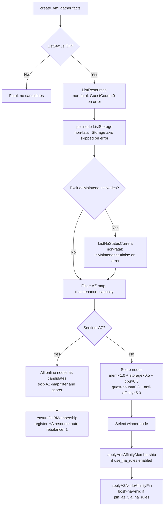

# DLB-Aware Placement

This document covers opt-in integration between the BOSH Proxmox CPI and the PVE 9.2 Dynamic Load Balancer (DLB).

---

## Overview

PVE 9.2 introduced a Cluster Resource Scheduler (CRS) dynamic mode that, when enabled cluster-wide, continuously rebalances **HA-managed guests** across cluster nodes based on load. The relevant cluster settings are:

- `ha=dynamic` — enables the dynamic scheduling mode

- `ha-rebalance-on-start=1` — rebalances on VM start

- `ha-auto-rebalance=1` — enables ongoing automatic rebalance

CRS/DLB acts **only on HA-managed guests** — an ordinary VM not registered as a PVE HA resource is invisible to the DLB.

This CPI feature bridges the gap. When enabled, the CPI registers newly created BOSH VMs as PVE HA resources with `auto-rebalance=1` and `state=started`, making them eligible for DLB placement and ongoing rebalancing. The feature is **off by default** and requires explicit operator opt-in.

For the broader placement architecture, see [Architecture — Placement and AZ anti-affinity](architecture.md#placement-and-az-anti-affinity).

---

## Two Opt-In Mechanisms

### Master Flag — `pve.placement.dlb.enabled`

Setting `pve.placement.dlb.enabled: true` in the BOSH job properties marks **every VM** created by this CPI instance for DLB registration.

This flag works **alongside** your existing availability zone topology. VMs that belong to a configured AZ (via `pve.placement.az_map`) are still initially placed within that AZ's candidate node set; DLB then rebalances them within those allowed nodes. The master flag does not require collapsing or removing your AZ configuration.

### Sentinel Availability Zone — `pve.placement.dlb.az_name`

The sentinel AZ provides per-workload opt-in without changing the global flag. Any VM whose `cloud_properties.availability_zone` matches the sentinel name (default: `"dlb"`) is treated as DLB-delegated:

- The CPI skips its AZ-map lookup (the sentinel name is not in `az_map`).

- All online nodes become candidates for the initial placement.

- The VM is registered as a PVE HA resource with `auto-rebalance=1` so CRS/DLB places and rebalances it.

- The HA node-affinity pin is intentionally **skipped** for sentinel-AZ VMs — there is no fixed AZ to pin to.

To disable the sentinel entirely, set `pve.placement.dlb.az_name: ""`. With the sentinel disabled, only the master flag can trigger DLB.

### Cloud-Config Example

The following cloud-config fragment shows a normal AZ (`z1`, scored by the CPI against a fixed node set) alongside the DLB sentinel AZ. Both can coexist in the same deployment.

```yaml
azs:
  - name: z1
    cloud_properties:
      availability_zone: z1   # must be in pve.placement.az_map

  - name: dlb-zone
    cloud_properties:
      availability_zone: dlb  # matches pve.placement.dlb.az_name default
```

In the CPI job properties:

```yaml
pve.placement.az_map:
  z1: [pve01, pve02]
# pve.placement.dlb.az_name defaults to "dlb" — no override needed
```

VMs in `z1` are scored and placed on `pve01` or `pve02`. VMs in `dlb-zone` are placed on any online node and rebalanced by the DLB.

---

## Configuration Reference

| Property | Type | Default | Effect |
|---|---|---|---|
| `pve.placement.dlb.enabled` | bool | `false` | Master flag — register all VMs for DLB. Works alongside AZ topology. |
| `pve.placement.dlb.az_name` | string | `"dlb"` | Sentinel AZ name. A VM with this AZ value is DLB-delegated even when `dlb.enabled` is false. Set to `""` to disable the sentinel. |
| `pve.placement.dlb.manage_cluster_crs` | bool | `false` | When true, the CPI writes the cluster CRS setting automatically. When false (default), the CPI reads and warns. See [Required Cluster Setup](#required-cluster-setup). |
| `pve.placement.dlb.require_shared_storage` | bool | `true` | When true (default), VMs on local storage — root pool, disk pool, or ConfigDrive ISO pool — are silently skipped for DLB registration. Set false only when all VMs are guaranteed to use shared storage. |
| `pve.require_shared_iso_for_ha` | bool | `false` | When true, escalates the config-drive ISO migration-safety warning (see [Shared Storage Required](#shared-storage-required)) to a create_vm error instead of only logging it. |
| `pve.placement.anti_affinity.use_ha_rules` | bool | `false` | When true, the CPI encodes anti-affinity as PVE HA negative resource-affinity rules (`bosh-aa-<group>`), giving the scheduler a formal constraint rather than only a scored preference. |
| `pve.placement.anti_affinity.strict` | bool | `false` | When true, PVE HA negative-affinity rules are set to strict (hard) mode. See [Anti-Affinity Interaction](#interaction-with-placement-scorer-and-anti-affinity). |
| `pve.placement.anti_affinity.verify` | bool | `false` | When true, the CPI performs a read-after-write check after updating the HA anti-affinity rule membership (via `verifyAntiAffinityMember`). A verify failure surfaces as a retriable error so the director re-drives. |
| `pve.placement.pin_az_via_ha_rules` | bool | `false` | When true, the CPI creates a `bosh-na-{vmid}` HA node-affinity rule after placement to durably bind the VM to its AZ node set. See [HA Node-Affinity Pin](#ha-node-affinity-pin). |
| `pve.placement.pin_az_strict` | bool | `true` | When true, the node-affinity pin is a hard constraint (PVE will not migrate the VM off the AZ node set even on total node-set failure). When false, the pin is preferred. See [Strict Pin Hazards](#strict-pin-hazards-single-node-az) for the single-node-AZ caveat. |

---

## Required Cluster Setup

DLB rebalancing only runs when the PVE cluster is in CRS dynamic mode. This is a **one-time admin step** outside CPI scope by default.

Run the following on a cluster node (or via a management host with `pvesh`):

```bash
pvesh set /cluster/options \
  --crs ha=dynamic,ha-rebalance-on-start=1,ha-auto-rebalance=1
```

### `manage_cluster_crs` Knob

**Default behavior (`manage_cluster_crs: false`):** The CPI reads `/cluster/options` each time a DLB-eligible VM is created. If the cluster is not in dynamic mode, the CPI logs a warning with the corrective `pvesh` command and continues. That command is built from the current setting with the three DLB keys merged in, so running it keeps any other CRS sub-option we already have. DLB rebalancing will be inactive until the operator applies the setting.

**Opt-in automation (`manage_cluster_crs: true`):** The CPI calls `UpdateOptions` to set `crs=ha=dynamic,ha-rebalance-on-start=1,ha-auto-rebalance=1` automatically. It merges those three keys into whatever the cluster already has, so any other CRS sub-option the operator set is preserved, and it writes nothing when all three already hold the required values. If the CPI cannot decode the current setting it writes nothing and logs the error, so a merge never starts from an empty base. Use this with caution: writing the cluster CRS option is a **cluster-wide change** that affects every HA-managed guest, not only BOSH VMs.

---

## Safety Prerequisites

### BOSH Resurrector Must Be Disabled

**The BOSH resurrector must be turned off for any deployment that uses DLB or HA-rule registration.** Both PVE HA and the BOSH resurrector independently detect that a VM is stopped and restart it. When both are active simultaneously:

- A VM that stops triggers both PVE HA and the BOSH resurrector.

- PVE HA restarts the guest on a different node; the BOSH Director sees the original VM ID as unresponsive and issues a `create_vm`, producing a duplicate.

- The original HA-managed guest and the Director-spawned replacement can conflict on IP, VMID, or agent credentials, leaving orphaned HA resources that block future operations.


The CPI cannot detect the resurrector's state — this is the operator's responsibility. Disable the resurrector via:

```yaml
# In bosh-deployment / manifest resurrector property
resurrector_enabled: false
```

Or through the BOSH CLI:

```bash
bosh update-resurrection off
```

### Shared Storage Required

Live migration — the mechanism DLB uses to rebalance VMs, and the mechanism PVE HA uses to recover a VM on another node — requires every volume attached to the VM to reside on storage accessible from all cluster nodes (rbd, nfs, cifs, glusterfs, or cephfs). That includes the VM root disk, any persistent disks, **and** the ConfigDrive ISO CD-ROM attached at `scsi30` (see [ConfigDrive](configdrive.md)): the ISO lives for the VM's whole life, not only at boot, so a node-local ISO pool blocks migration exactly like a node-local disk pool does.

VMs on node-local storage (dir, lvm, lvmthin, zfspool) cannot be live-migrated. With `pve.placement.dlb.require_shared_storage: true` (the default), the CPI checks the VM root pool (`pve.vm_storage`), the persistent disk pool (`pve.disk_storage`), **and** the ConfigDrive ISO pool (`pve.iso_storage`); if any of the three is node-local, the CPI silently skips DLB registration for that VM and logs a debug entry. This prevents PVE from attempting an impossible migration.

If the storage type cannot be determined from the PVE API at create time, the CPI fails open (proceeds with registration) and logs a debug entry.

#### ISO pool hazard applies beyond DLB too

The DLB shared-storage guard above only governs `placement.dlb` registration. `placement.pin_az_via_ha_rules` and `placement.anti_affinity.use_ha_rules` also register the VM as a PVE HA resource, and neither has its own shared-storage guard: create_vm instead runs a migration-safety check whenever **any** of the three HA-driven features (DLB, AZ node-affinity pin, or anti-affinity HA rules) is active for a VM. If `pve.iso_storage` resolves to a pool `/storage` does not report as shared, the CPI logs a warning naming the pool and the triggering feature(s):

```
create_vm: live migration and HA recovery of this VM will fail: config-drive ISO on non-shared storage
```

Set `pve.require_shared_iso_for_ha: true` to escalate that warning to a `create_vm` error instead — the deploy then fails fast rather than silently shipping a VM that cannot migrate or fail over. See [ConfigDrive — migration and HA interaction](configdrive.md#migration-and-ha-interaction) and `pve.iso_storage_follow_vm_storage` in [Configuration](configuration.md) for a way to point the ISO pool at an already-shared `pve.vm_storage` without a separate manifest edit.

### Multi-Node Cluster Required

PVE HA requires quorum. The recommended minimum is three nodes. On a single-node cluster, the CPI detects the node count and skips all DLB registration silently — the feature is entirely inert.

### SDN Networking Preserves IP and MAC Across Migration

When PVE live-migrates a VM, the guest retains its IP address and MAC. Your network configuration must support this:

- Use PVE SDN (configured as described in [Networks](networks.md)) or another network fabric that does not tie MAC-to-port entries to a specific physical host.

- Static IP assignments in BOSH cloud-config must remain valid cluster-wide, not only on the VM's initial node.

### Director and Bootstrap VMs Must Not Be DLB-Managed

The BOSH Director VM (created via `bosh create-env`) must never be registered with DLB or PVE HA. If the Director is live-migrated mid-deploy, in-flight CPI RPC connections are dropped and the deployment fails. Use a separate `cpi.json` for the `create-env` step that omits any `placement.dlb` properties — the Go config accessor returns safe OFF defaults when the `placement.dlb` block is absent.

### Large VMs and Migration Pause

VMs with a large working set of dirty memory pages incur a significant migration pause during which the guest is suspended briefly. If the pause exceeds the BOSH agent heartbeat timeout, the Director may declare the VM unhealthy and trigger recovery. Size VMs appropriately and, for latency-sensitive workloads, exclude them from DLB by not using the DLB sentinel AZ and leaving `dlb.enabled: false`.

---

## Placement Scoring Flow

The `create_vm` handler always calls `GatherNodeFacts` to collect live cluster state before selecting a node. The DLB sentinel AZ bypasses the AZ-map filter and scorer, routing directly to `ensureDLBMembership`.



---

## Storage-Utilization Ceiling Gate

`pve.storage.max_utilization_pct` (default 0, disabled) adds a proportional utilization ceiling to the node-scoring flow above, on top of the fixed-byte `placement.reserve_storage_headroom` filter. When set, it is evaluated as part of the same `Filter` step shown in the diagram (step G): a candidate node whose `vm_storage` pool would cross the ceiling after adding the new VM's disk footprint is rejected in enforce mode (`pve.storage.max_utilization_mode: enforce`, the default) or logged in warn mode (`warn`) without affecting the winner.

The same `pve.storage.max_utilization_pct` ceiling also gates `create_disk`, `resize_disk`, and (Warn-only) `snapshot_disk`, outside the placement flow described in this document. See [Operations — Storage capacity](operations.md#storage-capacity-utilization-bands-and-the-cpi-ceiling-gate) for the CoW-degradation and Ceph-watermark rationale behind the recommended ceiling value, and [Configuration Reference](configuration.md) for the full property table.

---

## HA Node-Affinity Pin

When `pve.placement.pin_az_via_ha_rules` is enabled, `create_vm` calls `applyAZNodeAffinityPin` after the winning node is selected. This step creates a PVE HA rule named `bosh-na-{vmid}` with:

- **Type:** `node-affinity`

- **Nodes:** comma-separated, sorted list of all nodes in the VM's AZ (from `pve.placement.az_map`)

- **Strict:** value of `pve.placement.pin_az_strict`

The AZ is derived from the **placed node** — `pinAZForNode` walks the AZ order and returns the first AZ whose node set contains the winner. This is correct for both singular `availability_zone` and plural `availability_zones` cloud-property forms.

The pin ensures that PVE HA failover and DLB rebalance keep the VM within its AZ node set even after the CPI call returns. Without this rule, DLB could migrate a VM to a node outside its intended AZ.

**DLB sentinel exclusion:** `pinAZForNode` explicitly skips the DLB sentinel AZ name. A VM placed via the sentinel has no fixed AZ node set, so no pin is created.

**Rollback:** `delete_vm` cleanup calls `removeNodeAffinityPin`, which deletes the `bosh-na-{vmid}` rule and deregisters the HA resource. The cleanup is best-effort and idempotent — a missing rule or resource is a no-op.

**Cluster lock:** The node-affinity pin does **not** acquire the cluster pool lock (`AcquireClusterLock`). The rule is keyed on `vmid` (not a shared group), so the only contention is a `create_vm` retry of the same VMID, which is already serialized by the VMID allocation model.

### Strict Pin Hazards: Single-Node AZ

`pve.placement.pin_az_strict` defaults `true`. This default is deliberate — BOSH treats availability-zone placement as a contract the CPI must honor, not a hint the scheduler may override — and it stays `true` by default. It carries two operational hazards when an AZ in `pve.placement.az_map` resolves to exactly one node:

1. **No failover target.** If that single node goes down, PVE HA has no other in-AZ node to relocate the VM to. A strict pin forbids moving the VM off its AZ node set even to a healthy node elsewhere in the cluster, so the VM stays down until the original node recovers.

2. **Maintenance can wedge.** Draining that node for planned maintenance (reboot, PVE upgrade) requires evacuating every guest pinned to it. A strict single-node-AZ pin has nowhere legal to go, which can block the drain until the operator either changes the rule or accepts downtime for that VM.

Both hazards vanish once the AZ maps to two or more nodes: HA then has an in-AZ node to fail over to or drain onto, so the strict guarantee (VM never leaves its AZ) holds without blocking recovery or maintenance. **Map every AZ used with `pin_az_strict: true` to at least two nodes.**

To make a single-node-AZ pin visible rather than a silent trap, `create_vm` logs a `Warn` at pin time whenever a strict node-affinity pin resolves to exactly one node, naming the AZ and the node:

```
create_vm: strict AZ node-affinity pin targets a single-node AZ; no failover
target if the node goes down, and node maintenance can wedge the VM (map the
AZ to >= 2 nodes to avoid this hazard)  az=z1 node=pve01
```

The warning does not fail `create_vm` — the VM is still created and pinned as configured. It is diagnostic only, for an operator scanning logs to catch a topology that will not fail over or drain cleanly before an incident forces the issue. The warning only fires for strict pins (`pin_az_strict: true`); a non-strict (preferred) pin on a single-node AZ has no failover hazard to warn about, since HA is free to relocate the VM off-AZ on failure.

---

## Anti-Affinity Cluster Lock

When `pve.cluster_lock_mode` is enabled and `pve.placement.anti_affinity.use_ha_rules` is true, the CPI serializes anti-affinity membership updates with `AcquireClusterLock`. The lock is held for the entire read-modify-write on the shared `bosh-aa-<group>` rule, preventing TOCTOU races when multiple `create_vm` calls run concurrently for the same instance group.

The lock is keyed per instance group (`bosh-lock-<group>`), so different instance groups never block each other. Lock acquire failure or timeout surfaces as a retriable error; the director re-drives rather than silently losing a spread-rule member.

**The anti-affinity cluster lock is distinct from the node-affinity pin.** The node-affinity rule is per-VM and does not require cross-process serialization. Only the shared anti-affinity group rule needs the cluster pool lock.

---

## GatherNodeFacts Error Semantics

`GatherNodeFacts` makes up to four API calls with asymmetric failure modes by design:

| API Call | Failure Mode | Effect |
|---|---|---|
| `ListStatus` | **Fatal** | No candidate list — placement fails entirely. |
| `ListResources` | Non-fatal | `GuestCount` and `SameGroupCount` set to 0 for all nodes; a warning is logged. |
| Per-node `ListStorage` | Non-fatal | `FreeStorageBytes` and `TotalStorageBytes` remain 0; the Storage scoring axis is skipped for that node. |
| `ListHaStatusCurrent` | Non-fatal | All nodes get `InMaintenance=false` (fail-open); a transient HA-API outage never blocks VM creation. |

`ListHaStatusCurrent` is only called when `pve.placement.exclude_maintenance_nodes` is true.

---

## Interaction with Placement Scorer and Anti-Affinity

### Normal AZ Topology with Master Flag

When `pve.placement.dlb.enabled: true` and the VM belongs to a configured AZ (via `pve.placement.az_map`), the CPI still restricts initial placement to that AZ's candidate node set. The node scorer runs normally within that set. After the VM is created, DLB may rebalance it, but only within nodes that PVE HA considers valid — effectively the same node set the AZ map defines.

### Sentinel AZ

When a VM's `availability_zone` matches the sentinel name and the sentinel name is not in `az_map`, the CPI uses all online nodes as candidates. The scorer runs across the full cluster and selects an initial landing node. DLB then rebalances freely across the cluster.

### Anti-Affinity Interaction

The CPI's existing anti-affinity feature (`pve.placement.anti_affinity.*`) spreads same-instance-group VMs across nodes using PVE HA negative-affinity rules. DLB may override that spreading under load: CRS/DLB sees resource pressure and migrates a VM onto a node that already hosts a sibling, because the DLB's balancing objective can conflict with anti-affinity constraints.


To reduce this divergence, use `pve.placement.anti_affinity.use_ha_rules: true` alongside DLB. This encodes anti-affinity as PVE-level negative HA resource-affinity rules, giving the scheduler a formal constraint rather than only a scored preference. Optionally set `pve.placement.anti_affinity.strict: true` to make those rules hard constraints. **Warning:** strict mode on a cluster with two or three nodes can prevent PVE from evacuating a faulting node when no compliant destination exists. Use strict mode only on clusters large enough to always have a node that satisfies every active constraint simultaneously.

---

## Delete Cleanup

On `delete_vm`, the CPI removes the VM from all associated PVE HA rules:

- `removeNodeAffinityPin` deletes the `bosh-na-{vmid}` rule and deregisters the HA resource (runs when `pin_az_via_ha_rules` is enabled).

- `removeAntiAffinityMembership` removes the VM from `bosh-aa-<group>` rules (runs when `anti_affinity.use_ha_rules` is enabled **or** `placement.dlb` is configured — master flag or non-empty sentinel name).

Both cleanups are best-effort and do not block VM deletion.

---

## Single-Node and Pre-9.2 Behavior

On a **single-node cluster**, the CPI detects that there is only one node, logs a debug entry, and skips DLB registration. The VM is created normally. No errors are returned and `create_vm` is not affected.

On a **PVE version older than 9.2**, the CPI parses the node version string, logs a debug entry, and skips DLB registration. VM creation proceeds normally. HA affinity rules (anti-affinity via `use_ha_rules`) continue to work on older PVE versions; only the DLB-specific `auto-rebalance` registration is skipped.

In both cases the feature is silently inert. Operators can enable DLB properties in their manifests and deploy to mixed-version or single-node clusters without errors; the DLB path does nothing until the prerequisites are met.

---

## References

- `src/pve_cpi/internal/placement/` — `GatherNodeFacts`, `ScoreNodes`, scorer weights

- `src/pve_cpi/internal/cpi/handlers/placement_dlb.go` — `ensureDLBMembership`, guards, CRS management

- `src/pve_cpi/internal/cpi/handlers/placement_antiaffinity.go` — `applyAntiAffinityMembership`, cluster lock

- `src/pve_cpi/internal/cpi/handlers/placement_nodeaffinity.go` — `applyAZNodeAffinityPin`, `removeNodeAffinityPin`

- `src/pve_cpi/internal/pve/cluster_lock.go` — `AcquireClusterLock`, pool-based advisory mutex
