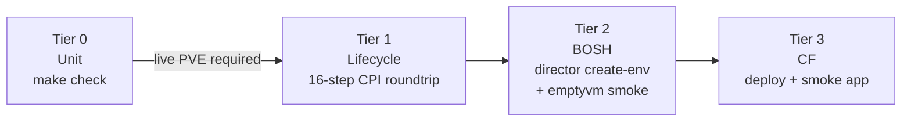

# Integration Testing

This guide covers the tiered integration test harness for the BOSH PVE CPI release. All tests beyond Tier 0 require a live Proxmox VE cluster and lab network access.

---

## 1. Tier Model



| Tier | Name | What it does | Infrastructure required |
|------|------|-------------|------------------------|
| 0 | Unit | `make check` — go vet, staticcheck, go test | None |
| 1 | Lifecycle | CPI binary roundtrip: create stemcell, (optionally) create network, create VM, attach disk, then exercise has_disk, set_disk_metadata, resize_disk, update_disk, and snapshot disk, reboot VM (soft + hard), delete all resources (has_disk re-checked false after delete). Each major step is additionally verified out-of-band against the PVE REST API (real cluster state, not just CPI return values) | Live PVE cluster, lab network (192.168.1.x) |
| 2 | BOSH | `bosh create-env` full director deploy, cloud/runtime-config upload, `emptyvm` smoke deployment, director health assertion | Live PVE cluster, lab network |
| 3 | CF | CF deployment via `scripts/cf deploy`, smoke app push (go-httpbin), map-route, HTTP 200 assertion | Live PVE cluster, lab network, routable system domain |

---

## 2. Safety Warning

> **`./scripts/test integration all` is DESTRUCTIVE.**
>
> It tears down any running CloudFoundry deployment and the BOSH director **before** redeploying everything from scratch. This is intentional — it guarantees a clean-slate run — but it means any workloads on that director **will be deleted without confirmation**.
>
> **Never run this against a production environment or any shared environment you care about.**
>
> Before running live, use `--dry-run` to preview every command the harness will execute:
>
> ```
> ./scripts/test integration all --dry-run
> ```
>
> The `--keep` flag skips cleanup after each tier so you can inspect resources after a run. Use it only in a throwaway environment.

---

## 3. Prerequisites

### Required CLIs

- `uv` — Python script runner (PEP 723); scripts use `#!/usr/bin/env -S uv run --script`

- `bosh` — BOSH CLI; used for `create-env`, `int` (secret extraction), and deployment operations

- `cf` — Cloud Foundry CLI; used for smoke app push in Tier 3

- `credhub` — CredHub CLI; used by `scripts/bosh` for credential injection

### Build tools

- `go` (1.26+) and `make` — required to build `bin/cpi` before Tier 1 runs

### Manifest files (gitignored)

The following files must exist and be populated before running any live tier. They are gitignored and never committed.

- `manifests/bosh/vars.yml`
PVE connection details: `pve_host`, `pve_port`, `pve_user`, `pve_node`, `pve_api_token` or `pve_password`, `pve_vm_storage`, `pve_disk_storage`, `pve_stemcell_storage`, `pve_iso_storage`, `pve_network_bridge`, `pve_verify_ssl`.

- `manifests/bosh/creds.yml`
Generated by `bosh create-env`. Contains `admin_password` and `director_ssl.ca`. Created automatically on first Tier 2 run.

- `manifests/cf/vars.yml`
CF-specific vars including `system_domain`.

### Stemcell

A BOSH stemcell tarball (`.tgz`) must be available. Supply the path in `ci/integration.yml` under `tier1.stemcell_path` or via the `STEMCELL_PATH` environment variable.

### Network

The machine running the tests must have IP reachability to the Proxmox VE API endpoint and to the `192.168.1.0/24` lab subnet. Tier 1 creates a VM at a static IP you configure; Tier 2 and 3 reach the BOSH director and CF router on that subnet.

---

## 4. Quick Start

Run unit tests only (no infrastructure needed):

```
./scripts/test
```

Run Tier 1 (CPI lifecycle) only:

```
./scripts/test integration lifecycle
```

Preview the full destructive run — prints every command, executes nothing:

```
./scripts/test integration all --dry-run
```

Run all tiers (destructive — tears down existing CF and director first):

```
./scripts/test integration all
```

Run all tiers and leave resources running after (skip cleanup):

```
./scripts/test integration all --keep
```

Use a non-default config file:

```
./scripts/test integration all --config /path/to/my-integration.yml
```

Tear down only (idempotent — safe to run even if nothing is deployed):

```
./scripts/test integration teardown
```

**Exit codes:**

- `0` — all requested tiers passed

- `1` — a tier step failed

- `2` — usage or configuration error (bad config file, missing required key)

---

## 5. Configuration

### Creating your config file

Copy the example and edit it. The file is gitignored — never commit it.

```
cp ci/integration.yml.example ci/integration.yml
```

### How secrets work

`ci/integration.yml` contains only non-secret topology knobs. Every secret (PVE API token or password, BOSH admin password, director CA certificate, and CF system domain) is pulled at runtime by calling `bosh int` against the gitignored manifest files. No passwords or tokens are written to the config file.

### Config key reference

**Top-level**

| Key | Type | Description |
|-----|------|-------------|
| `tiers.lifecycle` | bool | Enable/disable Tier 1 |
| `tiers.bosh` | bool | Enable/disable Tier 2 |
| `tiers.cf` | bool | Enable/disable Tier 3 |
| `bosh_vars` | path | Path to `manifests/bosh/vars.yml` (PVE connection + sizing) |
| `bosh_creds` | path | Path to `manifests/bosh/creds.yml` (generated by create-env) |
| `cf_vars` | path | Path to `manifests/cf/vars.yml` (includes `system_domain`) |

**`tier1` — CPI lifecycle**

| Key | Description | Example |
|-----|-------------|---------|
| `vmid_range_start` | First VMID reserved for integration test VMs | `900` |
| `vmid_range_end` | Last VMID in the reserved range | `999` |
| `network_ip` | Static IP assigned to the test VM | `192.168.1.250` |
| `network_range` | Subnet CIDR for the test VM | `192.168.1.0/24` |
| `network_gateway` | Default gateway for the test VM | `192.168.1.1` |
| `network_bridge` | Proxmox bridge to attach the test VM | `vmbr0` |
| `network_dns` | DNS resolvers passed to the test VM (YAML list) | `[1.1.1.1]` |
| `vm_cores` | vCPU count for the test VM | `1` |
| `vm_memory_mib` | RAM for the test VM in MiB | `1024` |
| `disk_size_mib` | Persistent disk size in MiB | `1024` |
| `stemcell_path` | Absolute path to stemcell tarball; leave empty to use `STEMCELL_PATH` env | `""` |
| `disk_storage_pools` | Optional. Empty list = single run on `pve_disk_storage`. A list of pool names runs Tier 1 once per pool. The string `auto` autodetects local image-capable pools (lvm/lvmthin/zfspool/dir) via the PVE API | `[]` |
| `network_test` | Optional. Exercises `create_network`/`delete_network` against live PVE (see below) | *(see below)* |

#### `tier1.network_test` — managed-network handler coverage

When `network_test.modes` is non-empty, Tier 1 runs one **extra** `scripts/lifecycle` pass per mode (independent of `disk_storage_pools` — no cross product), exercising the BOSH CPI `create_network`/`delete_network` methods. The created network is attached to that pass's test VM, and the result is verified out-of-band against the PVE REST API. An empty/absent `modes` list skips network testing entirely (default).

Setting `modes: auto` makes the harness **detect at run time** which modes the PVE host supports and run those, mirroring `disk_storage_pools: auto`:

- **`sdn`** is selected when the `/cluster/sdn` API is present (SDN installed) **and** a usable zone is resolvable: the configured `sdn.zone` already exists (reused and pinned so it is never deleted), or no `sdn.zone` is set but zones exist (the first is adopted and pinned), or the configured `sdn.zone` is absent (created for the test and torn down via `sdn_auto_manage_zone`). The `sdn.vnet`/`range`/`gateway`/`ip` values must still be set for SDN to be runnable.
- **`bridge`** is selected when `bridge.iface` is configured and **not already present** on the node, so the harness can cleanly create then delete it (it never touches a bridge it did not create).

Autodetect requires valid PVE credentials in `bosh_vars`. In `--dry-run` mode autodetect is skipped (no network passes are previewed).

| Key | Description | Example |
|-----|-------------|---------|
| `network_test.modes` | Paths to exercise: a list of `sdn`/`bridge`, or the string `auto` to detect supported modes. `[]` = skip | `[sdn, bridge]` or `auto` |
| `network_test.sdn.zone` | SDN zone name. Must pre-exist unless the CPI config sets `sdn_auto_manage_zone` (then it is auto-created) | `it` |
| `network_test.sdn.zone_type` | Zone type used when the zone is auto-created | `simple` |
| `network_test.sdn.vnet` | vnet name, 1–8 chars `[a-z0-9]` | `itvnet` |
| `network_test.sdn.range` | Isolated subnet CIDR (must not collide with the LAN) | `10.250.0.0/24` |
| `network_test.sdn.gateway` | Gateway for the SDN subnet | `10.250.0.1` |
| `network_test.sdn.ip` | Test VM IP within `range` | `10.250.0.10` |
| `network_test.bridge.iface` | **Unused** bridge iface to create then delete. Bridge mode mutates node networking — pick a name not in use | `vmbr9` |

- **`sdn` mode** requires an SDN-capable cluster. It creates a zone (if `sdn_auto_manage_zone`), vnet, and — when `range` is set — a subnet, applies the SDN config, and attaches the VM to the realized vnet bridge.
- **`bridge` mode** creates a Linux bridge via the nodes API and attaches the VM to it. This changes the node's network configuration; always use an unused iface name.

**`tier2` — BOSH director smoke**

| Key | Description | Example |
|-----|-------------|---------|
| `director_name` | Value passed as `-v director_name` to `bosh create-env` | `ocfp-mgmt` |
| `bosh_env_alias` | Alias registered via `bosh alias-env` | `pve` |
| `deployment_name` | Name of the emptyvm smoke deployment | `emptyvm` |
| `smoke_timeout_s` | Seconds to wait for the emptyvm deploy | `300` |

**`tier3` — CF smoke**

| Key | Description | Example |
|-----|-------------|---------|
| `deployment_name` | BOSH deployment name for CF | `cf` |
| `smoke_org` | CF org created for the smoke test | `integration-smoke` |
| `smoke_space` | CF space created for the smoke test | `test` |
| `smoke_app` | CF app name pushed as the smoke app | `httpbin-smoke` |
| `smoke_timeout_s` | Seconds to wait for CF deploy and app push | `900` |

### Out-of-band PVE verification

Beyond asserting on the CPI binary's JSON-RPC return values, Tier 1 independently confirms real cluster state by querying the PVE REST API directly (`scripts/_pve_verify.py`). The verifier reuses the **same host and authentication as the CPI config** — `api_token` becomes an `Authorization: PVEAPIToken=` header; a `password` config performs a `/access/ticket` login and uses the `PVEAuthCookie`. It queries list endpoints (`/cluster/sdn/vnets`, `/cluster/sdn/zones`, `/nodes/{node}/qemu`, `/nodes/{node}/network`, and storage content) and tests membership, which sidesteps PVE's inconsistent 404/500 behavior on per-id GETs.

Verified steps: `create_network` → vnet+subnet (SDN) or bridge present; `create_vm` → VM present; `create_disk` → volume present; `delete_vm` → VM gone; `delete_network` → vnet/bridge gone. A failed verification aborts the run exactly like a CPI error. `scripts/_pve_verify.py` is stdlib-only and can be run standalone for a connectivity smoke — e.g., `./scripts/_pve_verify.py --config cpi.json vnet itvnet`.

### `scripts/lifecycle` environment variables

`scripts/lifecycle` is called by the Tier 1 runner. When invoked via `./scripts/test integration lifecycle`, the harness sets all variables from `ci/integration.yml`. When invoked directly, set these yourself.

| Variable | Default | Description |
|----------|---------|-------------|
| `CPI_CONFIG` | *(required)* | Path to the CPI JSON config file |
| `STEMCELL_PATH` | *(required)* | Path to the BOSH stemcell tarball |
| `CPI_BIN` | `./bin/cpi` | Path to the compiled CPI binary |
| `AGENT_ID` | `lifecycle-<pid>` | Agent UUID used in `create_vm` |
| `NETWORK_RANGE` | `192.168.1.0/24` | CIDR subnet for the test VM |
| `NETWORK_GATEWAY` | `192.168.1.1` | Default gateway for the test VM |
| `NETWORK_IP` | `192.168.1.250` | Static IP assigned to the test VM |
| `NETWORK_BRIDGE` | *(from CPI_CONFIG)* | Proxmox bridge; reads `network_bridge` field from the CPI config if unset |
| `NETWORK_DNS` | `["8.8.8.8"]` | JSON array of DNS server IPs |
| `VM_CORES` | `1` | vCPU count |
| `VM_MEMORY_MIB` | `1024` | RAM in MiB |
| `DISK_SIZE_MIB` | `1024` | Persistent disk size in MiB |
| `TRACE` | *(unset)* | Set to any non-empty value to print raw JSON-RPC request/response to stderr |
| `NETWORK_TEST_MODE` | `off` | `off` \| `sdn` \| `bridge` — exercise `create_network`/`delete_network` for that path |
| `SDN_ZONE` | *(empty)* | SDN zone name (mode=sdn) |
| `SDN_ZONE_TYPE` | `simple` | Zone type used when auto-creating the zone |
| `SDN_VNET` | *(empty)* | vnet name, 1–8 chars `[a-z0-9]` (mode=sdn) |
| `SDN_RANGE` | *(empty)* | CIDR for the SDN subnet (mode=sdn) |
| `SDN_GATEWAY` | *(empty)* | Gateway for the SDN subnet (mode=sdn) |
| `SDN_IP` | *(empty)* | Test VM IP within `SDN_RANGE` (mode=sdn) |
| `BRIDGE_TEST_IFACE` | *(empty)* | Bridge iface to create then delete (mode=bridge) |

When invoked via `./scripts/test integration lifecycle`, `NETWORK_TEST_MODE` is set per pass from `tier1.network_test.modes`; the `SDN_*`/`BRIDGE_TEST_IFACE` values come from `tier1.network_test`.

---

## 6. Concourse

### Setting the pipeline

```
fly -t <target> sp -p bosh-pve-cpi -c ci/pipeline.yml -l ci/params.yml
```

`ci/params.yml` is gitignored. Populate it from `ci/params.yml.example`.

### Jobs

**`unit`**

Triggers automatically on every push to `main`. Runs `make check` (go vet + staticcheck + go test). No network requirements; runs on any worker.

**`integration`**

Manual trigger only. Requires the `unit` job to have passed (`passed: [unit]`). Runs `./scripts/test integration all` — the full destructive sequence.

**Worker requirement:** the Concourse worker running the `integration` job must have IP reachability to the `192.168.1.0/24` lab subnet. Workers without lab network access fail at the first PVE API call.

### Secrets

Secrets are passed to the integration task as Concourse parameters (the `((double-paren))` syntax) and resolved from Vault, CredHub, or a local params file at `fly sp` time.

Key params used by `ci/tasks/integration.yml`:

| Param | Description |
|-------|-------------|
| `PVE_API_TOKEN` | Proxmox API token |
| `PVE_ENDPOINT` | Proxmox API endpoint URL |
| `STEMCELL_PATH` | Path to stemcell tarball on the worker |
| `BOSH_VARS_YAML` | Base64-encoded content of `manifests/bosh/vars.yml` |
| `CF_VARS_YAML` | Base64-encoded content of `manifests/cf/vars.yml` |
| `BOSH_CLIENT_SECRET` | BOSH director admin password |
| `BOSH_CA_CERT` | BOSH director CA certificate |

`BOSH_VARS_YAML` and `CF_VARS_YAML` are passed as base64-encoded strings. The integration task decodes them to temporary files before calling `./scripts/test integration all` so that `bosh int` can resolve secrets normally.

### Task image requirements

The Docker image used by `ci/tasks/integration.yml` must include:

- `go` and `make` (to build `bin/cpi`)

- `bosh` CLI

- `cf` CLI

- `credhub` CLI

- `uv` (Python script runner)
