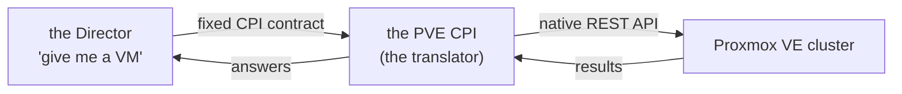

# Chapter 1 — Why We Are Here

*Minutes 0–5 of the hour.*

We have two things in this room that were never introduced to each other. On one side, BOSH: the system many of us already use to deploy and run platforms, the one that provisions machines, lays down software, watches for drift, and heals what breaks. On the other side, Proxmox VE: the hypervisor our hardware actually runs. BOSH has never heard of Proxmox. Proxmox has never heard of BOSH. This project is the introduction — a single piece of software that lets BOSH drive a Proxmox cluster as if it had known it all along.

Over the next hour we will walk through how it is put together, how it works, and how it is configured. This is not a code walkthrough. Nobody needs to read a line of Go to follow it, and nobody should leave feeling they have to. The goal is the mental model: when a deploy runs, what actually happens on the cluster, what the pieces are called, which settings matter, and where to look when something misbehaves. The code will still be there afterward for anyone who wants to go deeper.

*The idea the whole hour rests on: BOSH speaks one generic language for infrastructure, and a translator called the CPI turns that language into Proxmox API calls. Everything we operate — every VM, disk, network, and template — is that translation made real.*

## The driver metaphor

BOSH is built around a deliberate refusal. Its orchestrator, the Director, does not know how to create a VM on any specific cloud — not AWS, not vSphere, and not Proxmox. It only says generic things: "give me a VM from this stemcell, on this network, with this much memory." It never says how. Something has to sit on that line and translate, and BOSH defines a fixed contract for exactly that purpose: the Cloud Provider Interface, or CPI.

The cleanest picture is the device driver. An operating system says "print this page" in one generic language; each printer ships a driver that turns the request into signals its hardware understands. BOSH is the operating system. Proxmox VE is the hardware. This project is the driver.

*The Director speaks one generic language on the left; the CPI turns it into Proxmox's native API on the right.*

Because the contract is the same everywhere, swapping the cloud under a deployment is, in principle, swapping the driver. The Director never notices. That is why the deployment manifests we already know keep working here.

## The part that makes this one interesting

Here is the fact that shapes everything else we will see today: Proxmox VE is not a cloud. It is a very good hypervisor manager, but it was never designed around the abstractions a cloud takes for granted. It has no scheduler that picks the best node for a new VM. It has no concept of an availability zone. It has no durable volume that outlives the machine it is attached to. It has no portable, cluster-wide network identity.

A CPI for AWS mostly translates, because AWS already has all of those things. This CPI has to *manufacture* them. It builds a scheduler out of live cluster reads. It invents fault domains from a mapping we write down. It synthesizes durable disks out of the one durable thing Proxmox does offer. Think of it as a small factory standing between BOSH and the hypervisor, stamping out the cloud primitives Proxmox lacks. That factory image will come back again and again this hour.

## What we will leave with

The hour runs in four movements. First the cast of characters and what actually happens during a deploy. Then the manufactured primitives — how machines are born, where they land, how networks and disks work. Then configuration: the handful of settings that matter, and the promise the defaults make. Finally, day two: what heals itself, what needs a human, and where the documentation lives for everything we could not fit into an hour.

## Where this leads

Before any of that machinery makes sense, we need to know the players by name — the Director, the agent, the stemcell, the CPI binary itself, and the cluster they all meet on. That is [Chapter 2](02-the-cast.md).
