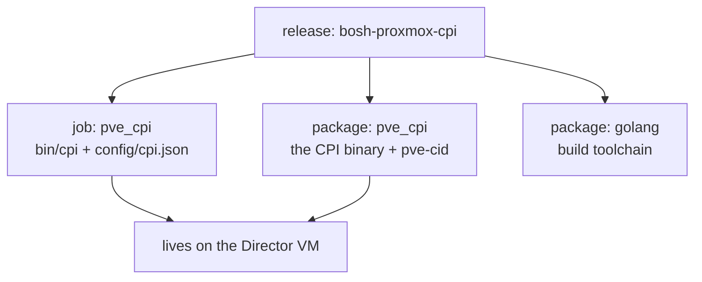

# Chapter 2 — The Cast of Characters

*Minutes 5–11 of the hour.*

Every story this hour involves the same five players, so let us meet them once, properly, before the plot starts. Some of them we already know from other BOSH environments. Two of them are new here.

*The idea this chapter rests on: the CPI is not a service we run — it is a small program the Director invokes once per request, like a tool picked up and put down. Everything about how it is packaged and operated follows from that.*

## The five players

- **The Director**
The brain of BOSH. It holds the deployment manifest, the database of what should exist, and the plan for getting there. It is the only component that ever calls the CPI, and it does so one small request at a time: create this VM, attach that disk, is this machine still there.

- **The stemcell**
A golden operating-system image with a dormant BOSH agent inside. The same OpenStack stemcells published on bosh.io work here unchanged — that compatibility is deliberate, and Chapter 4 explains the trick behind it.

- **The agent**
A small process inside every deployed VM. It wakes up on first boot, learns who it is, connects back to the Director's message bus, and from then on does the Director's bidding inside the machine: laying down packages, starting jobs, reporting health.

- **The Proxmox cluster**
The hardware truth. Nodes, storage pools, bridges, and the REST API on port 8006 that the CPI talks to. The CPI never opens a shell on a node and never logs into a guest — every single thing it does goes through that API, with one scoped credential.

- **The CPI itself**
A single binary that translates between the two worlds. It deserves a closer look, because its shape is unusual.

## A program, not a service

The CPI is not a daemon. There is no long-running process to monitor, no port it listens on, and no state it keeps in memory. When the Director needs something, it starts the binary, writes one request to it, reads one answer back, and the process exits. The next request starts a fresh process that remembers nothing.

That sounds like a limitation, and it is the design's greatest strength. A program that remembers nothing can be retried safely. If a request fails halfway — a network blip, a busy cluster — the Director simply runs it again, and the CPI is built so that running the same request twice never creates a duplicate or destroys something it should not. For us as operators, this means a failed deploy is rarely a crisis. Re-running is the normal, safe recovery, and the whole system is engineered around that assumption.

Everything the CPI knows arrives from exactly two places: the request the Director just sent, and one configuration file it reads on every start. That file — rendered from our manifest properties — is the single source of truth for how the CPI behaves, and it is where the whole of Chapter 8 lives.

## How it is packaged

The project ships as a standard BOSH release named `bosh-proxmox-cpi`, and its contents are small enough to describe completely.

- **One job, `pve_cpi`**
Colocated on the Director VM. It renders two files: `bin/cpi`, the entry point the Director invokes, and `config/cpi.json`, the configuration document built from our `pve.*` manifest properties.

- **Two packages**
A pinned Go toolchain, and the CPI source itself. At deploy time BOSH compiles the source hermetically — every dependency is vendored, so the build touches no network — and the result lands at `/var/vcap/packages/pve_cpi/bin/` on the Director VM.

- **A second, quieter tool: `pve-cid`**
The same package ships a small read-only command-line tool alongside the CPI. It decodes the identifiers we will meet in Chapter 3, locates disks and stemcells on the live cluster, and never mutates anything. It is the first thing to reach for when an ID in a BOSH error message needs to be turned back into a real object.

*One release, one job, two packages — all of it landing on the Director VM, none of it running as a service.*

One detail tells the whole story of the design: the job's monit file — the file that normally tells BOSH which process to keep alive — is deliberately empty of directives. There is no process to watch. The CPI exists only in the moments the Director is asking it a question.

## Where this leads

We know the players. The next question is the plot: when someone types `bosh deploy`, what sequence of requests actually flows across that seam, and what appears on the cluster as a result? That is [Chapter 3](03-what-a-deploy-does.md).
