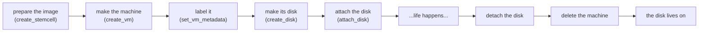

# Chapter 3 — What Happens When We Deploy

*Minutes 11–17 of the hour.*

From the outside, a running deploy looks like chaos — machines appearing, disks attaching, networks wiring up, all at once. Underneath it is something much simpler and much more reassuring. The Director never issues one giant "build my deployment" command. It issues a long sequence of small, named requests, each one independently retriable, and it sequences them itself. Watching one machine walk through that sequence is the fastest way to understand the whole system.

*The idea this chapter rests on: a deploy is a chain of small, safe-to-retry steps. Nothing the CPI does is a leap; everything is a step that can be checked, repeated, or undone.*

## One machine's life

The requests fire in a canonical order, and it reads like a biography.

*One VM's biography: image, machine, label, disk — and at the end, the machine goes but the disk survives.*

First the Director makes sure the operating-system image exists on the cluster. Then it asks for the machine: the CPI clones the image, wires the network, sets CPU and memory, and starts it. The agent inside boots, phones home, and the anonymous clone becomes a managed instance. Then come the disks — created, attached, and later detached as separate steps with their own lives. At the end, deleting the machine and deleting its data are two different decisions, made separately.

That last point is worth pausing on, because it is the most important promise in BOSH: **data survives compute**. A VM is disposable — the Director deletes and recreates it on every stemcell upgrade and every recovery. The persistent disk is not. It is created before the machine that uses it, handed from an old machine to its replacement, and deleted only when the deployment truly no longer wants the data. Two lifecycles, deliberately kept apart. Chapter 7 is devoted to what that costs on a platform with no native disk object.

## Safe to run twice

Every link in that chain is built to be retried. If `create_vm` fails halfway — the clone succeeded but the network attach did not — the CPI cleans up what it made, reports the failure honestly, and the Director tries again. If a request times out for a transient reason, the CPI marks the error *retriable*, and the Director re-drives it without human help. We will see in Chapter 9 how to read those two kinds of errors apart, because the distinction — heals itself versus needs a human — is the single most useful diagnostic skill for this system.

The practical consequence is calm. A deploy that fails on a busy afternoon is usually not broken; it is waiting. Re-running `bosh deploy` is the intended recovery path, not a workaround.

## Reading the cluster like a book

Everything the CPI creates lands in Proxmox with a numeric VMID, and the CPI assigns those numbers from disjoint, dedicated bands. This is the part every operator should memorize, because it makes the cluster legible at a glance.

| VMID range | What it is |
|---|---|
| 100 – 8999 | Real VMs — the deployment's actual machines |
| 9000 – 29999 | Persistent disks, wearing synthetic IDs |
| 30000 – 30999 | Frozen stemcell templates (Chapter 4) |
| 90000 – 90999 | Parker VMs guarding detached disks (Chapter 7) |

The ranges are configurable, but the idea is fixed: an ID's band tells us its species before we look at anything else. A "VM" numbered 30412 is not a runaway machine — it is a template. One numbered 9003 is a disk. On top of the bands, every real VM carries tags naming its Director, deployment, and job, so `pvesh get /cluster/resources` reads like an inventory, not a mystery.

The same legibility is what lets BOSH heal its own records. The chain includes read-back requests — is this VM still there, which disks does it hold — that exist purely so the Director can compare its database against cluster reality. That comparison has a name we will use on day two: `bosh cloud-check`.

## Where this leads

The chain has one step that dominates the clock: making the machine itself. Copying a full operating-system image for every VM takes minutes, and minutes times dozens of machines would make the platform unbearable. The next chapter is about the trick that turns those minutes into seconds — and how a fresh machine learns who it is without anyone logging in. That is [Chapter 4](04-machines-from-a-mold.md).
