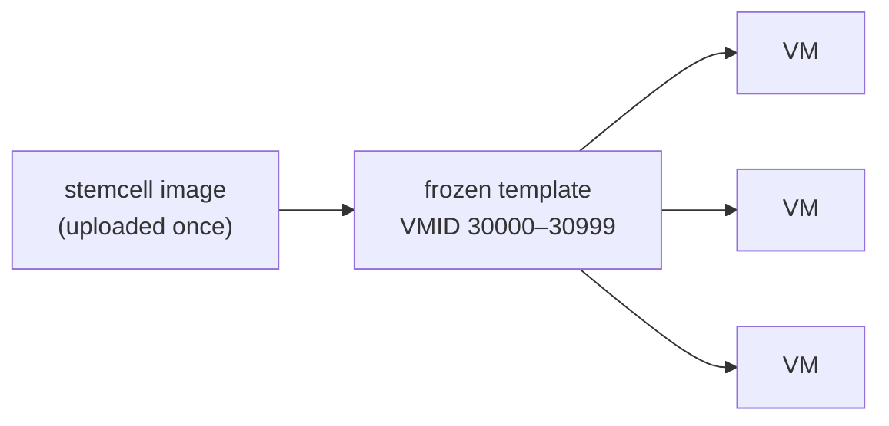
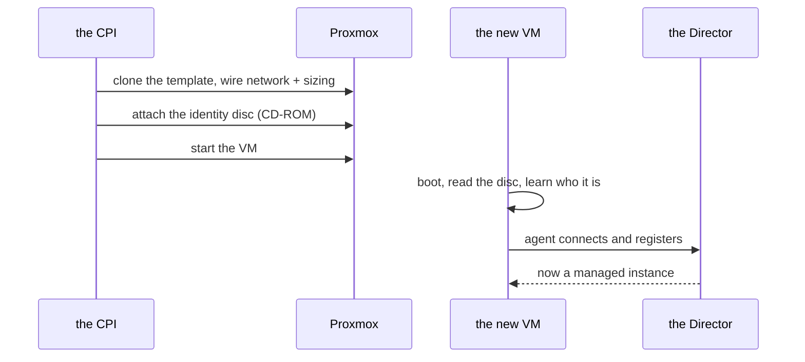

# Chapter 4 — Machines from a Mold

*Minutes 17–22 of the hour.*

Copying an operating-system image block by block takes about four minutes on typical storage. A deployment of dozens of machines, recreated on every upgrade, would spend most of its life copying the same bytes. So the CPI refuses to copy the same bytes twice — and that refusal is the single most important performance decision in the system.

*The idea this chapter rests on: pay the image cost once, into a frozen template, then stamp every machine out as a cheap clone. Then hand each anonymous clone its identity on a sealed disc — no login, no SSH, no extra service.*

## The mold

When a stemcell is uploaded, the CPI imports the image exactly once into a **template** — a frozen VM that never runs and exists only to be copied. It lives in the 30000–30999 band from last chapter, safely out of the way of real machines. From then on, every `create_vm` is a *casting*: a clone of that template. On copy-on-write storage — NFS, ZFS, thin LVM, Ceph — the clone shares the template's blocks and writes only its own changes. Four minutes becomes seconds.

*Import once, stamp many. The template is the mold; every VM is a casting that finishes in seconds.*

The template knows its own identity by *content*, not by name: it carries a fingerprint of the image bytes as a tag. Upload the same stemcell twice — even from two Directors racing each other — and the CPI recognizes the fingerprint and converges on one template instead of importing a second copy. When a stemcell is deleted, the same fingerprint finds every copy across the cluster, and reference counting ensures a template shared by two Directors is only destroyed when the last one lets go.

Two operational notes ride along here. The stemcells themselves are the standard OpenStack qcow2 line from bosh.io — no conversion, no special build. And the storage that holds templates must be file-based, and shared on a multi-node cluster; that requirement, and the light-stemcell variants that skip re-uploading images we already have, live in the reference docs for when they are needed.

## The sealed envelope

A fresh clone boots into a strange situation. It has an operating system and a BOSH agent, but the agent wakes up amnesiac — it does not know its name, where the Director's message bus lives, or what its network should look like. And the obvious fix, logging in to configure it, is exactly what the CPI cannot do: it speaks only to the Proxmox API, with no shell and no SSH into any guest.

So identity arrives as data, not as a conversation. The CPI writes the machine's settings — name, network, message-bus address, disk layout — onto a small read-only disc image and attaches it to the VM as a CD-ROM. The guest's stock tooling looks for exactly this disc on first boot, reads it, and applies it. Think of a sealed envelope in a new hire's onboarding folder: nobody dictates the contents over the phone; the envelope is simply there, and the machine opens it and learns who it is.

*Clone, seal, boot, phone home. Registration with the Director is the moment a bare clone becomes a managed instance.*

The disc format is the OpenStack config-drive layout — the same one those stock stemcells already understand. That is the whole trick behind the compatibility we mentioned in Chapter 2: rather than inventing a bootstrap protocol, the CPI reuses one the images already speak. There is no registry service to run, no cloud-init wiring for us to build, and nothing to keep alive between deploys. The disc stays attached for the VM's whole life, parked on a reserved slot where data disks can never collide with it.

## Where this leads

A machine now exists and knows who it is — but *where* is it? A cluster has many nodes, and Proxmox will happily pile every new VM onto whichever node we point at, until that node falls over. Nothing in the platform chooses wisely on our behalf. The next chapter is about the scheduler this CPI had to build from scratch, and the availability zones it invents along the way. That is [Chapter 5](05-where-machines-land.md).
