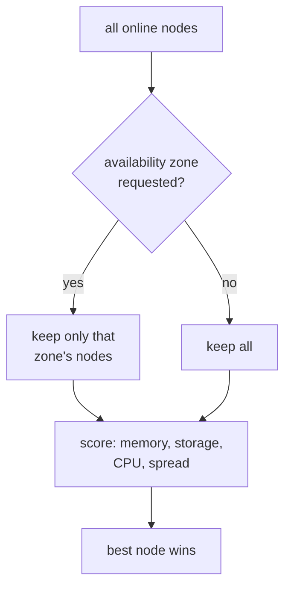

# Chapter 5 — Where Machines Land

*Minutes 22–27 of the hour.*

On a real cloud we ask for an instance and never think about which physical host runs it — a scheduler somewhere weighs every machine's free capacity and picks. Proxmox has no such thing. It creates a VM wherever we point it, and if we always point at the same node, it obediently stacks the whole deployment there until that node buckles while its neighbors sit idle. The first primitive the factory has to stamp out is a scheduler.

*The idea this chapter rests on: every placement decision starts from a fresh, live read of the cluster — and preferences are kept separate from guarantees. The scorer prefers; the operator's fault-domain map guarantees.*

## A scorer with fresh eyes

On every VM creation, the CPI reads the cluster as it is *right now* — each node's free memory, storage headroom, CPU load, how many guests it already runs, and whether it is flagged for maintenance — and ranks the candidates. Memory weighs heaviest, because a node out of RAM cannot start the guest at all. A node already hosting a sibling from the same instance group is penalized hard, so a job's instances spread across nodes instead of sharing one failure. The highest score wins, and the decision is thrown away; the next VM gets a fresh read.

This is on by default, with sensible weights, and needs nothing from us to work. Two escape hatches exist for when we know better: naming an explicit `target_node` bypasses scoring entirely, and turning placement off falls back to the configured default node.


*Placement is a funnel: filter by zone if one was asked for, score the survivors, pick a winner.*

## Availability zones are a map we write

Spreading load is not the same as surviving a failure. Real resilience needs fault domains — groups of nodes that fail separately, on different racks or power feeds. Proxmox has no concept of an availability zone, so the CPI lets us invent them: a simple mapping in configuration from zone names to node lists.

```yaml
placement:
  az_map:
    z1: [pve01, pve02]
    z2: [pve03, pve04]
```

A VM that asks for `z1` is confined to those nodes before scoring even begins. The cloud config we already write for BOSH — jobs spread across `z1` and `z2` — now translates into machines genuinely spread across different hardware.

One honest trap deserves a spotlight, because it is invisible until the day a node dies: BOSH does not pass the cloud-config zone name down to the CPI on its own. The zone must also appear in each `vm_type`'s `cloud_properties` as `availability_zone`. Leave that out, and the zone features are silently inert — every VM is created, everything looks fine, and nothing is actually pinned anywhere. Only the HA-pinning opt-in in the next section even logs a warning per unpinned VM; the plain case stays silent. The HA and resurrection guide walks through the full wiring.

## Making the decision stick

The CPI places a VM once and exits. But Proxmox's own high-availability machinery can later migrate that VM anywhere — including out of its zone — silently undoing the fault-domain design. For deployments that care, an opt-in setting writes the placement down: the CPI records a node-affinity rule in Proxmox's HA rule store, binding the VM to its zone's nodes even after the CPI process is long gone. A related opt-in covers the opposite case, handing workloads that want *continuous* rebalancing rather than a fixed home to Proxmox's Dynamic Load Balancer.

Both opt-ins share a serious caveat we will meet again in Chapter 9: once Proxmox is allowed to restart or move machines, BOSH's own resurrector must stand down for that deployment, or two independent healers will race each other and produce duplicates. One system heals; never both.

## Where this leads

A machine placed on the right node in the right zone is still unreachable until it has a network — and networks are where the platform's node-local habits bite hardest. A machine free to land anywhere needs a network that follows it. That, and the sharpest war story in this project's history, is [Chapter 6](06-networks.md).
