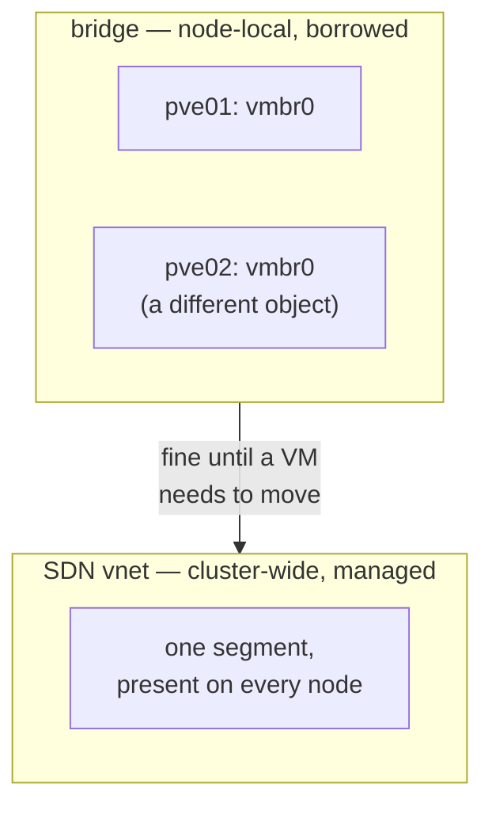

# Chapter 6 — The Network Story

*Minutes 27–33 of the hour.*

Networking is where most first deployments just work — and where the one truly maddening failure in this project's history lived. Both halves of that sentence deserve their five minutes.

*The idea this chapter rests on: by default the CPI borrows the networks we already have and touches nothing. Asked to manage networks, it can build ones that span the whole cluster. And either way, BOSH must fully own its address space — that is a correctness requirement, not a preference.*

## Borrowed networks: the default

Most deployments pre-provision their networking and want the CPI to keep its hands off. That is exactly the default. Every VM's interface attaches to a named Linux bridge — `vmbr0` unless we say otherwise — and the CPI never creates or deletes any network object. The BOSH side works the way it does everywhere: `manual` networks with static IPs are the normal case, the address and gateway riding into the guest on the identity disc from Chapter 4. DHCP-style `dynamic` networks and `vip` addresses are supported too.

For a single-node lab or a shop with an established VLAN scheme, this is the whole story: name the bridge, assign the ranges, deploy. A per-interface `vlan` tag is available when the bridge carries a trunk.

## Managed networks: the opt-in

A bridge has one weakness: it is a per-node object. The `vmbr0` on one node and the `vmbr0` on another are two unrelated things that happen to share a name. A VM placed freely by Chapter 5's scheduler — or migrated later — needs its network to exist *everywhere it might land*.

Marking a network managed hands its lifecycle to the CPI — creating and deleting it becomes the CPI's job rather than ours. Which *kind* of network it builds is a separate choice. Under the shipped default the CPI provisions an ordinary bridge on a single node: the borrowed shape, automated, with the same one-node weakness. The cluster-wide answer is the software-defined networking mode. Switched on, a managed network becomes a vnet inside a VXLAN zone, which realizes the *same* layer-2 segment on every node in the cluster. The CPI creates the zone on first use, derives the tunnel endpoints from live cluster membership, and waits for the network to actually materialize on the target node before attaching any VM to it — a guard against the platform's habit of reporting a network committed before it is real.

*A bridge pins a VM's network to one node; a managed vnet follows the VM wherever placement or migration sends it.*

Choosing between the modes is one setting, and the two coexist happily — a deployment can borrow the office VLAN for one network and let the CPI manage an isolated overlay for another.

## Own the address space

The maddening failure, in two sentences. A deployment once flapped on a steady fifteen-second cadence — agents connecting, dropping, reconnecting, every resource measuring healthy — and the cause was a single IP that BOSH had assigned to a VM while a real device on a shared office LAN already held it. Two machines answered for one address, and packets were delivered to the wrong hardware every few seconds.

The lesson is baked into the defaults we ship, and it lands hardest on exactly our situation — a network handed to us rather than one BOSH builds: **a network BOSH does not fully own cannot guarantee unique addressing, and without unique addressing nothing above it can be trusted.** On a provided network, owning the address space is an agreement with the people who run it, not a setting, and the agreement has three parts:

- The ranges BOSH assigns from are reserved for BOSH alone — carved out of every DHCP scope, and recorded in the network team's inventory as ours.

- Nothing else lives in those ranges — no appliance, no laptop, no monitoring probe, however temporary.

- The reservation outlives any one deployment — the ranges stay treated as occupied even when no VM currently holds an address in them.

Two guard rails back the agreement. Before provisioning a static IP, the CPI scans the cluster for another VM already configured with it and refuses the collision — that catches conflicts among our own machines, though it cannot see a foreign device on the wire; only the agreement covers those. And the troubleshooting runbook's flagship entry gives the packet-level procedure that *proves* a duplicate-address problem in minutes instead of days — Chapter 9 will point at it.

## Where this leads

Machines exist, know who they are, land wisely, and can be reached. The remaining primitive is the most valuable one: the disk that outlives its machine. Proxmox offers no such object at all, which makes this the CPI's richest invention. That is [Chapter 7](07-disks-that-outlive.md).
