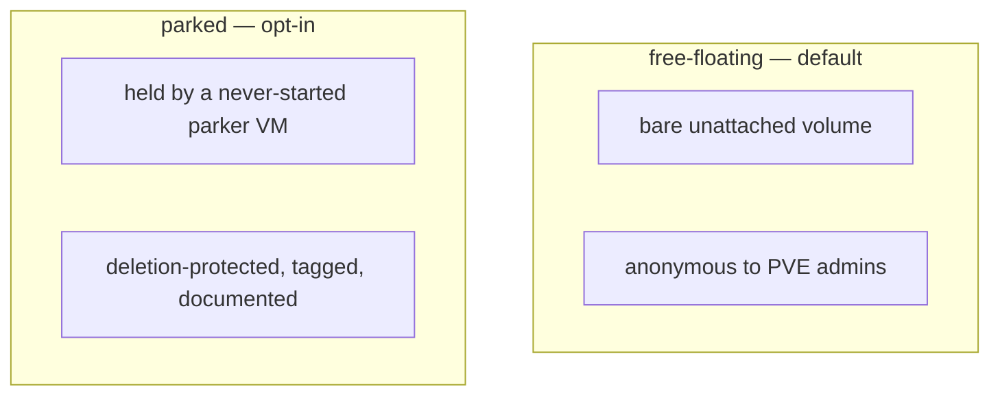

# Chapter 7 — Disks That Outlive Their Machines

*Minutes 33–39 of the hour.*

BOSH's most important promise is the one from Chapter 3: data survives compute. Kill a VM, recreate it, move it — the persistent disk comes back attached and intact. Every real cloud backs that promise with a first-class volume object carrying its own identity, metadata, and ownership. Proxmox has none of that. A volume's entire identity is a string like `nfs-disks:vm-9003-disk-0`, with no metadata API, no tags, and no record of who made it or whether deleting it is safe. The CPI has to invent the durable volume out of almost nothing.

*The idea this chapter rests on: when the platform lacks the object our abstraction needs, build it from the durable carriers that do exist — an identifier BOSH never loses, a numbered namespace everyone can read, and, when we opt in, a guardian machine whose only job is to say "this is ours."*

## The identifier that carries its own paperwork

Where does a disk's identity live if the platform will not store it? Inside the one thing that never gets lost: the disk's own ID. When the CPI creates a persistent disk, the identifier it hands back to the Director is more than a name — encoded inside it are the storage pool, the node, the availability zone, and the disk's performance settings. The Director faithfully hands that ID back on every later request, so the disk's paperwork travels with the disk. Nothing needs to be remembered, because everything is carried.

This is also why those IDs look long and opaque in BOSH output. They are envelopes, not labels — and the `pve-cid` tool from Chapter 2 opens them:

```bash
/var/vcap/packages/pve_cpi/bin/pve-cid decode 'pvd-eyJ2b2xpZCI6...'
```

One command turns any ID from an error message back into a storage pool, a node, and a volume name we can go look at.

The second carrier is one we already know: the disk's synthetic VMID from the 9000–29999 band. Any destructive operation can tell a persistent disk from a machine's own scratch disks by the band its ID falls in, and the CPI's deletion guards are built directly on that distinction — a VM deletion that finds a persistent-band disk still referenced will refuse rather than destroy data it cannot prove is disposable.

## The detach window, and the coat-check

A disk's most dangerous hours are the ones between machines — detached from an old VM, not yet attached to its replacement. By default, such a disk floats as a bare unattached volume. BOSH knows exactly what it is; the Director's records and the ID envelope keep it safe from *BOSH*. But a Proxmox administrator browsing storage sees only an anonymous volume with no native signal that it is a live disk full of production data. A tidy-minded human, or a storage cleanup script, might delete it.

For a shop where everyone touching Proxmox knows about the 9000–29999 band, the default is fine. For everyone else there is an opt-in strategy best described as a coat-check. Each detached disk is immediately hung on a **parker VM** — a machine in the 90000–90999 band that is never started, marked deletion-protected so Proxmox itself refuses to remove it, and tagged as BOSH property. The disk is now visibly owned and physically guarded, at the cost of a few extra API calls per detach. Each park also writes a provenance note — which disk, from which VM, when — so an audit months later can reconstruct the history.


*Free-floating is cheap and anonymous; parking trades a few API calls for a visible, protected home.*

## Trust, then verify

Because disks are where mistakes are unrecoverable, the tooling assumes we will want to check. The `scripts/disk-audit` tool walks the entire disk band across every node and classifies each volume — attached, parked, free-floating, or unknown — with stable exit codes, so it works equally well as a monthly human habit or a CI gate. The reference docs pair it with a firm rule of thumb: before deleting anything that looks orphaned, ask the Director first (`bosh disks --orphaned`), because a disk BOSH still tracks is not an orphan, no matter how lonely it looks.

Performance settings follow the same carried-not-remembered philosophy: caching, I/O threading, and throughput caps chosen at creation ride inside the ID envelope and are applied at every attach. Defaults for all of these resolve sensibly from the storage backend, so most deployments never set any of them.

## Where this leads

That completes the machinery — machines, identity, placement, networks, and durable disks, every primitive Proxmox lacked. What remains is our half of the contract: the configuration file that drives all of it, the credential it runs as, and the promise its defaults make. That is [Chapter 8](08-how-we-configure-it.md).
