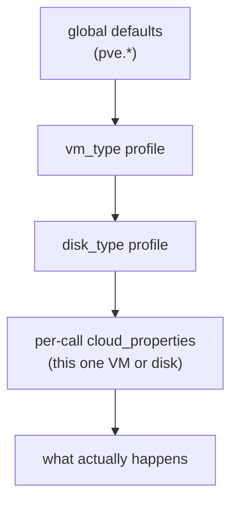

# Chapter 8 — How We Configure It

*Minutes 39–46 of the hour.*

The configuration reference for this CPI documents well over a hundred properties, and that number is designed to be misleading. A working production deployment needs five. Everything else is an opt-in that defaults to doing nothing, and that ratio — five required, the rest silent — is itself the most important configuration fact to carry out of this room.

*The idea this chapter rests on: configuration is a contract. Five properties are required; a small set of defaults quietly protect us; everything else stays inert until asked. And an upgrade never changes behavior unless a setting explicitly asks it to.*

## The five that matter

Every property lives under one namespace, `pve.*`, set in the Director's manifest or in the CPI config. The required five are exactly what a translator would need to know:

```yaml
properties:
  pve:
    host: pve.example.com          # which cluster
    user: bosh@pve                 # who we are
    api_token: ((pve_api_token))   # proof (or password — one of the two)
    vm_storage: nfs-vms            # where machine disks live
    disk_storage: nfs-disks        # where persistent disks live
```

In practice a sixth, `node`, names the default node, and a seventh, `network_bridge`, defaults to `vmbr0`. The CPI validates the whole document on every start and rejects a malformed one at the door, naming the offending field — never twelve minutes into a deploy behind an opaque hypervisor error.

## The credential is a liability we size deliberately

The recommended identity is not root. It is a dedicated `bosh@pve` user holding a custom role that grants exactly the privileges the CPI's operations use — VM management, storage allocation on the configured pools, and pool membership — and nothing more. The permissions reference lists every grant against the path it acts on, so what the credential can do is written down and auditable. A compromised CPI credential is then a bounded loss: it can touch the VMs and disks it was scoped to, and it cannot reach past them.

Two sharp edges are worth naming out loud, because both bite at setup time. The API token must be created with *privilege separation disabled* — Proxmox's token default gives the token its own empty permission set, and stemcell uploads fail in a confusing way until it is switched off. And the CPI checks its pool access the moment it starts, so a missing pool grant fails loudly and immediately rather than corrupting a deploy midway. Both are in the setup guide, in order, with the exact commands.

## Say it once, at the right altitude

Beyond the required five, settings resolve through layers, and the rule is simple: the more specific voice wins.


*Global says "always," a profile says "this class of workload," a per-call property says "this one, specifically" — and the most specific voice wins.*

Globals state cluster-wide truths: default storage, default bridge, the VMID bands. Named profiles capture a workload class once — "our database shape" — so the same choices are not repeated in every manifest. And the `cloud_properties` we already write in cloud config carry the per-workload specifics: cores, memory, root disk size, an availability zone, a target node. The properties operators actually touch week to week are a familiar handful: sizing, zones, and occasionally a storage pool override.

## Defaults that protect, defaults that sleep

The defaults divide into two families, and knowing which is which is knowing the system's character.

A small set defaults *protective* — they act on our behalf out of the box. Template-based cloning is on, because four-minute VM creation is a defect. Placement scoring is on. The duplicate-IP scan from Chapter 6 is on. Memory ballooning is *off*, deliberately, because BOSH sizes machines deterministically and a hypervisor quietly reclaiming memory underneath it produces failures that masquerade as application bugs. Each of these has a documented rationale, and each can be overridden.

Everything else — telemetry, hooks, HA integration, the parked-disk coat-check, disk performance tuning, the load balancer, all of it — defaults to off, unset, and inert. The closing line of the configuration reference says it plainly: everything not required adds no privilege requirement and no behavior until switched on.

That inertness is a maintained promise: **additive upgrades**. Upgrading this release with an unchanged manifest changes nothing — new capabilities arrive as new switches, every switch arrives off, and each feature's configuration tests prove that leaving its fields out is valid, so the absent case is the tested case. For us, that converts upgrades from a risk assessment into a routine.

## Where this leads

Configuration is our intent; day two is what reality does with it. Machines crash, storage gets busy, deploys fail at inconvenient hours — and the system is designed to tell us clearly which of those events need us and which will heal on their own. Reading that signal is [Chapter 9](09-when-things-go-wrong.md).
