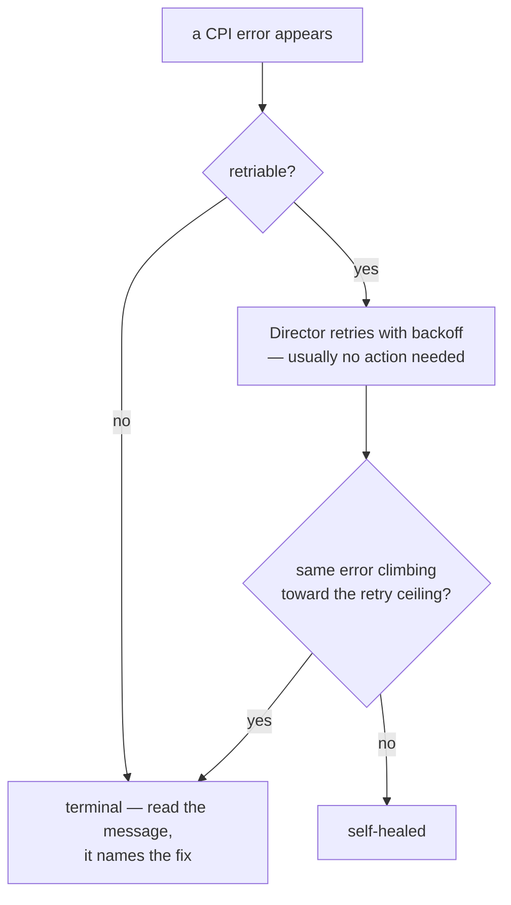

# Chapter 9 — When Things Go Wrong

*Minutes 46–52 of the hour.*

A deploy breaks at three in the morning. The person staring at it has an error string, a hung task, and no appetite for source code. The whole operability design of this CPI is built for that person, and this chapter is the survival kit: the one distinction that triages most failures, the places truth lives, and the question of who is allowed to heal what.

*The idea this chapter rests on: the system tells us, in every error, whether it will heal itself. Most failures are the platform being briefly busy; the skill is recognizing the few that are not — and starting every diagnosis from ground truth, not from the manifest.*

## The one distinction that does most of the work

Every error the CPI reports carries a flag saying whether the operation is safe to retry, and the Director obeys it. That flag splits the world in two.

Retriable errors are the platform being a hypervisor: a storage lock held by a backup job, a busy API worker, a network blip. The Director re-drives these automatically, with backoff, and a handful of retry lines in a task log is not a problem — it is the resilience layer doing its job. Terminal errors are structural: a permission missing, a storage pool misconfigured, an identifier range exhausted. No retry will fix them; they name what needs a human.

*Retry noise heals itself; a terminal error, or a retriable one that never stops, names the real work.*

The skill is not reading every log line — it is knowing which lines to ignore. Occasional retries: ignore. The same retriable error climbing relentlessly toward its ceiling: treat as structural.

## Where truth lives

Diagnosis starts from what the system actually consumed, never from what we intended.

- The full story of any task, including every CPI request and response: `bosh task <id> --debug`.

- The CPI's own log on the Director VM: `/var/vcap/sys/log/bosh/cpi/pve.log`.

- The configuration the binary actually read — rendered, defaulted, resolved: `/var/vcap/jobs/pve_cpi/config/cpi.json`. When behavior seems to contradict the manifest, this file settles the argument.

The troubleshooting runbook is organized to match how incidents actually unfold: indexed by *symptom* — the literal error text, the observable misbehavior — because at three in the morning nobody knows the cause yet. Its flagship entry is the flapping-agent story from Chapter 6, complete with the packet-capture procedure that proves a duplicate address in minutes. And when records drift — a failed deploy, a VM removed behind BOSH's back — `bosh cloud-check` compares the Director's database against cluster reality and offers the repairs. Run it after any failed deploy before trying again; it is the tool built exactly for that moment.

For shops that want numbers, two opt-ins from Chapter 8's sleeping family: a simple metrics file logging every request's duration and outcome, and full OpenTelemetry tracing that turns one slow deploy into a timed, browsable tree of every underlying API call. Both off by default, both unable to break a deploy when their collector goes away.

## One healer at a time

The subtlest day-two topic deserves its own minute. Two different systems are willing to resurrect a failed VM: BOSH's resurrector, which watches agent heartbeats and rebuilds missing machines, and Proxmox's HA manager, which watches nodes and restarts or relocates guests. Out of the box there is no conflict — the CPI registers nothing with Proxmox HA, and BOSH alone heals. The moment we opt into the HA-backed features from Chapter 5, Proxmox becomes a healer too, and two healers with no knowledge of each other will race: one restarts the old machine while the other builds a replacement, and the deployment ends up with duplicates fighting over an address.

The rule is one sentence: **for any deployment, exactly one system owns recovery.** Keep the resurrector on and stay out of Proxmox HA, or register with HA and switch the resurrector off for that deployment. The CPI warns when it sees the risky combination; the HA guide has the full ownership matrix and measured failover timings.

## Where this leads

That is the machinery, the configuration, and the failure modes — the working knowledge for operating this system. What remains is the map: where each deeper document lives for the day one of these five-minute topics needs to become an afternoon. That, and questions, is [Chapter 10](10-where-to-go-next.md).
