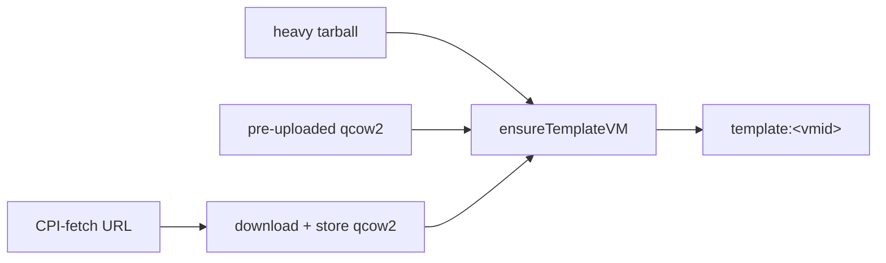

# Light Stemcells

Light stemcells let operators reference an existing or remotely hosted qcow2 image
instead of transferring image bytes through BOSH on every deploy. Two modes are
available:

1. **Pre-uploaded** — operator places a qcow2 on PVE storage out-of-band and
   references it via `cloud_properties.image_id`.

2. **CPI-assisted fetch** — operator references a remote URL via
   `cloud_properties.image_url`; the CPI fetches it once and caches it in PVE
   storage, deduplicating on re-deploy.

Both modes build a frozen template VM and return a stemcell CID of the form
`template:<vmid>` (e.g., `template:30042`). `bosh delete-stemcell` on a
`template:` CID destroys that template VM and its backing volume. The legacy
`light:` CID prefix is recognized for backward compatibility on delete only —
current code does not produce it. See the [Architecture — Stemcell Model](architecture.md#stemcell-model)
section for the full CID dispatch table.

## When to use

- **Air-gapped lab** — upload once via `pvesm` or the PVE Upload API and reuse across
  redeploys without touching the BOSH director upload path.

- **Multi-deployment infrastructure** — point multiple deployments at the same CPI-fetched
  image from a private mirror; the CPI reuses the cached copy.

- **Large stemcells** — avoid the director-to-CPI upload bottleneck when bandwidth
  between the director and PVE storage is limited.

## Storage requirements

Light stemcells require **file-content** PVE storage. Block-only backends cannot
accept qcow2 uploads and are rejected.

| PVE storage type | Supported | Notes |
|---|---|---|
| `dir` | yes | Local directory; requires `cloud_properties.node` on multi-node clusters. |
| `nfs` | yes | Shared; no node pin required. |
| `cifs` | yes | Shared; no node pin required. |
| `cephfs` | yes | Shared; no node pin required. |
| `glusterfs` | yes | Shared; no node pin required. |
| `btrfs` | yes | Local; requires `cloud_properties.node` on multi-node clusters. |
| `lvm` | **no** | Block-only. |
| `lvmthin` | **no** | Block-only. |
| `zfspool` | **no** | Block-only. |
| `rbd` | **no** | Block-only (raw RBD images; qcow2 unsupported). |

**Policy by cluster shape:**

- **Single-node** — any file-content backend is accepted. `cloud_properties.node`
  is optional.

- **Multi-node + shared storage** (nfs, cifs, cephfs, glusterfs) — accepted without
  node pinning.

- **Multi-node + local storage** (dir, btrfs) — `cloud_properties.node` is required.
  Without it, the CPI cannot guarantee that the uploaded image and any VM that uses it
  land on the same node.

## Mode 1: Pre-uploaded

The operator uploads the qcow2 to PVE storage manually. The CPI confirms the file
is present, builds a frozen template VM from it, and returns `template:<vmid>`.

### Operator workflow

1. Upload the qcow2 to the target PVE storage. Two paths exist:

   ```bash
   # From a PVE host shell:
   pvesm upload <storage> /path/to/bosh-stemcell-ubuntu-jammy-1.438.qcow2 --content import
   ```

   Or use the PVE web UI: navigate to the storage, open the **Content** tab, and
   click **Upload**.

2. Note the resulting volid. The PVE storage browser displays it in the form
   `<storage>:import/<filename>`. Example:
   `nfs-stemcells:import/bosh-stemcell-ubuntu-jammy-1.438-a1b2c3d4.qcow2`

3. Author the stemcell tarball. The minimal `stemcell.MF` below references the
   pre-uploaded volume via `cloud_properties.image_id`:

   ```yaml
   name: bosh-proxmox-kvm-ubuntu-jammy-go_agent-light
   version: "1.438"
   api_version: 2
   operating_system: ubuntu-jammy
   stemcell_formats:
     - proxmox-kvm
   cloud_properties:
     image_id: "nfs-stemcells:import/bosh-stemcell-ubuntu-jammy-1.438-a1b2c3d4.qcow2"
     name: ubuntu-jammy
     version: "1.438"
     disk_format: qcow2
     os_type: l26
     disk: 10240
     # Required when storage is local-dir on a multi-node cluster:
     # node: pve-node1
   ```

   The `bosh repack-stemcell` command can inject or replace `cloud_properties` in an
   existing stemcell tarball, avoiding the need to author one from scratch.

4. Upload to the director:

   ```bash
   bosh upload-stemcell <light-tarball.tgz>
   ```

   The CPI confirms `image_id` points to a real volume on PVE, builds a frozen
   template VM from it, and returns a `template:<vmid>` CID (e.g., `template:30042`).

5. Deploy normally. `bosh deploy` passes the `template:` CID to `create_vm`, which
   clones the template directly.

### Error messages

| Error | Cause | Fix |
|---|---|---|
| `image_id %q is not a valid storage volid` | `image_id` does not match `<storage>:import/<file>` | Correct the volid format. |
| `light stemcell image_id %q not found on storage %q node %q` | File not present on PVE. | Run `pvesm list <storage>` to confirm the upload landed. See [Troubleshooting](#troubleshooting) for the rescan note. |
| `storage %q is local on a multi-node cluster` | Local-dir storage on a cluster with no node pin. | Add `cloud_properties.node: <nodename>`. |
| `storage %q (type=%q) is block-only` | LVM, ZFS, or RBD storage chosen. | Switch to a file-content storage (nfs, dir, cephfs). |

## Mode 2: CPI-assisted fetch

The CPI fetches the qcow2 from a remote URL, streams it into PVE storage, builds a
frozen template VM from it, and returns `template:<vmid>`. Subsequent
`bosh upload-stemcell` calls for the same image skip the download entirely.

### URL schemes

| Scheme | Format | Notes |
|---|---|---|
| `https://` | `https://host/path/to/stemcell.qcow2` | Basic or Bearer auth supported. |
| `s3://` | `s3://bucket/key` | AWS S3 or S3-compatible (MinIO, Cloudflare R2) with optional endpoint override. |
| `bosh+blobstore:` | `bosh+blobstore:<blob-id>` | BOSH Director blobstore via HTTP. |
| `oci://` | `oci://registry/repo:tag` | OCI artifact registry. |

### Credentials

Credentials can be supplied per-stemcell in `cloud_properties` or centrally in the CPI config.

#### Per-stemcell credentials

Set `cloud_properties.image_url_auth` in `stemcell.MF`. Per-stemcell auth overrides any
config-level defaults.

```yaml
cloud_properties:
  image_url: "https://artifactory.corp/stemcells/ubuntu-jammy-1.438.qcow2"
  image_url_auth:
    type: bearer
    bearer_token: "<token>"
```

#### Centralized credentials (CPI config)

Add entries to `pve.fetch_credential_defaults` in the CPI job properties. Each entry maps
a URL prefix to an auth payload. When multiple entries match, the longest prefix wins.

```yaml
properties:
  pve:
    fetch_credential_defaults:
      - url_prefix: "https://artifactory.corp/"
        auth:
          type: basic
          username: robot
          password: "<password>"
      - url_prefix: "s3://stemcells-mirror/"
        auth:
          type: s3
          access_key_id: "AKIAEXAMPLE"
          secret_access_key: "<secret>"
          endpoint: "https://s3.lab.local"
```

Per-stemcell `image_url_auth` takes priority over config defaults. Among config defaults,
the entry with the longest matching `url_prefix` wins.

### Auth payload schemas

Each auth payload requires a `type` field that selects the scheme.

**`basic`**
```yaml
type: basic
username: "<username>"
password: "<password>"
```

**`bearer`**
```yaml
type: bearer
bearer_token: "<token>"
```

**`s3`**
```yaml
type: s3
access_key_id: "<access-key>"
secret_access_key: "<secret>"
# Optional — set for S3-compatible endpoints:
endpoint: "https://minio.lab.local"
region: "us-east-1"
force_path_style: true
```
When `endpoint` is set, path-style addressing is enabled automatically (needed for
MinIO and most S3-compatible servers).

**`oci`**
```yaml
type: oci
username: "<registry-user>"   # omit for anonymous pull
password: "<registry-token>"
```

**`blobstore`**
```yaml
type: blobstore
endpoint: "https://blobstore.director.internal:25251"
username: "<user>"    # optional
password: "<pass>"    # optional
```

### Dedup

The CPI deduplicates fetched images using a `(name, version, sha8)` filename pattern. When
`bosh upload-stemcell` is called again for the same image:

1. The CPI scans PVE storage for any import volume with a matching `name`+`version` prefix.
2. If a match is found, it returns the existing `template:<vmid>` CID without fetching the remote URL.
3. After the fetch, an exact SHA-256 check provides a second dedup gate.

A re-deploy or repeat `bosh upload-stemcell` for an already-cached image completes in
milliseconds.

### Error messages

| Error | Cause | Fix |
|---|---|---|
| `unsupported URL scheme in %q` | `image_url` scheme not in the supported list. | Use `https://`, `s3://`, `bosh+blobstore:`, or `oci://`. |
| `fetch %q: HTTP 401` | Credentials missing or wrong. | Check `image_url_auth` or `fetch_credential_defaults`. |
| `resolve credentials: ... missing required field` | Malformed auth payload. | Check `type` field and required keys for the scheme. |
| `storage %q (type=%q) is block-only` | Fetch target storage is LVM/ZFS/RBD. | Switch `stemcell_storage` to a file-content backend. |
| `storage %q is local on a multi-node cluster` | Local storage, no node pin. | Add `cloud_properties.node`. |

## Template VM lifecycle

All stemcell paths — heavy, pre-uploaded, and CPI-fetch — converge on the same lifecycle:
the CPI builds a frozen PVE template VM and returns its VMID as the stemcell CID.



### VMID range

Template VMs are allocated from a dedicated VMID range, separate from VM and disk
ranges, so they are easy to identify in the PVE UI. The default range is `[30000, 30999]`.
Override with `pve.stemcell_template_vmid_range_start` and
`pve.stemcell_template_vmid_range_end` in the CPI config.

### SHA-tag deduplication and race reconciliation

After uploading the qcow2, `ensureTemplateVM` tags the template VM with
`bosh-stemcell-sha-<sha8>` where `sha8` is the first 8 hex characters of the SHA-256
digest. On subsequent `create_stemcell` calls for the same image:

1. The CPI first checks for an existing template VM carrying that SHA tag.
2. If not found by tag, it falls back to the deterministic filename lookup.
3. If another `create_stemcell` call raced and created a duplicate, `reconcileTemplateRace`
   scans for duplicates, keeps the survivor, and deletes the extra template.

### Pool and node pinning

Two optional config keys control template VM placement:

- `pve.stemcell_template_node` — pins template creation to a specific cluster node;
  `delete_stemcell` uses the same node for the primary destroy.

- `pve.stemcell_template_pool` — assigns template VMs to a named PVE resource pool,
  which scopes access controls and enables bulk operations.

### Template replication

When `pve.stemcell_replicate_local` is enabled, the CPI replicates the template VM to
all cluster nodes after creation, up to `pve.stemcell_replication_concurrency` parallel
copies (default: serial). Individual node replication failures are logged as warnings
and do not fail `create_stemcell`. `delete_stemcell` performs a cross-node SHA-tag sweep
to remove all replicas regardless of whether replication was enabled originally.

### Provenance and orphan pruning

When `pve.stemcell.provenance` is enabled, the CPI stores a JSON provenance record in
the template VM description and applies `bosh-stemcell-sha` and `bosh-stemcell-name`
tags. This lets the operator audit which templates correspond to which BOSH stemcell
uploads.

`pve.stemcell.prune_orphans` (requires `pve.stemcell.director_id`) removes template
VMs cluster-wide that carry the director's tag but are no longer tracked by the current
director. Orphan pruning is best-effort: individual sweep failures do not fail
`delete_stemcell`.

## Operator caveats

`bosh delete-stemcell` on a `template:` CID destroys the template
VM and its backing disk volume via PVE purge. No manual `pvesm free` step is needed.
Verify deletion by running `bosh stemcells` before and after; the CID disappears afterward.

**Legacy `light:` CIDs** (produced only by CPI versions predating the template-VM
model) are treated as no-ops: `bosh delete-stemcell` on a `light:` CID logs an INFO
entry and returns success without touching PVE. If the director still holds `light:`
CIDs from a prior CPI version, manage those volumes manually:

```bash
# From a PVE host shell:
pvesm free <storage>:import/<filename>

# Example:
pvesm free nfs-stemcells:import/bosh-stemcell-ubuntu-jammy-1.438-a1b2c3d4.qcow2
```

Alternatively, open the PVE web UI, navigate to the storage's **Content** tab, select
the volume, and click **Remove**.

## Troubleshooting

**Existence check fails immediately after `pvesm upload`**

PVE caches storage content listings. The CPI queries that listing during the
pre-uploaded existence check. If `pvesm list <storage>` does not yet show the file,
run `pvesm rescan` on the PVE node or wait approximately 10 seconds and retry
`bosh upload-stemcell`.

**Partial upload artifact left after a fetch failure**

Look for `*.partial` files in the storage content list:

```bash
pvesm list <storage> --content import
```

Delete any partial file before retrying:

```bash
pvesm free <storage>:import/<partial-filename>
```

**CPI version downgrade after light stemcells were used**

A CPI version that predates the template-VM model cannot parse `template:` CIDs. Before
downgrading, re-upload all stemcells using the normal (heavy) path so the director holds
the older CID format. Do not downgrade while any deployment still references a `template:` CID.

## See also

- [Architecture — Stemcell Model](architecture.md#stemcell-model) — CID dispatch table,
  clone behavior, and the create/delete lifecycle overview.
- [Persistent disks](persistent-disks.md) — storage backend classification and
  cloud-properties for disk pools.
- [ConfigDrive layout](configdrive.md) — ISO delivery for agent bootstrap.
- [Configuration reference](configuration.md) — stemcell config keys
  (`stemcell_template_vmid_range_start/end`, `stemcell_template_node`,
  `stemcell_template_pool`, `stemcell_replicate_local`,
  `stemcell_replication_concurrency`, `stemcell.provenance`, `stemcell.director_id`,
  `stemcell.prune_orphans`).
- [BOSH light-stemcell convention](https://bosh.io/docs/stemcell/) — the equivalent
  feature in AWS, OpenStack, and GCP CPIs uses the same operator workflow.
