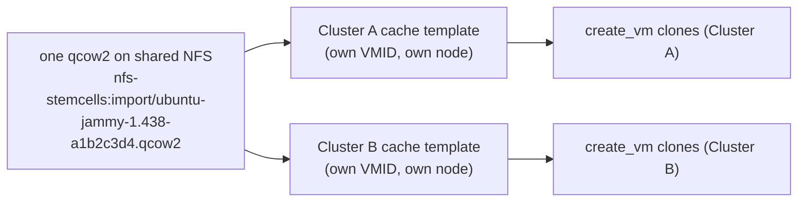
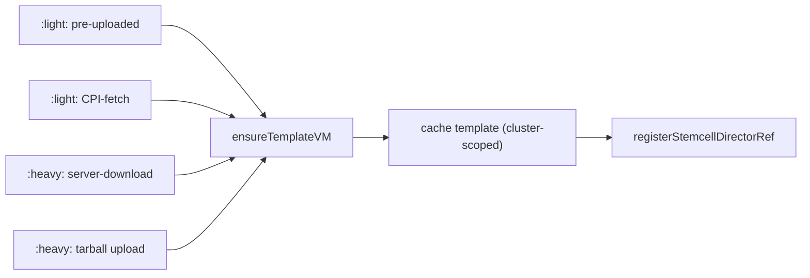

# Light Stemcells

Every stemcell CID this CPI issues identifies a qcow2 file on PVE storage, not any PVE VMID — the file path itself is the stemcell's identity, prefixed with a kind discriminator:

- **`:light:<storage>:import/<file>`** — an operator-managed qcow2. The operator places the file (or points the CPI at one to fetch) and owns its lifecycle; the CPI never deletes it, no matter how many directors stop referencing it.

- **`:heavy:<storage>:import/<file>`** — a CPI-managed qcow2. The CPI uploaded or downloaded the bytes, and deletes the file when the last BOSH director reference within this cluster is dropped.

Both kinds build (or reuse) a frozen PVE template VM as a per-cluster **clone-source cache** — this is a performance mechanism, not part of the CID, and its VMID is never exposed to the Director. `create_vm` clones the cache template instead of importing the qcow2 fresh into every VM's root disk. Because the cache is keyed by content hash, one qcow2 shared across multiple PVE clusters gets one independently-built cache template per cluster, all cloning from the same source file.

There is no legacy CID compatibility: `create_stemcell` and `delete_stemcell` accept only the `:light:`/`:heavy:` grammar above. Every earlier grammar — a bare `<storage>:import/<file>`, a `light:...`/`template:<vmid>` prefix, or a bare integer VMID — is rejected as a hard, non-retriable parse error.

## Choosing a mode

| Mode | `cloud_properties` | Who owns the file | When the CPI deletes it |
|---|---|---|---|
| **Pre-uploaded** (`:light:`) | `image_id` + required `sha256` | Operator | Never |
| **CPI-fetch** (`:heavy:` — see [naming note](#a-naming-note-image_url-produces-heavy-not-light) below) | `image_url` (+ optional `image_url_auth`) | CPI | At last director reference in this cluster |
| **Server-side download** (`:heavy:`) | `source_url` + required `sha256` | CPI | At last director reference in this cluster |
| **Heavy tarball upload** (`:heavy:`) | none of the above — the normal `bosh upload-stemcell` path | CPI | At last director reference in this cluster |

`image_id`, `image_url`, and `source_url` are mutually exclusive; setting more than one is a `create_stemcell` error.

### A naming note: `image_url` produces `:heavy:`, not `:light:`

Despite the "light stemcell" umbrella term this document covers, only the **pre-uploaded** mode (`image_id`) returns a `:light:` CID — the CPI never took ownership of those bytes. `image_url` (CPI-fetch) and `source_url` (server-side download) both transfer bytes under CPI control (directly, or via PVE's own download-url API), so both return `:heavy:` — the CPI, not the operator, owns deleting that file at last reference. The distinction that matters operationally is *who owns deletion*, not *who initiated the transfer*.

## Why `:light:` matters: one file, every cluster

The headline scenario this design serves: upload one qcow2 to a shared NFS export once, and every PVE cluster with `stemcell_storage` pointed at that export serves it — no per-cluster upload traffic, no cross-cluster refcounting complexity, because a `:light:` file is never deleted by the CPI regardless of how many clusters or directors reference it.



Each cluster still builds and owns its own cache template — a template is a per-cluster clone source, and guest configuration is cluster-specific — but the qcow2 underneath every cache is the same file, uploaded once. This is the storage shape [Multi-cluster deployments](multi-cluster.md#light-stemcells-one-file-every-cluster) documents in full; see that page for the worked cpi-config example and the disjoint-VMID-banding requirement that makes sharing storage across clusters safe. `pve.stemcell_strategy` (default `template`) controls whether `create_vm` clones the cache or imports the qcow2 directly per VM; per-VM `cloud_properties.stemcell_strategy` overrides it.

## Storage requirements

Light-stemcell modes (pre-uploaded, CPI-fetch, and server-side download all share this policy) require **file-content** PVE storage. Block-only backends cannot accept qcow2 uploads and are rejected.

| PVE storage type | Supported | Notes |
|---|---|---|
| `dir` | yes | Local directory; requires `cloud_properties.node` on multi-node clusters. |
| `nfs` | yes | Shared; no node pin required. |
| `cifs` | yes | Shared; no node pin required. |
| `cephfs` | yes | Shared; no node pin required. |
| `glusterfs` | yes | Shared; no node pin required. |
| `btrfs` | yes | Local; requires `cloud_properties.node` on multi-node clusters. |
| `lvm` | **no** | Block-only. |
| `lvmthin` | **no** | Block-only. |
| `zfspool` | **no** | Block-only. |
| `rbd` | **no** | Block-only (raw RBD images; qcow2 unsupported). |

**Policy by cluster shape:**

- **Single-node** — any file-content backend is accepted. `cloud_properties.node` is optional.

- **Multi-node + shared storage** (nfs, cifs, cephfs, glusterfs) — accepted without node pinning.

- **Multi-node + local storage** (dir, btrfs) — `cloud_properties.node` is required. Without it, the CPI cannot guarantee that the uploaded image and any VM that uses it land on the same node.

## Mode 1: Pre-uploaded (`:light:`)

The operator uploads the qcow2 to PVE storage manually and declares its SHA-256 digest. The CPI never uploads, deletes, or rewrites the underlying volume — it only confirms the file is present, builds (or reuses) a frozen cache template from it, and registers this director's reference.

`cloud_properties.sha256` is **required** in this mode (the tarball and CPI-fetch paths compute the digest themselves from bytes they handle; this one and server-download cannot): content identity and sha-tag cache dedup both depend on it, and a missing or malformed digest is a hard `create_stemcell` error before any PVE call is made.

### Operator workflow

1. Upload the qcow2 to the target PVE storage. Two paths exist:

   ```bash
   # From a PVE host shell:
   pvesm upload <storage> /path/to/bosh-stemcell-ubuntu-jammy-1.438.qcow2 --content import
   ```

   Or use the PVE web UI: navigate to the storage, open the **Content** tab, and click **Upload**.

2. Compute the SHA-256 digest of the uploaded file (required — see above):

   ```bash
   sha256sum bosh-stemcell-ubuntu-jammy-1.438.qcow2
   ```

3. Note the resulting volid. The PVE storage browser displays it in the form `<storage>:import/<filename>`. Example: `nfs-stemcells:import/bosh-stemcell-ubuntu-jammy-1.438-a1b2c3d4.qcow2`.

4. Author the stemcell tarball. The minimal `stemcell.MF` below references the pre-uploaded volume via `cloud_properties.image_id`. `image_id` accepts either a bare volid or a full `:light:` path-identity CID (a `:heavy:` CID is rejected here — that kind asserts CPI ownership, which a pre-uploaded image contradicts by definition):

   ```yaml
   name: bosh-proxmox-kvm-ubuntu-jammy-go_agent-light
   version: "1.438"
   api_version: 2
   operating_system: ubuntu-jammy
   stemcell_formats:
     - proxmox-kvm
   cloud_properties:
     image_id: "nfs-stemcells:import/bosh-stemcell-ubuntu-jammy-1.438-a1b2c3d4.qcow2"
     sha256: "<64-character sha256 hex digest from step 2>"
     name: ubuntu-jammy
     version: "1.438"
     disk_format: qcow2
     os_type: l26
     disk: 10240
     # Required when storage is local-dir/btrfs on a multi-node cluster:
     # node: pve-node1
   ```

   The `bosh repack-stemcell` command can inject or replace `cloud_properties` in an existing stemcell tarball, avoiding the need to author one from scratch.

5. Upload to the director:

   ```bash
   bosh upload-stemcell <light-tarball.tgz>
   ```

   The CPI confirms `image_id` points to a real volume on PVE, builds (or reuses) a frozen cache template from it, registers this director's reference, and returns a `:light:<storage>:import/<file>` CID.

6. Deploy normally. `bosh deploy` passes the `:light:` CID to `create_vm`, which clones the cache template (or imports the qcow2 directly under `stemcell_strategy: import`).

### Error messages

| Error | Cause | Fix |
|---|---|---|
| `preuploaded stemcells must declare sha256 ...` | `cloud_properties.sha256` missing or not a 64-character hex string. | Compute and add the digest (step 2 above). |
| `cloud_properties.image_id %q is not a valid path-identity CID` | `image_id` starts with `:` but doesn't parse as `:light:...`/`:heavy:...`. | Correct the CID or use a bare volid instead. |
| `cloud_properties.image_id %q has kind "heavy"; preuploaded stemcells must use a bare volid or a ":light:" CID` | `image_id` is a `:heavy:` CID. | Use a bare volid or a `:light:` CID — a `:heavy:` CID asserts CPI ownership, which a pre-uploaded image contradicts. |
| `cloud_properties.image_id %q is not a valid storage volid` | `image_id` does not match `<storage>:import/<file>`. | Correct the volid format. |
| `light stemcell image_id %q not found on storage %q node %q` | File not present on PVE. | Run `pvesm list <storage>` to confirm the upload landed; see [Troubleshooting](#troubleshooting) for the rescan note. |
| `storage %q is local on a multi-node cluster` | Local-dir/btrfs storage on a cluster with no node pin. | Add `cloud_properties.node: <nodename>`. |
| `storage %q (type=%q) is block-only` | LVM, ZFS, or RBD storage chosen. | Switch to a file-content storage (nfs, dir, cephfs, cifs, glusterfs, btrfs). |

## Mode 2: CPI-assisted fetch (`:heavy:`)

The CPI fetches the qcow2 from a remote URL, streams it into PVE storage while computing its SHA-256 in one pass, builds (or reuses) a frozen cache template, and returns a `:heavy:` CID (see the [naming note](#a-naming-note-image_url-produces-heavy-not-light) above — this mode is covered by the "light stemcell" umbrella term because of the historical feature name, but the CPI transferred the bytes, so it owns deleting them). Subsequent `bosh upload-stemcell` calls for the same content skip the download entirely.

When the `image_url` qualifies, we route it through PVE's own download-url API first, the same server-side transfer [Mode 3](#mode-3-server-side-download-heavy) uses: PVE streams the bytes directly into storage and the CPI never carries them, which also sidesteps upload proxying across cluster nodes. Three conditions must all hold: the URL is plain `https://`, `cloud_properties.sha256` is present (the server-side path derives filename, dedup, and CID identity from the digest), and no credentials apply to the URL (neither `image_url_auth` nor a matching entry in the CPI config's centralized credentials, since PVE would not send them). Both paths derive the same digest-based filename and `:heavy:` CID, so if the server-side attempt fails we log a warning and fall back to the CPI-side fetch described here, with no change to the stemcell's identity.

### URL schemes

| Scheme | Format | Notes |
|---|---|---|
| `https://` | `https://host/path/to/stemcell.qcow2` | Basic or Bearer auth supported. |
| `s3://` | `s3://bucket/key` | AWS S3 or S3-compatible (MinIO, Cloudflare R2) with optional endpoint override. |
| `bosh+blobstore:` | `bosh+blobstore:<blob-id>` | BOSH Director blobstore via HTTP. |
| `oci://` | `oci://registry/repo:tag` | OCI artifact registry. |

### Credentials

Credentials can be supplied per-stemcell in `cloud_properties` or centrally in the CPI config.

#### Per-stemcell credentials

Set `cloud_properties.image_url_auth` in `stemcell.MF`. Per-stemcell auth overrides any config-level defaults.

```yaml
cloud_properties:
  image_url: "https://artifactory.corp/stemcells/ubuntu-jammy-1.438.qcow2"
  image_url_auth:
    type: bearer
    bearer_token: "<token>"
```

#### Centralized credentials (CPI config)

Add entries to `pve.fetch_credential_defaults` in the CPI job properties. Each entry maps a URL prefix to an auth payload. When multiple entries match, the longest prefix wins.

```yaml
properties:
  pve:
    fetch_credential_defaults:
      - url_prefix: "https://artifactory.corp/"
        auth:
          type: basic
          username: robot
          password: "<password>"
      - url_prefix: "s3://stemcells-mirror/"
        auth:
          type: s3
          access_key_id: "AKIAEXAMPLE"
          secret_access_key: "<secret>"
          endpoint: "https://s3.lab.local"
```

Per-stemcell `image_url_auth` takes priority over config defaults. Among config defaults, the entry with the longest matching `url_prefix` wins.

### Auth payload schemas

Each auth payload requires a `type` field that selects the scheme.

**`basic`**
```yaml
type: basic
username: "<username>"
password: "<password>"
```

**`bearer`**
```yaml
type: bearer
bearer_token: "<token>"
```

**`s3`**
```yaml
type: s3
access_key_id: "<access-key>"
secret_access_key: "<secret>"
# Optional — set for S3-compatible endpoints:
endpoint: "https://minio.lab.local"
region: "us-east-1"
force_path_style: true
```
When `endpoint` is set, path-style addressing is enabled automatically (needed for MinIO and most S3-compatible servers).

**`oci`**
```yaml
type: oci
username: "<registry-user>"   # omit for anonymous pull
password: "<registry-token>"
```

**`blobstore`**
```yaml
type: blobstore
endpoint: "https://blobstore.director.internal:25251"
username: "<user>"    # optional
password: "<pass>"    # optional
```

### Dedup

Before fetching, the CPI does a best-effort prefix scan of storage for any existing volume matching the stemcell's name+version (avoiding a redundant network round-trip on a repeat upload with the same name+version, regardless of exact content match). After the fetch, an exact SHA-256-based filename check provides the precise dedup gate — a re-deploy or repeat `bosh upload-stemcell` for byte-identical content reuses the existing volume and completes in milliseconds.

### Error messages

| Error | Cause | Fix |
|---|---|---|
| `unsupported URL scheme in %q` | `image_url` scheme not in the supported list. | Use `https://`, `s3://`, `bosh+blobstore:`, or `oci://`. |
| `fetch %q: HTTP 401` | Credentials missing or wrong. | Check `image_url_auth` or `fetch_credential_defaults`. |
| `resolve credentials: ... missing required field` | Malformed auth payload. | Check `type` field and required keys for the scheme. |
| `storage %q (type=%q) is block-only` | Fetch target storage is LVM/ZFS/RBD. | Switch `stemcell_storage` to a file-content backend. |
| `storage %q is local on a multi-node cluster` | Local storage, no node pin. | Add `cloud_properties.node`. |

## Mode 3: Server-side download (`:heavy:`)

`cloud_properties.source_url` streams the image directly into PVE storage via PVE's own `download-url` API (`POST /nodes/{node}/storage/{storage}/download-url`, requires PVE 7.2+) — only the PVE node needs network access to `source_url`, not the CPI host. The CPI never transfers image bytes in this mode, but it does own the resulting import volume (the operator didn't pre-place it), so the returned CID is always `:heavy:`.

`cloud_properties.sha256` is **required** in this mode. It is forwarded to PVE as a server-side checksum (a task failure on mismatch is a non-retriable `create_stemcell` error) and baked into the canonical filename for exact-content dedup and sha-tag cache identity. A missing or malformed digest is a hard `create_stemcell` error raised before any PVE call:

```text
create_stemcell: server-download (cloud_properties.source_url) requires cloud_properties.sha256 so content identity and dedup work (must be a 64-character hex string, got "")
```

PVE, not the CPI, streams these bytes, so this path never computes a digest of its own to fall back on.

```yaml
cloud_properties:
  source_url: "https://artifacts.corp/stemcells/ubuntu-jammy-1.438.qcow2"
  sha256: "<64-character sha256 hex digest>"   # required
  name: ubuntu-jammy
  version: "1.438"
  disk_format: qcow2
  os_type: l26
```

## Mode 4: Heavy tarball upload (`:heavy:`)

The normal `bosh upload-stemcell <tarball>.tgz` path with no `image_id`/`image_url`/`source_url` set. The CPI extracts the tarball, computes the SHA-256 of the disk image, uploads the resulting qcow2 to `stemcell_storage`, and builds (or reuses) the cache template — this is the path every `bosh` CLI stemcell upload takes by default, with no special `cloud_properties` required beyond what the stemcell tarball itself already carries.

## Cache template lifecycle (all modes)

Every mode — pre-uploaded, CPI-fetch, server-download, and heavy tarball — converges on the same cache-template mechanism after the qcow2 is in place:



### Content-hash dedup and race reconciliation

`ensureTemplateVM` tags every cache template with `bosh-stemcell-sha-<sha8>` (the first 8 hex characters of the qcow2's SHA-256) when the digest is known. On a subsequent `create_stemcell` call for the same content:

1. A cluster-wide lookup by the `bosh-stemcell-sha-<sha8>` tag finds existing candidates. Each candidate's full SHA-256 (recorded in its provenance description) is re-verified against the wanted digest before reuse — a sha8 tag match alone is not proof of identity, since two different images can share an 8-hex-character tag by chance.
2. When sha8 is unknown the CPI falls back to a deterministic name lookup instead — a weaker identity, never used when content-addressed identity is available. Every mode now requires a digest, so this fallback is unreachable in normal operation.
3. If two `create_stemcell` calls race and both build a template for the same content, `reconcileTemplateRace` re-scans after freeze, keeps the lowest-VMID survivor cluster-wide, and deletes the loser's duplicate.

### Templates from a previous CPI generation

The sha8 tag records *content*, not ownership. Any CPI generation that ever cached the same BOSH stemcell on this cluster wrote the identical tag, so tag identity alone cannot tell "our cache template" from "a template some older CPI built and a still-running director is cloning from". Adopting the latter would register a reference against a template whose provenance records none, and the first `delete_stemcell` for that content would then see a reference count of zero and destroy a live template out from under the older director.

Every sha8-keyed lookup and sweep therefore requires a second marker before a template is eligible at all: either `bosh-stemcell-cache` (stamped on every cache template this CPI builds) or a `director--<uuid>` reference tag (stamped when a director registers a reference, which keeps an already-adopted template visible for refcounting and eventual cleanup). A template carrying neither is invisible — never adopted, never swept, never destroyed.

The practical consequence on a cluster mid-upgrade: the CPI builds its own cache template alongside the older generation's rather than reusing it, so both exist for a while and the same stemcell occupies template VMIDs twice. That is deliberate — a duplicated template costs disk, while a wrongly adopted one costs a running foundation. Once no director depends on the older templates, delete them manually; the CPI will never do it.

### VMID range

Cache template VMs allocate from a dedicated VMID range, separate from VM and disk ranges. Default `[30000, 30999]`; override with `pve.stemcell_template_vmid_range_start`/`_end`. See [Configuration — VMID ranges](configuration.md#vmid-ranges).

### Pool and node pinning

- `pve.stemcell_template_node` — pins cache-template creation to a specific cluster node; `delete_stemcell` uses the same node for the primary destroy.
- `pve.stemcell_template_pool` — assigns cache templates to a named PVE resource pool (default `bosh-templates`, create-if-missing). See [Configuration — Resource Pools](configuration.md#resource-pools).

### Template replication

When `pve.stemcell_replicate_local` is enabled, the CPI replicates the cache template to every other cluster node after creation. What decides whether replicas are needed is `vm_storage` — the pool every cache template's root disk lives on — being node-local; the qcow2 pool's own shared-ness is irrelevant to cloning, and a shared `stemcell_storage` with node-local `vm_storage` (one shared NFS `import` pool feeding clusters whose VM disks are on lvmthin) still needs replicas on every node `create_vm` may target. When the qcow2 pool is shared, replication skips the per-node file copy — the one shared file serves every node's `import-from` — and only builds the per-node template. This applies to every stemcell kind, including pre-uploaded `:light:` stemcells: the operator owns the light qcow2, but the cache template and its replicas are CPI-owned. Individual node failures are logged as warnings and do not fail `create_stemcell`. `delete_stemcell` sweeps all replicas cluster-wide via the same sha8-tag lookup used for the primary, regardless of when replication was enabled.

## Director-UUID reference counting

Every mode registers the calling BOSH director's UUID as a live reference on the cache template's provenance — this is a hard step, not best-effort: a silently dropped registration would let a different director's `delete_stemcell` destroy a template this director still depends on.

- **`create_stemcell`** (any mode, including a dedup hit that reuses an existing cache) always registers this director's reference before returning the CID.
- **`delete_stemcell`** removes this director's reference. The cache template is destroyed only when that was the *last* remaining reference in the cluster — refs from other directors sharing the same cluster keep the cache alive.
- **`:light:` files are never deleted**, regardless of reference count — only the cache template (the clone-source performance artifact) goes away at last reference; the operator-owned qcow2 is untouched.
- **`:heavy:` files are deleted at last reference**, in the same `delete_stemcell` call that destroys the last-referencing cache template.

Multiple directors sharing one PVE cluster each hold independent references on the same cache template — see [Multi-cluster deployments — Stemcell registration across CPI entries](multi-cluster.md#stemcell-registration-across-cpi-entries) for the `--fix` re-registration workflow when one BOSH director targets multiple cpi-config entries.

### `:heavy:` and a cross-cluster shared export do not mix

Reference counts are scoped to one cpi-config entry, because an entry can only see its own cluster's templates. That is harmless while each cluster owns its own copy of a file, and it is the whole reason `:light:` is safe on a shared export — nothing the CPI does can delete an operator-managed qcow2.

For `:heavy:` it is a trap. Point two entries' `stemcell_storage` at one shared export and both write the same deterministic filename, so both end up referencing one file while counting references separately. The first cluster to release its last reference deletes that file, and the second cluster's templates keep pointing at a path that is no longer there. Nothing in the surviving cluster's own state records why: its reference count never reached zero, so from its side the deletion is unexplained, and the failure usually surfaces later as a `create_vm` that cannot find its image.

Put `:heavy:` stemcells on storage only one entry can reach, or use `:light:` on the shared pool.

## Operator caveats

`bosh delete-stemcell` on a stemcell whose only remaining director reference is this director's destroys the cache template (and, for `:heavy:`, the qcow2). No manual `pvesm free` step is needed in that case. Verify with `bosh stemcells` before and after; the CID disappears once every director has released it.

For a `:light:` file, `pvesm free` (or the PVE UI's storage **Content** tab) is the *only* way to remove the qcow2 itself — the CPI will never do it:

```bash
# From a PVE host shell:
pvesm free <storage>:import/<filename>

# Example:
pvesm free nfs-stemcells:import/bosh-stemcell-ubuntu-jammy-1.438-a1b2c3d4.qcow2
```

## Inspecting stemcell CIDs with `pve-cid`

`pve-cid` ships on the Director VM at `/var/vcap/packages/pve_cpi/bin/pve-cid` — not on `PATH` by default. The examples below assume `export PATH="/var/vcap/packages/pve_cpi/bin:$PATH"`, or invoke the full path directly.

`pve-cid decode` is fully offline (no PVE API call, no config load) and prints a CID's structure — storage, volume path, filename, and (when extractable) sha8:

```bash
pve-cid decode ':light:nfs-stemcells:import/bosh-stemcell-ubuntu-jammy-1.438-a1b2c3d4.qcow2'
pve-cid decode ':heavy:local:import/bosh-stemcell-ubuntu-jammy-1.438-a1b2c3d4.qcow2' --json
```

`pve-cid stemcells` scans a live cluster (requires CPI config) and correlates cache templates with storage files, grouped by sha8, flagging entries with zero director references as orphan candidates:

```bash
pve-cid stemcells --config /path/to/cpi.json --orphans
```

## Troubleshooting

**Existence check fails immediately after `pvesm upload`**

PVE caches storage content listings. The CPI queries that listing during the pre-uploaded existence check. If `pvesm list <storage>` does not yet show the file, run `pvesm rescan` on the PVE node or wait approximately 10 seconds and retry `bosh upload-stemcell`.

**Partial upload artifact left after a fetch failure**

Look for `*.partial` files in the storage content list:

```bash
pvesm list <storage> --content import
```

Delete any partial file before retrying:

```bash
pvesm free <storage>:import/<partial-filename>
```

## See also

- [Multi-cluster deployments](multi-cluster.md) — the full `:light:` shared-storage walkthrough, disjoint VMID banding, and cross-cluster stemcell inventory.
- [Design Decisions](design-decisions.md) — the underlying rationale for the path-identity CID grammar and the qcow2 deletion policy.
- [Configuration reference](configuration.md) — stemcell config keys (`stemcell_template_vmid_range_start`/`_end`, `stemcell_template_node`, `stemcell_template_pool`, `stemcell_strategy`, `stemcell_replicate_local`).
- [CPI Methods — create_stemcell / delete_stemcell](cpi_methods.md) — the full method contract.
- [BOSH light-stemcell convention](https://bosh.io/docs/stemcell/) — the equivalent feature in AWS, OpenStack, and GCP CPIs uses the same operator workflow.
