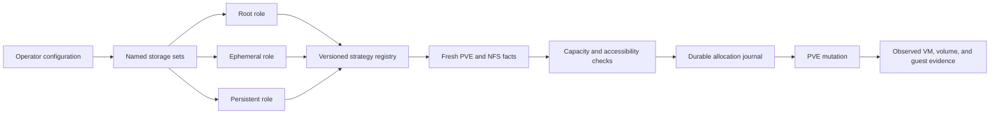
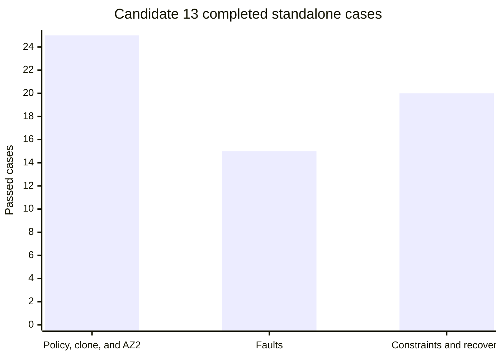
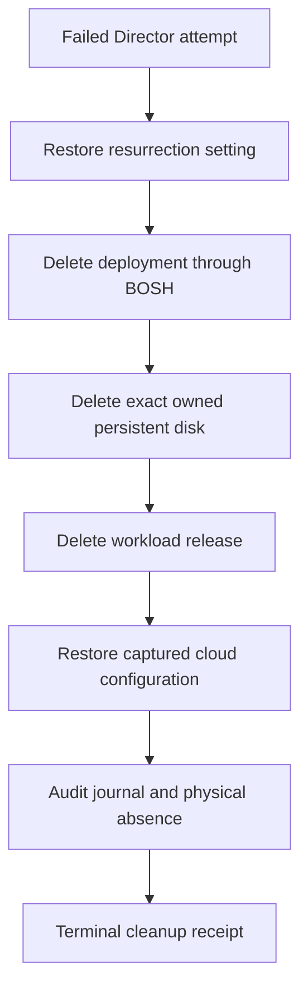

# Multi-storage placement implementation and validation report

## Report status

This report closes the local implementation and validation work on September 12, 2026. The multi-storage placement feature is implemented. Candidate 13 passed all sixty standalone lab cases, the separate four-VM routing batch, the Director update, and the Director compilation, errand, and recreation workloads. At the operator's direction, further Director upgrade certification and BATS will run through the weekly acceptance pipeline. No further local Director or BATS execution is part of this report's closure.

The report is final for this local campaign; full release certification is not claimed. The remaining Director core and rollout cases have no successful completion receipts. A successful cleanup proves resource removal, not acceptance of the failed workflow.

## What the implementation provides

Operators can define named storage sets and bind them independently to root, ephemeral, and persistent disk roles. A set can list storage IDs directly or resolve them from a regular expression. Each role chooses a versioned strategy, so operators can change the selection algorithm without changing the set's membership or the CPI's lifecycle contract.

The first implementation supplies three version 1 strategies:

| Strategy | Selection rule | Intended operator use |
| --- | --- | --- |
| `spread` | Uses deterministic rendezvous ranking over the allocation identity and backing identity. | Keeps allocations stable while distributing new work across eligible backings. |
| `weighted_free_space` | Weights deterministic selection by current free capacity after reservations. | Favors backings with more remaining capacity without making placement nondeterministic. |
| `least_utilized` | Selects the lowest projected utilization and uses deterministic identity ordering for ties. | Equalizes proportional use across backings with different sizes. |

The base deployment model is fully represented. Operators can bind root and dedicated ephemeral disks to a four-member NFS set while binding persistent disks to a separate one-member or multi-member NFS set. The same planner handles a singleton persistent set and a plural persistent set. Per-request selectors remain available within the operator's global role boundary, and they cannot escape that boundary.

The planner works from physical backing identities rather than storage names alone. It consolidates the same backing observed from several nodes, applies declared capacity domains, includes in-flight reservations, and rejects a plan that would exceed either an individual backing or a shared capacity envelope. Placement facts and policy fingerprints are recorded before mutation. Lifecycle calls then recover from the recorded allocation rather than recalculating the current policy.

## Lab topology

The live environment uses two three-node nested PVE clusters, `pve-cpi` and `pve-cpi-az2`, hosted by physical node `sm-0`. The physical host exports four shares for root and ephemeral storage and one share for persistent storage. A separate NFS storage provides images and ConfigDrive content. PMX manages the PVE storage definitions and all Proxmox inspection and mutation.

| Role | Storage IDs | Members | Live purpose |
| --- | --- | ---: | --- |
| Root and ephemeral | `nfs-ephemeral-1` through `nfs-ephemeral-4` | 4 | Spread or capacity-aware placement of VM-owned disks. |
| Persistent | `nfs-persistent-1` | 1 | Base singleton persistent policy and pinned persistent placement. |
| Persistent supplement | `nfs-persistent-cert-2` | 1 | Plural persistent and encrypted-subset certification. |
| Images and ISO | `nfs-images` | 1 | Stemcell cache, imports, snippets, and ConfigDrive ISO files. |
| Fault injection | `nfs-cert-fault` | 1 temporary definition | Export, quota, visibility, and interrupted-operation tests. |

The four-VM batch used deliberately selected allocation keys. It proved simultaneous routing to all four ephemeral shares while every persistent disk used `nfs-persistent-1`. This result demonstrates deterministic coverage of the pool. It does not claim statistical fairness for arbitrary groups of four allocations.

## Candidate identity and Director continuity

Candidate 13 was reconstructed and compiled on Linux from the preserved release inputs. The private Director receipt records the full guest executable digest, and the staged compilation receipt records the full workload harness binary digest. Those binaries have different build contexts, so their byte identities are not expected to match. This report does not turn abbreviated console values into checksum claims.

The Director update retained the following stable identities:

| Item | Verified value |
| --- | --- |
| Director VMID | `100090` |
| Director UUID | `9c88e707-478d-4895-a708-001403623838` |
| Persistent disk CID | `84d35e43-a61a-41f4-65ff-d52d3cabad1a` |
| Director service state | All 13 services running after the update. |
| Standalone closure | 12,230 evidence bindings accepted. |

Release acceptance uses the full hashes in the preserved candidate and Director receipts.

## Validation results

Candidate 13 has completed all standalone rows and the routing batch.

| Campaign | Result | Cleanup or absence proof | Retained evidence |
| --- | ---: | --- | --- |
| Policy, clone, and AZ2 | 25 of 25 | Per-case completion plus aggregate verification. | [Policy completion receipt](../.codex-work-preservation/candidate-v13/lab-evidence/policy-sequence-completion.json) |
| Fault injection | 15 of 15 | All 15 cases completed supported cleanup and fresh absence checks. | [Fault completion receipt](../.codex-work-preservation/candidate-v13/lab-evidence/fault-sequence-completion.json) |
| Constraints and recovery | 20 of 20 | Each case reached its required terminal state. | [Constraint and recovery receipt](../.codex-work-preservation/candidate-v13/lab-evidence/constraints-r4-sequence-completion.json) |
| Four-VM routing batch | 1 batch | All VMs and volumes were absent after cleanup. | Bound by the policy completion receipt. |
| Director compilation | Passed | Every fresh compilation VM and owned volume was absent afterward. | Preserved under `workload-v13-r6` and its predecessors on the bastion. |
| Director errand | Passed | The errand VM was retained for the workflow's final audited deletion. | Preserved under `workload-v13-r6` on the bastion. |
| Director recreation | Passed | The old VM generation became terminal, the replacement used a new VM CID and allocation UUID, and the persistent backing stayed stable. | Preserved under `workload-v13-r6` on the bastion. |
| Director resurrection | Not passed in this campaign | The failed attempt has a complete supported cleanup receipt. | `workload-v13-r6/post-failure-cleanup-verification.json` |
| BATS | Assigned to weekly acceptance | No acceptance result claimed. | Future pipeline report must identify the tested release. |
| Rollout | Not completed in this campaign | No acceptance result claimed. | Generic upgrade and BATS runs do not establish all three placement-specific rollout results. |

The retained standalone completion receipts keep `complete_release_matrix` set to `false`. That value is correct because the Director, BATS, and rollout gates are separate release requirements.

## Local test evidence

After applying the live-discovered harness corrections to the tracked source, the integrated Python suite passed all 679 tests. Focused tests for the six changed harness files passed 75 tests. The Go packages that own storage placement, inventory, allocation journaling, and CPI handlers also passed with a writable cache. The handler suite completed in 103.749 seconds.

The broad local Go command reached 1,528 passing tests before it stopped on sandbox restrictions for loopback listeners and the default Go cache, plus stale vendor metadata in command packages. Those failures did not occur in the storage packages, and they are not recorded as product passes. Candidate 13's preserved Linux source gate had already passed all 22 packages before this local rerun.

| Gate | Result | Scope |
| --- | --- | --- |
| Focused Python regression suite | 75 passed | Audit handling, VM disk discovery, Director scoping, and related workflow behavior. |
| Integrated Python suite | 679 passed | All scripts matching `*_test.py`. |
| `internal/storageplacement` | Passed | Strategy registry, deterministic vectors, weights, and capacity-domain inputs. |
| `internal/storageinventory` | Passed | Discovery, backing identity, aliases, capacity consolidation, and reservations. |
| `internal/allocationjournal` | Passed | Authority, transitions, retention, recovery, and audit records. |
| `internal/cpi/handlers` | Passed | Planning, selection, allocation, cleanup, lifecycle, and diagnostics. |

## Failures found and corrected

The following findings were corrected and covered by regression tests. Failed artifacts remain unchanged. Package revisions and output directories use separate counters. For example, the R9 workload wrote to `workload-v13-r6`, while R10 preparation wrote to `workload-v13-r7`. The R10 preflight failure is recorded separately because its cause was not established.

| Attempt | Observed failure | Cause | Correction and regression evidence | Cleanup disposition |
| --- | --- | --- | --- | --- |
| Director R4 | Settlement expired before execution. | The five-minute receipt lifetime was too short for the reviewed workflow. | Raised the settlement lifetime to 15 minutes and corrected the package instructions. | No workload mutation occurred. |
| Director R6 | The first audit stopped before parsing valid JSON. | The helper treated audit exit 1 as a transport failure, even though the audit command uses it for a semantically inspectable warning result. | `_json_command` now accepts only explicitly declared return codes. Audit calls declare `(0, 1)`, and all other callers retain `(0,)`. | The failed attempt was cleaned and baseline state was verified. |
| Director R7 | Recreation verification expected ephemeral storage at `scsi1`. | Persistent disk reattachment occupied `scsi1`, so PVE correctly placed the dedicated ephemeral disk at `scsi2`. | The verifier excludes known persistent volumes from its disk-role candidates without deleting them. It checks uniqueness and required slots, then verifies the one remaining SCSI disk against the ephemeral set. | Deployment, release, disks, and cloud configuration were restored. |
| Director R9 | Resurrection failed before deleting the VM. | The harness invoked `bosh delete-vm 100146` without the deployment scope required by BOSH. | Resurrection now calls the normal deployment-scoped operation path. A regression asserts `operation(["delete-vm", "100"])`. | The final receipt proves resurrection restored, deployment and release absent, baseline cloud configuration restored, 13 allocation records terminal, 10 VMIDs absent, and 3 persistent disk allocations absent. |

The exact removed-backend exception accepts only these three historical audit issues for `nfs-cert-fault`:

- `historical mutation backing for "nfs-cert-fault" changed or disappeared`

- `historical storage "nfs-cert-fault" changed or disappeared; original backing needs audit`

- `historical storage "nfs-cert-fault" is absent from definitions`

The audit must still report a healthy generation index, cluster continuity, a complete VM scan, and no conflicts. A clean audit must be complete with no issues. A removed-backend audit must be incomplete with exactly the three issues above. Extra, missing, duplicated, or conflicting evidence fails certification.

## Cleanup evidence for the last mutating attempt

The R9 cleanup receipt has SHA-256 `f3f5505cada60b24cc6e175f542a2267904f427a96f20d8aacdfc7eb6061a49a`. It records successful private commands for restoring resurrection, deleting the deployment, deleting the remaining disk, deleting the workload release, restoring the cloud configuration, and verifying each final state.

| Cleanup assertion | Verified result |
| --- | --- |
| Resurrection | Enabled and restored to its observed prior value. |
| Deployment | Absent. |
| Workload release | Absent. |
| Cloud configuration | Byte-equivalent to the captured baseline. |
| Allocation records | All 13 owned records are `deleted`. |
| Workload VMIDs | All 10 observed VMIDs are absent. |
| Persistent allocations | All 3 observed persistent disk allocations are absent. |
| PMX inventory | No workload VM remains; the Director and pre-existing infrastructure remain. |

## Tooling and final preflight findings

Earlier session restrictions prevented Git index writes, PMX guest-agent requests, and some keychain operations. Full access restored writes in the original checkout and PMX connectivity to the physical host, all three primary lab nodes, and the bastion guest agent. The implementation checkpoint is committed as `98ba5ab` in the original CPI repository.

The PMX keychain correction grants the current executable access when storing a keychain item. It validates the executable path before deleting an old item, preserving the credential if executable lookup fails. All 240 configuration tests and `go vet` passed. The fix is committed as `e7087bb` in the original PMX repository. A later `pmx lab context sync pve-cpi` refreshed the lab token, and a separate PMX invocation successfully listed the nested nodes. That confirms restored access; it does not independently prove the ACL behavior of a rebuilt PMX binary. The [preserved patch](../.codex-work-preservation/pmx-keychain-trust-fix.patch) records the correction.

OCFP CLI v0.2.12 attempted a PVE provider lookup against a hostname that did not resolve in the earlier session. Continuation used the bastion guest agent through PMX. This report does not claim an OCFP fix.

After access returned, package `director-workload-v13-r10` began preparation as the bastion's `ubuntu` user. It captured baseline configuration and fixture files under `workload-v13-r7`, then stopped with `remote Director audit or identity read failed`. No deployment mutation or core execution followed. The partial preparation remains preserved and must not be treated as a prepared, unused output directory.

SSH authentication succeeded during diagnosis. A separate journal-audit command returned exit 1 with `storage journal operation failed; inspect retained evidence` and no audit JSON. This does not establish that the three historical removed-storage warnings caused the failure. The earlier diagnosis attributing R10 to those warnings is withdrawn. The Director audit acceptance rule was not relaxed. Future certification must establish the cause from fresh evidence before changing that rule.

## Weekly acceptance handoff

The operator assigned further Director upgrade certification and BATS to the weekly pipeline and closed this local campaign. The existing [acceptance workflow](../.github/workflows/acceptance.yml) schedules both suites for Saturdays at 02:30 UTC in the `cpitest` environment. Its [operating guide](certification/scheduled.md) describes the runner and report publication. No workflow was dispatched or changed as part of this report update.

Scheduled runs select the latest published CPI release. They validate this implementation only after that release contains the multi-storage changes. The workflow also supports an explicitly selected candidate artifact through manual dispatch, as described in [candidate artifact certification](certification/candidate-artifacts.md). A future result must identify its tested release and source before it can add evidence to this feature's certification record.

| Validation area | Disposition at local closure | Evidence needed for acceptance |
| --- | --- | --- |
| Director upgrade | Candidate 13 local update passed; further certification belongs to weekly acceptance. | A successful upgrade report for a release containing this implementation. |
| BATS | Assigned to weekly acceptance; no local pass claimed. | A successful BATS report for the same release. |
| Director resurrection and resource-policy removal | Local core sequence did not complete. | Successful placement-specific workload receipts. |
| Three placement rollout cases | Not completed locally. | Receipts covering the declared policy transitions, upgrade, and downgrade assertions. |
| R10 preflight | Failed before deployment mutation; partial preparation retained. | Diagnosis and a successful fresh preflight before reusing this local certification path. |

The weekly workflow runs general upgrade certification and BATS. Those results must not be credited as the remaining placement-specific Director and rollout cases unless their artifacts demonstrate those assertions. Existing receipts retain `complete_release_matrix=false`. Finalizing this report does not change historical outcomes or mark unexecuted checks as passed.

## Evidence index

| Evidence | Purpose |
| --- | --- |
| [Candidate preservation inventory](../.codex-work-preservation/README.md) | Identifies release archives, compiled receipts, reconstruction inputs, and retained live evidence. |
| [Policy completion](../.codex-work-preservation/candidate-v13/lab-evidence/policy-sequence-completion.json) | Binds 25 policy, clone, and AZ2 cases plus the four-VM batch. |
| [Fault completion](../.codex-work-preservation/candidate-v13/lab-evidence/fault-sequence-completion.json) | Binds 15 fault cases and all 15 cleanup checks. |
| [Constraint and recovery completion](../.codex-work-preservation/candidate-v13/lab-evidence/constraints-r4-sequence-completion.json) | Binds 20 constraint and recovery cases. |
| [Implementation progress](plans/multi-storage-placement-progress.md) | Maintains chronological checkpoints and historical failed-attempt context. |
| [Design](designs/multi-storage-placement-design.md) | Defines semantics, invariants, strategy contracts, and vSphere comparison. |
| [Implementation plan](plans/multi-storage-placement-plan.md) | Defines work packages, release gates, risks, and report requirements. |
