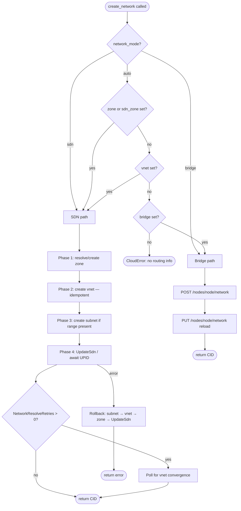

# Network Management

This CPI supports two network backends for BOSH managed networks: PVE SDN vnets and Linux bridges. When a BOSH cloud-config marks a network as `managed: true`, the Director calls `create_network` to provision the resource and `delete_network` to remove it. All other networks (pre-configured bridges, static VLANs) use `managed: false`; the CPI never calls their lifecycle handlers.

## SDN vs Bridge Routing

The handler selects a backend based on three inputs: the `network_mode` config property, the `zone` field in `cloud_properties`, and the CPI config `sdn_zone`. The routing logic runs in this order:

1. If `network_mode` is `"sdn"` → SDN path (unconditional; error if zone unresolvable).

2. If `network_mode` is `"bridge"` → bridge path (unconditional; error if bridge unresolvable).

3. If `network_mode` is `"auto"` (the default):
   - If `cloud_properties.zone` is set OR `config.sdn_zone` is set OR `cloud_properties.vnet` is set → SDN path.
   - Otherwise → bridge path (requires `cloud_properties.bridge` or `config.network_bridge`).

4. If neither path is resolvable → `cpierrors.Cloud` returned to the Director.

### Routing decision table

| `network_mode` | `cloud_properties.zone` | `config.sdn_zone` | `cloud_properties.bridge` / `config.network_bridge` | Outcome |
|---|---|---|---|---|
| `sdn` | any | any | any | SDN path |
| `bridge` | any | any | any | Bridge path |
| `auto` | set | any | any | SDN path |
| `auto` | empty | set | any | SDN path |
| `auto` | empty | empty | set | Bridge path |
| `auto` | empty | empty | empty | Error: no routing info |

> **Note:** `config.sdn_zone` is loaded into the same `zone` variable as `cloud_properties.zone` before routing runs; the table reflects the effective per-path outcome.

For `delete_network`, the handler probes the SDN backend first (GET vnet by name). If the vnet exists, it takes the SDN delete path. If PVE reports the vnet absent (`ErrSDNNotFound`), it falls back to the bridge delete path. Any other probe error is returned to the Director.

### SDN Eventual Consistency

After `UpdateSdn` commits the SDN configuration, data-plane realization is asynchronous: each node must propagate the change before VMs can attach to the new vnet. When `pve.network_resolve_retries` is greater than zero, `create_network` polls the running cluster SDN config until the new vnet converges before returning success. The absolute time bound is `pve.network_resolve_timeout_sec` (default 60 s when retries are enabled; 0 = 60 s). When polling times out, the error is retriable and the Director re-drives.

By default `network_resolve_retries` is 0 (polling disabled); behavior is byte-identical to prior releases. External or static bridges such as `vmbr0` are never gated by this poll.

For async zone types (vlan, vxlan, evpn), `UpdateSdn` may return a UPID. The CPI awaits the UPID task to completion before the convergence poll begins, so subsequent `ListSdnVnets` calls observe committed state.

## cloud_properties schema

These keys are read from the per-network `cloud_properties` block in the BOSH cloud-config.

| Key | Type | Required | Meaning |
|---|---|---|---|
| `zone` | string | SDN path only, when `config.sdn_zone` is empty | PVE SDN zone name. Takes precedence over `config.sdn_zone`. |
| `zone_type` | string | no | Zone type to use when the CPI creates the zone (requires `sdn_auto_manage_zone: true`). One of: `simple`, `vlan`, `qinq`, `vxlan`, `evpn`. Falls back to `config.sdn_zone_type` (default `simple`). For async zone types (vlan, vxlan, evpn), `UpdateSdn` is asynchronous; the CPI awaits the UPID task before polling SDN convergence. |
| `vnet` | string | SDN path | PVE SDN vnet name. Must be 1–8 lowercase alphanumeric characters (regex `[a-z0-9]{1,8}`). Leading digits are allowed. |
| `bridge` | string | Bridge path only, when `config.network_bridge` is empty | Linux bridge interface name on the target node (e.g. `vmbr1`). |
| `node` | string | Bridge path only, when `config.node` is empty | PVE node where the bridge is created or deleted. |

### Vnet naming rules

PVE enforces a strict naming constraint on vnet identifiers: a vnet name must be 1–8 lowercase alphanumeric characters (regex `[a-z0-9]{1,8}`). Leading digits are allowed. Hyphens, underscores, and uppercase letters are rejected. The CPI validates this constraint before calling the SDN API and returns an error to the Director if the name is invalid. Choose short, lowercase names such as `boshvn`, `cf1net`, or `prodnet`.

## Zone auto-management

By default (`sdn_auto_manage_zone: false`), the CPI manages only vnets and subnets within an existing zone. The operator creates and deletes zones through the PVE UI or API. The CPI returns an error if `create_network` is called with a zone that does not exist in PVE.

When `sdn_auto_manage_zone: true`, the CPI may create and delete zones autonomously:

**Auto-create:** If the zone named in `cloud_properties.zone` or `config.sdn_zone` does not exist in PVE at `create_network` time, the CPI creates it using the zone type from `cloud_properties.zone_type` or `config.sdn_zone_type` (default `simple`). A name must always be supplied; the CPI never invents zone names.

**Auto-delete:** At `delete_network` time, the CPI removes the parent zone only when **all three** conditions hold:

1. `sdn_auto_manage_zone` is `true`.

2. The zone name does not match `config.sdn_zone` (the operator-pinned zone is never auto-deleted; it may be shared across multiple managed networks).

3. The zone has zero remaining vnets after the vnet is removed (confirmed by listing vnets filtered by zone before deleting).

If any condition fails, the zone is left in place. A list failure during the zone-empty check skips deletion rather than returning an error. Zone name comparison is case-insensitive.

**PVE constraint:** The SDN zone create API (`POST /cluster/sdn/zones`) does not accept description, notes, or comment fields. CPI-owned zones are not annotated in PVE; tracking which zones belong to the CPI is done through the stateless config rule (condition 2 above).

### Rollback on partial create

If zone create, vnet create, or subnet create succeeds but `UpdateSdn` fails, the CPI rolls back in reverse order: subnet → vnet → zone. Each rollback step is guarded: only resources created during the current call are removed; pre-existing resources are never touched. All rollback operations run on a context detached from the caller's cancellation so cleanup runs even if the caller aborts.

A rollback itself calls `applySDN` to commit the staged deletions, because every SDN mutation must be followed by `UpdateSdn` or it remains pending in the PVE config directory. If the rollback apply also fails, the warning is logged and the original error is returned. The `delete_network` path expects all three layers to be fully applied; a partially-applied state is cleaned up on the next `create_network` retry.

## Manifest examples

### Example 1 — SDN with managed zone

The CPI manages the zone lifecycle. The zone `boshzone` is created on first `create_network` call and deleted when the last vnet in it is removed.

BOSH manifest CPI properties:

```yaml
properties:
  pve:
    host: pve.example.com
    user: root@pam
    api_token: root@pam!bosh=((pve_api_token))
    node: pve1
    vm_storage: local-lvm
    disk_storage: local-lvm
    network_bridge: vmbr0
    network_mode: sdn
    sdn_zone: boshzone
    sdn_zone_type: simple
    sdn_auto_manage_zone: true
```

Cloud-config managed network:

```yaml
networks:
- name: bosh-sdn-net
  type: manual
  managed: true
  subnets:
  - range: 10.200.0.0/24
    gateway: 10.200.0.1
    cloud_properties:
      zone: boshzone
      vnet: boshvn
```

The CPI will:

1. Check whether zone `boshzone` exists; create it (type `simple`) if absent.

2. Create vnet `boshvn` in zone `boshzone` (idempotent on conflict).

3. Create subnet `10.200.0.0/24` with gateway `10.200.0.1` on the vnet.

4. Apply the SDN configuration (`PUT /cluster/sdn`).

5. Return network CID `boshvn`, address properties, and `cloud_properties` containing `zone`, `vnet`, and `bridge` (all set to `boshvn`, since PVE simple-zone vnets are realized as a Linux bridge of the same name).

### Example 2 — Bridge fallback

No SDN required. The CPI creates a Linux bridge on the target node.

BOSH manifest CPI properties:

```yaml
properties:
  pve:
    host: pve.example.com
    user: root@pam
    api_token: root@pam!bosh=((pve_api_token))
    node: pve1
    vm_storage: local-lvm
    disk_storage: local-lvm
    network_bridge: vmbr0
    network_mode: bridge
```

Cloud-config managed network:

```yaml
networks:
- name: bosh-bridge-net
  type: manual
  managed: true
  subnets:
  - range: 10.201.0.0/24
    gateway: 10.201.0.1
    cloud_properties:
      bridge: vmbr1
      node: pve1
```

The CPI will:

1. Call `POST /nodes/pve1/network` to create bridge `vmbr1` (idempotent on 409 conflict).

2. Call `PUT /nodes/pve1/network` to reload the node network config.

3. Return network CID `vmbr1`, address properties, and `cloud_properties` containing `bridge` and `node`.

## create_network

The routing and provisioning sequence is visualized below. Phase labels correspond to the prose in [SDN vs Bridge Routing](#sdn-vs-bridge-routing) and [Zone auto-management](#zone-auto-management) above.

### Routing diagram



## delete_network

PVE requires subnets to be deleted before the parent vnet can be deleted. The CPI deletes all subnets for the vnet first, then deletes the vnet, then calls `UpdateSdn` (awaiting the UPID for async zone types), then conditionally removes the parent zone subject to the three-condition guard described in [Zone auto-management](#zone-auto-management).

Every `ErrSDNNotFound` response during deletion is swallowed so the function is idempotent across repeated or concurrent invocations.

## Isolated test network (SDN)

For deploy testing — especially CloudFoundry, where dozens of VMs are placed at
once — never share an L2 segment with unmanaged devices. If the deployment
subnet overlaps a physical office or lab LAN, an address BOSH assigns to a VM
can collide with a device already using it; two MACs then answer ARP, the
Director's ARP cache flaps, mbus packets are misdelivered, and agents loop
`connection reset by peer` → reconnect, failing random instances with
`Timed out sending 'get_state'`. See
[Troubleshooting — duplicate IP on a shared LAN](troubleshooting.md#agent-never-comes-up).

This repo ships a turnkey isolated network as a PVE SDN **simple** zone + vnet +
subnet on a private `172.x` range. Selecting it moves both the Director and the
deployment onto a network BOSH fully owns, so no foreign device can claim an
address.

```bash
# 1. Create the SDN zone + vnet + subnet + host-firewall allowance (idempotent).
BOSH_PVE_ENV=cpitest ./scripts/bosh net-up

# 2. Deploy the Director onto the isolated network.
BOSH_PVE_ENV=cpitest ./scripts/bosh create-env
BOSH_PVE_ENV=cpitest ./scripts/bosh alias-env

# 3. Upload the cloud-config and deploy CF onto the same network.
BOSH_PVE_ENV=cpitest ./scripts/cf deploy

# Inspect / tear down.
BOSH_PVE_ENV=cpitest ./scripts/bosh net-status
BOSH_PVE_ENV=cpitest ./scripts/bosh net-down   # after delete-env + cf teardown
```

`net-up` creates a simple zone (a plain local bridge — an isolated L2 segment
plus a gateway), one vnet whose name becomes the Linux bridge VMs attach to, and
a subnet with `snat` enabled so VMs reach the internet via the PVE host's uplink
while staying off the shared LAN. It commits with `pvesh set /cluster/sdn` and is
idempotent.

### Host firewall: API access from the isolated subnet

When `pve-firewall` is enabled, the host's INPUT policy DROPs new VM→host
connections unless explicitly allowed, and the PVE API (`8006`) is further gated
to a "management" source set. A Director on the shared LAN was implicitly inside
that management range; once it moves to the isolated subnet it is not, so the
**in-VM CPI** (which runs on the Director, unlike `create-env`'s CPI, which runs
locally) can no longer reach `https://<pve_host>:8006`. Every `create_vm` then
fails with `cluster.ListResources ... dial tcp <pve_host>:8006: connect:
connection timed out`. `net-up` closes this gap automatically: it adds two
idempotent rules to `/etc/pve/nodes/<node>/host.fw` permitting the configured
subnet to reach `8006` (and ICMP), then reloads the firewall. `net-down` removes
them; `net-status` prints them.

### Operator reachability to the relocated Director

The Director's API/CredHub/UAA listen on its `internal_ip`. After relocation
that IP lives on the isolated subnet, which is only present on the PVE host —
the workstation running `bosh`/`./scripts/cf` needs a route to it. If the
workstation reaches the lab over Tailscale, advertise the subnet from the PVE
node (`tailscale set --advertise-routes=...,172.31.0.0/24`) and approve it in the
tailnet admin console; `create-env`'s local CPI still reaches the PVE API over
the workstation's existing path. Without a route, `alias-env`/`deploy` time out
against the new Director IP even though the Director itself is healthy.

### Relocating the Director rotates IP-pinned certificates

Moving the Director changes `internal_ip`, and several generated leaf
certificates embed it in their SAN/CN: `mbus_bootstrap_ssl`, `director_ssl`,
`nats_server_tls`, `blobstore_server_tls`, `credhub_tls`, `uaa_ssl`, and
`uaa_service_provider_ssl`. The BOSH CLI only generates a variable when it is
**absent** from the vars-store, so a plain `create-env` reuses the stale certs
and the agent bootstrap fails with `x509: certificate is valid for <old-ip>, not
<new-ip>`. Remove just those seven leaf entries from
`manifests/bosh/creds.yml` (keep every `*_ca`, encryption key, and password) and
re-run `create-env`; the CLI regenerates them for the new IP, re-signed by the
unchanged CAs, so the trust chain and the bosh database (releases, stemcells,
CredHub data) are preserved.

Everything is operator-configurable in a single file —
[`manifests/envs/cpitest/vars.yml`](../manifests/envs/cpitest/vars.yml) — which
defines the vnet name, zone, CIDR, gateway, reserved bands, and static IPs. The
same `vars.yml` drives both the SDN objects (`net-up`) and the BOSH manifests
(Director network + CF cloud-config), so they always agree. To run a different
layout, copy `manifests/envs/cpitest/` to `manifests/envs/<name>/`, edit the
copy, and drive it with `BOSH_PVE_ENV=<name>`. Keep these invariants:
`pve_network_bridge` == `cpitest_sdn_vnet`, `internal_cidr` ==
`cpitest_sdn_subnet`, `internal_gw` == `cpitest_sdn_gateway`, and every
reserved/static/host IP inside `internal_cidr`. Proxmox limits zone and vnet
names to 8 characters; vnet names must be 1–8 lowercase alphanumeric characters. See
[`manifests/envs/cpitest/README.md`](../manifests/envs/cpitest/README.md).

## Cross-references

- [Configuration Reference](configuration.md) — full property table including `network_mode`, `sdn_zone`, `sdn_zone_type`, `sdn_auto_manage_zone`, `network_resolve_retries`, and `network_resolve_timeout_sec`.

- [Operations Guide](operations.md) — operational guidance for SDN setup, troubleshooting apply failures, and bridge cleanup.

- [Troubleshooting](troubleshooting.md#agent-never-comes-up) — duplicate-IP / ARP-ambiguity agent flapping and the isolated-network fix.
