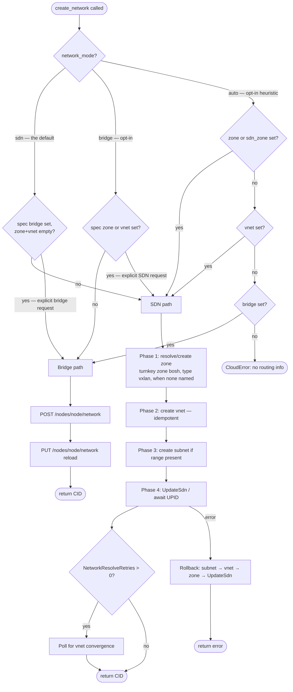

# Network Management

This CPI supports two network backends for BOSH managed networks: PVE SDN vnets (the default) and Linux bridges (opt-in). When a BOSH cloud-config marks a network as `managed: true`, the Director calls `create_network` to provision the resource and `delete_network` to remove it. All other networks — pre-configured bridges and static VLANs — use `managed: false`; the CPI never calls their lifecycle handlers.

## SDN vs Bridge Routing

The handler selects a backend based on three inputs: the `network_mode` config property, the `zone`/`vnet`/`bridge` fields in `cloud_properties`, and the `sdn_zone` CPI config property. The mode sets the default path; an unambiguous request in the network spec overrides it, so one CPI config can serve SDN and bridge networks side by side. The routing logic runs in this order:

1. If `network_mode` is `"sdn"` (the default) → SDN path, unless `cloud_properties` names a `bridge` and neither a `zone` nor a `vnet` — an explicit bridge request, which takes the bridge path. On the SDN path, when no zone is named anywhere and `sdn_auto_manage_zone` is enabled (its default), the CPI uses the turnkey zone `bosh`; with auto-manage disabled an unresolvable zone is an error.

2. If `network_mode` is `"bridge"` (opt-in) → bridge path (error if bridge unresolvable), unless `cloud_properties` names a `zone` or a `vnet` — an explicit SDN request, which takes the SDN path.

3. If `network_mode` is `"auto"` (opt-in; the legacy heuristic retained for compatibility):
   - If `cloud_properties.zone` is set OR `config.sdn_zone` is set OR `cloud_properties.vnet` is set → SDN path.
   - Otherwise → bridge path (requires `cloud_properties.bridge` or `config.network_bridge`).

4. If neither path is resolvable → `cpierrors.Cloud` returned to the Director.

### Routing decision table

| `network_mode` | `cloud_properties.zone` / `.vnet` | `config.sdn_zone` | `cloud_properties.bridge` | Outcome |
|---|---|---|---|---|
| `sdn` (default) | any set | any | any | SDN path |
| `sdn` (default) | both empty | any | empty | SDN path (turnkey zone `bosh` when no zone named and auto-manage on) |
| `sdn` (default) | both empty | any | set | Bridge path (explicit bridge request) |
| `bridge` (opt-in) | any set | any | any | SDN path (explicit SDN request) |
| `bridge` (opt-in) | both empty | any | any | Bridge path (falls back to `config.network_bridge` when unset) |
| `auto` (opt-in) | any set | any | any | SDN path |
| `auto` (opt-in) | both empty | set | any | SDN path |
| `auto` (opt-in) | both empty | empty | set (or `config.network_bridge`) | Bridge path |
| `auto` (opt-in) | both empty | empty | empty | Error: no routing info |

> **Note:** only call- and profile-level values steer the explicit-request overrides; `config.sdn_zone` and `config.network_bridge` are defaults, not intent, and never flip the path away from the mode's default. Under `auto`, `config.sdn_zone` still routes to SDN — the legacy heuristic is preserved unchanged.

For `delete_network`, the handler probes the SDN backend first (GET vnet by name). If the vnet exists, it takes the SDN delete path. If PVE reports the vnet absent (`ErrSDNNotFound`), it falls back to the bridge delete path. Any other probe error is returned to the Director unchanged.

### SDN Eventual Consistency

After `UpdateSdn` commits the SDN configuration, data-plane realization is asynchronous: each node must propagate the change — over inter-node SSH — before VMs can attach to the new vnet. One broken node can leave the change silently pending cluster-wide while `UpdateSdn` still reports success. When `pve.network_resolve_retries` is greater than zero, `create_network` polls the running cluster SDN config until the new vnet converges, then returns success. The absolute time bound is `pve.network_resolve_timeout_sec` (default 60 s when retries are enabled; 0 = 60 s). When polling times out, the error is retriable and the Director re-drives.

`network_resolve_retries` defaults to `30` (~30 s at the CPI's 1 s poll cadence) when left unset in the manifest — both this convergence poll and `create_vm`'s consume-side bridge-presence gate (below) are active by default, converting the silent pending-state race into an actionable, retriable error. Set `pve.network_resolve_retries: 0` explicitly to disable both gates and restore the earlier ungated behavior. External or static bridges such as `vmbr0` are never gated by this poll regardless of the setting. If a vnet bridge is missing on some nodes even with the gate enabled, see [Troubleshooting — vnet bridge missing on some nodes / SDN state stuck pending](troubleshooting.md#vnet-bridge-missing-on-some-nodes--sdn-state-stuck-pending) — this is node-trust breakage, not a CPI/API fault.

For async zone types (vlan, vxlan, evpn), `UpdateSdn` may return a UPID. The CPI awaits the UPID task before the convergence poll begins, so subsequent `ListSdnVnets` calls observe committed state. With the vxlan default this UPID-await path is the normal path, not the exception.

### DHCP on managed networks

The subnet the CPI creates on an SDN vnet carries no DHCP configuration by construction — `create_network` sets only the subnet's CIDR and gateway, never a DHCP range or DNS server. This is deliberate: BOSH manifests declare networks as `type: manual` with an explicit static IP per instance, and the Director delivers that IP to the guest through the config drive rather than through a network-level DHCP exchange. A dynamic (DHCP) BOSH network works too, but IP pre-assignment checks such as `pve.ensure_no_ip_conflicts` are not meaningful there and should be disabled.

Enabling DHCP on a CPI-managed subnet is an operator action outside the CPI: PVE SDN's built-in DHCP support requires `dnsmasq` installed and running on every node the zone spans, not only the node handling the API call — a node missing `dnsmasq` silently fails to serve leases to guests that land there. IPAM reservations made through PVE's DHCP take effect only after the guest reboots and re-requests a lease; a running guest keeps whatever address it already holds.

## cloud_properties schema

These keys are read from the per-network `cloud_properties` block in the BOSH cloud-config.

| Key | Type | Required | Meaning |
|---|---|---|---|
| `zone` | string | no (turnkey zone `bosh` when omitted with auto-manage on) | PVE SDN zone name. Takes precedence over `config.sdn_zone`. Required only when `sdn_auto_manage_zone` is disabled. |
| `zone_type` | string | no | Zone type to use when the CPI creates the zone (requires `sdn_auto_manage_zone`). One of: `simple`, `vlan`, `qinq`, `vxlan`, `evpn`. Falls back to `config.sdn_zone_type` (default `vxlan`). When the zone already exists, its actual PVE type governs vnet tagging regardless of this value. `evpn` zones must pre-exist — the CPI never creates them (see [EVPN zones](#zone-auto-management)). |
| `vnet` | string | SDN path | PVE SDN vnet name. Must be 1–8 lowercase alphanumeric characters (regex `[a-z0-9]{1,8}`). Leading digits are allowed. |
| `vnet_tag` | int | no | Explicit vnet tag (VNI for vxlan/evpn, VLAN ID for vlan/qinq; 1–16777215, capped at 4094 for vlan/qinq). When omitted on a tagged zone type, the CPI auto-allocates from the `sdn_vni_range` band (default 5000–5999). Invalid on `simple` zones. |
| `bridge` | string | Bridge path only, when `config.network_bridge` is empty | Linux bridge interface name on the target node (e.g. `vmbr1`). |
| `node` | string | Bridge path only, when `config.node` is empty | PVE node where the bridge is created or deleted. |

### Vnet naming rules

PVE enforces a strict naming constraint on vnet identifiers: a vnet name must be 1–8 lowercase alphanumeric characters (regex `[a-z0-9]{1,8}`). Leading digits are allowed. Hyphens, underscores, and uppercase letters are rejected. The CPI validates this constraint before calling the SDN API and returns an error to the Director if the name is invalid. Choose short, lowercase names such as `boshvn`, `cf1net`, or `prodnet`.

## Zone auto-management

By default (`sdn_auto_manage_zone: true`), the CPI owns the zone lifecycle: `create_network` creates the zone when it is absent and `delete_network` removes it when its last vnet goes. Setting `sdn_auto_manage_zone: false` keeps zones operator-owned — the CPI manages only vnets and subnets within an existing zone, and `create_network` against a missing zone returns an error directing the operator to create it.

**Auto-create:** If the zone named in `cloud_properties.zone` or `config.sdn_zone` does not exist in PVE at `create_network` time, the CPI creates it using the zone type from `cloud_properties.zone_type` or `config.sdn_zone_type` (default `vxlan`). When no zone is named anywhere, the CPI uses the fixed turnkey name `bosh` — beyond that single well-known default it never invents zone names, so repeat deployments converge on one CPI-owned zone. A vxlan zone is created with its peer list and optional MTU (see [VXLAN overlay defaults](#vxlan-overlay-defaults-peers-vnis-and-mtu)); a vlan zone is created with `config.network_bridge` as its underlay bridge.

**Auto-delete:** At `delete_network` time, the CPI removes the parent zone only when **all four** conditions hold:

1. `sdn_auto_manage_zone` is enabled.

2. The zone name does not match `config.sdn_zone` (the operator-pinned zone is never auto-deleted; it may be shared across multiple managed networks). The turnkey zone `bosh` is deliberately not pinned — the CPI created it, so removing it when empty is correct turnkey hygiene.

3. The zone is not an EVPN zone (see below).

4. The zone has zero remaining vnets after the vnet is removed (confirmed by listing vnets filtered by zone before deleting).

If any condition fails, the zone is left in place. A list failure during the zone-empty check — or a failure to read the zone type — skips deletion instead of returning an error. Zone name comparison is case-insensitive.

**EVPN zones:** the CPI never creates or deletes EVPN zones. An EVPN fabric — the zone, its BGP controller, route reflectors, and exit nodes — is operator infrastructure. `create_network` against an absent EVPN zone fails fast with instructions to create the zone and controller in PVE (Datacenter → SDN); once the zone exists, the CPI manages vnets and subnets inside it exactly as for any other zone type.

We recommend PVE 9.2 or later for EVPN zones: FRR, the routing daemon EVPN's control plane depends on, ships preinstalled from PVE 9 onward, while PVE 8 requires installing it by hand before an EVPN zone can come up. The CPI itself does not version-gate EVPN — it issues the same SDN API calls regardless of PVE version — so an EVPN zone on an older cluster without FRR installed fails at the PVE layer, not inside the CPI.

**PVE constraint:** The SDN zone create API (`POST /cluster/sdn/zones`) does not accept description, notes, or comment fields. CPI-owned zones are not annotated in PVE; which zones belong to the CPI is tracked through the stateless config rule (condition 2 above).

## VXLAN overlay defaults: peers, VNIs, and MTU

The vxlan default builds a cluster-wide L2 overlay with three knobs, all optional:

**Peers.** A vxlan zone needs the list of node IPs that terminate its tunnels. The CPI derives it from the online cluster nodes (`GET /cluster/status`) at zone-create time; `pve.sdn_vxlan_peers` overrides the derivation when tunnel traffic must ride a dedicated underlay network whose addresses differ from the management IPs. Zero derivable peers is a hard error — PVE would accept the zone, but no tunnel would ever come up. A node that is offline at zone-create time is omitted; re-apply the zone with explicit peers (or recreate the network) once it returns.

**VNIs.** Every vnet in a vxlan or evpn zone carries a VXLAN Network Identifier, and every vnet in a vlan or qinq zone carries a VLAN ID — PVE requires the tag; it is the segment identity on the wire. The CPI auto-allocates from the `pve.sdn_vni_range_start`/`_end` band (default 5000–5999, random entry point, collision-checked against all existing vnets including pending ones, and against zone-level control VNIs such as an EVPN zone's `vrf-vxlan`). `cloud_properties.vnet_tag` pins an explicit value per network. vlan/qinq tags cap at 4094; the CPI clamps the band and rejects explicit values above the cap before calling PVE.

VNIs are fabric-global: a vnet tag and an EVPN zone's control VNI (`vrf-vxlan`) share one identifier space, and PVE does not reject the collision — it silently cross-talks or blackholes traffic on the affected VRF. The CPI excludes zone-level control VNIs from auto-allocation, but the exclusion is fail-open (a zone-listing failure logs one warning and allocation proceeds on vnet tags alone), so keep operator-managed control VNIs outside `sdn_vni_range` by convention — values below 5000 (e.g. 4999) stay clear of the default band.

**MTU.** VXLAN encapsulation spends roughly 50 bytes per frame on outer headers (EVPN pays the same tax). PVE derives the vnet MTU from the underlay automatically — a 1500-byte underlay yields 1450-byte vnets — and the CPI hands every virtio NIC attached to an SDN vnet `mtu=1`, which means "inherit the bridge MTU", so guests never emit an oversized frame. `pve.sdn_zone_mtu` overrides the derivation for unusual underlays; leave it unset otherwise. Jumbo frames work the same way: a 9000-byte underlay on every node's physical path yields 8950-byte overlay MTU (set `sdn_zone_mtu: 8950` explicitly if PVE cannot derive it). On an IPv6 underlay, set `sdn_zone_mtu: 1430` by hand — PVE's automatic 1450 derivation assumes IPv4 encapsulation overhead, and an IPv6 outer header costs 20 bytes more, so the automatic figure over-estimates the usable overlay MTU. Mixed underlay MTUs across nodes are the failure mode to avoid — the overlay MTU must fit the smallest underlay everywhere. The failure signature and probe commands are in [Troubleshooting — SDN MTU](troubleshooting.md#small-packets-pass-large-packets-hang-sdn-mtu).

Firewall prerequisite: VXLAN tunnels run node-to-node over UDP 4789; EVPN additionally needs TCP 179 (BGP) between nodes and controllers. See [Operations — SDN VXLAN operations](operations.md#sdn-vxlan-operations).

### Rollback on partial create

If zone create, vnet create, or subnet create succeeds but `UpdateSdn` fails, the CPI rolls back in reverse order: subnet → vnet → zone. Each rollback step is guarded: only resources created during the current call are removed; pre-existing resources are never touched. All rollback operations run on a context detached from the caller's cancellation, so cleanup runs even if the caller aborts.

The rollback itself calls `applySDN` to commit the staged deletions, because every SDN mutation must be followed by `UpdateSdn` or it remains pending in the PVE config directory. If the rollback apply also fails, the warning is logged and the original error is returned. The `delete_network` path expects all three layers to be fully applied; a partially applied state is cleaned up on the next `create_network` retry.

## Manifest examples

### Example 1 — Turnkey VXLAN (the default)

Nothing to opt into: with defaults, the CPI builds a cluster-wide vxlan overlay on the first `create_network` call and tears it down when the last vnet is removed. Only the connection basics appear in the manifest.

BOSH manifest CPI properties:

```yaml
properties:
  pve:
    host: pve.example.com
    user: root@pam
    api_token: root@pam!bosh=((pve_api_token))
    node: pve1
    vm_storage: local-lvm
    disk_storage: local-lvm
    network_bridge: vmbr0
```

Cloud-config managed network:

```yaml
networks:
- name: bosh-sdn-net
  type: manual
  managed: true
  subnets:
  - range: 10.200.0.0/24
    gateway: 10.200.0.1
    cloud_properties:
      vnet: boshvn
```

The CPI will:

1. Check whether the turnkey zone `bosh` exists and create it (type `vxlan`) if absent, with peers derived from the online cluster nodes and MTU derived by PVE from the underlay.

2. Create vnet `boshvn` in zone `bosh` (idempotent on conflict), with a VNI auto-allocated from the 5000–5999 band. A newly created vnet gets the alias `bosh-boshvn` — visible in the PVE UI's SDN vnet list — marking it as CPI-owned; unlike the zone-level constraint above, vnets do accept an alias, so this is the one place in the SDN hierarchy where CPI ownership is visible in the UI. A pre-existing vnet the CPI adopts (idempotent path) keeps whatever alias it already had; the CPI never overwrites it.

3. Create subnet `10.200.0.0/24` with gateway `10.200.0.1` on the vnet.

4. Apply the SDN configuration (`PUT /cluster/sdn`) and await the returned task to completion — vxlan zones apply asynchronously.

5. Return network CID `boshvn`, address properties, and `cloud_properties` containing `zone`, `vnet`, and `bridge` (`vnet` and `bridge` both `boshvn`, since PVE realizes every vnet as a Linux bridge of the same name on each node, for all zone types).

### Example 1b — Simple zone (opt-in)

For a single node — or a deliberately node-local segment — opt into a simple zone. The vnet becomes an isolated per-node bridge with no cross-node reach; do not use this for deployments that span nodes.

```yaml
properties:
  pve:
    # ...connection basics as above...
    network_mode: sdn
    sdn_zone: boshzone
    sdn_zone_type: simple
```

The sequence is the same, minus the vxlan specifics: the zone is created as type `simple`, the vnet carries no tag, and the apply is synchronous.

### Example 2 — Bridge (opt-in)

The legacy path, retained as an explicit opt-in: no SDN required, and the CPI creates a Linux bridge on the target node. The bridge exists only on that node, so this suits single-node setups only. Set `network_mode: bridge`, or leave the default mode in place and give the managed network a `bridge` cloud property with no zone/vnet — an explicit bridge request takes the bridge path under any mode.

BOSH manifest CPI properties:

```yaml
properties:
  pve:
    host: pve.example.com
    user: root@pam
    api_token: root@pam!bosh=((pve_api_token))
    node: pve1
    vm_storage: local-lvm
    disk_storage: local-lvm
    network_bridge: vmbr0
    network_mode: bridge
```

Cloud-config managed network:

```yaml
networks:
- name: bosh-bridge-net
  type: manual
  managed: true
  subnets:
  - range: 10.201.0.0/24
    gateway: 10.201.0.1
    cloud_properties:
      bridge: vmbr1
      node: pve1
```

The CPI will:

1. Call `POST /nodes/pve1/network` to create bridge `vmbr1` (idempotent on 409 conflict).

2. Call `PUT /nodes/pve1/network` to reload the node network config.

3. Return network CID `vmbr1`, address properties, and `cloud_properties` containing `bridge` and `node`.

## create_network

The routing and provisioning sequence is shown below. Phase labels correspond to the prose in [SDN vs Bridge Routing](#sdn-vs-bridge-routing) and [Zone auto-management](#zone-auto-management) above.

### Routing diagram



## delete_network

PVE requires subnets to be deleted before the parent vnet can be deleted. The CPI deletes all subnets for the vnet first, then the vnet, then calls `UpdateSdn` (awaiting the UPID for async zone types), then conditionally removes the parent zone subject to the four-condition guard described in [Zone auto-management](#zone-auto-management).

Every `ErrSDNNotFound` response during deletion is swallowed, making the function idempotent across repeated or concurrent invocations.

## Isolated test network (SDN)

For deploy testing — especially CloudFoundry, where dozens of VMs are placed at once — never share an L2 segment with unmanaged devices. If the deployment subnet overlaps a physical office or lab LAN, an address BOSH assigns to a VM can collide with a device already using it. Two MACs then answer ARP, the Director's ARP cache flaps, mbus packets are misdelivered, and agents loop `connection reset by peer` → reconnect, failing random instances with `Timed out sending 'get_state'`. See [Troubleshooting — duplicate IP on a shared LAN](troubleshooting.md#agent-never-comes-up).

This repo ships a turnkey isolated network as a PVE SDN **simple** zone + vnet + subnet on a private `172.x` range. Selecting it moves both the Director and the deployment onto a network BOSH fully owns, so no foreign device can claim an address.

The simple zone here is a deliberate opt-in: this lab runs on a single PVE node, where an isolated per-node bridge with SNAT is exactly the right shape, and the CPI's default vxlan overlay would add encapsulation for no reach benefit. On a multi-node cluster the default already gives us the isolated segment — cluster-wide — with nothing to configure:

```yaml
# Multi-node equivalent: omit zone/zone_type entirely; the CPI creates the
# turnkey vxlan zone "bosh" and the vnet spans every node.
cloud_properties: { vnet: cpitest0 }
```

```bash
# 1. Create the SDN zone + vnet + subnet + host-firewall allowance (idempotent).
BOSH_PVE_ENV=cpitest ./scripts/bosh net-up

# 2. Deploy the Director onto the isolated network.
BOSH_PVE_ENV=cpitest ./scripts/bosh create-env
BOSH_PVE_ENV=cpitest ./scripts/bosh alias-env

# 3. Upload the cloud-config and deploy CF onto the same network.
BOSH_PVE_ENV=cpitest ./scripts/cf deploy

# Inspect / tear down.
BOSH_PVE_ENV=cpitest ./scripts/bosh net-status
BOSH_PVE_ENV=cpitest ./scripts/bosh net-down   # after delete-env + cf teardown
```

`net-up` creates a simple zone (a plain local bridge — an isolated L2 segment plus a gateway), one vnet whose name becomes the Linux bridge VMs attach to, and a subnet with `snat` enabled so VMs reach the internet via the PVE host's uplink while staying off the shared LAN. It commits with `pvesh set /cluster/sdn` and is idempotent.

### Host firewall: API access from the isolated subnet

When `pve-firewall` is enabled, the host's INPUT policy DROPs new VM→host connections unless explicitly allowed, and the PVE API (`8006`) is further gated to a "management" source set. A Director on the shared LAN was implicitly inside that management range; once it moves to the isolated subnet it is not, so the **in-VM CPI** (which runs on the Director, unlike `create-env`'s CPI, which runs locally) can no longer reach `https://<pve_host>:8006`. Every `create_vm` then fails with `cluster.ListResources ... dial tcp <pve_host>:8006: connect: connection timed out`. `net-up` closes this gap automatically: it adds two idempotent rules to `/etc/pve/nodes/<node>/host.fw` permitting the configured subnet to reach `8006` (and ICMP), then reloads the firewall. `net-down` removes them; `net-status` prints them.

### Operator reachability to the relocated Director

The Director's API, CredHub, and UAA listen on its `internal_ip`. After relocation, that IP lives on the isolated subnet, which is only present on the PVE host — the workstation running `bosh` or `./scripts/cf` needs a route to it. If the workstation reaches the lab over Tailscale, advertise the subnet from the PVE node (`tailscale set --advertise-routes=...,172.31.0.0/24`) and approve it in the tailnet admin console; `create-env`'s local CPI still reaches the PVE API over the workstation's existing path. Without a route, `alias-env` and `deploy` time out against the new Director IP even though the Director itself is healthy.

### Relocating the Director rotates IP-pinned certificates

Moving the Director changes `internal_ip`, and several generated leaf certificates embed it in their SAN/CN: `mbus_bootstrap_ssl`, `director_ssl`, `nats_server_tls`, `blobstore_server_tls`, `credhub_tls`, `uaa_ssl`, and `uaa_service_provider_ssl`. The BOSH CLI only generates a variable when it is **absent** from the vars-store, so a plain `create-env` reuses the stale certs and the agent bootstrap fails with `x509: certificate is valid for <old-ip>, not <new-ip>`. Remove those seven leaf entries from `manifests/bosh/creds.yml` (keep every `*_ca`, encryption key, and password) and rerun `create-env`; the CLI regenerates them for the new IP, re-signed by the unchanged CAs, so the trust chain and the bosh database (releases, stemcells, CredHub data) are preserved.

Everything is operator-configurable in a single file — [`manifests/envs/cpitest/vars.yml`](../manifests/envs/cpitest/vars.yml) — which defines the vnet name, zone, CIDR, gateway, reserved bands, and static IPs. The same `vars.yml` drives both the SDN objects (`net-up`) and the BOSH manifests (Director network + CF cloud-config), so they always agree. To run a different layout, copy `manifests/envs/cpitest/` to `manifests/envs/<name>/`, edit the copy, and drive it with `BOSH_PVE_ENV=<name>`. Keep these invariants: `pve_network_bridge` == `cpitest_sdn_vnet`, `internal_cidr` == `cpitest_sdn_subnet`, `internal_gw` == `cpitest_sdn_gateway`, and every reserved, static, and host IP inside `internal_cidr`. Proxmox limits zone and vnet names to 8 characters; vnet names must be 1–8 lowercase alphanumeric characters. See [`manifests/envs/cpitest/README.md`](../manifests/envs/cpitest/README.md).

## Router and NAT VMs

VMs that forward traffic between networks — routers, NAT gateways, and software load balancers — require two additional `create_vm` `cloud_properties` settings. Both are set at the VM level, not per-network.

### Per-NIC `ip_forwarding`

Setting `ip_forwarding: true` in a NIC's `cloud_properties` disables the PVE per-NIC firewall for that interface. A router VM must pass packets between its NICs; the PVE NIC-level firewall would otherwise drop forwarded frames even when the VM-level firewall and IP forwarding are enabled in the guest kernel.


Effect: the CPI sets `firewall=0` on the matching PVE NIC config entry after clone. NICs with `ip_forwarding: true` are also excluded from the ipset seeding that drives VIP allowed-address-pairs, so no additional ipset rules are needed for the router NIC.

Example NIC entry in a BOSH network spec:

```yaml
networks:
- name: external
  type: manual
  cloud_properties:
    vnet: extvn
    ip_forwarding: true   # disable NIC firewall for this interface
- name: internal
  type: manual
  cloud_properties:
    vnet: intvn
```

### VM-level `advertised_routes`

`advertised_routes` is a list of SDN subnet entries the CPI creates in the fabric when the VM is provisioned. Each entry names a PVE vnet and a CIDR the VM will forward. The CPI calls `POST /cluster/sdn/vnets/{vnet}/subnets` for each entry and then commits the change with `PUT /cluster/sdn`.

```yaml
cloud_properties:
  advertised_routes:
  - vnet: intvn
    destination: 10.64.0.0/16
  - vnet: dmzvn
    destination: 172.18.0.0/24
```

**EVPN requirement:** `advertised_routes` injects routes into the FRR-managed logical-router fabric. It requires a PVE SDN zone of type `evpn` — the only zone type with a routing control plane. For every other zone type (simple, vlan, qinq, vxlan), PVE may accept the subnet create request, but no logical-router route is injected; the CPI logs a warning and continues. Verify the zone type before relying on this feature for actual packet forwarding.

**SDN permissions:** the API token must hold `SDN.Allocate` on `/sdn`. See [PVE API permissions](pve-api-permissions.md#2-privileges-the-cpi-actually-uses).

**Rollback:** if `applySDN` fails after some subnets were created, the CPI removes the already-created subnets on a best-effort basis and returns an error. Any subnet the rollback cannot remove is logged by name for operator cleanup.

**Cleanup on `delete_vm`:** each advertised route stamps a provenance tag (`advrt-<vnet>-<hash>`) on the VM at create time. When the VM is deleted, the CPI removes each recorded subnet from its vnet — unless another live VM carries the same tag (paired routers share routes; the last one out cleans up). The cleanup is entirely fail-open: any error leaves the subnet in place with a warning naming it, and never fails the delete. Subnets left behind by CPI versions predating this cleanup (or by a logged fail-open skip) are removed manually with `pvesh delete /cluster/sdn/vnets/<vnet>/subnets/<subnet-id>` followed by `pvesh set /cluster/sdn`.

For the full `create_vm` cloud_properties schema — including `pci_passthroughs`, `retain_ephemeral_on_delete`, hotplug, and NIC-level VIP settings — see [CPI Methods — create_vm](cpi_methods.md#create_vm).

## Cross-references

- [Configuration Reference](configuration.md) — full property table including `network_mode`, `sdn_zone`, `sdn_zone_type`, `sdn_auto_manage_zone`, `network_resolve_retries`, and `network_resolve_timeout_sec`.

- [Operations Guide](operations.md) — operational guidance for SDN setup, troubleshooting apply failures, and bridge cleanup.

- [Troubleshooting](troubleshooting.md#agent-never-comes-up) — duplicate-IP / ARP-ambiguity agent flapping and the isolated-network fix.
