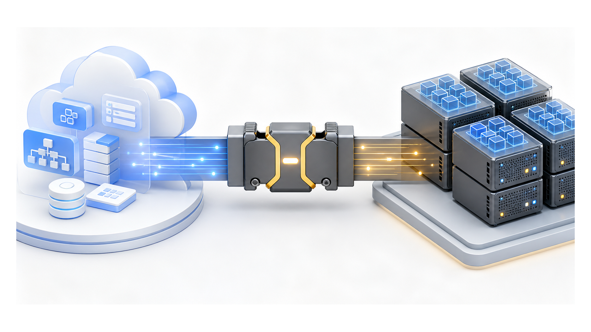
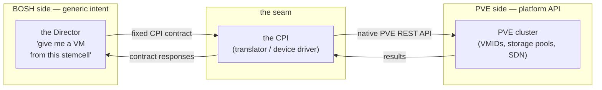
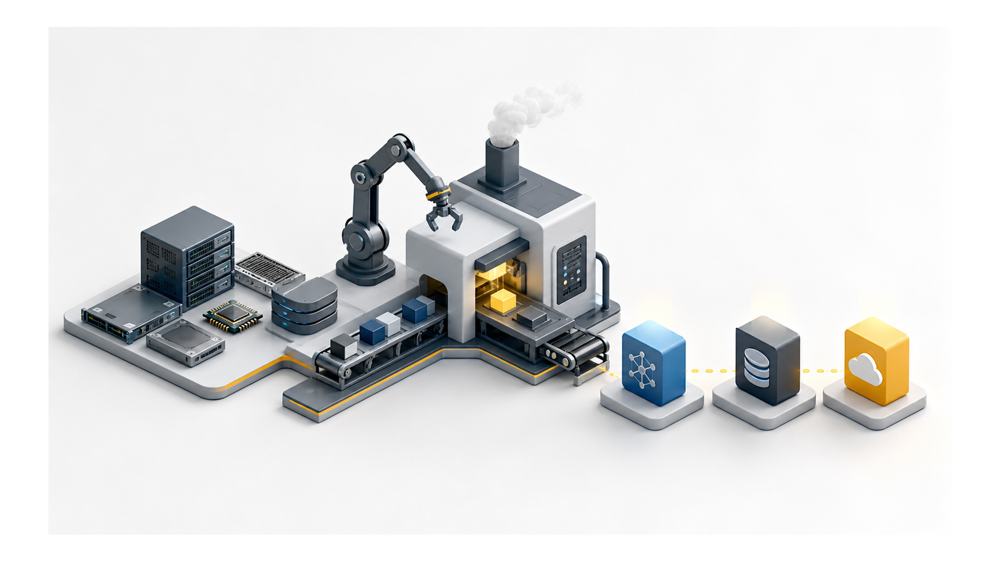

# Chapter 1
## The Problem and the Seam

*The Director is infrastructure-agnostic; all infrastructure-specific knowledge lives behind a fixed contract.*

<!--
- Framing: this whole chapter is about one seam — the fixed CPI v2 contract — and why PVE makes that seam do more work than a cloud does.
-->

---
class: visual-right
---

## What BOSH is, and the line it is designed not to cross

- Provision, deploy, watch, heal — any cloud
- The Director: generic intent only
- "Give me a VM from this stemcell" — never how
- Portability = deliberate refusal

<!--
- Decision to hold to: all infrastructure-specific knowledge lives behind the contract, so the Director carries zero PVE detail and stays portable by construction, not by convention.
- The contract is fixed and versioned — the Director calls `info` first, we will answer `api_version: 2`, and it negotiates from there.
- The refusal is deliberate: BOSH says "give me a VM from this stemcell" and never how — that "never how" is exactly the surface we will own.
- Q&A bait: "what if BOSH wants something PVE can't natively do?" — that's the manufacture story two slides on; the contract doesn't bend, we will build under it.
-->

---

## one contract, many drivers

- BOSH = OS; PVE = hardware; CPI = driver
- Swap driver — the Director never notices

<!--
- The wire is deliberately narrow: JSON-RPC on stdin/stdout, one request per process invocation, exit after, logs to stderr — nothing stateful between calls.
- The contract is 22 canonical methods plus the `update_disk` extension we will add; "many drivers" is literal — same method set, AWS/Azure/vSphere/PVE each translate it differently.
- v2 reshaped the contract: `create_vm` now returns `[vm_cid, networks_with_mac]`, `attach_disk` returns disk hints, `configure_networks` is gone (networks set only at create_vm), and there is no registry.
- "Swap driver, Director never notices" is real but bounded — we and vSphere will be the only two CPIs that even implement network lifecycle; surface coverage is the easy part, depth within methods is the actual work ahead.
- The certification boundary will back the claim: our local lifecycle harness will run 14 canonical methods end-to-end against live PVE in minutes; the upstream Concourse BAT suite is the release gate we target, though no `pve/` directory exists upstream yet.
-->

---
class: visual-right
---

## The central truth about PVE

- PVE is not a cloud
- No scheduler, no AZ, no durable volume, no portable network
- AWS/Azure CPIs translate; this CPI must *manufacture*
- CPI = factory stamping out missing cloud primitives

<!--
- The load-bearing distinction: AWS/Azure CPIs translate native primitives that already exist; PVE has none of them, so this CPI must manufacture them under the same contract.
- Concrete manufacture: PVE has no per-disk snapshot, so `snapshot_disk` will snapshot the whole hosting VM; PVE has no disk metadata or disk-tag field, so we will stash JSON in the VM description and ride tags on the hosting VM.
- The cross-process lock is the sharpest case — PVE's pmxcfs-replicated HA rules are non-atomic shared config, so we will need an explicit cluster mutex (a resource-pool sentinel). That puts PVE in the vSphere/Azure camp, not with the hyperscalers.
- "Validate, don't orchestrate" inverts here: Azure's Compute Gallery replicates a stemcell for us; PVE's `qm clone` is a full copy unless storage is shared, so we will manufacture per-node template replication ourselves.
- Gotcha that justifies the seam: no scheduler, no AZ, no durable volume, no portable network — so placement scoring, AZ-to-node mapping, and snapshot guards must all be built because the platform doesn't hand them to us.
-->

---

## The scope of this release

- Single binary, CPI v2 contract, PVE ≥ 9.2
- Small surface area
- All complexity hidden behind the seam

<!--
- "Small surface" is honest about the wire, not the work: one Go binary, 22 canonical methods we will back with real logic plus the `update_disk` extension — no stubs hiding behind the contract.
- We will advertise `openstack-qcow2`/`openstack-raw` stemcell formats, so operators can upload existing bosh-openstack-kvm stemcells with no conversion — PVE treats the format name opaquely; only the image bytes matter.
- Certification scope is a decision to make deliberately: the local lifecycle harness will cover the full method surface, sufficient for everything short of cutting a tagged release; upstream BAT is a release-time concern.
-->
