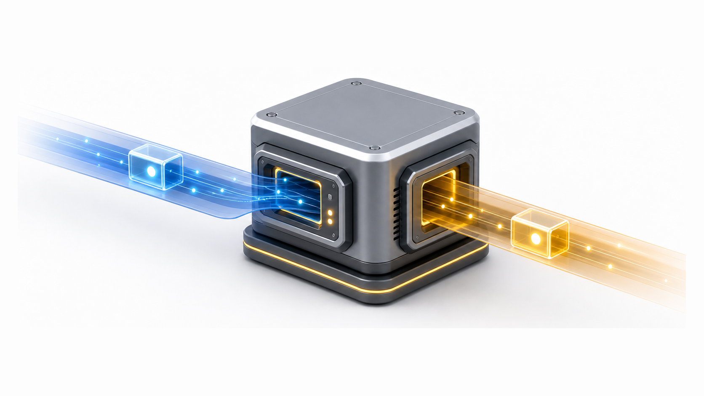
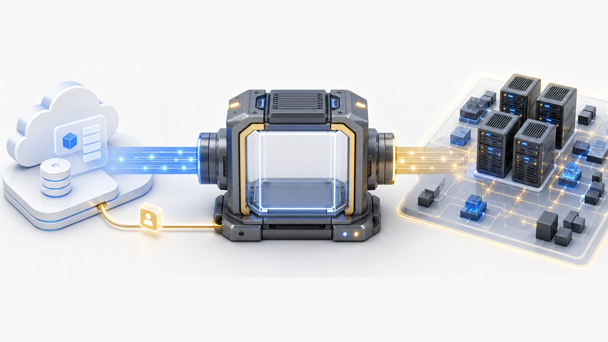
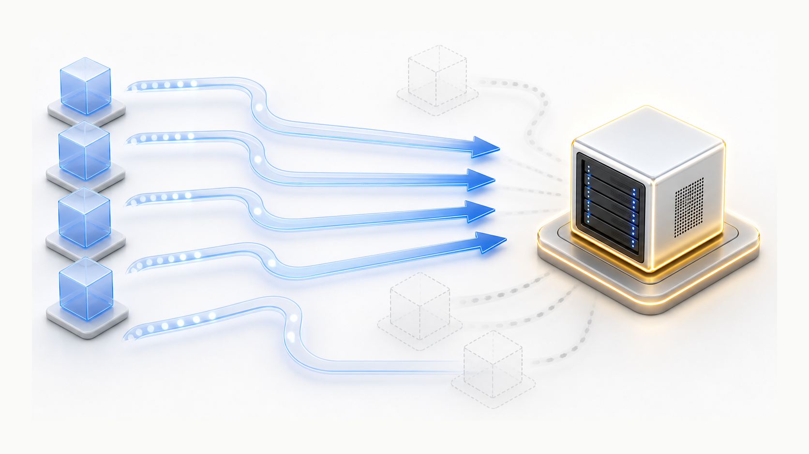
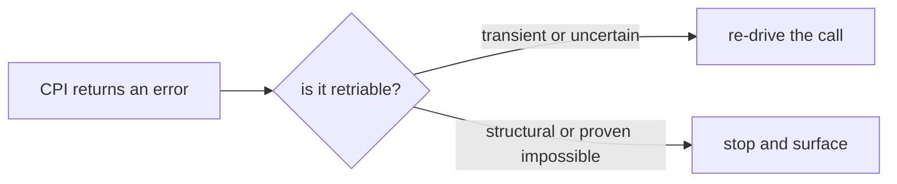
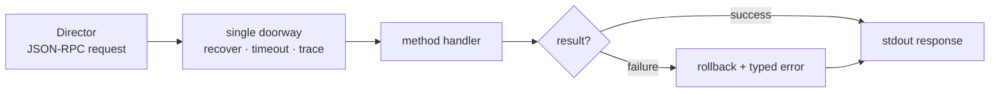

# Chapter 2
## One Constraint, Many Consequences

*Invoked once per request; may be retried — stateless, idempotent, errors typed.*

<!--
- One architectural constraint — invoked once, then exit — and everything in this chapter falls out of it: statelessness, idempotency, read-back, typed errors.
-->

---
class: visual-right
---

## The wire shape

- One request in → one response out
- JSON-RPC: method, arguments, context, version
- No session, no open connection, no memory
- Process exits after each call

<!--
- JSON-RPC over stdin/stdout, one request per line, process exits after each call — logs go to stderr precisely because stdout is the response channel.
- The envelope carries method, arguments, context, and version; the Director calls `info` first to learn we are api_version 2 and which stemcell formats we accept.
- No session means no warm cache or pooled connection between calls — every invocation re-authenticates and re-discovers cluster state from scratch.
- The cost we accept is per-call process startup; the payoff is crash isolation — a panic in one call cannot corrupt another.
-->

---
class: visual-right
---

## Statelessness, because nowhere to keep state

- No memory; no database
- Director holds state; hands back cloud ID each call
- CPI reconstructs from live PVE state every request
- Director holds the map; CPI reads the territory

<!--
- The decision: hold zero local state — no database, no scratch file. The Director owns the ledger (create-env keeps it in state.json) and hands back the cloud_id every call.
- The CID is our only memory, so we encode state into the identifier: `template:<vmid>`, `<storage>:import/<file>`, disk CIDs carry storage+id, a snapshot CID is `<vmid>:<snap_name>`.
- Per-disk performance options (iothread, cache, mbps, iops) ride in the disk CID as a base64+JSON suffix — attach_disk decodes them with no out-of-band state.
- Gotcha: the CID is a contract — we cannot renumber or relocate without breaking the Director's records, so encodings must stay forward-compatible (pre-upgrade CIDs still resolve via SHA-tag lookup).
- Tradeoff versus a stateful CPI with its own DB: we reconstruct from live PVE every call, even cluster-scanning to find a disk's host after HA failover — slower, but no split-brain between CPI memory and reality.
-->

---
class: visual-right
---

## Idempotency, because the Director will call again

- Director may re-drive after partial failure
- Delete absent → success, not error
- Create existing → reuse, not duplicate
- Converge on desired state; never assume clean slate

<!--
- The decision: every method converges on the desired state; the Director re-drives after partial failure, so we never assume a clean slate.
- Delete-absent is success — delete_vm, delete_disk, delete_stemcell, and delete_snapshot all treat 404/missing as done; create-existing reuses the template VMID rather than duplicating.
- Tradeoff: delete must be *certain* — delete_vm and delete_disk raise rather than report false success when deletion cannot be confirmed; we choose orphan-prevention over convenient idempotency.
- Gotcha: idempotent retry meets async PVE — fast_path_delete returns before destroy completes, so has_vm may briefly still see the VM; the `bosh-deleting` tag plus a straggler sweep reconciles it on the next call.
- Network/SDN creates fold a 409 conflict into success; a detach-then-park retry is a no-op when the disk is already parked.
-->

---
class: visual-right
---

## Read-back, because the Director needs to reconcile

- `has_vm`, `has_disk`, `get_disks` — reality checks
- Director compares records against live truth
- Detects orphaned and missing resources
- BOSH cloudcheck leans on these primitives

<!--
- has_vm, has_disk, and get_disks are the reconciliation primitives — cloudcheck compares the Director's records against live PVE truth and repairs drift.
- has_disk returns false (not an error) on 404; on lvmthin/zfspool PVE throws HTTP 500 "Failed to find logical volume" — we tolerate that as false so block-backend operators get a clean answer instead of a spurious retry.
- Read-back is authoritative only because it scans the whole cluster — get_disks and has_disk locate the owning node first, so the answer holds after an HA failover.
- get_disks deliberately excludes root and CD-ROM slots (scsi0, virtio0, ide0, ide2, anything media=cdrom) — only persistent disks are reconciled.
-->

---

## The error model

- the worst legal output is a typed retriable error
- Never report false success; never swallow uncertainty

<!--
- Decision: the worst legal output is a typed retriable error — never report false success, never swallow uncertainty.
- Classification rule: HTTP 4xx → non-retriable CloudError (structural), 5xx and network timeouts → RetriableCloudError; a 404 upgrades to VMNotFound/DiskNotFound at the call site, where the resource type is known.
- The Director reads OkToRetry off the envelope to decide re-drive versus stop — misclassify a transient as fatal and a deploy wedges; misclassify a structural failure as transient and it loops forever.
- Gotcha: even a panic is caught and returned as RetriableCloud with a logged stack trace — a crash becomes a re-drive, not a malformed response.
-->

---

## The single doorway

- Every method inherits uniform protection
- no per-method reimplementation

<!--
- The decision: one dispatcher wraps every method in recover() + a per-request timeout + gated tracing + the rollback stack — uniform protection with zero per-method boilerplate.
- Rollback is a LIFO stack of cleanup functions fired only on a non-nil error and made idempotent by sync.Once — a half-created VM does not leak.
- Tracing passes arguments and results through RedactSecrets before logging — credentials never reach the log even when tracing is enabled.
- keep_failed_vms can suspend rollback so an operator can inspect a failed create — the seam is a deliberate override point, not a hardcoded path.
-->

