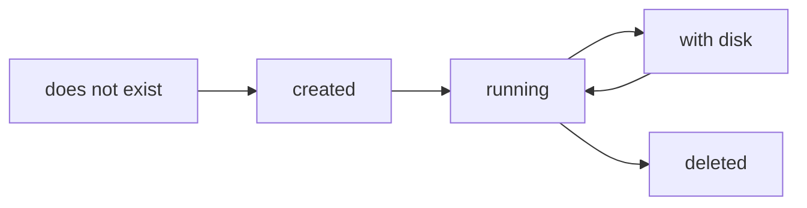

# Chapter 3
## The Lifecycle of a Machine

*A deploy is the composition of independent, retriable resource lifecycles.*

<!--
- Framing: a deploy is not one transaction — it's five independent resource lifecycles (stemcell, VM, disk, reconciliation, networking), each its own retriable CPI call.
- 21 canonical CPI v2 methods plus the update_disk extension we add; each invocation is one JSON-RPC request that does its work and exits.
-->

---

## One VM's life as a chain

- Capability discovered, not assumed — `info` fires first
- Every link individually retriable

<!--
- `info` fires first so the Director discovers our api_version (always 2) and stemcell formats rather than assuming — we advertise openstack-qcow2/raw because OpenStack stemcells are byte-compatible with PVE import, so operators reuse bosh-openstack-kvm-* with no conversion.
- One link hides a lot: create_vm does clone -> configure NICs -> attach pre-existing disks -> write agent settings -> start, in that order. Boot ordering matters.
- The boot/handshake gotcha we design around: the agent can hang forever in two ways — naming a non-existent ephemeral device makes the DevicePathResolver poll endlessly, and the 5 GiB base disk is too small to carve ephemeral. We fix both by leaving Ephemeral empty (stemcell carves from root) and resizing scsi0 after clone.
- Retriable means idempotent: on VMCreationFailed the CPI must clean up partial resources; the lb_register rollback deregisters the VM. keep_failed_vms=true preserves it for inspection instead.
-->

---

## The conceptual groups

- 5 families: stemcell, VM, disk, reconciliation, networking
- `has_vm` / `has_disk` / `get_disks` — BOSH cloudcheck primitives
- Director re-asks "which state?" at any point

<!--
- has_vm / has_disk / get_disks exist purely for cloudcheck — the Director re-asks "which state?" after a crash, partial failure, or HA failover, and we answer authoritatively.
- That's why get_disks and has_disk locate the VM via a fresh cluster scan rather than trusting a cached node — the answer must be correct after an HA failover moved the guest.
- The deliberate seam: we model disk lifecycle separately from VM lifecycle so the disk family can outlive compute. The state machine loops running <-> with-disk; only the disk survives a delete.
-->

---
class: visual-right
---

## data survives compute

- Disk lifecycle is separate from VM lifecycle
- VM is disposable; disk must survive recreate, upgrade, roll
- Disk identity band: 9000–29999
- Detach → re-attach to fresh VM; delete only when unwanted

<!--
- Why the synthetic 9000–29999 band: persistent disks get their own VMID identity, distinct from VMs (100–8999), so a disk is never recycled while compute churns around it.
- Gotcha that justifies it: orphan-disk collision (vm-9000-disk-0 already exists) after a failed run. We union existing vm-9NNN volumes into the used-VMID set before allocating, so 9000 is never reused while its LV still lives.
- The failure mode delete_vm must guard against: PVE's delete:scsiN demotes the disk to an unusedN slot, then DELETE qemu destroys every disk still in the config — unusedN included — silently nuking the persistent volume. The fix is two layers: SDK two-PUT detach, plus a CPI guard that refuses to destroy if a persistent volume can't be confirmed gone.
- detachForeignActiveDisks + guardUnusedVolumes block destroy unless the disk's absence is certain — we'd rather error and retry than orphan or delete data.
-->

---
class: visual-right
---

## The quiet trick underneath

- PVE has no first-class persistent disk object
- No per-disk snapshot, no disk metadata, no disk tags
- CPI manufactures: disk snapshot → VM-level snapshot
- Disk metadata → VM description; disk tags → VM tags

<!--
- PVE has no per-disk snapshot, metadata, or tag primitive, so we manufacture all three on the hosting VM — snapshot_disk creates a VM-level snapshot (every disk on that VM is captured), and the snapshot_cid is vmid:snap_name, not the disk CID.
- Disk metadata rides as a JSON sentinel in the VM description (<!__BOSH:...__>); disk tags become VM tags as sanitized key--value entries.
- Constraint: the disk must be attached to exactly one VM. Found on two VMs -> "ambiguous disk attachment" CloudError; detached at call time -> metadata is dropped with a warning, not stored.
- The snapshot guard is the seam this trick forces: attach/detach/resize are rejected when the VM has snapshots, because a disk attached after a snapshot is invisible to it on rollback. Bypass only with allow_disk_ops_with_snapshots, for emergency recovery.
-->

