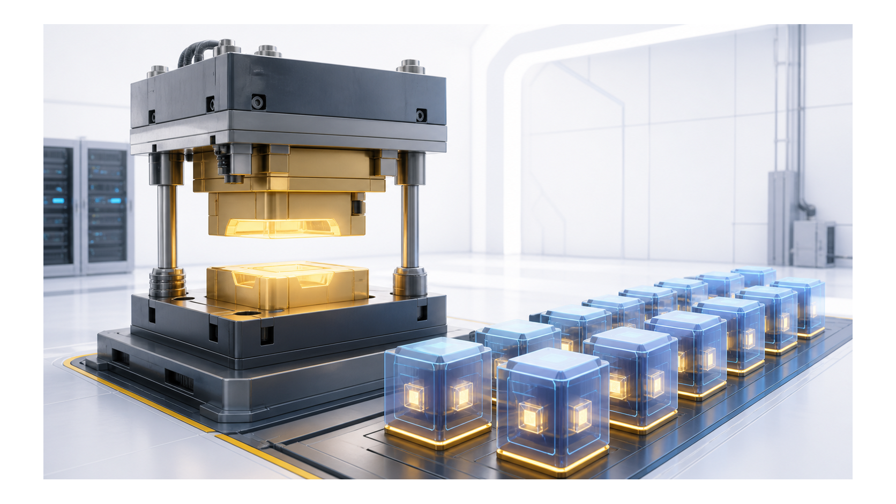
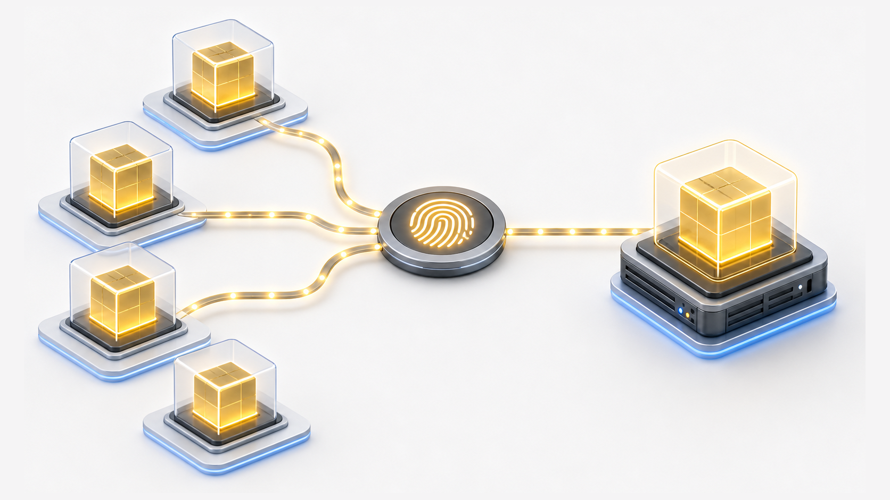
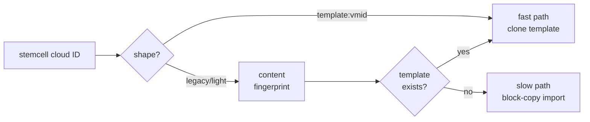
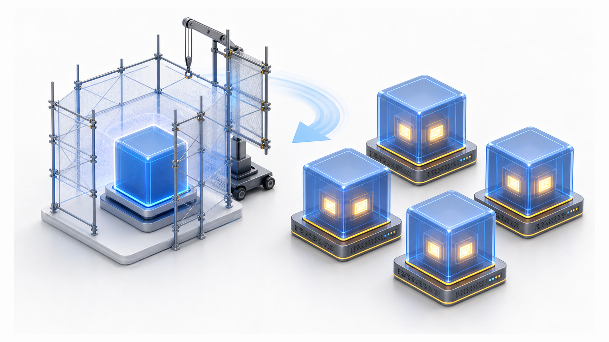

# Chapter 4
## The Stemcell as a Mold

*Pay the image cost once; clone in seconds, never import the same image twice.*

<!--
Orienting frame for the chapter — kept deliberately light. One line to land: a stemcell is not the thing we boot, it is the MOLD we stamp boots from. The whole chapter is the cost-shifting argument — pay the expensive image cost once at upload, make every subsequent VM a near-free clone. Everything that follows (light vs heavy, fingerprint identity, clone type, storage locking, replication) falls out of that single decision.
-->

---
class: visual-right
---

## Import once, stamp many

- Import image once → frozen template VM
- Every VM = copy-on-write clone
- VMID band 30000–30999
- 4 minutes → seconds

<!--
Heavy vs light is the first decision we have to make. HEAVY = the full qcow2 will ship through the BOSH director on every upload; the slow path will then do a per-VM block copy (`import-from=`) — that is where the ~4 minutes will come from. LIGHT = the image bytes are already on PVE storage, so we will skip the director-to-CPI transfer entirely. Two light modes to build: (1) pre-uploaded — operator drops the qcow2 on storage out-of-band, references it by `cloud_properties.image_id` (`<storage>:import/<file>`); (2) CPI-assisted fetch — operator gives `image_url` (https / s3 / oci / bosh+blobstore) and the CPI will pull it once and cache it.

Key unifying point we want: ALL three paths — heavy, pre-uploaded, fetch — will converge on the same `ensureTemplateVM` step. They will all end as one frozen PVE template VM and return a `template:<vmid>` CID. The mold will be identical regardless of how the clay arrived.

Why we plan the 30000–30999 band small and separate: one template per stemcell name/version tuple, so live count stays in the tens, not thousands. It sits ABOVE the VM range (≤8999) and the persistent-disk range (9000–29999); the validator will cross-check all three at CPI startup and refuse to boot on overlap. A separate band also means we will be able to spot templates instantly in the PVE UI.

The "seconds" only holds on linked-clone-capable storage — that is the next-slide tradeoff. Likely probe: "will heavy still be supported?" Yes — it will just be the slow path that builds the same template.
-->

---
class: visual-right
---

## Identity by content, not by name

- Content fingerprint = template's identity
- Same image never imported twice
- Concurrent imports converge on one survivor
- Statelessness forces content-addressed design

<!--
The fingerprint is the SHA-256 of the image; we will tag the template VM `bosh-stemcell-sha-<sha8>` (first 8 hex chars). That tag will BE the identity — not the filename, not the BOSH name.

Dedup will be two-gate so we rarely pay the download: (1) before fetching, scan PVE storage for an import volume matching the `(name, version)` prefix — a hit returns the existing `template:<vmid>` in MILLISECONDS without touching the remote URL; (2) after the fetch, an exact SHA-256 check is the second gate. On `create_stemcell` the CPI will first look up the SHA tag, then fall back to the deterministic filename lookup.

Why content-addressing at all? Statelessness. The CPI is one short-lived OS process per call — nothing in-process remembers "I already imported this." So identity has to be derivable from the bytes themselves, not from any local bookkeeping.

The "converge on one survivor" point is the race story we have to design for: two concurrent `create_stemcell` calls for the same image can both build a template before either sees the other. `reconcileTemplateRace` will then scan for duplicates, keep one survivor, and delete the extra. In-process locks would do nothing here — separate processes — so reconciliation has to happen in PVE state.

Gotcha worth volunteering: PVE caches storage content listings. An existence check fired immediately after `pvesm upload` can miss the file. Fix is `pvesm rescan` or ~10s wait. This bites operators doing pre-uploaded mode by hand.
-->

---

## Dispatch on the shape of the cloud ID

- Modern ID → fast clone path
- Legacy → opportunistic upgrade
- Backward-compatible by construction

<!--
The dispatch will key on the SHAPE of the CID string, nothing else. `template:<vmid>` → modern, clone the template directly. Anything else — `<storage>:import/<file>` or the old `light:` prefix — is a pre-upgrade CID: look up a template by content hash; if one exists, take the fast clone path; if not, run the original slow `import-from=` block copy.

"Opportunistic upgrade" is the nice property we want: the first `create_vm` on an old CID will build the template, every subsequent VM will clone it. No re-upload, no operator action — stemcells uploaded before this feature exists will just keep working and get faster on their own.

Delete asymmetry an operator will ask about: `delete-stemcell` on a `template:` CID will destroy the template VM AND its backing volume via PVE purge — no manual `pvesm free`. But on a legacy `light:` CID it will be a no-op — it will log INFO and return success WITHOUT touching PVE, because the code will never produce `light:` and can't be sure what it points at. Those old volumes must be freed by hand (`pvesm free <storage>:import/<file>`).

Downgrade hazard to flag: a CPI version predating the template model cannot parse `template:` CIDs. Before downgrading, re-upload everything via the heavy path so the director holds the old CID format, and never downgrade while a deployment still references a `template:` CID.
-->

---
class: visual-right
---

## The template is a build-time artifact, nothing more

- Cloned VM has no template dependency
- Deletable at any time without disturbing running VMs
- Pure scaffolding — never load-bearing

<!--
This is the slide to be precise on, because the clone TYPE will qualify the "no dependency" claim. We propose `clone_mode` = `auto` | `linked` | `full`. Default `auto` will resolve to LINKED (copy-on-write) on snapshot-capable backends (dir, nfs, cifs, cephfs, zfspool, lvmthin, rbd); FULL only on lvm-thick, which can't do linked clones. `full` will force full everywhere; `linked` will force linked and return an explicit error on lvm-thick instead of silently falling back.

The honest nuance an expert WILL probe: a FULL clone is a real byte copy, so it genuinely has zero template dependency — delete the template freely. A LINKED clone is a CoW snapshot that still shares the template's base image, so it is NOT independent at the block level. The reconciliation we will build: the system will know this. Orphan pruning (`stemcell.prune_orphans`) will only delete templates that have NO referencing linked clone — a template with live linked children will never be pruned. So "deletable at any time" is true for templates with no live clones, and the build-time-artifact framing holds cleanly under full clone. Don't overclaim block independence under linked clone; say "we will never let a base get deleted while it still has children."

Tradeoff to name: linked = seconds and near-zero extra space, but the base must persist; full = slower and full space per VM, but truly self-contained. We lean toward linked as the default because the chapter's whole pitch is "clone in seconds."
-->

---
class: visual-right
---

## Living across many nodes

- Shared file storage required for cluster-wide cloning
- Optional parallel replication to every node
- Content fingerprint drives cluster-wide cleanup

<!--
Two cluster shapes we have to handle. SHARED file storage (nfs, cifs, cephfs, glusterfs) — one template, any node can clone it, no node pinning. LOCAL storage (dir, btrfs, zfspool, lvmthin) on a multi-node cluster — the template and the VM cloning it must live on the SAME node, so by default `create_stemcell` will reject local stemcell storage on multi-node.

The escape hatch we propose is `stemcell_replicate_local`: it will upload the qcow2 independently to every node's local storage and build a per-node template tagged `bosh-stemcell-node-<node>`. `stemcell_replication_concurrency` will parallelize it (default 1 = serial, up to 64). Per-node failures will be best-effort — logged as warnings, they will NOT fail `create_stemcell`. And delete won't care whether replication was ever on: `delete_stemcell` will run a cross-node SHA-tag SWEEP to remove every replica. That's the "fingerprint drives cluster-wide cleanup" line.

Storage-locking tie-in — this is the part the chapter's clone-burst raises and an ops audience will push on. PVE serializes every storage mutation behind ONE lockfile per storage pool (`/var/lock/pve-manager/pve-storage-<name>`). `pvesm upload`, the `import-from` block copy, and root-disk resize all grab it; pure `qm set` config edits (attach/detach) do NOT. A Cloud Foundry deploy fires a dozen `create_vm` calls in a second — each its own OS process, so in-process locks are useless — and their import + resize + configdrive bursts will pile onto the same lock. The loser will see "can't lock file ... got timeout". The CPI will absorb it with `RetryOnTransientOrLock`: 2s × 1.5^attempt, ±30% jitter, 30s cap, ~124s worst case — well inside BOSH's task timeout. If `attempt` routinely climbs past 5 the contention is structural; the decision then is to split `stemcell_storage` from `vm_storage` so import and resize grab DIFFERENT lockfiles, or throttle director workers. There's also a queued-imgdel race we have to design around (a delete queued under the same lock can fire after a same-name upload wins) — only mention if asked; we will fix it by awaiting the imgdel UPID before re-uploading.

Also on the table here: `stemcell_template_node` / `stemcell_template_pool` for placement and access scoping, and provenance — `stemcell.provenance` will stamp a JSON record into the template Notes plus `bosh-stemcell-sha`/`-name` tags so operators can audit which template maps to which upload.
-->

