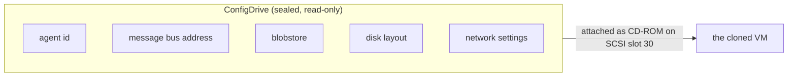
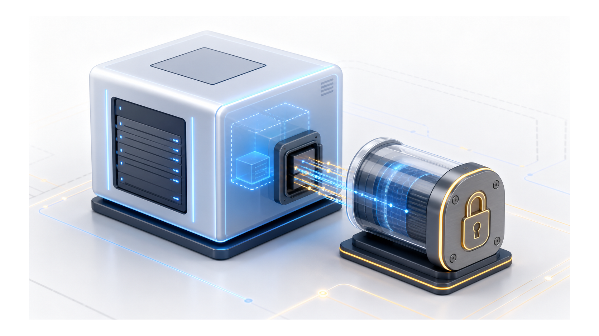
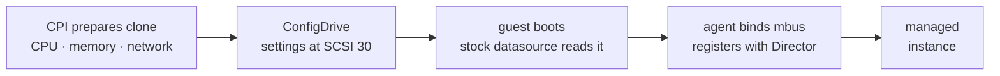

# Chapter 5
## Giving a Machine Its Identity

*Deliver identity out-of-band as a read-only ConfigDrive — no SSH, no registry, reuse what stemcells already speak.*

<!--
- Chapter 5: how we will hand a freshly cloned VM its identity out-of-band — a sealed config-2 ISO the guest's stock datasource already knows how to read.
-->

---

## The envelope, not the conversation

- CPI will fill it, seal it, hand it over
- Guest's stock datasource opens it on first boot
- OpenStack format — stemcells run unmodified

<!--
- Decision to make: deliver settings out-of-band as a sealed, read-only ISO — no SSH into the guest, no registry callback, no inbound network dependency at bootstrap.
- Format will be OpenStack config-2: an ISO 9660 + Rock Ridge volume labeled `config-2`, fixed at 10 MiB.
- Primary tree `/openstack/latest/user_data` will carry the raw BOSH settings JSON; `meta_data.json` rides alongside as a minimal stub.
- We will also write an EC2 fallback tree (`/ec2/latest/...`) — same bytes, second layout, for stemcells whose datasource is EC2-configured.
- Stock bosh.io openstack-kvm stemcells recognize it on first boot with no #cloud-config parsing, runcmd, or systemctl step — that is the whole point of reusing the format.
-->

---
class: visual-right
---

## Where the envelope sits

- System disk: SCSI slot 0
- Persistent data disks: middle slots
- ConfigDrive: SCSI slot 30 — permanently reserved
- Slot reservation caps persistent-disk count

<!--
- Constraint worth citing: PVE exposes scsi0–scsi30 — 31 slots total — and we will permanently burn scsi30 on the ConfigDrive CD-ROM.
- scsi0 is the cloned system disk; scsi1–scsi28 hold ephemeral and persistent disks; scsi29 is deliberate headroom we will leave unallocated.
- Net: 28 usable persistent slots. create_vm will reject more than 28 disk_cids at creation — a loud error, not a silent truncation.
- Gotcha: the default iso_storage `local` is readable by any user with PVE node access — for sensitive settings we will recommend a dedicated ISO pool.
-->

---

## Modes, and one we will rule out

- **cloudinit** — default; ConfigDrive bootstrap
- **noagent** — CPI plumbing tests
- **auto** — resolves to ConfigDrive every time
- **registry** — ruled out; will fail configuration validation

<!--
- registry mode — we will rule it out entirely; supplying `agent_mode: registry` or any `registry.*` key will fail config validation at startup, not a silent no-op.
- cloudinit will be the only real bootstrap path; auto will always resolve to it; noagent will exist to test CPI plumbing without a guest.
- We propose ruling out a PVE-native cicustom/snippets sub-mode — an open decision: PVE's storage upload API only accepts content types iso/vztmpl/import — snippets needs SSH filesystem placement to /var/lib/vz/snippets/ that we would deliberately avoid.
- ConfigDrive-via-CD-ROM works on stock OpenStack stemcells with no cloud-init service running.
- Will match upstream BOSH's own deprecation of the registry component — we will not diverge from the ecosystem.
-->

---

## The handshake

- Registration = bare clone becomes managed instance

<!--
- Decision to make: identity will be push-only — the CPI will fill and seal the drive, then the guest's stock datasource pulls it. There will be no callback to the CPI in this handshake.
- The agent binding its mbus (NATS) and registering with the Director is what turns a bare clone into a managed instance — before that it is just a powered-on VM.
- mbus gotcha: when agent.mbus is empty but a blobstore host is set, we will derive nats://<host>:4222; loopback hosts (127.0.0.1, localhost, ::1, 0.0.0.0) will be rejected so a misconfig fails loudly instead of routing nowhere.
- noagent will skip this entire handshake by design — letting us exercise CPI clone/attach plumbing without waiting on a live guest.
-->

---

## The gotcha that justifies the seams

- Wrong ephemeral device → silent, permanent hang
- CPI will resize disk post-clone — room to carve
- CPI will under-specify; guest fills in what only it can see
- Seam will sit where a wrong instruction would be fatal

<!--
- Tension: we will deliberately under-specify. The CPI will write the layout it knows into the settings JSON; the guest agent fills in what only it can see at boot.
- Disk sizing is the sharp edge: a dedicated ephemeral disk can be floored at ratio × RAM via ephemeral_disk_min_ratio (conventional value 2) so the guest never lands an undersized ephemeral device.
- enforce mode rejects create_vm with a non-retriable error naming the deficit; warn just logs and proceeds; the check is skipped entirely when no dedicated ephemeral disk is requested.
- Same family of silent traps we will guard against elsewhere: numa must be on at create time or memory hot-add silently no-ops; loopback mbus routes to nothing.
- The seam will sit exactly where a wrong instruction would be fatal rather than merely wrong — that is the design rule, not an accident.
-->

