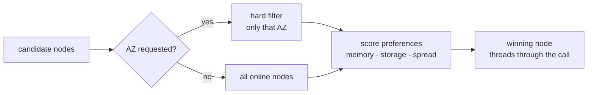
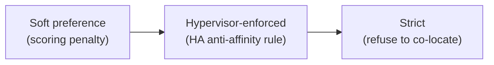
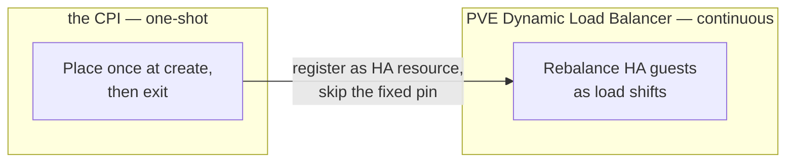

# Chapter 6
## Manufacturing a Scheduler

*Synthesize a scheduler PVE lacks; score preferences, respect hard constraints, accept one-shot limits.*

<!--
- PVE has no cross-node placement brain of its own — we build one in the create_vm path, then hand the long-lived decisions back to PVE's HA rule store.
-->

---

## Soft preference vs hard constraint

- Score = preference, not a gate
- Node-list loss fails closed; all other signals fail open
- Fresh live read on every call — no daemon, no cache

<!--
- The one true gate is the AZ map: an availability_zone with no az_map key is a hard error, not a soft penalty. Everything else is a weighted score.
- Default weights: mem 1.0, storage 0.5, cpu 0.5, guest-count 0.3, and an anti-affinity penalty of 5.0 — anti-affinity dominates by an order of magnitude when it fires.
- Asymmetric failure by design: only ListStatus (the node list) is fatal; lose guest counts, per-node storage, or HA-maintenance state and we degrade that axis and keep placing.
- Storage-headroom is just one scored axis — if a node's ListStorage call errors, we drop the storage axis for that node rather than abort the whole placement.
- No standing scheduler to drift: we gather facts fresh per create_vm. Set placement.enabled=false to fall back to static pve.node; an explicit target_node always overrides scoring.
-->

---

## Three strengths of anti-affinity

- Operator maps BOSH AZ names onto PVE node sets
- Strict form on a small cluster can block failover
- Constraint strictness must match cluster size

<!--
- Three strengths, three switches: anti_affinity.enabled is the scored 5.0 penalty (advisory, can lose to load); use_ha_rules promotes it to a real PVE negative resource-affinity rule (bosh-aa-<group>); strict makes that rule hard.
- The reject we want them to feel: strict on a two- or three-node cluster can refuse to evacuate a faulting node when no compliant destination exists. Only go strict where a constraint-satisfying node always survives a failure.
- The shared bosh-aa-<group> rule is a read-modify-write — two concurrent create_vm calls for the same instance group can silently drop a member. cluster_lock_mode=pool serializes it per group; lock timeout is a retriable error, so the director re-drives rather than lose a spread member.
- anti_affinity.verify adds a read-after-write check on rule membership; a verify miss surfaces retriable too. Belt-and-suspenders against concurrent-writer drops.
-->

---
class: visual-right
---

## Making placement outlive the call

- CPI exits; PVE HA can migrate VMs silently
- Pin writes HA node-affinity rule — survives the process
- PVE's HA rule store becomes our long-term memory
- PCI passthrough forces a strict pin

<!--
- The seam: our scorer runs once and the process exits, but PVE HA can migrate a VM off our chosen node minutes later. The score alone has no memory.
- pin_az_via_ha_rules writes a per-VM bosh-na-{vmid} node-affinity rule pinning the VM to its AZ's node set — that survives our exit and keeps HA failover and DLB inside the AZ.
- pin_az_strict defaults true (hard: HA won't relocate off-AZ even if every AZ node is down); set false for a preferred pin that allows off-AZ relocation on total AZ failure.
- PCI passthrough is incompatible with live migration, so any VM with pci_passthroughs gets a strict node-affinity pin automatically — non-negotiable, not operator-tunable.
- The per-VM pin needs no cluster lock (keyed on vmid, not a shared group); delete_vm removes the rule, best-effort and idempotent. The pin is mutually exclusive with the DLB sentinel — a sentinel VM has no fixed AZ to pin to.
-->

---

## Knowing when to stop placing

- One-shot score cannot react to later load shifts
- DLB delegation opt-in; fails inert without prerequisites
- Explicit node target overrides scoring entirely

<!--
- The honest admission: a one-shot scorer can't chase load that shifts after create. PVE 9.2's DLB is the continuous rebalancer we lack, so for HA guests we register and step aside instead of pretending to balance.
- Two opt-in triggers: the master flag (every VM, still inside its AZ node set) or the sentinel AZ "dlb" — which skips az_map and the scorer, lands on any online node, registers auto-rebalance=1, and deliberately skips the AZ pin.
- The prerequisite that bites: the BOSH resurrector MUST be off. Both PVE HA and the resurrector independently restart a stopped VM, and the duel spawns a duplicate that collides on IP/VMID/agent creds. We can't detect resurrector state — it's on the operator.
- More gates before DLB does anything: shared storage (live migration can't move local disks — require_shared_storage defaults true and silently skips them), 3-node quorum, and SDN that keeps IP+MAC across migration. Single-node or pre-9.2 clusters make the whole feature inert.
- Two things to never DLB: the Director itself (a mid-deploy migration drops in-flight CPI RPCs) and large-dirty-memory VMs (migration pause can exceed the agent heartbeat). manage_cluster_crs can write the dynamic-mode CRS setting for us, but that's a cluster-wide change affecting every HA guest, so it's off by default.
-->

