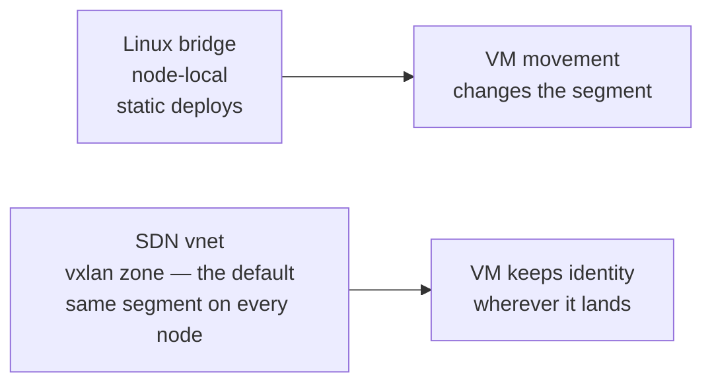
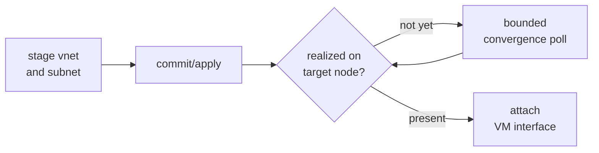
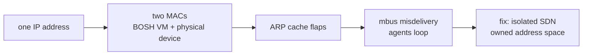

# Chapter 7
## Portable Networks

*Network identity must be as portable as the workload it serves.*

Locality is the spine — wearing a different costume.

<!--
- Same spine as Chapter 6: a VM that PVE can move between nodes is worthless if its network segment is left behind. Portable placement demands portable addressing.
- Only managed:true networks reach this chapter — the Director calls create_network/delete_network. Most deployments pre-configure their networks (managed:false) and the CPI will never touch their lifecycle.
-->

---

## Two network primitives

- Bridge: per-node, opt-in for static deploys
- vnet in a vxlan zone: one segment on every node
- SDN will be the default — it will make roaming from Chapter 6 safe

<!--
- network_mode will pick the backend: sdn — the default — bridge (always Linux bridge, an opt-in), or auto, a legacy heuristic kept for compatibility that will route to SDN when cloud_properties.zone, pve.sdn_zone, or cloud_properties.vnet is set; otherwise bridge, which needs cloud_properties.bridge or pve.network_bridge.
- A Linux bridge such as vmbr1 is node-local: it exists only on the node it was defined on, so a VM that migrates lands on a different L2 segment. The distinction to hold onto: PVE realizes EVERY vnet as a same-named Linux bridge on each node, but only vlan/vxlan/evpn zones stitch those bridges into one segment. A simple-zone vnet is the realization without the stitching — isolated per-node bridges, no more portable than vmbr1. That is why the default zone type will be vxlan.
- delete_network has no mode hint, so it will probe SDN first (GET vnet by name); ErrSDNNotFound will fall back to the bridge delete path. Any other probe error will be returned to the Director unchanged.
- pve.network_bridge is required regardless of mode — it is the default bridge create_vm will attach NICs to at boot, independent of which backend provisions managed networks.
-->

---

## Owned versus borrowed networks

- Borrowed networks: attach, never touch
- Managed networks: explicit lifecycle ops only
- PVE name rule will be validated before any API call
- Turnkey vxlan zone by default; EVPN always operator-owned
- Zone auto-delete: only if proven ours alone

<!--
- The name rule is PVE's, not ours: a vnet name must match [a-z0-9]{1,8} — 1 to 8 lowercase alphanumerics, leading digits allowed, no hyphens, underscores, or uppercase. The CPI will validate this before calling the SDN API and reject bad names up front. Pick short names like boshvn, cf1net, prodnet.
- Zone management will be turnkey by default: sdn_auto_manage_zone true, and when no zone is named the CPI will create one fixed, well-known zone — "bosh", type vxlan — with tunnel peers derived from the live cluster membership (GET /cluster/status, online nodes; pve.sdn_vxlan_peers will override for a dedicated underlay) and per-vnet VNIs auto-allocated from a 5000–5999 band (cloud_properties.vnet_tag will pin one explicitly). Set auto-manage false and the CPI will manage only vnets and subnets inside a zone the operator already created.
- The one exception we will carve out: EVPN. An EVPN fabric — controller, BGP peering, route reflectors — is operator infrastructure, so the CPI will never create an EVPN zone and never delete one. Missing EVPN zone → fail fast with instructions; present → the CPI consumes it, vnets and subnets only.
- Auto-delete will need all four conditions: auto_manage on, the zone name does NOT equal the operator-pinned pve.sdn_zone (that shared default is never auto-deleted), the zone is not EVPN, and zero remaining vnets after the removal. Fail any one and the zone stays. A list or zone-type-read failure during the check will skip deletion rather than erroring. The turnkey "bosh" zone is deliberately NOT pinned — the CPI created it, so removing it when its last vnet goes is correct turnkey hygiene.
- We can't tag a zone as "ours" — the SDN zone-create API accepts no description, notes, or comment field. Ownership will be inferred statelessly from the config rule above, not from a marker in PVE. This is the same stateless-contract discipline from Chapter 2.
-->

---

## A committed change is not yet a realized fact

- Stage → commit → convergence poll → attach
- Timeout → retriable error; the Director re-drives
- Static bridge will bypass poll entirely

<!--
- PVE SDN is two-phase commit. API calls only stage changes into the config directory; nothing is live until a PUT /cluster/sdn (UpdateSdn) applies them. After apply, data-plane realization — ifupdown2 reload plus pmxcfs propagation — is asynchronous and runs per-node, so a vnet can be "committed" yet not yet present on the node where the next VM lands.
- The poll will be opt-in. network_resolve_retries will default to 0, which disables both gates and stays byte-identical to prior releases. Set it (conventional value 60) and create_network will poll until the vnet converges, AND create_vm will confirm each SDN NIC's bridge exists on the target node before attaching. network_resolve_timeout_sec (default 60s) is the absolute time bound regardless of retry budget.
- Why a retriable error and not a hard failure: convergence is a timing problem, not a config problem. Returning retriable lets the Director re-drive the same call until the data plane catches up.
- Static bridges (vmbr0) and other external bridges will never be gated — they already exist on every node, so they pass straight through.
- Async zone types (vlan, vxlan, evpn) make UpdateSdn itself asynchronous: it returns a UPID task the CPI will await before the convergence poll begins, so subsequent ListSdnVnets calls observe committed state. With vxlan as the default zone type, this UPID-await will be the normal path on every apply, not the exception.
- On partial create the rollback will unwind subnet → vnet → zone, then call UpdateSdn again to commit those deletions (a staged delete is as inert as a staged create). It will be guarded — only resources created during THIS call are removed — and will run on a context detached from the caller's cancellation so cleanup completes even if the caller aborts.
-->

---
class: visual-right
---

## Handing the VM its address

- vnet realized as same-named bridge — every zone type
- Address will ride in on ConfigDrive — no guest login
- Overlay MTU inherited automatically (mtu=1 on virtio NICs)
- NAT/router: per-interface forwarding + route injection
- EVPN zone required for routes; will warn and continue otherwise

<!--
- PVE realizes EVERY vnet — whatever the zone type — as a Linux bridge with the SAME name on each node, so the returned network CID will be the vnet name and cloud_properties zone, vnet, and bridge all carry that one name. The guest attaches to that bridge at boot.
- The address will be delivered through ConfigDrive in cloudinit agent mode — the CPI will never log into the guest to configure networking; the instance reads its own config off the attached ISO.
- The MTU detail we will bake in: VXLAN encapsulation costs ~50 bytes per frame, so PVE derives 1450-byte vnets from a 1500-byte underlay. The CPI will hand every virtio NIC on an SDN vnet mtu=1 — "inherit the bridge MTU" — so the guest can never emit a frame the tunnel can't carry. Non-virtio models don't accept the option and will be skipped.
- Router/NAT/LB VMs need two VM-level (not per-network) cloud_properties. ip_forwarding:true on a NIC will set firewall=0 on that PVE NIC so forwarded frames aren't dropped, and will exclude the NIC from VIP ipset seeding (a forwarding NIC must pass non-local traffic). advertised_routes will be a list of {vnet, destination-CIDR} the CPI injects via POST .../subnets then PUT /cluster/sdn.
- The zone-type caveat is the gotcha to flag: advertised_routes only inject into the FRR-managed logical-router fabric, which requires an evpn zone — the only zone type with a routing control plane. On every other zone type (simple, vlan, qinq, vxlan) PVE may accept the subnet create but no route is injected — the CPI will log a warning and continue rather than failing, so verify the zone type before relying on it for real forwarding. Also requires SDN.Allocate on /sdn.
- And the routes will clean up after themselves: each advertised route will stamp a provenance tag on the VM, and delete_vm will remove the recorded subnets — refcounted, so paired routers sharing a route will keep it until the last one goes; fail-open, so a cleanup error will warn and never block the delete.
-->

---

## Fail open for the legitimate occupant

- Seed allowlist with primary IP before enabling filter
- Skip DHCP / unparseable interfaces
- Malformed input: fail fast, no change
- Closed for impostor, open for occupant

<!--
- The hazard the ipfilter will guard against: a VM with a spoofed source IP, or a moved workload whose old neighbor still claims its address. The filter will pin which source IPs a NIC may emit.
- The fail-open invariant we will hold: before enabling the filter we seed the ipset with the NIC's own primary IP. Without that seed the VM would lock ITSELF out the instant the filter engages — closed for the impostor, open for the legitimate occupant.
- Two correctness skips to build in: forwarding NICs (ip_forwarding:true) will be excluded entirely because they must pass non-local frames; DHCP and unparseable addresses will be skipped because there's no static IP to anchor the filter on.
- Static IP-conflict checking is the companion knob: ensure_no_ip_conflicts (default true) will refuse create_vm if another VM on the node already holds the requested static IP. Set it false only for genuinely dynamic/DHCP networks. ip_conflict_probe: agent will add an active QEMU-guest-agent sweep of running VMs to catch dynamically assigned addresses — and that probe will be fail-open: a guest-agent error skips that guest, never blocking provisioning.
- Malformed allowed-address input will fail fast with no PVE change — we won't half-apply a filter.
-->

---

## The hazard that makes ownership a precondition

- Overlapping subnet → ARP flap → mbus misdelivery
- Design: isolated SDN network, BOSH owns address space
- Ownership of address space = correctness precondition

<!--
- The full failure chain we must design against, for when someone asks "how bad can a shared LAN really be?": deploying CF will place dozens of VMs at once — let that subnet overlap a physical lab LAN and an IP BOSH assigns can collide with a device already using it; two MACs answer ARP; the Director's ARP cache flaps; mbus (NATS) packets get misdelivered; agents loop connection-reset-by-peer → reconnect, and random instances fail with "Timed out sending get_state". A nondeterministic, maddening failure with a mundane root cause.
- The fix we will build is structural, not a retry: a turnkey isolated SDN zone + vnet + subnet on a private 172.x range will move BOTH the Director and the deployment onto a segment BOSH fully owns, so no foreign device can claim an address. Our single-node lab will opt into a simple zone deliberately — an isolated per-node bridge with SNAT is exactly the right shape when there is only one node; on a multi-node cluster the vxlan default will already give the same isolation cluster-wide. net-up will be idempotent; the subnet will carry snat so VMs still reach the internet via the host uplink while staying off the shared LAN.
- The three relocation gotchas we must design for, because they bite operators who try this: (1) host firewall — once the Director is on the isolated subnet it's outside PVE's management source set, so net-up will add idempotent rules letting the subnet reach :8006, or the in-VM CPI times out on every create_vm. (2) Operator reachability — the relocated Director IP lives only on the PVE host; the workstation needs a route (e.g. Tailscale advertise-routes for the 172.x subnet). (3) Certificate rotation — moving the Director changes internal_ip, which is baked into seven IP-pinned leaf certs (director_ssl, nats_server_tls, etc.); the BOSH CLI only regenerates an ABSENT var, so we will need to delete those seven leaves from creds.yml (keep every CA, key, password) and rerun create-env, or the agent fails with "x509: certificate is valid for <old-ip>".
- The takeaway that will promote ownership to a precondition: portability of identity is only safe when BOSH owns the address space. Everything else in this chapter — SDN vnets, convergence polling, ipfilters — assumes nobody else can squat our IPs.
-->

