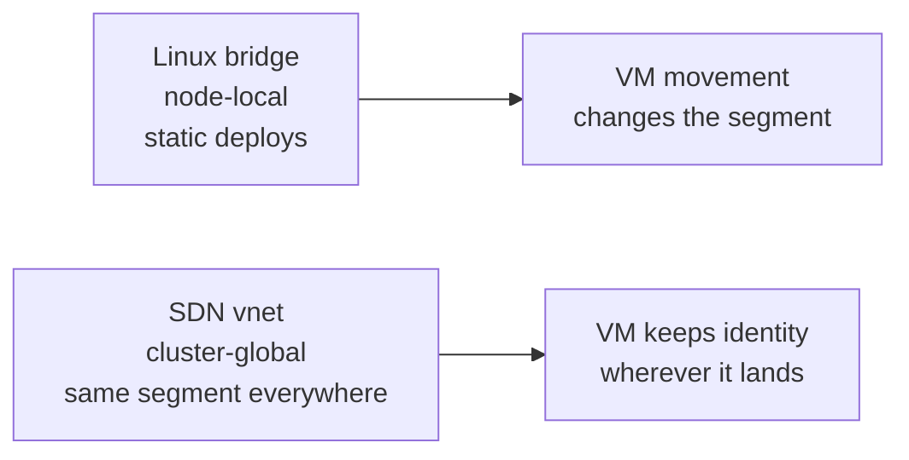
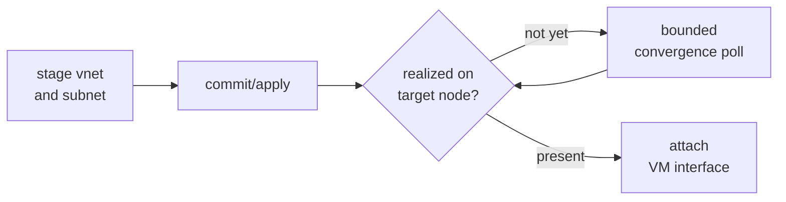
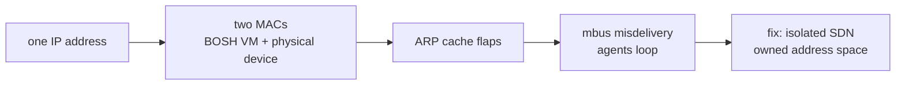

# Chapter 7
## Portable Networks

*Network identity must be as portable as the workload it serves.*

Locality is the spine — wearing a different costume.

<!--
- Same spine as Chapter 6: a VM that PVE can move between nodes is worthless if its network segment is left behind. Portable placement demands portable addressing.
- Only managed:true networks reach this chapter — the Director calls create_network/delete_network. Most deployments pre-configure their networks (managed:false) and the CPI never touches their lifecycle.
-->

---

## Two network primitives

- Bridge: per-node, for static deploys
- vnet: one segment on every node
- SDN makes roaming from Chapter 6 safe

<!--
- network_mode picks the backend: sdn (always SDN), bridge (always Linux bridge), or auto — the default. auto routes to SDN when cloud_properties.zone, pve.sdn_zone, or cloud_properties.vnet is set; otherwise bridge, which needs cloud_properties.bridge or pve.network_bridge.
- A Linux bridge such as vmbr1 is node-local: it exists only on the node it was defined on, so a VM that migrates lands on a different L2 segment. A PVE simple-zone vnet is realized as a same-named Linux bridge on every node — the VM attaches to "the same wire" wherever it lands.
- delete_network has no mode hint, so it probes SDN first (GET vnet by name); ErrSDNNotFound falls back to the bridge delete path. Any other probe error is returned to the Director unchanged.
- pve.network_bridge is required regardless of mode — it is the default bridge create_vm attaches NICs to at boot, independent of which backend provisions managed networks.
-->

---

## Owned versus borrowed networks

- Borrowed networks: attach, never touch
- Managed networks: explicit lifecycle ops only
- PVE name rule is validated before any API call
- Zone auto-delete: only if proven ours alone

<!--
- The name rule is PVE's, not ours: a vnet name must match [a-z0-9]{1,8} — 1 to 8 lowercase alphanumerics, leading digits allowed, no hyphens, underscores, or uppercase. The CPI validates this before calling the SDN API and rejects bad names up front. Pick short names like boshvn, cf1net, prodnet.
- Zones default to operator-owned: sdn_auto_manage_zone false, so the CPI manages only vnets and subnets inside a zone the operator already created. Calling create_network against a non-existent zone is an error unless auto-manage is on.
- Auto-delete needs all three conditions: auto_manage on, the zone name does NOT equal the operator-pinned pve.sdn_zone (that shared default is never auto-deleted), and zero remaining vnets after the removal. Fail any one and the zone stays. A list failure during the empty-check skips deletion rather than erroring.
- We can't tag a zone as "ours" — the SDN zone-create API accepts no description, notes, or comment field. Ownership is inferred statelessly from the config rule above, not from a marker in PVE. This is the same stateless-contract discipline from Chapter 2.
-->

---

## A committed change is not yet a realized fact

- Stage → commit → convergence poll → attach
- Timeout → retriable error; the Director re-drives
- Static bridge bypasses poll entirely

<!--
- PVE SDN is two-phase commit. API calls only stage changes into the config directory; nothing is live until a PUT /cluster/sdn (UpdateSdn) applies them. After apply, data-plane realization — ifupdown2 reload plus pmxcfs propagation — is asynchronous and runs per-node, so a vnet can be "committed" yet not yet present on the node where the next VM lands.
- The poll is opt-in. network_resolve_retries defaults to 0, which disables both gates and stays byte-identical to prior releases. Set it (conventional value 60) and create_network polls until the vnet converges, AND create_vm confirms each SDN NIC's bridge exists on the target node before attaching. network_resolve_timeout_sec (default 60s) is the absolute time bound regardless of retry budget.
- Why a retriable error and not a hard failure: convergence is a timing problem, not a config problem. Returning retriable lets the Director re-drive the same call until the data plane catches up.
- Static bridges (vmbr0) and other external bridges are never gated — they already exist on every node, so they pass straight through.
- Async zone types (vlan, vxlan, evpn) make UpdateSdn itself asynchronous: it returns a UPID task the CPI awaits before the convergence poll begins, so subsequent ListSdnVnets calls observe committed state.
- On partial create the rollback unwinds subnet → vnet → zone, then calls UpdateSdn again to commit those deletions (a staged delete is as inert as a staged create). It is guarded — only resources created during THIS call are removed — and runs on a context detached from the caller's cancellation so cleanup completes even if the caller aborts.
-->

---
class: visual-right
---

## Handing the VM its address

- vnet realized as same-named bridge
- Address rides in on ConfigDrive — no guest login
- NAT/router: per-interface forwarding + route injection
- OVN zone required for routes; warns and continues otherwise

<!--
- A simple-zone vnet is realized as a Linux bridge with the SAME name, so the returned network CID is the vnet name and cloud_properties zone, vnet, and bridge all carry that one name. The guest attaches to that bridge at boot.
- The address is delivered through ConfigDrive in cloudinit agent mode — the CPI never logs into the guest to configure networking; the instance reads its own config off the attached ISO.
- Router/NAT/LB VMs need two VM-level (not per-network) cloud_properties. ip_forwarding:true on a NIC sets firewall=0 on that PVE NIC so forwarded frames aren't dropped, and excludes the NIC from VIP ipset seeding (a forwarding NIC must pass non-local traffic). advertised_routes is a list of {vnet, destination-CIDR} the CPI injects via POST .../subnets then PUT /cluster/sdn.
- The OVN caveat is the gotcha to flag: advertised_routes only inject into the OVN logical-router fabric, which requires an evpn or vxlan zone. On simple/vlan zones PVE may accept the subnet create but no route is injected — the CPI logs a warning and continues rather than failing, so verify the zone type before relying on it for real forwarding. Also requires SDN.Allocate on /sdn.
-->

---

## Fail open for the legitimate occupant

- Seed allowlist with primary IP before enabling filter
- Skip DHCP / unparseable interfaces
- Malformed input: fail fast, no change
- Closed for impostor, open for occupant

<!--
- The hazard the ipfilter guards against: a VM with a spoofed source IP, or a moved workload whose old neighbor still claims its address. The filter pins which source IPs a NIC may emit.
- The fail-open invariant we hold: before enabling the filter we seed the ipset with the NIC's own primary IP. Without that seed the VM would lock ITSELF out the instant the filter engages — closed for the impostor, open for the legitimate occupant.
- Two correctness skips: forwarding NICs (ip_forwarding:true) are excluded entirely because they must pass non-local frames; DHCP and unparseable addresses are skipped because there's no static IP to anchor the filter on.
- Static IP-conflict checking is the companion knob: ensure_no_ip_conflicts (default true) refuses create_vm if another VM on the node already holds the requested static IP. Set it false only for genuinely dynamic/DHCP networks. ip_conflict_probe: agent adds an active QEMU-guest-agent sweep of running VMs to catch dynamically assigned addresses — and that probe is fail-open: a guest-agent error skips that guest, never blocking provisioning.
- Malformed allowed-address input fails fast with no PVE change — we won't half-apply a filter.
-->

---

## The hazard that makes ownership a precondition

- Overlapping subnet → ARP flap → mbus misdelivery
- Design: isolated SDN network, BOSH owns address space
- Ownership of address space = correctness precondition

<!--
- The full failure chain we design against, for when someone asks "how bad can a shared LAN really be?": deploying CF places dozens of VMs at once — let that subnet overlap a physical lab LAN and an IP BOSH assigns can collide with a device already using it; two MACs answer ARP; the Director's ARP cache flaps; mbus (NATS) packets get misdelivered; agents loop connection-reset-by-peer → reconnect, and random instances fail with "Timed out sending get_state". A nondeterministic, maddening failure with a mundane root cause.
- The fix is structural, not a retry: a turnkey isolated SDN simple zone + vnet + subnet on a private 172.x range moves BOTH the Director and the deployment onto a segment BOSH fully owns, so no foreign device can claim an address. net-up is idempotent; the subnet carries snat so VMs still reach the internet via the host uplink while staying off the shared LAN.
- The three relocation gotchas, because they bite operators who try this: (1) host firewall — once the Director is on the isolated subnet it's outside PVE's management source set, so net-up adds idempotent rules letting the subnet reach :8006, or the in-VM CPI times out on every create_vm. (2) Operator reachability — the relocated Director IP lives only on the PVE host; the workstation needs a route (e.g. Tailscale advertise-routes for the 172.x subnet). (3) Certificate rotation — moving the Director changes internal_ip, which is baked into seven IP-pinned leaf certs (director_ssl, nats_server_tls, etc.); the BOSH CLI only regenerates an ABSENT var, so we delete those seven leaves from creds.yml (keep every CA, key, password) and rerun create-env, or the agent fails with "x509: certificate is valid for <old-ip>".
- The takeaway that promotes ownership to a precondition: portability of identity is only safe when BOSH owns the address space. Everything else in this chapter — SDN vnets, convergence polling, ipfilters — assumes nobody else can squat our IPs.
-->

