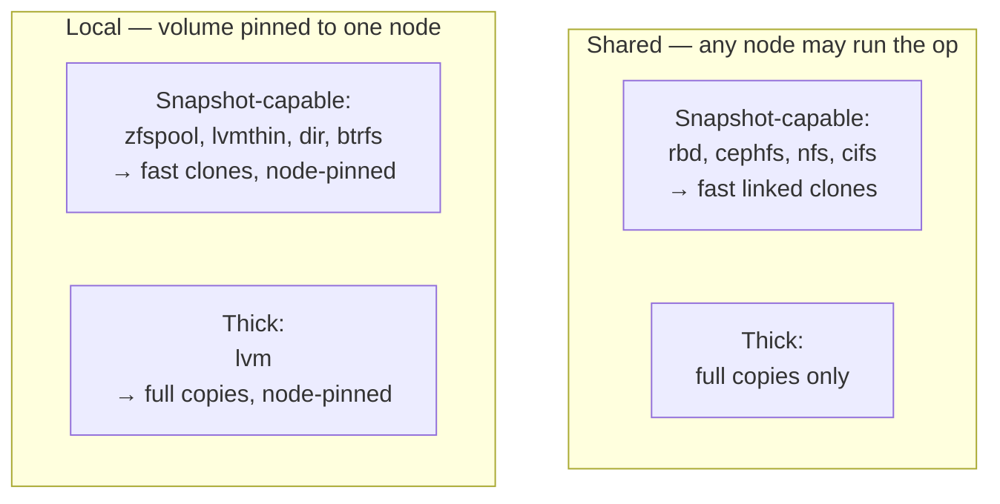
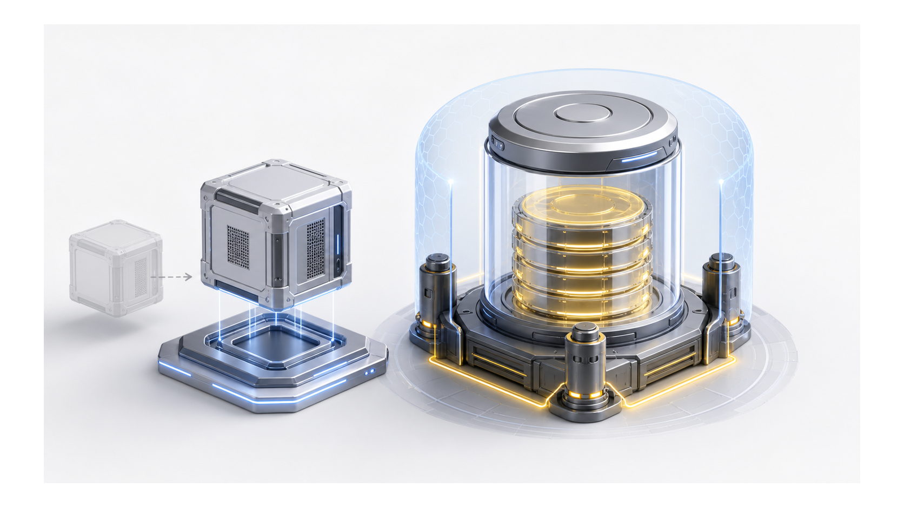
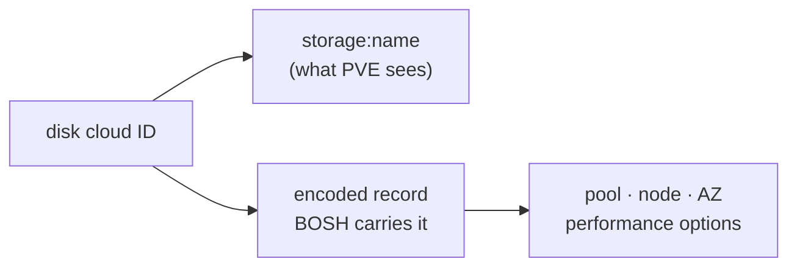
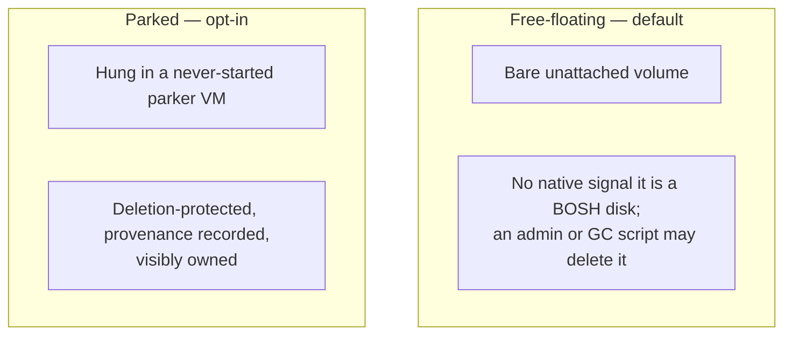

# Chapter 8
## Inventing the Durable Volume

*Build the object out of the only durable carrier we have; locality couples placement and storage.*

<!--
- PVE has no first-class volume object — we invent durable disk identity on raw storage, and locality forces placement and storage to couple.
-->

---

## The storage matrix: discovered, not assumed

- Unrecognized backend → most constrained (local, full-copy)
- Linked clones require snapshot-capable storage
- Force linked clone on thick → loud error

<!--
- The decision: we classify every storage at runtime via GET /storage, not from manifest config — shared (cluster-visible) vs local (node-pinned) drives node selection for every disk op.
- Unknown backend resolves to the most constrained pair: local plus full-copy. The safe default forces explicit node selection instead of guessing wrong.
- The classification cache TTL is 60s, so storage.cfg edits take effect within that window; worth raising on live-reconfig questions.
- shared=1 in storage.cfg overrides the type table — any storage flagged shared is treated as cluster-visible.
- Forcing a linked clone onto thick storage is a loud error, not a silent full copy.
-->

---
class: visual-right
---

## Locality couples storage to placement

- Local disk → hard node constraint, not a preference
- Creation: disk and VM born on the same node
- Existing disk: scan node-by-node to locate
- Relocation: manual operator action, not CPI logic

<!--
- Tension: a local disk is a hard node constraint, not a scheduling preference — the disk and its VM must be born on the same node.
- create_disk on a local backend prioritizes the vm_cid hint over cloud_props.node, because the disk must co-locate with its owner VM.
- For an existing local disk we store no node index — we scan node-by-node via Storage.Exists(); the first node reporting it present wins.
- attach_disk verifies co-location: VM on pve-01, disk on pve-02 fails fast with "local-storage disks cannot cross nodes" rather than a stale, unattachable disk.
- There is no cross-node move in CPI logic — relocation stays a manual operator action (pvesm move), or switch to a shared backend.
-->

---

## Encoding disk identity

- CPI strips encoded part before any PVE call
- Statelessness → identity must live in the durable ID
- Persistent disks get own VMID band: namespace safety

<!--
- Decision: identity lives in the CID because the CPI is stateless — no in-process disk index; the Director carries the encoded record and re-presents it each call.
- Format is storage:volume plus an optional |base64url-JSON suffix (RFC 4648 §5, no padding) holding pool, node, AZ, and per-disk perf opts.
- We strip the encoded suffix before every PVE call — storage APIs only understand the bare storage:volume string.
- When all meta fields are zero-valued we emit the bare CID unchanged — backward compatible with deployments not using perf or AZ placement.
- Persistent disks get their own VMID band (9000–29999 default) so the synthetic container VMID can't collide with workload VMs.
- Lifecycle ops split on the storage lock: create_disk/delete_disk take the PVE per-storage lockfile and get exponential-backoff retry (10 attempts, ~124s worst case); attach/detach are pure config PUTs and never contend.
-->

---

## The detach window and the coat-check

- Parker VM: never started, deletion-protected
- Local disks park on own node — locality honored at rest
- Cost: a few extra API calls per detach

<!--
- Tension: the detached window is where a disk is most exposed — a bare unattached volume has no PVE-native signal it belongs to BOSH; an admin or GC script can delete it.
- Default is free (cheap: 1 API op per detach). Opt-in parked attaches the disk to a never-started parker VM with protection=1, onboot=0 — visible ownership in the PVE UI.
- A native volume-tag/ownership approach is ruled out: PVE has no volume metadata, tag, or ownership API, so the parker VM is the only durable carrier of protection.
- Parkers are node-scoped — local disks park on their own node, so locality is honored even at rest.
- Capacity: 31 scsiN slots per parker (scsi0–scsi30); when one fills, we pack the next disk into the lowest parker with a free slot before creating another, so the band fills densely.
- Cost of parked: 3–5 API calls per detach vs 1 for free — that's the tradeoff, not free safety.
-->

---
class: visual-right
---

## The paperwork can race; the disk cannot

- Slot attachment: durable, always correct
- Provenance note in parker description: best-effort, may race
- Physical fact separated from advisory record
- Guards: no delete/snapshot of parker, retry unreadable band

<!--
- Key distinction we hold: the scsiN slot attachment is the durable physical fact; the provenance sentinel in the parker description is best-effort advisory.
- Concurrent parks on the same parker can overwrite each other's provenance — PVE has no atomic read-modify-write on VM descriptions. The disk stays correctly attached; only the advisory record may be incomplete.
- Park failure is fail-closed retriable: on retry the disk is free-floating, so the idempotency check re-parks without repeating the detach.
- Guard: snapshot_disk on a parked disk is refused — a PVE snapshot is whole-VM, so it would bundle every deployment's disks on that parker into one snapshot.
- Guard: delete_vm refuses a VMID in the parker band carrying the bosh-parker tag — bypassing protection=1 via skiplock would destroy every scsiN disk. An unreadable in-band VMID is also refused, directing the caller to retry.
-->

---
class: visual-right
---

## Expressing intent at the right altitude

- Performance options baked into cloud ID, merged at attach
- Per-disk choice wins over global default
- Layered resolver: global → profile → per-call (specific wins)
- Storage tier: capability match at call time, not pool name

<!--
- Decision: per-disk performance intent is encoded into the CID at create_disk and merged at attach_disk — per-disk values win over the global pve.disk_performance.* defaults.
- Layered resolution runs global default → pool/profile → per-call, most-specific wins, so a pool overrides the global and a disk overrides the pool.
- Storage tier is matched on capability at call time, not by hardcoding a pool name — storage topology can change without breaking routing.
- Concrete knobs: iothread, cache mode, discard, ssd, mbps_rd/wr, iops_rd/wr — applied automatically when the disk attaches.
- Gotcha: disk_format must match the backend — raw is required for lvm/lvmthin/zfspool, qcow2 only on file storages; a mismatch is a hard error.
-->

