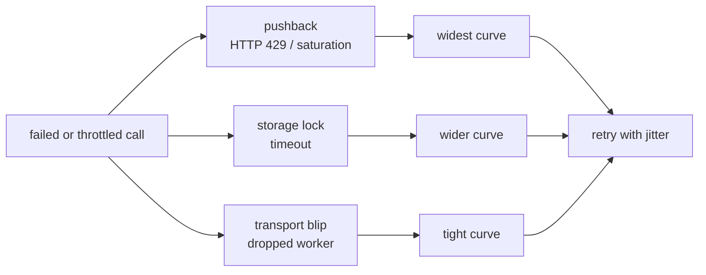
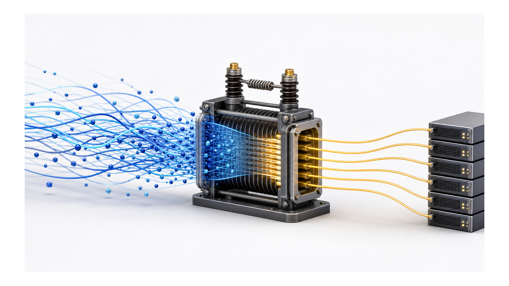

# Chapter 9
## Absorbing the Storm

*The CPI is an impedance-matching transformer between an elastic orchestrator and an inelastic hypervisor.*

<!--
- The chapter where the CPI earns its keep: turning a Director's elastic burst into something an inelastic hypervisor can actually swallow.
-->

---

## The structural mismatch

- 12 processes : 3 workers : 1 lockfile per storage pool
- Each CPI call = separate OS process, no shared memory
- Reconciliation must live on the seam — in the CPI

<!--
- Tension: reconciliation has to live in the CPI because there is nowhere else — each call is a separate `bosh-pve-cpi` process, no shared memory, so in-process serialization does nothing.
- The ratios are the whole story: a dozen+ concurrent create_vm in one second, 3 pvedaemon workers, one lockfile per storage pool — roughly 10:1 in-flight-to-worker.
- The Director defaults its worker pool wide; the only real knobs sit at the two ends (throttle the Director, grow the host), so the middle has to absorb.
- Gotcha that forces the seam: a worker recycle during the burst window is statistically guaranteed — once every few hundred requests in the field.
-->

---

## Three layers, three points on the timeline

- Backoff curve matched to bottleneck drain time
- Jitter de-synchronizes the retrying herd
- Per-node in-flight limit: the only preventive layer

<!--
- Three failure classes, three backoff curves matched to drain time — pushback widest (5s base / 60s cap), storage lock middle (2s / 30s), transient transport tightest (1s / 15s).
- Why not one curve: worker-pool saturation drains slower than a single per-storage lock hold, which drains slower than a sub-second worker restart — one curve would over- or under-wait.
- Jitter is ±30%: a dozen CPI processes that failed in the same instant must not all retry in the same instant.
- Predicate order matters: "got timeout" appears in both lock and pushback strings, so we check pushback first and let it win the longer curve. RetryOnTransientOrLock layers all three predicates.
- max_inflight_per_node is the only preventive layer — a per-node semaphore that caps the burst at the source instead of absorbing it after the fault.
-->

---
class: visual-right
---

## Waiting for the work to actually finish

- Every PVE task is awaited before the handler returns
- Deadline → retriable timeout, not a wedged loop
- Adaptive poll: interval paces with task progress
- Worst legal output: a typed, retriable error

<!--
- Decision: every PVE task is awaited before the handler returns — no fire-and-forget, because an async storage task can land after we have moved on.
- The race that justifies it: DELETE queues an imgdel under the same lockfile; under contention it can fire after a same-name upload won the lock, deleting the fresh volume. Real case: vm-117-config.iso vanished mid-start.
- Fix: we await the imgdel UPID before uploading — DeleteVolumeIfExistsAsync returns it; same wiring on delete_disk and create_disk rollback.
- Streaming-upload subtlety: a retry must reopen the file from disk — the body is a single-use io.Reader, so os.Open lives inside the retry callback.
- A deadline becomes a typed, retriable TimeoutError, not a wedged loop; worst-case full retry exhaustion is ~124s, well inside BOSH's task timeout.
-->

---
class: visual-right
---

## When the fix is host-side

- Split stemcell + VM storage → separate lockfiles (highest leverage)
- Raise API worker count for large deploys
- 30s storage lock: baked into PVE, not configurable
- Know where the wall is, not just where the knobs are

<!--
- Highest-leverage host change: split stemcell storage from VM storage (pve.stemcell_storage vs pve.vm_storage) so import and resize grab different lockfiles and stop contending.
- Worker tuning helps the API plane; storage splitting helps the data plane — and the data plane is where deploys actually stall.
- Numbers: pvedaemon and pveproxy default to 3 workers; raise both to 6–8 for CF-class deploys, cap at the node's vCPU count. Set them together or we just move the bottleneck.
- The wall, not a knob: the 30s storage lock timeout is baked into PVE::Storage::Plugin::lock_storage — not configurable without patching Perl that won't survive an upgrade.
- What not to bother with: vm.dirty_* kernel knobs don't help here — the per-storage lock serializes before the kernel ever sees the I/O.
-->
