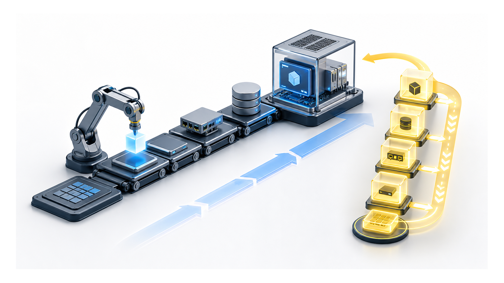
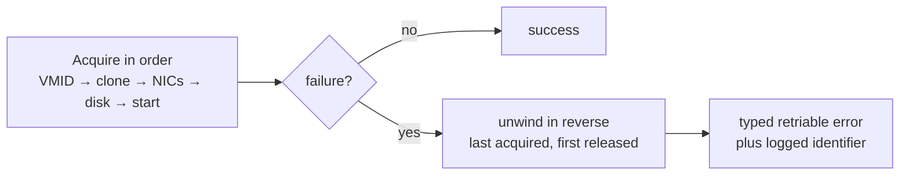
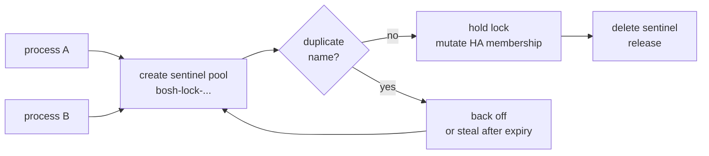
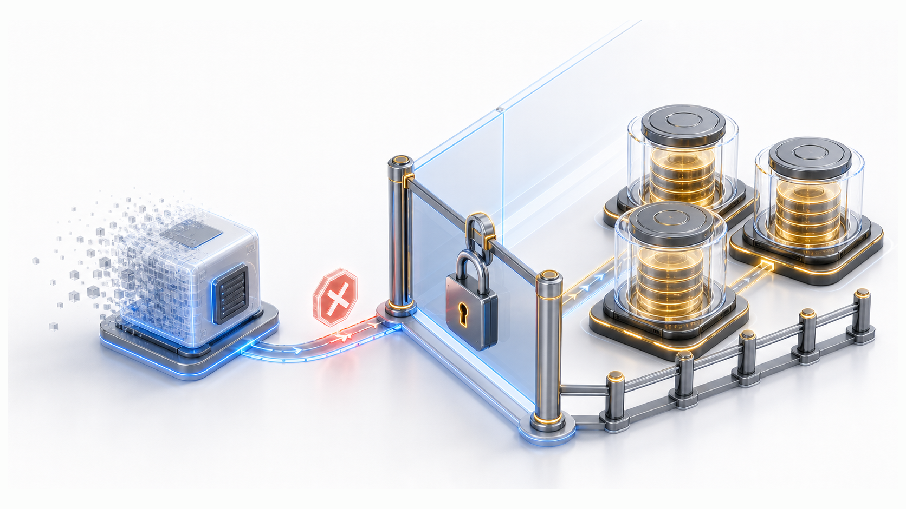

# Chapter 10
## Never Wedge, Never Leak, Never Lose

*Worst legal output: a typed, retriable error — atomicity composed from an undo log, reversed.*

<!--
- Three failure modes, one stance: a fault will become a typed retriable error, never a crash, a silent leak, or a lost disk.
-->

---
class: visual-right
---

## Converting the worst case into the best available case

- Single doorway will wrap every handler in a recovery net
- Fault → caught, logged, converted to retriable error
- Director gets "try again"; operator gets the trace
- No handler has to remember to be safe

<!--
- Decision to confirm: every handler will run inside one recovery wrapper, so no handler has to remember to be safe — the seam owns safety, not the author.
- The doorway will convert a fault into RetriableCloudError (ok_to_retry:true) so the Director re-queues the whole call; only terminal faults get CloudError (ok_to_retry:false) — 403s, snapshot-guard rejections, VMID exhaustion.
- Wrap will preserve the type and ok_to_retry of the innermost error, so adding context never silently downgrades a retriable fault to terminal.
- Never-leak-secrets gotcha: the RPC payload will serialize only the operator-safe msg — the full chain (HTTP bodies, credential hints) stays in the debug logger, out of the Director's task envelope.
- Never-wedge: each method will run under a bounded deadline (operation_timeout envelope; fixed 300s / 600s inner PVE task polls) so a stuck task converts to an error instead of pinning a Director queue slot.
-->

---

## A transaction with no native rollback

- Last acquired, first released — dependencies demand it
- Debug mode: keep failed VMs tagged, not erased
- Best-effort cleanup; failure leaves a logged identifier

<!--
- Tension: PVE gives us no transaction — we will compose atomicity from an undo log unwound last-acquired-first-released (start → disk → NICs → clone → VMID).
- We lean toward not erasing failed VMs outright (decision to confirm): debug mode will keep them tagged for inspection; the default path will run cleanupVM (stop + delete) before retrying.
- Gotcha to plan for: cleanupVM can itself fail and leak a VMID with no BOSH record — we will recover by finding untagged VMs in the band and qm destroy; this is why the band needs headroom.
- Best-effort cleanup will never block the error return; even a failed unwind will leave a logged identifier to chase, not a silent dangling resource.
-->

---

## Borrowing a mutex the platform never offered

- PVE resource pools will double as a cluster-wide mutex
- Expiry + steal + verify: safe against crashed holders
- Opt-in; timeout returns a retriable error

<!--
- Tension: mutating HA membership is a cross-process shared write with no PVE-native lock — unlike per-storage operations, where PVE's own lockfile serializes us and we will just retry around timeouts (10 attempts, 2s→30s backoff, ±30% jitter).
- So we will synthesize a lock from a sentinel pool whose duplicate-name collision is the gate; expiry plus steal keeps a crashed holder from wedging the cluster forever.
- Why it will earn its keep: PVE has no atomic read-modify-write, so concurrent writers to one object (e.g. two parks rewriting the same parker's provenance) can clobber each other — the lock will protect correctness the platform won't.
-->

---
class: visual-right
---

## Refusing to cross a lifecycle boundary

- `delete_vm` must never destroy persistent disks
- Persistent band: separate identifier namespace from VMs
- Mine to delete? → identity by namespace answers it
- When in doubt: refuse, fail closed

<!--
- Decision to confirm: delete_vm must never destroy a persistent disk the Director hasn't released — identity by namespace will answer "mine to delete?"
- How we will tell: persistent disks will carry a synthetic VMID (band 9000–29999) baked into the volid; any active-slot disk whose embedded VMID differs from the owning VM is foreign and will be detached-and-preserved before the destroy.
- Fail-closed in two flavors: a detach blocked by a lock-timeout will refuse the destroy and stay retriable; an unusedN volume pinned by a snapshot will refuse and be NOT retriable — remove the snapshot first.
- Same guard will run on both the synchronous and fast_path_delete paths, and will refuse any parker-band VM (bosh-parker tag) — a skiplock destroy there would wipe every disk in its scsiN slots.
- retain_on_delete disks will get the same detach-and-preserve; the raw escape hatch, qm destroy --purge, deletes unusedN volumes irreversibly, which is exactly why we will never reach for it.
-->

---

## The same answer, every time

- Fault → retriable error, not crash
- Partial build → unwound, not leaked
- Shared write → serialized, not clobbered
- Destructive delete → refused, not silently crossed

<!--
- The fourth invariant the slide implies but doesn't name is "never leak" — orphans will get found, not forgotten.
- disk-audit will classify every band volume as attached / parked / free-floating / unknown and exit non-zero on a free-floating disk, so storage cleanup is gated on a clean audit, not a guess.
- bosh cloud-check will reconcile Director state against PVE (has_vm / has_disk / get_disks); bosh disks --orphaned will cross-check before any manual qm destroy.
- Honesty for Q&A: the parked strategy will still need live-cluster validation — we will confirm protection=1 and provenance on the first real detach cycle before trusting it in production.
-->

